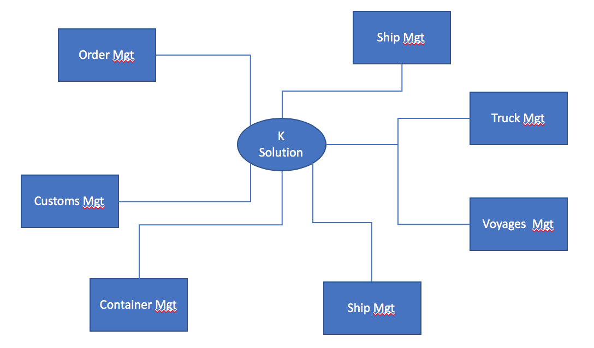
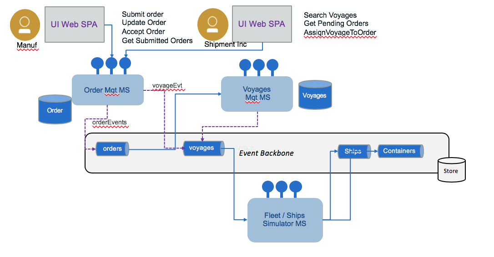

# K Container Shipment EDA reference implementation

This solution implementation illustrates the deployment of real time analytics on event streams in the context of container shipment in an [event driven architecture](https://github.com/ibm-cloud-architecture/refarch-eda) with event backbone, functions as service and microservices.

## What you will learn
* CQRS pattern with event sourcing done in Kafka / IBM Event Stream 
* Implement TDD with mockito to avoid kafka dependency
* Applying event storming for the business process at hand
* Identifying the microservice from the domain driven development domain context.

## Introduction
As part of producing the IBM event driven point of view and reference architecture, we wanted to bring together a complete scenario which would cover all aspects of developing an event driven solutions including extended connections to devices/IOT and blockchain for trusted business trading networks. We felt that the shipping business could provide a good foundation for this and would enable us to show how to develop event driven solutions following the architecture patterns.

The high level process can be represented in the following diagram, and is described in detailed in [this section](analysis/readme.md#high-level-view-of-the-shipment-process-flow):


In developing the scenario, it became apparent that the event driven nature of business, extends across the business network, so we have widened the view in the scenario to consider the chain of parties involved in the shipping process, including importer, exporter, land transport and customs. To keep the scenario easy to understand, we have only considered the following cases:

1. Importer Orders goods from exporter overseas
2. Exporter becomes the customer of the shipping agent and uses 'K.Container' shipping service
3. Shipping agent manages process of land transport loading, unloading and shipping. Through the scenario we can see the impact of “events”, which may delay or change the shipping process across all three parties.  

We are using goods to be transported in refrigerator containers or reefer containers to keep the 'clod chain' of transported products.

</img>

## Table Of Content

* [Target Audiences](#target-audiences)
* [Analysis](./analysis/readme.md) is a detailed explanation of the event storming method applied to the container shipping process. 
* [Define microservice scopes](#define-microservice-scopes)
* [From analysis to microservices specification](./docs/analysis2microsvcs.md)
* [Design Considerations](./docs/design.md)
* [Architecture](#architecture) using the different EDA patterns.
* [Deployment](#deployment) to hybrid cloud
* [Demonstration script](./docs/demo.md) to present the application end to end.

## Target Audiences

You will be greatly interested by the subjects addressed in this solution if you are...

* An architect, you will get a deeper understanding on how all the components work together, and how to address resiliency, high availability.
* A developer, you will get a broader view of the solution end to end and get existing starting code, and practices you may want to reuse during your future implementation. We focus on event driven solution in hybrid cloud addressing patterns and non-functional requirements as CI/CD, Test Driven Development, ...
* A project manager, you may understand all the artifacts to develop in an EDA solution, and we may help in the future to do project estimation.

## Define microservice scopes

As presented in [the note about event driven microservice patterns](https://github.com/ibm-cloud-architecture/refarch-eda/blob/master/docs/evt-microservices/README.md#understanding-event-driven-microservice-patterns), we are using a set of event-drivent design patterns to develop this solution. One of them is the **sub domain decomposition**. From the analysis output we have the aggregates, actors and data that are helping us to extract a set of subdomains. The figure below summarizes those aggregates:

#### Figure illustrating organization of shipment handling as microservices  


#### Summary of microservice scopes for shipment handling:
* **Fleet Service**: responsibles to group the ship (container carriers), in fleet, per major ocean. 
    * Information model: 
       * Fleet has multiple ships,
       * Ship has unique identifier (we will use its name), and a container capacity (represented as a matrix to make it simple), current position, status, voyage identifier for the voyage it is doing. 
    * Events: Ship commission, ship position, load container event, unload container event, start itinerary X, arrive at port, docked,...
    * Operations: getFleets, get ships in a fleet, get ship by ID. CRUD Fleet and Ship.
    * Implementation in [this project.](https://github.com/ibm-cloud-architecture/refarch-kc-ms/tree/master/fleet-ms)
* **Voyages Service**: define a set of voyage schedules supported by the shipping company
    * Information model: voyageID, shipID, src_Port, planned_departure_date, dest_port, planned_arrival_dates, free_space_this_leg
    * Events: add itinerary route, OrderAssigned
    * Operations: CRUD on itinerary routes, query on capacity availability, assign slot to order, free slot for order.
     * Implementation in [this project.](https://github.com/ibm-cloud-architecture/refarch-kc-ms/tree/master/voyages-ms)
* **Order Service**: manage the shipment order
    * Information model: Booking id , customer, pickup location, pickup after date, deliver location, expected deliver date, order status, assigned container  
    * Events: order placed, order assigned to voyage( sets VoyageID, ship ID ), container assigned to order ( Sets container ID), Landorder, Transport associated with pickup container, Order status event, Order billing/accounting event
    * Operations: CRUD on order, update order status
     * Implementation in [this project.](https://github.com/ibm-cloud-architecture/refarch-kc-order-ms)
* **Container Service**: 
    * Information model: Container Id, Container temperature, container position, container condition ( maintenance goods), current associated order
    * Events: 
    * Operations: CRUD on container
    * (not yet implemented)
* Customs and Export Service (not yet implemented)
* Land Transport Service: (not yet implemented)

[Read more in the design consideration articles...](./docs/design.md)

## Architecture

When dealing with architecture we want to start by high level and drill down into more detail view. The system context view for the solution looks like the diagram below:



Deploying the different components using event-driven and microservice patterns, we may organize them as in the following figure where event backbone ensures pub/sub implementation and supports the event sourcing:


* Top left represents the [user interface](https://github.com/ibm-cloud-architecture/refarch-kc-ui) to support the demonstration of the K.Container solution, with a set of widgets to present the ships movements, the container tracking / monitoring and the event dashboards. The botton of the UI will have controls to help performaing the step by step demonstration.
* The event backbone is used to define a set of topics used in the solution and as event sourcing for microservice to microservice data eventual consistency support.
* Each service supports the top-level process with context boundary defining the microservice scope.
* Streaming analytics is used to process aggregates and analytics on containers and ships movement data coming in real time.

As we develop by iterations the current scope of the Minimum Viable Product is only addressing the following components:



[Read more on EDA design pattern...](https://github.com/ibm-cloud-architecture/refarch-eda/blob/master/docs/evt-microservices/ED-patterns.md)

The [12 factors application](https://12factor.net/) is also used for order management microservice.

--- 

## Deployment

This solution supports a set of related repositories which includes user interface, a set of microservices to implement the Event Sourcing and CQRS patterns, and to implement simulators and analytics content.
In each repository we are explaining the design and implementation approach, how to build and run them for development purpose.

### Related repositories

The command `./scripts/clone.sh` in this repositiory clones those dependant repositories. 

* [User Interface in Angular 7 and Backend For Frontend server used for demonstration purpose](https://github.com/ibm-cloud-architecture/refarch-kc-ui).
* [Ship and fleet microservice](https://github.com/ibm-cloud-architecture/refarch-kc-ms/tree/master/fleet-ms) of this solution are grouped in one repository. We may change that later if we need it.
* [Real time analytics with IBM Streaming Analytics](https://github.com/ibm-cloud-architecture/refarch-kc-streams) to identify problem on containers from real time events.
* [Order management microservice using CQRS and event sourcing pattern](https://github.com/ibm-cloud-architecture/refarch-kc-order-ms).
* [Voyage microservice](https://github.com/ibm-cloud-architecture/refarch-kc-ms/tree/master/voyages-ms) to support the order management and ship voyage assignment.


### Configurations

To make the solution running we need to have a set of products installed and ready:
* Event Streams
* Streaming Analytics
* Kubernetes Cluster (IBM Cloud Private or IBM Kubernetes Service on cloud) or Docker compose.

We can deploy the components of the solution into three environments:

* **Public cloud (IBM Cloud)**, [see this article](docs/prepare-ibm-cloud.md) for details on how to prepare the needed services.
* **Private cloud** (we are using IBM Cloud Private) and [see this article](docs/prepare-icp.md) for details.
* **Local** to your laptop, mostly using docker images and docker compose. See next section for explanations.

### Build
This project includes some scripts to help build the full solution once all the repositories are cloned. If you have some problem during this integrated build we recommend goind into each project to assess the build process in detail. Also for development purpose going into each project, you can learn how to build and run locally.

* To be able to build you need npm, node, maven and docker:
  * Get [docker and install](https://docs.docker.com/install/) it (if not done yet).
  * Get [maven](https://maven.apache.org/install.html) and add it to your PATH
  * Get [node and npm](https://nodejs.org/en/)

* build all projects in one command by executing: `scripts/buildAll`
* Use the `scripts/imageStatus` script to verify your docker images are built:

```
 ibmcase/kc-ui                                        latest              c89827424689        15 hours ago        596MB  
 registry.ng.bluemix.net/ibmcaseeda/kc-ui             latest              c89827424689        15 hours ago        596MB  
 ibmcase/kc-orderqueryms                              latest              09406c8795e8        23 hours ago        548MB   
 registry.ng.bluemix.net/ibmcaseeda/kc-orderqueryms   latest              09406c8795e8        23 hours ago        548MB   
 ibmcase/kc-ordercmdms                                latest              5190db45e4bf        23 hours ago        548MB   
 registry.ng.bluemix.net/ibmcaseeda/kc-ordercmdms     latest              5190db45e4bf        23 hours ago        548MB   
 ibmcase/kc-voyagesms                                 latest              54b8d6a61f4e        23 hours ago        1.16GB   
 registry.ng.bluemix.net/ibmcaseeda/kc-voyagesms      latest              54b8d6a61f4e        23 hours ago        1.16GB   
 ibmcase/kc-fleetms                                   latest              a5e1d40a8b1f        23 hours ago        616MB   
 registry.ng.bluemix.net/ibmcaseeda/kc-fleetms        latest              a5e1d40a8b1f        23 hours ago        616MB   
```

* If you want to delete the docker images after that use the command:
`docker rmi $(docker -aq | grep ibmcase)`

### Run locally

To run the full solution locally you can use a kubernetes cluster like Minikube or Docker Edge, or use docker-compose. We propose to use docker-compose for local deployment, and here are the instructions to launch backbone and solution components:

1. Get [docker and install](https://docs.docker.com/install/) it (if not done yet)
1. Get [docker compose](https://docs.docker.com/compose/install/)
1. Assign at least 8GB of memory and may be 4 to 6 CPUs to your docker runtime. This is set in the Preferences menu and under the `Advanced` tab.
1. In one Terminal window use our compose file to start the backend components: `$ cd docker &&  docker-compose -f backbone-compose.yml up`.    
The first time the backend is started, you need to configure the Kafka topics we are using in the solution. The local script: `scripts/createLocalTopics.sh` will create them.

1. In a second terminal use our second compose file to start the web server and the other microservices: `$ docker-compose -f kc-solution-compose.yml up`

1. Verify the different components work fine. You can use the different test scripts we have defined in each of the microservices or use the following URLs:
  * For the [user interface URL http://localhost:3010](http://localhost:3010)
  * The Fleet Simulator [API URL](http://localhost:9080/api/explorer/) or one of its operation to get the fleet names: http://localhost:9080/fleetms/fleets.
  * Add an order
  * The voyages http://localhost:3100/voyage
  * The order query microservice http://localhost:11080/orders/byManuf/GoodManuf
  
Read the [demo script](./docs/demo.md) to see how all those components work together to present the business process.

### Run on IBM Cloud Kubernetes Services

Be sure to have installed the needed services (Event Streams, Streams Analytics, IKS) by following [this note](docs/prepare-ibm-cloud.md). 

1. Define a Event Stream API key secret: To use Event Streams, we need to get the API key and configure a secret to the `browncompute` namespace.  

  ```sh
  $ kubectl create secret generic eventstreams-apikey --from-literal=binding='<replace with api key>' -n browncompute
  # Verify the secrets
  $ kubectl get secrets -n browncompute
  ```  
  This secret is used by all the K.Container solution microservices using Kafka. The detail of how we use it with environment variables, is described in one of the project [here](https://github.com/ibm-cloud-architecture/refarch-kc-ms/blob/master/fleet-ms/README.md#run-on-ibm-cloud-with-kubernetes-service)  

2. Define a secret to access the IBM CLoud docker image private repository so when your IKS instance accesses docker images it will authenticate. This is also mandatory when registry and clusters are not in the same region.
  ```sh
  kubectl get secret bluemix-default-secret-regional -o yaml | sed 's/default/browncompute/g' | kubectl -n browncompute create -f -

  # Verify the secret 
  $ kubectl get secrets -n browncompute
  ```
 
You will see something like below.

```
NAME                                   TYPE                                  DATA      AGE
bluemix-browncompute-secret-regional     kubernetes.io/dockerconfigjson        1         22m
default-token-ggwl2                      kubernetes.io/service-account-token   3         41m
eventstreams-apikey                      Opaque                                1         24m
```

Now for each microservice of the solution, we have defined a helm chart or a script to deploy it to IKS. 

3. Push images to your IBM Cloud private image repository. If not connected to ibmcloud do the following:
  ```sh
  $ ibmcloud login -a https://api.us-east.bluemix.net

  # Target the IBM Cloud Container Service region in which you want to work.
  $ ibmcloud cs region-set us-east
  # Set the KUBECONFIG environment variable.
  $ export KUBECONFIG=/Users/$USER/.bluemix/plugins/container-service/clusters/fabio-wdc-07/kube-config-wdc07-fabio-wdc-07.yml
  # Verify you have access to your cluster by listing the node:
  $ kubectl get nodes
  ```
  Then execute the `./scripts/pushToPrivate`
  
4. Deploy the helm charts for each components using the `scripts/deployHelms`. 

5. Verify the deployments and pods:
```sh
$ kubectl get deployments -n browncompute

NAME                        DESIRED   CURRENT   UP-TO-DATE   AVAILABLE   AGE
fleetms-deployment          1         1         1            1           23h
kc-ui                       1         1         1            1           18h
ordercommandms-deployment   1         1         1            1           1d
orderqueryms-deployment     1         1         1            1           23h
voyagesms-deployment        1         1         1            1           19h

$  kubectl get pods -n browncompute

NAME                                        READY     STATUS    RESTARTS   AGE
fleetms-deployment-564698b998-7pb2n         1/1       Running   0          23h
kc-ui-749d7df9db-jl6tv                      1/1       Running   0          14h
ordercommandms-deployment-d6dc4fdc7-5wjtp   1/1       Running   0          1d
orderqueryms-deployment-5db96455f-6fqp5     1/1       Running   0          23h
voyagesms-deployment-6d7f8cdc8d-hnvq6       1/1       Running   0          19h
```

5. You can perform a smoke test with the `scripts/smokeTests`. 

6. Access the kubernetes console from your IKS deployment to see the deployments: 


The following links go to each service deployment instructions:

* The [fleet microservice](https://github.com/ibm-cloud-architecture/refarch-kc-ms/tree/master/fleet-ms#run-on-ibm-cloud-with-kubernetes-service)
* The [voyage microservice](https://github.com/ibm-cloud-architecture/refarch-kc-ms/tree/master/voyages-ms#run-on-ibm-cloud-with-kubernetes-service)
* The [order command microservice](https://github.com/ibm-cloud-architecture/refarch-kc-order-ms/tree/master/order-command-ms#run-on-ibm-cloud-with-kubernetes-service)
* The [order query microservice](https://github.com/ibm-cloud-architecture/refarch-kc-order-ms/tree/master/order-query-ms#run-on-ibm-cloud-with-kubernetes-service)
* Last the [web user interface](https://github.com/ibm-cloud-architecture/refarch-kc-ui#deploy-on-ibm-cloud-iks)

## Contribute

As this implementation solution is part of the Event Driven architeture reference architecture, the [contribution policies](./CONTRIBUTING.md) apply the same way here.

**Contributors:**
* [Jerome Boyer](https://www.linkedin.com/in/jeromeboyer/)
* [Martin Siegenthaler](https://www.linkedin.com/in/martin-siegenthaler-7654184/)
* [David Engebretsen](https://www.linkedin.com/in/david-engebretsen/)
* [Francis Parr](https://www.linkedin.com/in/francis-parr-26041924)
* [Hemankita Perabathini](https://www.linkedin.com/in/hemankita-perabathini/)

Please [contact me](mailto:boyerje@us.ibm.com) for any questions.
