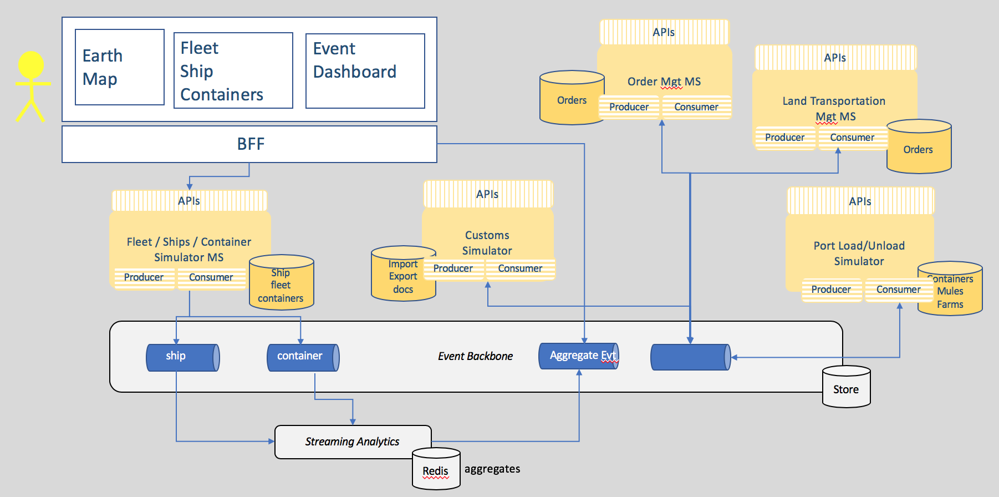

# K Container Shipment Use Case

This solution implementation illustrates the deployment of real time analytics on event streams in the context of container shipment in an event driven architecture with event backbone, functions as service and microservices.

As part of producing the IBM event driven point of view and reference architecture, we wanted to bring together a complete scenario which would cover all aspects of developing an event driven solutions including extended connections to devices/IOT  and blockchain for trusted business trading networks. We felt that the shipping business could provide a good foundation for this and would enable us to show how to develop event driven solutions following the architecture patterns.

The high level process can be represented in the following diagram, and is described in detailed in [this section](analysis/readme.md#high-level-view-of-the-shipment-process-flow):

In developing the scenario, it became apparent that the event driven nature of business, extends across the business network, so we have widened the view in the scenario to consider the chain of parties involved in the shipping process, including importer, exporter, land transport and customs. To keep the scenario easy to understand, we have only considered the following cases:

1. Importer Orders goods from exporter overseas
2. Exporter becomes the customer of the shipping agent and uses 'ToDoor' shiping service
3. Shipping agent manages process of land transport loading, unloading and shipping. Through the scenario we can see the impact of “events”, which may delay or change the shipping process across all three parties.  

## Table Of Content

* [Target Audiences](#target-audiences)
* [Analysis](./analysis/readme.md) is a detailed explanation of the event storming method applied to the containershipping process.
* [Define microservice scopes](#define-microservice-scopes)
* [Architecture](#architecture) using the different EDA patterns.
* [Deployment](#deployment) to hybrid cloud
* [Demonstration script](./docs/demo.md) to present the application end to end.

## Target Audiences

You will be greatly interested by the subjects addressed in this solution if you are...

* An architect, you will get a deeper understanding on how all the components work together, and how to address resiliency, high availability.
* A developer, you will get a broader view of the solution end to end and get existing starting code, and practices you may want to reuse during your future implementation. We focus on event driven solution in hybrid cloud addressing patterns and non-functional requirements as CI/CD, Test Driven Development, ...
* A project manager, you may understand all the artifacts to develop in an EDA solution, and we may help in the future to do project estimation.

## Define microservice scopes

As presented in [this note](https://github.com/ibm-cloud-architecture/refarch-eda/blob/master/docs/evt-microservices/README.md#understanding-event-driven-microservice-patterns), we are using a set of microservice design patterns to develop this solution. One of them is the sub domain decomposition. From the analysis output we have the aggregates, actors and data that is helping us to extract a set of subdomains:

* Fleet Service: responsible to group the ship, container carriers, in fleet, per major ocean. 
    * Information model: 
        * Fleet has multiple ships,
        * ship unique identifier, and a container capacity (represented as a matrix to make it simple), current position, status, itinerary identifier. 
    * Events: Ship commission , ship position, load event, unload event, start itinerary X
    * Operations: getFleets, get ships in a fleet, get ship by ID. CRUD Fleet and Ship level
* Voyages Service: define a set of voyage schedules supported by the shipping company
    * Information model: voyageID, shipID, src_Port, planned_src_port_dates, dest_port, planned_dest_port_dates, free_space_this_leg
    * Events: add itinerary route
    * Operations: CRUD on itinerary routes
* Order Service: manage the shipment order
    * Information model: Booking id , customer, pickup loc, pickup after date, deliver location, expected deliver date, order status, assigned container  
    * Events: Place order, order assigned to voyage( sets VoyageID, ship ID ), container assigned to order ( Sets container ID), Landorder, Transport associated with pickup container, Order status event, Order billing/accounting event
    * Operations: CRUD on order, update order status
* Container Service:
    * Information model: Container Id, Container temperature, container position, container condition ( maintenance goods), current associated order
    * Events: 
    * Operations: CRUD on container
* Customs and Export Service
    * Information model:
    * Events:
    * Operations: process an order for custom validation
* Land Transport Service:
    * Information model: LandTID, pickup place pickup time, drop place. Drop time, provider, price , container id , LT order status
    * Events:
    * Operations:

## Architecture

Leveraging the Event Driven Architecture high level architecture foundation the solution is using the following components:

* Top left represents the user interface to support the demonstration of the KC solution, with a set of widgets to present the ships movements, the container tracking / monitoring and the event dashboards. The botton of the UI will have controls to help performaing the step by step demonstration.
* The event backbone is used to define a set of topics used in the solution and as event sourcing for microservice to microservice data consistency support.
* Each service supports the top-level process with context boundary defining the microservice scope.
* Streamaing analytics is used to process aggreates and analytics on containers and ships movement data coming in real time.

## Deployment

The solution support a set of related repositories including user interface, a set of microservices to implement event sourcing, saga and CQRS patterns, and to implement simulators and analytics content.
In each repository we are explaining the design and some code approach used.

### Related repositories

* [User Interface in Angular 7 and Backend For Frontend server used for demonstration purpose](https://github.com/ibm-cloud-architecture/refarch-kc-ui)
* Most of the simples [supporting microservices and functions](https://github.com/ibm-cloud-architecture/refarch-kc-ms) of this solution are grouped in one repository. We may change that later if we need it.
* [Real time analytics with IBM Streams Analytics](https://github.com/ibm-cloud-architecture/refarch-kc-streams)
* [Order management microservice using CQRS and event sourcing pattern](https://github.com/ibm-cloud-architecture/refarch-kc-order-ms)

The command `./scripts/clone.sh` clones the dependant repositories. 

### Configurations

To make the solution running we need to have a set of components installed and ready. We can deploy the components of the solution into three environments:

* **Public cloud (IBM Cloud)**, [see the article](docs/prepare-ibm-cloud.md) for details.
* **Private cloud** (we are using IBM Cloud Private) and [see this article](docs/prepare-icp.md) for details.
* Local to your laptop, mostly using docker images and docker compose. See next section for explanations.

### Run locally

To run locally you can use a kubernetes like Minikube or Docker Edge, or docker-compose. We propose to use docker-compose for local deployment, and here are the instructions to launch backbone and solution components:

1. Get [docker and install](https://docs.docker.com/install/) it (if not done yet)
1. Get [docker compose](https://docs.docker.com/compose/install/)
1. In one Terminal window use our compose file to start the backend components: `$ cd docker &&  docker-compose -f backbone-compose.yml up`.    
Once the backend is started, you need to configure the Kafka topics. The local script: `scripts/createLocalTopics.sh` will create the necessary Kafka Topics so the solution will work.

1. In a second terminal use our second compose file to start the web server and the other microservices: `$ docker-compose -f kc-solution-compose.yml up`

1. Verify the different components work fine. You can use the different test scripts you can find in each of the microservices, simulators of the solution, or go to the [user interface URL](http://localhost:3000) the Fleet Simulator [API URL](http://localhost:9081/api/explorer/) and execute the [demo script](./docs/demo.md).

## Contribute

As this implementation solution is part of the Event Driven architeture reference architecture, the [contribution policies](./CONTRIBUTING.md) apply the same way here.

**Contributors:**
* [Jerome Boyer](https://www.linkedin.com/in/jeromeboyer/)
* [Martin Siegenthaler](https://www.linkedin.com/in/martin-siegenthaler-7654184/)
* [David Engebretsen](https://www.linkedin.com/in/david-engebretsen/)
* [Francis Parr](https://www.linkedin.com/in/francis-parr-26041924)
* [Hemankita Perabathini](https://www.linkedin.com/in/hemankita-perabathini/)

Please [contact me](mailto:boyerje@us.ibm.com) for any questions.
