# Container Shipment Analysis

This section defines the overall steps in the methodology to analyse a specific global shipping example and derive the event driven solution. We combined some elements of the [design thinking](https://www.ibm.com/cloud/garage/content/think/practice_design_thinking/) methodology with the [event storming](https://ibm-cloud-architecture.github.io/refarch-eda/methodology/eventstorming/) and [domain driven design](https://www.ibm.com/cloud/garage/content/code/domain-driven-design/) to extract the following analysis of the business domain.

## Output from Domain Driven Design workshop

From the design thinking workshop we extracted the following artifacts:

* a persona list
* the MVP hills

### Personas for each stakeholder

We develop personas for each of the business stakeholders to better understand their work environment, motivations and challenges.  Personas helps to capture the decisions and questions that these stakeholders must address with respect to the targeted key business initiative.

Persona name | Objectives | Challenges
--- | --- | ---
**Retailer** |Receive shipped goods on time, on date contracted with manufacturer  Receive assurance that temperature sensitive goods have remained with bounds| Late delivery may miss market opportunity   long delivery time makes market opportunitiy prediction more difficult
**Manufacturer** |Good enough estimates of shipment times from Shipment Company to close sale and delivery with Retailer Pickup of containers by land transporter   Timely delivery of container to Retailer as contracted with Shipment company   Able to get information on current location and state of container in transit| Contract with Shipment company will include timing estimates and penalty clauses   must update Retailer as sonn as schedule changes known   Must receive and communicate to retailer assurance on history of temperature sensitive goods  
**Shipping Company** |Provide good enough estimates of shipment time to close shipment contract with Manufacturer Execute shipment contracts on time profitably ( with minimal cost)|Fixed ship and itinerary schedule   variability in ship leg travel times and costs   variability in port congestion and load / unload times at dock   variability in Land transport timings 
**Land Transporter** |Pick up and drop off containers at times and locations agreed with Shipment company |May be short notice requests   may actually use bids in a market to resolve at lowest cost best response etc.
**Port Dock Operator** |Load and unload containers from docked ship as specified by Shipping Company with minimal time and effort   free up dock asset quickly to become available for next ship | Highly complex sequence of operation in Dockyard to be coordinated to minimize effort and time 
**Customs Officer** |Clear containers for export and assess duty on import containers|Depends on quality of manifest and certification of origin documentation for each container from Manufacturer 

### MVP hills

The challenges listed in the persona table above identify a possible set of MVP hills for this end to end solution. The event storming methodology described below will lead to picking out specific subareas of the solution with most value as initial MVPs.

## High level view of the shipment process flow

At the high level the shipment process flow is suggested and illustrated in the diagram below.

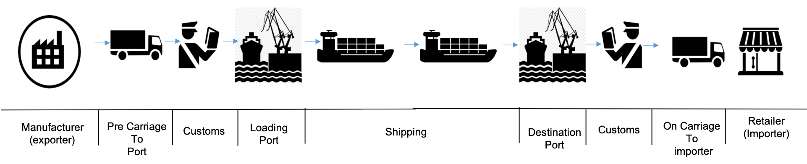

For the purposes of showing how to design a reference EDA solution we select on a simple subcase of all actual and possible variations of the global container flow. Very high level steps in this flow are as follows:

1. Retailer and manufacturer interact to create agreement to deliver specific goods in a container from manufacturer's location to retailer's location with an expected arrival date.
1. Manufacturer places shipping order with 'Shipping Company' to pickup container and deliver under the condition expected above.
1. Shipping Company arranges for land transport to pick up loaded container and required documentation from Manufacturer and deliver the container to dockside at source port (adjacent to Manufacturer) for loading onto container vessel.
1. Shipping company works with Customs Officer at source port to clear outbound container for export.
1. When Container Ship is in dock at source port Shipping company arranges with Port Dock Operator to load and unload containers at this port.
1. Loaded container ship leaves dock in source port adjacent to Manufacturer and sails to destination port.
1. Container ship arrives at destination port (adjacent to Retailer) and queues to enter Port Docking area.
1. Shipment company arranges with Port Docking Operator to unload specific containers needed at this port and reload additional ones for next shipping leg.
1. Shipment company works with Import Export office at destination port to clear and collect any import duties.
1. Shipment company works with Land Transporter at destination port to pick up container and deliver to Retailer.
1. Container is delivered by Land Transporter to Retailer's location - transaction is complete.

## Event storming analysis of the container shipping flow

We use the [event storming](https://ibm-cloud-architecture.github.io/refarch-eda/methodology/eventstorming) analysis to move from the high level description of a business process flow above to a specific event timeline with identified bounded contexts each of which could be a target MVP component linked through EDA architecture.

Event storming is a rapid lightweight design process enabling the team of business owners and stake holders, architects and IT specialists to fomalize a complex solution in a clearly communicable event timeline. This step is effective in developing event-based microservices linked through an EDA architecture in one or more MVP contexts. 

Steps in an eight hours event storming analysis workshop of the container shipping example are illustrated and described below. 

### Step 1: Capture the Domain Event Timeline, swim lanes and key phases

This section of the example description covers activities identified as event storming workshop steps 1,2,3 in the generic description of the [event storming method](hhttps://ibm-cloud-architecture.github.io/refarch-eda/methodology/eventstorming/).

The initial step in event storming analysis is to capture all events, things which have happened at a point in time, and organize them into a timeline:

* Each event goes on an orange "sticky note"
* Parallel or independent processes may be separated with blue horizontal swim lanes
* Critical event indicate a new stage, or pivot, in the flow shown with vertical blue bars.

For the global shipment example described at a very high level above we came up with an event timeline shown in the set of diagrams below.
(The event storming process captures these event timeline sections in charts on walls around the meeting room). 

#### Container shipping event timeline section 1

This section of the event time line deals with initial contracts to ship container and startup actions - specifically:  

* Retailer and Manufacturer setting on an initial order for delivery of goods in a container.
* Manufacturer placing order for shipment with Shipping Company.
* Land transport arranged to pick up container and deliver to source port.
* Container ship approach source port adjacent to Manufacturer's location.

The events are organized into separate swim lanes for Manufacturer, Retailer and Ship perspectives operating in parallel.

Swim lanes help to clearly separate ship events as it approaches the source port from container specific events with agreements to ship etc. There is no time coupling or precise causality between events in these two swim lanes.

The red sticky note is a comment.

* In this case we make the particular simplification to limit the scenario to shipping complete containers only. This avoids having to deal with additional warehousing, container load aggregation and packing events - together with correspondng unpacking and disaggregation.

#### Container shipping event timeline section 2

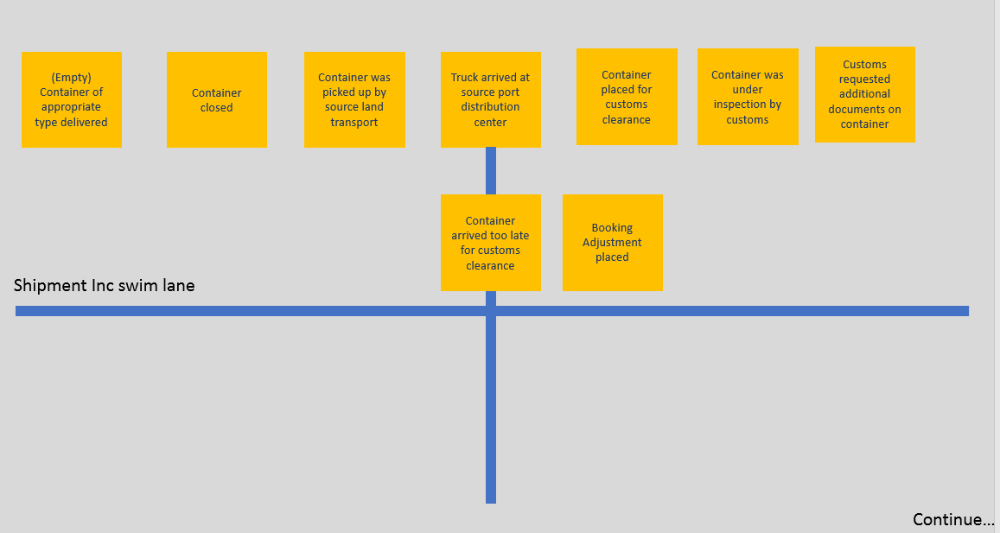

This section continues event time line development with a swim lane now focussing on loading and pickup of a specific container at the Manufacturer's location and its delivery to the source port dockside.

There is a critical event (indicated by vertical blue bar) separating the "source dockside" phase of the solution. Before this critical event we are dealing with container specific activities in collecting and transporting the container from Manufacturer's location to dockside.
In the following dockside phase there are interactions with Customs Officer to get the container cleared for export.

The Manufacturer will need an empty container (refrigerated if necessary for the shipment of interest) to load the goods into. We show an event for empty container being delivered. The solution is simplified if we assume that the Manufacture has a pool of empty containers always available. Alternatively this can be analyzed fully in some more complete generalized version of the solution.

When the container arrives at source port dockside it may or may not be intime for the cutoff time required by the Customs Officer to get containers cleared for export before the scheduled departure of a particular container ship. If the cutoff deadline is missed the shipment will need to be rebooked on a later container ship and the client Manufacturer notified of expected delay in delivery.

#### Container shipping event timeline section 3

This section continues the event timelines with swim lanes relating to a specific container shipment and also to the movement of a ship potentially carrying hundreds of containers.

It introduces two new critical events:

1. The Customs decision phase of event ends with a specific decision to clear a container for export or not, or possibly a request for additional inspecions or documents requiring more decision time: 

      * If the container is approved for export it can proceed to loading.  
      * If additional time is required for the clearance process, the original booking and expected delivery date may need to be modified. 
      * If export clearance is denied, then shipmen is cancelled and requesting parties notified.

1. Ship enters dock ready to start unloading and loading is a new critical event:

      * Previous ship events in Event Timeline section 1 dealt with ship "booking" a load/unload timeslot at a dock in the source port.
      * Also getting  national authority or Customs clearance to enter that jurisdiction.
      * Now on arrival at the source port anchorage area, the ship requests permission to moor at an available dock facility.
      * The critical event when a ship is cleared and moored at a dock hence ready to start unloading and loading containers is the start of the next event phase - container loading (and unloading).

#### Container shipping event timeline section 4

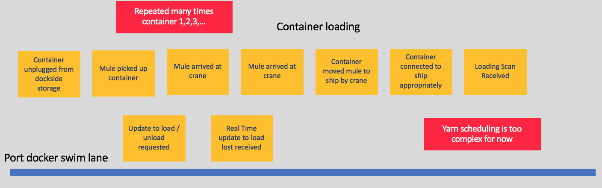

This segment of the event timeline deals with a single swim lane for the ship while it is moored in a dock facility at the source port, is having arriving containers destined for this port unloaded and new containers being loaded at his port. The port dock facility operator is coordinating many events in the yard to perform load unload operations. These steps - as noted in a red discussion "sticky" in the event storming timeline are repeated for many containers. The time line presented here captures representative high level events. It is straightforward to extend the analysis to open up additional layers of detail touching on operational optimizations and coordination at the cost of addiional complexity not essential to our reference example here.

Some of the events in this phase are now specialized to address needs of particular type of container - refrigerated containers - able to maintain specific temperature bounds and to report on their global location and temperature status on a continuous basis. This is a natural outcome of the event storming analysis involving free parallel capture of event types by a team of individuals with different points of view and interests. Working forward towards one or more MVP implementations of key components of this solution linked through EDA architecture we will need to characterize event types more uniformly end to end but imposing that level of consistency checking on the initial event storming process will slow down progess without providing significant benefit.

#### Container shipping event timeline section 5

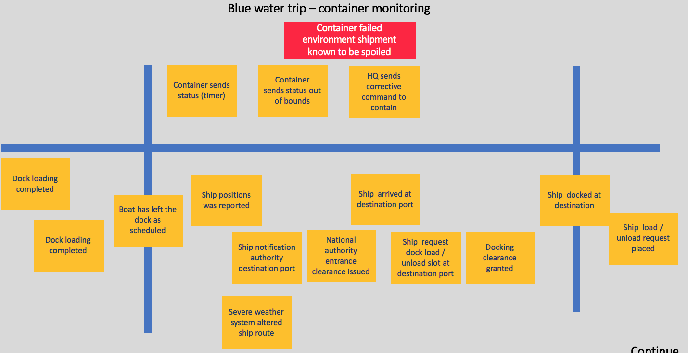

This segment of the event timeline captures events which occure in the blue water phase of the shipping, after the container ship has left the source port and is travelling owards but has not yet reached the destination port. 

It is divided into two swim lanes the ship perspective and individual container perspectives. The ship perspective includes events relating to the entire ship:

* leaving port.
* reporting its current position.
* deciding to alter planned course to avoid a weather event.

The upper swim lane capture events which are specific to a particular container.

* container sensors reporting on geolocation.
* refrigerated container sensors reporting on humidity, carbon dioxide,  temperature in the container and power consumption of the refrigeration unit.

#### Container shipping event timeline sections 6 and 7 

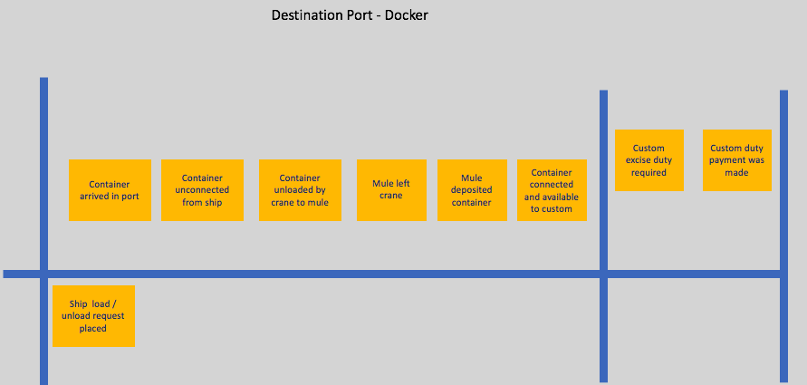

The remining event time line segments 6 and 7 deal with arrival at the destination port unload of the container and delivery to the Retailer's location. At the level of simplification in the reference architecture example, the steps for unloading a container at the destination port, clearing Customs and delivering it to are Retailer location are the symmetric image of the steps to pick up the container from the Manufacture location, clear it through export permissions and load onto the ship. 

For these reason we just provide event timeline digrams for these steps withou going into further explanatory detail. 

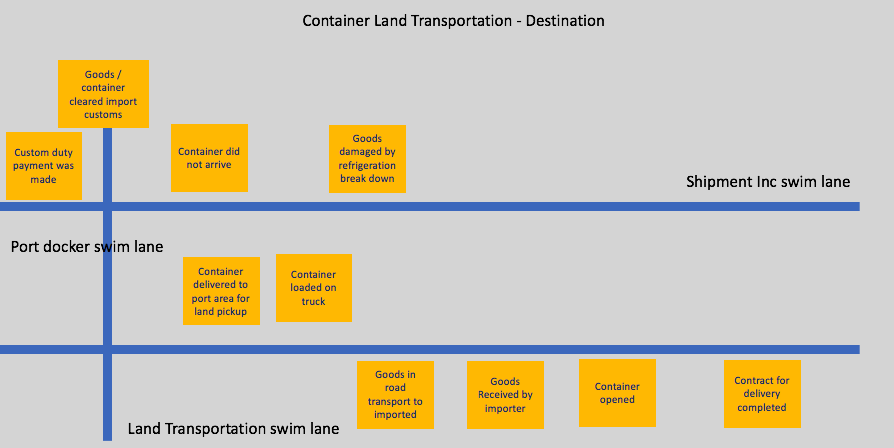

### Step 2: Identify commands and event linkages
  

> This section of the example description covers activities identified as event storming workshop steps 4,5) in the generic description of the [event storming method](https://www.ibm.com/cloud/garage/architectures/eventDrivenArchitecture/event-storming-methodology).

After capturing all events for the scenario and organizing them in a time line, the next step in event storming analysis is to identify the triggers for events and causal linkages between events. 

For each identified event in the timeline we ask "What triggered this event to occur?". Expected event trigger types are:

* A human operator makes a decision and issues a command.
* Some external system or sensor provides a stimulus.
* An event results from some policy  - typically automated processing of a precursor event.
* Completion of some determined period of elapsed time.

For each event trigerred by a command, the triggering command is identified in a blue (sticky) note. This may become a microservice api in a later implementation. The human persona issuing the command is identified and shown in a yellow note above this.

For events trigerred by processing of some precursor events the trigerring policy explaining when and why this event occurs is summarized in a lilac colored note. Specific causal event linkages are added to the event storming diagram as blue directed (arrow) linkages.

In the following subsections we show the results of command and event linkage analysis for some selected areas of the container shipping example.

#### Container shipping Commands for order placement and land transport setup

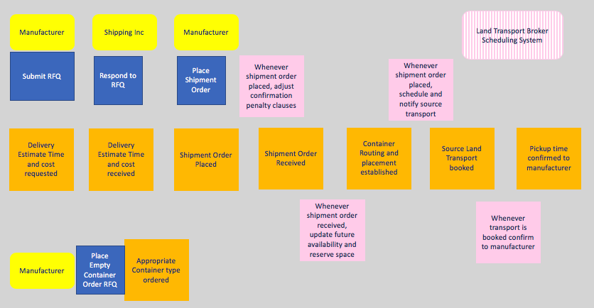

This diagram shows the command, agent issuing events and policies triggering events for the order placement and land transport set up (at manufacturer location) sections of the event timeline generated in step 1

#### Container shipping  event linkages for order placement setup 

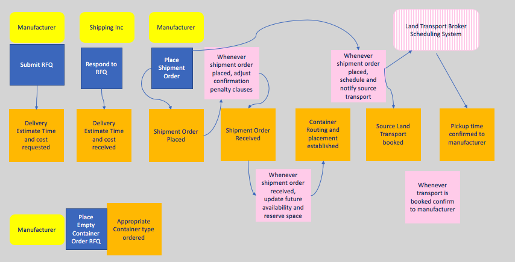

The above diagram adds event linkages showing the causality chaining of events and business rules.

#### Container shipping commands for pickup at Manufacturer's location

The above diagram is generated for the command and policies associated with pick up of a loaded container from the Manufacturer's location and delivery to the source port dockside.

#### Container shipping commands in port to port (Blue water) section of the event time line

The diagram is self explanatory.

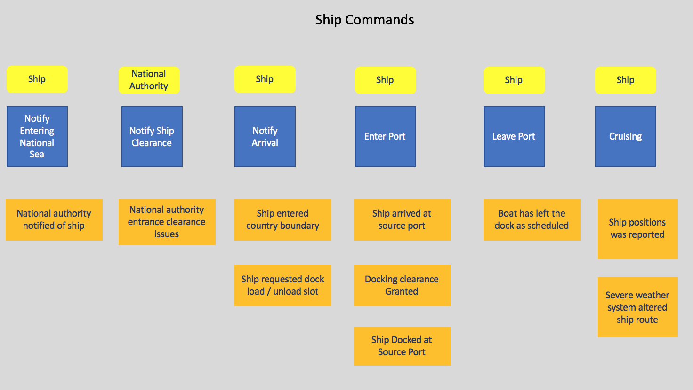

### Step 3: Decision data, predictive insights and insight storming:

> This section of the example description covers activities identified as event storming workshop step 8 in the generic description of the [event storming method](https://www.ibm.com/cloud/garage/architectures/eventDrivenArchitecture/event-storming-methodology).

Insight storming is extending the event storming workshop to identify and capture insightful predictive analytics, and it is introduced and described in [workshop execution Step 8 - Insight](https://www.ibm.com/cloud/garage/architectures/eventDrivenArchitecture/event-storming-methodology). 

Predictive analytic insights are effectively probabilistic statements about which future events are likely to occur and what are the like properties of those events. They are typicaly generated using models created by data scientists or using artificial intelligence (AI) or machine learning (ML).  Business owners and stakeholders in the event driven solution have good intuitions on:
* Which probabilistic insights are likely to lead to better decision making and action when a particular event occurs.
* What sources of information are likely to help create a model to predict this insight.

So in event storming for an EDA system, we recommend generalizing the step of identifying data (properties of past definite events) to help make good decision and replacing this with an **insight storming** step which will look for: 
* data which will help make good decisions about how to act when an event occurs
* predictive insights which could help guide our actions in response to proactively before some future event.
* sources of data which are likely to enable the building of reliable predictive insight models. 

This additional step of insight storming takes advantage of the fact that we already have a time line for the problem being analysed with all events designed, commands, policies and event linkages already identified, and the business owners and stakeholders in the room whose insights for the business problem enable them to identify potentially valuable predictive insights. 

Working through insight storming in this way leads to a business value driven specification of possible predictive analytics opportunities in the solution. Event driven architecture provides a mature pattern to models addressing the identified needs. Event Stream Processing analytics infrastructure is then availalable to support scoring of these models and uses of the resulting insights in decision making and action in real time. 

#### Container shipping event stream processing diagram - including event stream processing flows

The shipping example includes the case where continuous sensor measurement data is available from each refrigerated container while it is stacked on board the container ship and is in between ports on a blue water phase of the scenario. We show how streaming analytics can process the arriving continuous sensor measures in real-time and to deliver additional capabilites in the EDA solution. 

A diagram for this flow generated from Insight storming is shown below. 

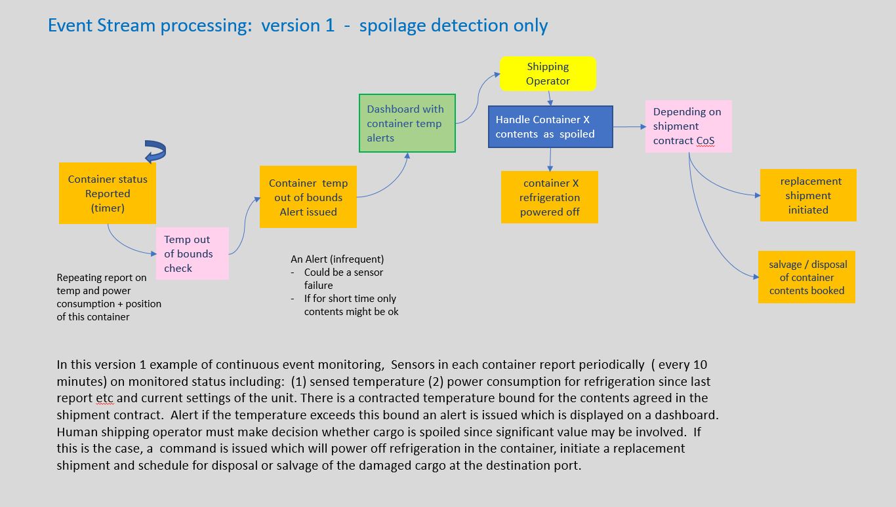

In this diagram it is made clear the delivery of measured temperature, probably GPS position, and power consumption of the refrigeration unit for that container is a recurring "continuous" event stream. Each container might report once a minute; this ensures that an auditable record of container temperature is available from the event backbone or event sourcing.

We show a policy test to decide whether the temperature has gone outside the specified range committed to in that shipment contract for the goods in that container. If this violation has occured, this is an (unusual) alert event reporting that temperature has gone out of range.
This information is available as data to subject matter expert's dashboard seen by the shipping company operator who must make the business decision whether the contents of the container are spoiled. It is likely that involvement of human operator is necessary since this is a business decision with possibly significant $ consequences. It is possible that a bad sensor reading could have been received or that in this contract violation of the temperature range for a very short interval of time is permissable. 

Some stateful analysis of the container temperature reports would make the readings more reliable; perhaps there need to be more than one out of range reading to issue the alert to avoid corrupted data false positives.

If the business decision is made that the container's contents are spoiled:

* A command is invoked to act on this decision.
* The container refrigeration may be powered down (possible other sensing left active)
* A policy based on terms and class of service of this particular shipment will determine:
    * Whether a replacement shipment will be initiated and booked 
    * Usually shipping and receiving parties need to be notified
    * The shipping company will schedule some salvage or disposal action for the content of the container at next port

Each of the actions above will be an event captured in the event backbone - trigerring further loosely coupled commands and policies to take defined actions.  
    
#### Container shipping event stream processing with predictive Insight flows included

The previous section defines how event stream processing could detect when a shipment was spoiled and trigger recovery actions. But shipping experts in an insight storming session will note that it is much better to predict when a spoilage temperature event is **likely to occur** and to take automated immediate (real-time) action to avert the spoilage.

The simplest form of prediction of a temperature likely to go outside of its permissible range is to have checks on whether the temperature is approaching these bounds. If the temperature must stay below T degrees, take corrective action if it reaches T - delta degrees. 

More complex models for predicting temperature, could take into account diurnal variation due to external temperatures, possible predicted external temperatures forecast for the current course of the ship, and whether ther container is stacked above deck and hence particularly exposed to external temperatures. 

We assume that possible corrective action includes resetting the thermostatic controls on the refrigeration unit for the cotainer, possibly resetting the controls which may have drifted from their calibrated settings... 

An insight storming diagram which could be generated from discussion of these potentially useful insights and predictions is shown in the diagram below. 

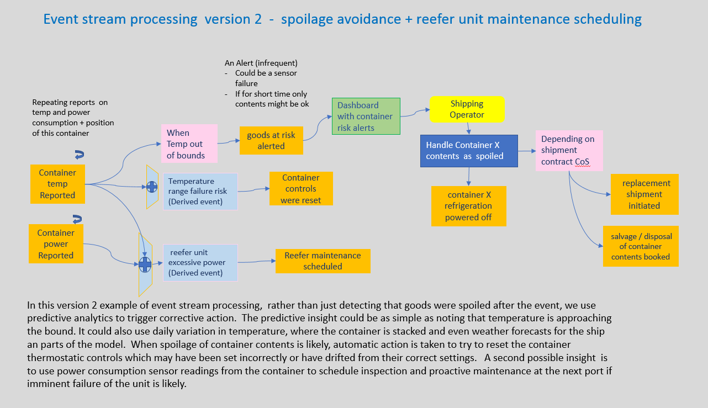

We have added an additional insight - namely that it may be possible to predict from the temperature observed in a container and the trend of power consumption of that refrigeration unit, that the unit is in danger of failing and should be inspected and possibly services as soon as possible. 

Insights about predicted risk of temperature based spoilage, and prediction of refrigeration unit  probable need for maintenance are presented in light blue. These are probabilistic prediction for properties and likely occurence of future events. Loose coupling and reuse of these insights by allowing publish subscribe to insight topics is helpful.  Insights are conceptually different from events since they are probabilistic predictions for the future rather than events which by definition have already happened at some specific point in time. 

#### Event stream processing for insights relating to the ship 

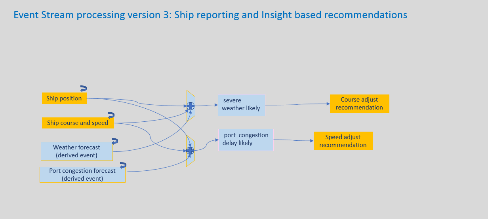

### Step 4: Commands, linkages, data and context for order placement  

> This section covers activities identified as EventStorming Workshop steps 6,7 in the generic description of the [event storming method](https://www.ibm.com/cloud/garage/architectures/eventDrivenArchitecture/event-storming-methodology).

In particular, we look at identifying bounded contexts and identifying aggregates which will lead to a loosely coupled collection of microservices providing an agile event-driven design. 

We drill down on understanding the order placement process when a container shipment is booked as the MVP context focus in which to explore our design at the next level of detail. We will focus the implementation on at least two aggregates: the shipment order, and container transportation.

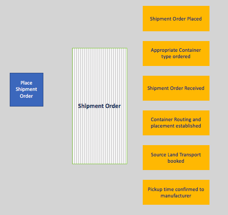

An actor will create a shipment order from a user interface (a manufacturer staff) that will call a command for creating the order. The shipment order context will be mapped to a microservice. The implementation will generate a set of events.

Same for container transportation.
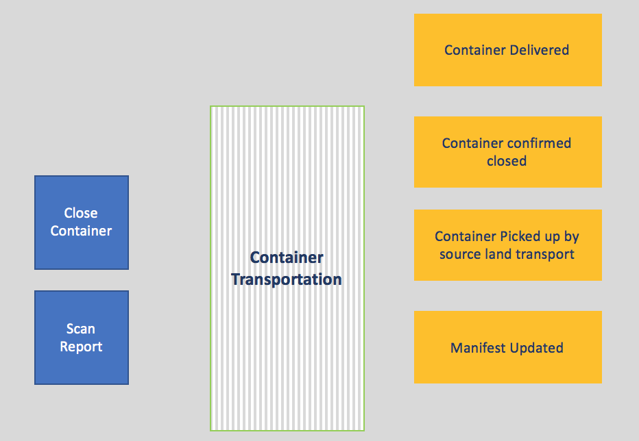

For more information on the design considerations for this solution see [this related note.](../design/readme.md)

