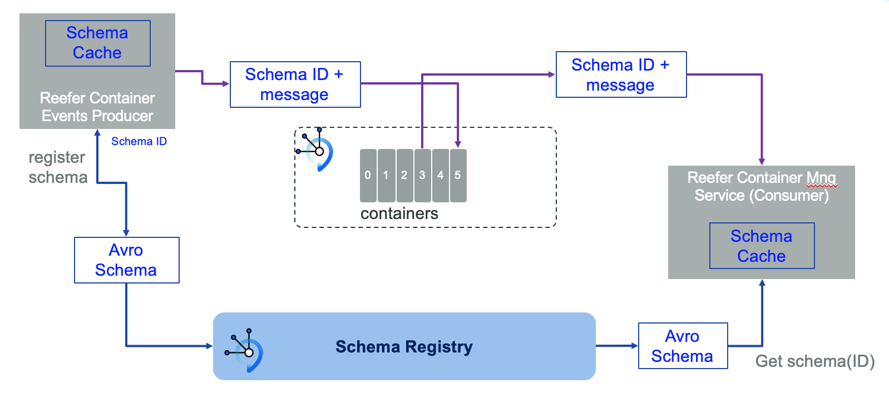
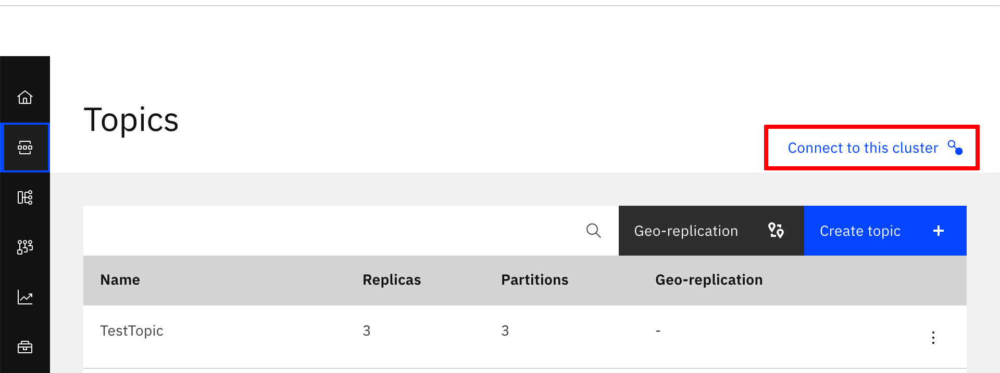
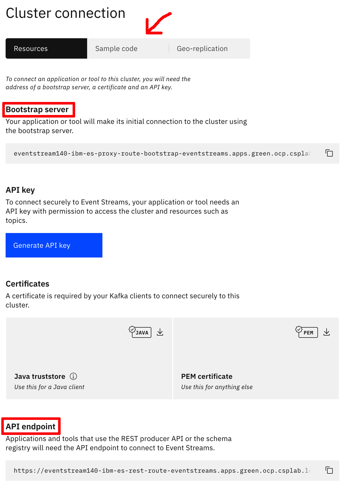
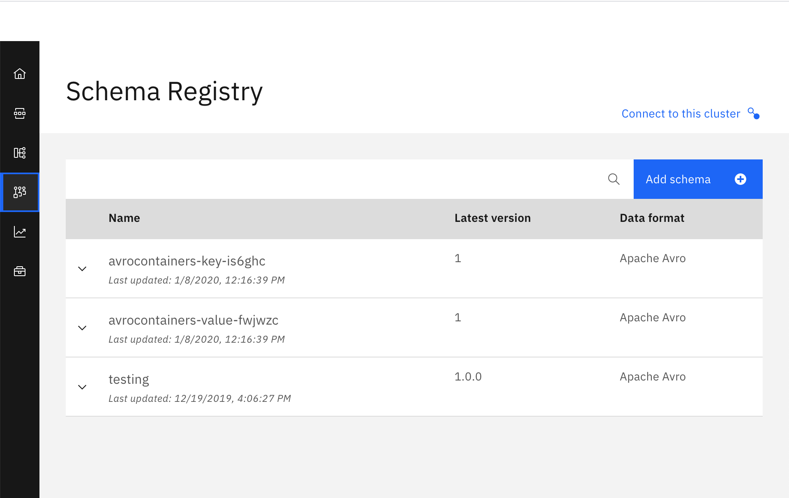
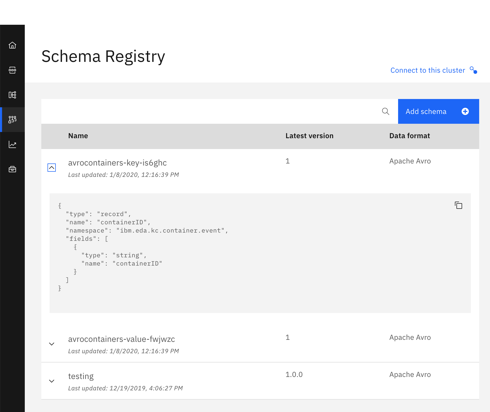
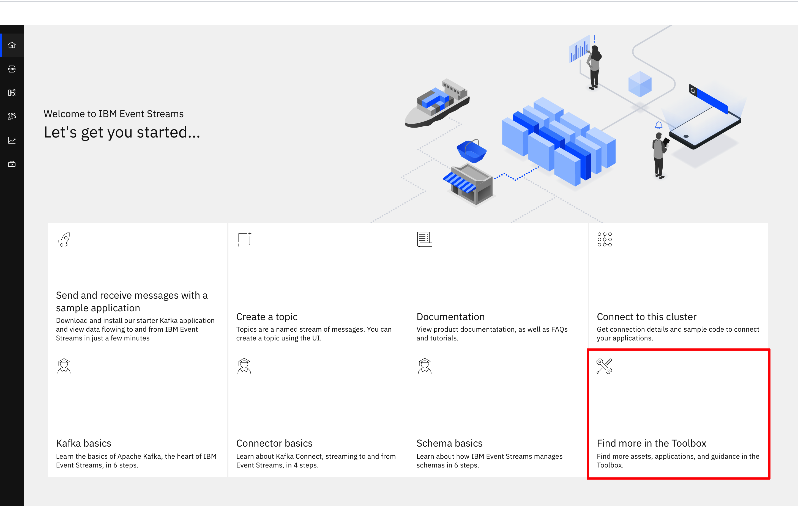
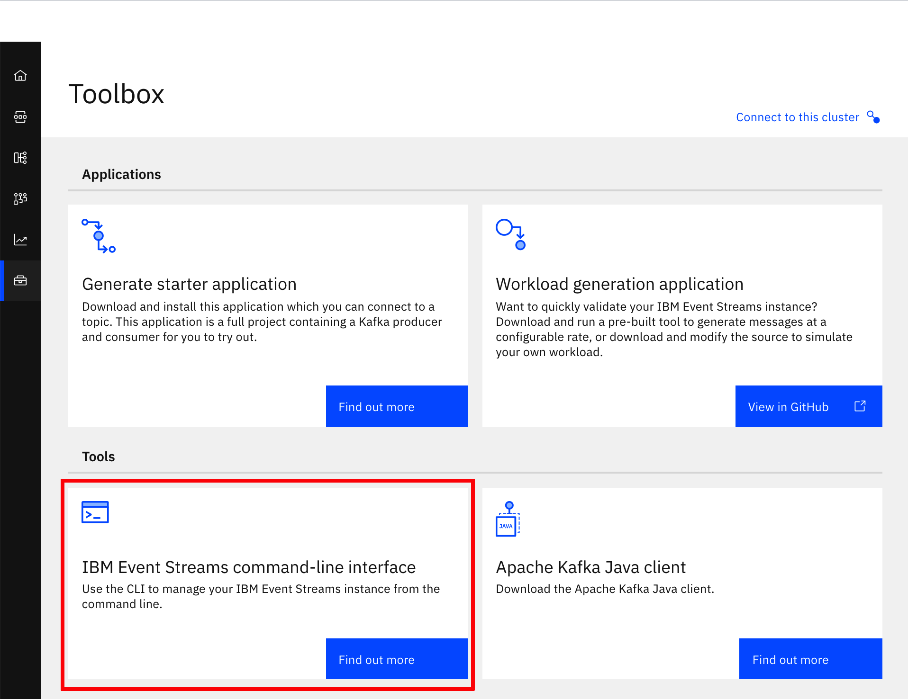

# Apache Avro

## Introduction

Here we explain the [Apache Avro](https://avro.apache.org/) messaging integration we have done in one of our integration tests for the **refarch-kc-container-ms** component, which is part of the [Reefer Containers reference implementation](https://ibm-cloud-architecture.github.io/refarch-kc/) of the [IBM Event Driven Architectures reference architecture](https://ibm-cloud-architecture.github.io/refarch-eda/). The Reefer Containers reference implementation is a simulation of what a container shipment process could look like in reality. From a manufacturer creating some goods to the delivery of those to a retailer, going through requesting a container, loading the goods into the container, finding a voyage for that container on a ship, monitoring the container's temperature and GPS location, delivering the container, unloading the goods, etc. As you can imagine, this scenario is ideal for an Event Driven architecture where we not only have a microservices based application but also the integration of these using Event Driven Architecture components (such as Kafka) and patterns (such as Saga, CQRS, Event Sourcing, etc).

### What is Apache Avro

Avro is an open source data serialization system that helps with data exchange between systems, programming languages, and processing frameworks. Avro helps define a binary format for your data, as well as map it to the programming language of your choice.

### Why Apache Avro

There are several websites that discuss the Apache Avro data serialization system benefits over other messaging data protocols. A simple google search will list dozens of them. Here, we will highlight just a few of those benefits from a [Confluent blog post](https://www.confluent.io/blog/avro-kafka-data/):

- It has a direct mapping to and from JSON
- It has a very compact format. The bulk of JSON, repeating every field name with every single record, is what makes JSON inefficient for high-volume usage.
- It is very fast.
- It has great bindings for a wide variety of programming languages so you can generate Java objects that make working with event data easier, but it does not require code generation so tools can be written generically for any data stream.
- It has a rich, extensible schema language defined in pure JSON
- It has the best notion of compatibility for evolving your data over time.

## Avro, Kafka and Schema Registry

Avro relies on schemas. When Avro data is produced or read, the Avro schema for such piece of data is always present. This permits each datum to be written with no per-value overheads, making serialization both fast and small. An Avro schema defines the structure of the Avro data format. Schema Registry defines a scope in which schemas can evolve, and that scope is the subject. The name of the subject depends on the configured subject name strategy, which by default is set to derive subject name from topic name.

In our case, this Avro data are messages sent to a kafka topic. Each message is a key-value pair. Either the message key or the message value, or both, can be serialized as Avro. Integration with Schema Registry means that Kafka messages do not need to be written with the entire Avro schema. Instead, Kafka messages are written with the **schema id**. The producers writing the messages and the consumers reading the messages must be using the same Schema Registry to get the same mapping between a schema and schema id.

Kafka is used as Schema Registry storage backend. The special Kafka topic `<kafkastore.topic>` (default `_schemas`), with a single partition, is used as a highly available write ahead log. All schemas, subject/version and ID metadata, and compatibility settings are appended as messages to this log. A Schema Registry instance therefore both produces and consumes messages under the `_schemas` topic. It produces messages to the log when, for example, new schemas are registered under a subject, or when updates to compatibility settings are registered. Schema Registry consumes from the `_schemas` log in a background thread, and updates its local caches on consumption of each new `_schemas` message to reflect the newly added schema or compatibility setting. Updating local state from the Kafka log in this manner ensures durability, ordering, and easy recoverability.

### How does it all work



When the producer sends a message/event to a Kafka topic for the first time, it sends the schema for that message/event to the Schema Registry. The Schema Registry registers this schema to the subject for the Kafka topic we want to send the message/event to, and returns the **schema id** to the producer. The producer **caches this mapping between the schema and schema id** for subsequent message writes, so **it only contacts Schema Registry on the first message/event write** (unless the schema has changed, that is evolved, when the schema registry will be contacted again for validation and storage of this new version of the schema). Kafka messages are written along with the **schema id** rather than with the entire data schema.

When a consumer reads this data, it sees the **Avro schema id and sends a schema request to Schema Registry**. Schema Registry retrieves the schema associated to that schema id, and **returns the schema to the consumer**. The consumer **caches** this mapping between the schema and schema id for subsequent message reads, so it only contacts Schema Registry on the first schema id read.

## Our implementation

As mentioned in the introduction, the integration of the Apache Avro data serialization system has been done in one of the integration test for the `refarch-kc-container-ms` component of the [Reefer Containers reference implementation](https://ibm-cloud-architecture.github.io/refarch-kc/) of the [IBM Event Driven Architectures reference architecture](https://ibm-cloud-architecture.github.io/refarch-eda/).

The **refarch-kc-container-ms** component will take care of the reefer containers status. From adding new reefers to the available containers list to assigning a container to a particular order and managing the status of that reefer throughout the shipment process aforementioned. 

The integration tests for our Reefer Containers reference implementation can be found [here](https://github.com/ibm-cloud-architecture/refarch-kc/tree/master/itg-tests). The integration tests are being developed in python and their main goal is to validate the successful deployment of the Reefer Containers reference implementation end-to-end.

The particular integration test (still under development) where we have integrated the Apache Avro serialization system can be found under the `ContainersPython` folder. More precisely, these are the files and folders involved in our implementation:

```shell
├── data_schemas
│   ├── container_event.avsc
│   ├── container_event_key.avsc
│   ├── container_event_payload.avsc
│   ├── container_event_type.avsc
│   ├── container_status.avsc
│   └── utils
│       └── avroEDAUtils.py
└── itg-tests
    ├── ContainersPython
    │   ├── ConsumeAvroContainers.py
    │   └── ContainerAvroProducer.py
    └── kafka
        ├── KcAvroConsumer.py
        └── KcAvroProducer.py
```

that will allow us to send **container events** into the **containers** Kafka topic and read from such topic.

By using these python scripts, we will be able to validate:

- Sending/Receiving **Apache Avro encoded messages**.
- **Apache Avro data schema definitions** for data correctness.
- **Schema Registry** for Apache Avro data schema management.

### Data Schemas

Avro schemas are defined with JSON. An example of a Container Event for creating a new reefer container to the available list of containers for our reference application looks like:

```json
{
  "containerID": "container01",
  "timestamp": 1569410690,
  "type": "ContainerAdded",
  "payload": {
    "containerID": "container01",
    "type": "Reefer",
    "status": "Empty",
    "latitude": 37.8,
    "longitude": -122.25,
    "capacity": 110,
    "brand": "itg-brand"
  }
}
```

An Avro schema could be a nested schema which allows us to have a smaller reusable data schemas to define bigger and more complex ones. This is the case for our Container Event data schema. For instance, the payload is defined on its own data schema (`container_event_payload.avsc`) which the Container Event data schema refers to:

```json
{
  "namespace": "ibm.eda.kc.container.event",
  "name": "payload",
  "type": "record",
  "fields": [
    {
      "name": "containerID",
      "type": "string"
    },
    {
      "name": "type",
      "type": "string"
    },
    {
      "name": "status",
      "type": "ibm.eda.kc.container.status"
    },
    {
      "name": "latitude",
      "type": "float"
    },
    {
      "name": "longitude",
      "type": "float"
    },
    {
      "name": "capacity",
      "type": "int"
    },
    {
      "name": "brand",
      "type": "string"
    }
  ]
}
```

As you can see, the status attribute of the payload is yet another data schema itself which, in this case, is of type enum:

```json
{
  "namespace": "ibm.eda.kc.container",
  "name": "status",
  "type": "enum",
  "symbols": [
    "Loaded",
    "Empty",
    "Unassignable",
    "PartiallyLoaded"
  ]
}
```

All the different data schemas for a Container Event can be found under the `data_schemas` folder.

In that folder we have also developed a util script (`avroEDAUtils.py`) to be able to construct the final Container Event data schema that is needed by our producer:

```python
def getContainerEventSchema(schema_files_location):
  # Read all the schemas needed in order to produce the final Container Event Schema
  known_schemas = avro.schema.Names()
  container_status_schema = LoadAvsc(schema_files_location + "container_status.avsc", known_schemas)
  container_event_payload_schema = LoadAvsc(schema_files_location + "container_event_payload.avsc", known_schemas)
  container_event_type_schema = LoadAvsc(schema_files_location + "container_event_type.avsc", known_schemas)
  container_event_schema = LoadAvsc(schema_files_location + "container_event.avsc", known_schemas)
  return container_event_schema

def LoadAvsc(file_path, names=None):
  # Load avsc file
  # file_path: path to schema file
  # names(optional): avro.schema.Names object
  file_text = open(file_path).read()
  json_data = json.loads(file_text)
  schema = avro.schema.SchemaFromJSONData(json_data, names)
  return schema
```

#### See it in action

Here, we are going to see how data schemas help with data correctness. Using the payload for our container messages/events as the example, this is the output of a correct message being sent:

```
--- Container event to be published: ---
{
  "containerID": "container01",
  "type": "Reefer",
  "status": "Empty",
  "latitude": 37.8,
  "longitude": -122.25,
  "capacity": 110,
  "brand": "itg-brand"
}

Message delivered to containers [0]
```

However, if we try to send a payload where, for instance the container ID is an integer rather than a string, we will get an `avro.io.AvroTypeException`:

```
avro.io.AvroTypeException: The datum {'containerID': 12345, 'type': 'Reefer', 'status': 'Empty', 'latitude': 37.8, 'longitude': -122.25, 'capacity': 110, 'brand': 'itg-brand'} is not an example of the schema
{
    "type": {
        "type": "record",
        "name": "payload",
        "namespace": "ibm.eda.kc.container.event",
        "fields": [
          {
            "type": "string",
            "name": "containerID"
          },
          {
            "type": "string",
            "name": "type"
          },
          {
            "type": {
              "type": "enum",
              "name": "status",
              "namespace": "ibm.eda.kc.container",
              "symbols": [
                "Loaded",
                "Empty",
                "Unassignable",
                "PartiallyLoaded"
              ]
            },
            "name": "status"
          },
          {
            "type": "float",
            "name": "latitude"
          },
          {
            "type": "float",
            "name": "longitude"
          },
          {
            "type": "int",
            "name": "capacity"
          },
          {
            "type": "string",
            "name": "brand"
          }
        ]
      }
```

### Producer and Consumer

The python scripts developed to implement a producer and consumer to a kafka topic that sends Avro messages whose data schemas are managed by a schema registry are:

```shell
└── itg-tests
    ├── ContainersPython
    │   ├── ConsumeAvroContainers.py
    │   └── ContainerAvroProducer.py
    └── kafka
        ├── KcAvroConsumer.py
        └── KcAvroProducer.py
```

We have used the **confluent_kafka avro libraries** to implement our producer and consumer.

```python
from confluent_kafka.avro import AvroProducer, AvroConsumer
```

#### Producer

We create our `KafkaProducer` object where we define some of the **AvroProducer** options such as the schema registry url for data schema registration and management. But it is not until we call the `prepareProducer` method that we actually create the **AvroProducer** with that **schema registry** to be used as well as the **data schemas for the key and value** of our Container Event to be sent.

Finally, in the `publishEvent` method we send a value plus a key to a kafka topic.

producer when we call `prepareProducer`

```python
import json
from confluent_kafka import KafkaError
from confluent_kafka.avro import AvroProducer

class KafkaProducer:

    def __init__(self,kafka_brokers = "",kafka_apikey = "",schema_registry_url = ""):
        self.kafka_brokers = kafka_brokers
        self.kafka_apikey = kafka_apikey
        self.schema_registry_url = schema_registry_url

    def prepareProducer(self,groupID = "pythonproducers",key_schema = "", value_schema = ""):
        options ={
                'bootstrap.servers':  self.kafka_brokers,
                'schema.registry.url': self.schema_registry_url,
                'group.id': groupID
        }
        self.producer = AvroProducer(options,default_key_schema=key_schema,default_value_schema=value_schema)

    def publishEvent(self, topicName, value, key):
        # Important: value DOES NOT come in JSON format from ContainerAvroProducer.py. Therefore, we must convert it to JSON format first
        self.producer.produce(topic=topicName,value=json.loads(value),key=json.loads(value)[key], callback=self.delivery_report)
        self.producer.flush()
```

To use this class you need to do the following steps:

```python
# load schema definitions for key and value
from utils.avroEDAUtils import getContainerEventSchema, getContainerKeySchema
container_event_value_schema = getContainerEventSchema("/data_schemas/")
container_event_key_schema = getContainerKeySchema("/data_schemas/")
# Create a producer with the schema registry URL end point
kp = KafkaProducer(KAFKA_ENV,KAFKA_BROKERS,KAFKA_APIKEY,SCHEMA_REGISTRY_URL)
kp.prepareProducer("ContainerProducerPython",container_event_key_schema,container_event_value_schema)
# loop on publishing events
kp.publishEvent(TOPIC_NAME,container_event)
```

#### Consumer

Similarly to the producer, when we create a `KafkaConsumer` object we are just setting some of its attributes such as the kafka topic we will listen to and the schema registry url the producer will retrieve the data schemas from based on the schema ids messages comes with. It is only when we call the `prepareConsumer` method that we actually create the **AvroConsumer** and subscribe it to the intended kafka topic.

```python
import json
from confluent_kafka.avro import AvroConsumer

class KafkaConsumer:

    def __init__(self, kafka_brokers = "", kafka_apikey = "", topic_name = "", schema_registry_url = ""):
        self.kafka_brokers = kafka_brokers
        self.kafka_apikey = kafka_apikey
        self.topic_name = topic_name
        self.schema_registry_url = schema_registry_url 

    def prepareConsumer(self, groupID = "pythonconsumers"):
        options ={
                'bootstrap.servers':  self.kafka_brokers,
                'group.id': groupID,
                'auto.offset.reset': 'earliest',
                'schema.registry.url': self.schema_registry_url,
        }
        self.consumer = AvroConsumer(options)
        self.consumer.subscribe([self.topic_name])

# ...
```

### Schema registry

We have worked with the [Confluent schema registry](https://hub.docker.com/r/confluentinc/cp-schema-registry/) as well as the [IBM Event Streams Schema Registry](https://ibm.github.io/event-streams/schemas/overview/).

#### Confluent

The integration of the schema registry with your kafka broker is quite easy. In fact, all you need is to provide the schema registry with your zookeeper cluster url and give your schema registry a hostname: https://docs.confluent.io/current/installation/docker/config-reference.html#schema-registry-configuration

Once you have your schema registry up and running, this provides a rich API endpoint to operate with: https://docs.confluent.io/current/schema-registry/using.html#common-sr-usage-examples

For example:

Let's assume we have created a new kafka topic called `avrotest` for testing our work. And let's also assume we are sending persona messages/events whose data schema is the following:

```json
{
    "namespace": "avro.test",
    "name": "persona",
    "type": "record",
    "fields" : [
        {
            "name" : "name",
            "type" : "string"
        },
        {
            "name" : "age",
            "type" : "int"
        },
        {
            "name" : "gender",
            "type" : "string"
        }
    ]
 }
```

- Get the **subjects** (that is, the kafka topics to which we have a schema registered against. As explained before, we either have registered the schema manually ourselves or the Avro producer has registered it when we have sent the first message)

  ```http
  curl -X GET http://localhost:8081/subjects

  ["avrotest-value","avrotest-key"]
  ```

- Get versions for a subject:

  ```http
  curl -X GET http://localhost:8081/subjects/avrotest-value/versions

  [1]
  ```

- Get a specific version:

  ```http
  curl -X GET http://localhost:8081/subjects/avrotest-value/versions/1/

  {
    "subject": "avrotest-value",
    "version": 1,
    "id": 1,
    "schema": "{\"type\":\"record\",\"name\":\"persona\",\"namespace\":\"avro.test\",\"fields\":[{\"name\":\"name\",\"type\":\"string\"},{\"name\":\"age\",\"type\":\"int\"},{\"name\":\"gender\",\"type\":\"string\"}]}"
  }
  ```

- Get the schema of a specific subject version:

  ```http
  curl -X GET http://localhost:8081/subjects/avrotest-value/versions/1/schema

  {
    "type": "record",
    "name": "persona",
    "namespace": "avro.test",
    "fields": [
      {
        "name": "name",
        "type": "string"
      },
      {
        "name": "age",
        "type": "int"
      },
      {
        "name": "gender",
        "type": "string"
      }
    ]
  }
  ```

- Get the schema of a specific subject latest version:

  ```http
  curl -X GET http://localhost:8081/subjects/avrotest-value/versions/latest/schema

  {
    "type": "record",
    "name": "persona",
    "namespace": "avro.test",
    "fields": [
      {
        "name": "name",
        "type": "string"
      },
      {
        "name": "age",
        "type": "int"
      },
      {
        "name": "gender",
        "type": "string"
      }
    ]
  }
  ```

#### Event Streams

On the other hand, you don't need to do any setup process in order to use the Schema Registry that comes with IBM Event Streams. You simply need to provide your applications with the configuration that the IBM Event Streams provides you with

##### UI

Log into the IBM Event Streams UI and go to the topics section on the left hand side panel. Once there you will see a _Connect to this cluster_ option on the top right corner:



It will display a card with the information you need in order to use IBM Event Streams as well as the Schema Registry it comes with. It also contains a _Sample Code_ section where you can get the sample code for how to configure a Java application:



Once you have configured your application with your IBM Event Streams and Schema Registry information to be able to use and access these, you simple produce and consume Avro encoded messages as you would with Confluent.

You can see the Avro schemas your producers have got registered with IBM Event Streams by clicking on the _schema registry_ option on the right hand panel:



You can click in each of them to actually see their definition and version:



You can also use the IBM Event Streams UI to create new schemas.

##### CLI

We can also use the **cloudctl** CLI and its IBM Event Streams **es** plugin to access and manage our instance of IBM Event Streams. To install the CLI and plugin, log into your IBM Event Streams instance, click on _toolbox_:



then click on _IBM Event Streams command-line interface_ and follow the instructions in there:



Once you have the CLI and plugin install, simply login to your OCP cluster and initialize your IBM Event Streams **es** plugin:

```shell

$ cloudctl login -a <ICP console endpoint> -u <user> -p <password>
Authenticating...
OK

Targeted account mycluster Account

Enter a namespace > eventstreams
Targeted namespace eventstreams

Configuring kubectl ...
Property "clusters.mycluster" unset.
Property "users.mycluster-user" unset.
Property "contexts.mycluster-context" unset.
Cluster "mycluster" set.
User "mycluster-user" set.
Context "mycluster-context" created.
Switched to context "mycluster-context".
OK

Configuring helm: /Users/user/.helm
OK

$ cloudctl es init

ICP endpoint:                             https://icp-console.apps.green.ocp.csplab.local   
Namespace:                                eventstreams   
Helm release:                             eventstream140   
Event Streams API endpoint:               https://eventstream140-ibm-es-rest-route-eventstreams.apps.green.ocp.csplab.local   
Event Streams API status:                 OK   
Event Streams SSL client auth endpoint:   https://eventstream140-ibm-es-clientauth-route-eventstreams.apps.green.ocp.csplab.local   
Event Streams UI address:                 https://eventstream140-ibm-es-ui-route-eventstreams.apps.green.ocp.csplab.local   
Event Streams bootstrap address:          eventstream140-ibm-es-proxy-route-bootstrap-eventstreams.apps.green.ocp.csplab.local:443   
OK
```

We can already see that once we get the IBM Event Streams **es** plugin initialized, we are provided with the endpoint information to interact with IBM Event Streams and its Schema Registry.

We can now see the Avro schemas we have registered:

```Shell
$ cloudctl es schemas
Schema                        State    Latest version   Latest version ID   Updated   
avrocontainers-key-is6ghc     active   1                1                   Wed, 08 Jan 2020 11:16:39 UTC   
avrocontainers-value-fwjwzc   active   1                1                   Wed, 08 Jan 2020 11:16:39 UTC   
testing                       active   1.0.0            1                   Thu, 19 Dec 2019 15:06:27 UTC   
OK

$ cloudctl es schema avrocontainers-key-is6ghc

Schema avrocontainers-key-is6ghc is active.

Version   Version ID   Schema                      State    Updated                         Comment   
1         1            avrocontainers-key-is6ghc   active   Wed, 08 Jan 2020 11:16:39 UTC      
OK

$ cloudctl es schema avrocontainers-key-is6ghc --json
{
  "id": "avrocontainers-key-is6ghc",
  "name": "avrocontainers-key-is6ghc",
  "state": {
    "state": "active"
  },
  "enabled": true,
  "versions": [
    {
      "id": 1,
      "name": "1",
      "date": "2020-01-08T11:16:39.962Z",
      "state": {
        "state": "active"
      },
      "enabled": true
    }
  ]
}
```

Finally, explore all the options you have to interact with the IBM Event Streams Schema Registry:

```Shell
$ cloudctl es --help | grep schema
   schema                       Display details of a schema.
   schema-add                   Add a new schema or a new version of a schema to the registry.
   schema-modify                Modify an entire schema or a specific schema version
   schema-remove                Remove a schema or a version of a schema from the registry.
   schema-verify                Verify a schema file.
   schemas                      List the schemas in the registry.
   schemas-export               Export the schemas in the registry to a zip file.
   schemas-import               Import a set of schemas into the registry from a zip file.
```

### Data evolution

So far we  have seen what Avro is, what a data schema is, what a schema registry is and how this all works together. From creating a data schema for your messages/events to comply with to how the schema registry and data schemas work together. And we have also seen the code for doing all this, from the python code to send and receive Avro encoded messages based on their schemas to the rich API the Confluent schema registry provides to interact with.

However, we have said little about the need for data to evolve. When you design an Event Driven architecture for your application (by applying [Event Storming](https://ibm-cloud-architecture.github.io/refarch-eda/methodology/eventstorming/) or [Domain Driven Design](https://ibm-cloud-architecture.github.io/refarch-eda/methodology/ddd/) for example), it is very hard to come up with data structures/schemas that will not need to evolve/change in time. That is, your data like your use or business cases may need to evolve. As a result, Avro data schemas must be somehow flexible to allow your data to evolve along with your application and use cases.

But it is not as easy as adding or removing data that travels in your events/messages or modifying the type of such data. And one of the reasons for this is that Kafka (or any other type of event broker) is many times used as the source of truth. That is, a place that you can trust as to what has happened. Hence, Kafka will serve as the event source of truth where all the events (that is, data) that happened (which could be bank transactions, communications, etc) will get stored (sometimes up to [hundreds of years](https://www.confluent.io/blog/publishing-apache-kafka-new-york-times/)) and will be able to be replayed if needed. As a result, there must be a data schema management and data schema evolution put in place that allow the compatibility of old and new data schemas and, in fact, data at the end of the day.

There are mainly three types of data compatibility:

1. Backward
2. Forward
3. Full

#### Backward compatibility

Backward compatibility means that **consumers using the new schema can read data produced with the last schema**.

Using the persona data schema already mentioned throughout this readme, what if we decide to change the data schema to add a new attribute such as place of birth? That is, the new schema would look like:

```json
{
    "namespace": "avro.test",
    "name": "persona",
    "type": "record",
    "fields" : [
        {
            "name" : "name",
            "type" : "string"
        },
        {
            "name" : "age",
            "type" : "int"
        },
        {
            "name" : "gender",
            "type" : "string"
        },
        {
            "name" : "place_of_birth",
            "type" : "string"
        }
    ]
}
```

here is the output when we try to produce an event/message with the above data schema:

```python
### Persona event to be published: ###
{'name': 'david', 'age': '25', 'gender': 'male', 'place_of_birth': 'USA'}
######################################
Traceback (most recent call last):
  File "ContainerAvroProducer.py", line 73, in <module>
    kp.publishEvent(TOPIC_NAME,container_event,"1")
  File "/home/kafka/KcAvroProducer.py", line 42, in publishEvent
    self.producer.produce(topic=topicName,value=json.loads(value),key=json.loads(key), callback=self.delivery_report)
  File "/root/.local/lib/python3.7/site-packages/confluent_kafka/avro/__init__.py", line 80, in produce
    value = self._serializer.encode_record_with_schema(topic, value_schema, value)
  File "/root/.local/lib/python3.7/site-packages/confluent_kafka/avro/serializer/message_serializer.py", line 105, in encode_record_with_schema
    schema_id = self.registry_client.register(subject, schema)
  File "/root/.local/lib/python3.7/site-packages/confluent_kafka/avro/cached_schema_registry_client.py", line 223, in register
    raise ClientError("Invalid Avro schema:" + str(code))
confluent_kafka.avro.error.ClientError: Invalid Avro schema:422
```

And the reason for such error is that, because new schemas must be backward compatible (default compatibility mode for Confluent kafka data schemas topics), we can't just simply add a new attribute. Consumers using the new schema must be able to read data produced with the last schema. That is, if a consumer was to read old messages with the schema above, it would expect the `place_of_birth` attribute and its value on these old messages. However, the messages were produced with the old schema that did not enforce such attribute. Hence, the problem.

We can also check the compatibility of this new schema using the API:

```http
curl -X POST -H "Content-Type: application/vnd.schemaregistry.v1+json"
--data '{"schema": "{\"type\":\"record\",
                     \"name\":\"persona\",
                     \"namespace\":\"avro.test\",
                     \"fields\":[{\"name\":\"name\",\"type\":\"string\"},
                                 {\"name\":\"age\",\"type\":\"int\"},
                                 {\"name\":\"gender\",\"type\":\"string\"},
                                 {\"name\":\"place_of_birth\",\"type\":\"string\"}]}"}' 
        http://localhost:8081/compatibility/subjects/avrotest-value/versions/latest

{"is_compatible":false}
```

How do we evolve our schema to add new attributes in a way that the schema is _BACKWARD_ compatible? Adding a **default** value for such attribute so the consumer can use it when reading old messages that were produced without that attribute:

```json
{
    "namespace": "avro.test",
    "name": "persona",
    "type": "record",
    "fields" : [
        {
            "name" : "name",
            "type" : "string"
        },
        {
            "name" : "age",
            "type" : "int"
        },
        {
            "name" : "gender",
            "type" : "string"
        },
        {
            "name" : "place_of_birth",
            "type" : "string",
            "default": "nonDefined"
        }
    ]
}
```

Rather than changing it straight in the code, we can do some sort of validation through the API:

```http
curl -X POST -H "Content-Type: application/vnd.schemaregistry.v1+json" 
--data '{"schema": "{\"type\":\"record\",
                     \"name\":\"persona\",
                     \"namespace\":\"avro.test\",
                     \"fields\":[{\"name\":\"name\",\"type\":\"string\"},
                                 {\"name\":\"age\",\"type\":\"int\"},
                                 {\"name\":\"gender\",\"type\":\"string\"},
                                 {\"name\":\"place_of_birth\",\"type\":\"string\", \"default\":\"nonDefined\"}]}"}'
http://localhost:8081/compatibility/subjects/avrotest-value/versions/latest

{"is_compatible":true}
```

We now can evolve our data schema to enforce a new attribute with our new messages/events being produced but making sure the consumer is able to read old messages that do not contain such attribute. We do so by sending a new persona event/message along with this new data schema. This will make the schema registry to register the new data schema.

We can validate the new data schema version has been registered by using the schema registry API:

```http

curl -X GET http://localhost:8081/subjects/avrotest-value/versions

[1,2]

curl -X GET http://localhost:8081/subjects/avrotest-value/versions/latest/schema

{"type":"record",
 "name":"persona",
 "namespace":"avro.test",
 "fields":[{"name":"name","type":"string"},
           {"name":"age","type":"int"},
           {"name":"gender","type":"string"},
           {"name":"place_of_birth","type":"string","default":"nonDefined"}]}
```

What if we want to remove an attribute from our persona events/messages now? Well, this one is easy since the Avro consumer will simply ignore/drop all those attributes in the old persona events/messages that are not defined in the new data schema and just take in those that are defined.

Let's try to remove the `gender` attribute:

```http
curl -X POST -H "Content-Type: application/vnd.schemaregistry.v1+json"
--data '{"schema": "{\"type\":\"record\",
                     \"name\":\"persona\",
                     \"namespace\":\"avro.test\",
                     \"fields\":[{\"name\":\"name\",\"type\":\"string\"},
                                 {\"name\":\"age\",\"type\":\"int\"},
                                 {\"name\":\"place_of_birth\",\"type\":\"string\", \"default\":\"nonDefined\"}]}"}'
http://localhost:8081/compatibility/subjects/avrotest-value/versions/latest

{"is_compatible":true}
```

#### Forward compatibility

Forwards compatibility means that **data produced with a new schema can be read by consumers using the last schema**.

First, let's set the compatibility type to _FORWARD_ (default compatibility mode in Confluent kafka is backward):

```http
curl -X PUT -H "Content-Type: application/vnd.schemaregistry.v1+json" --data '{"compatibility": "FORWARD"}' http://localhost:8081/config

{"compatibility":"FORWARD"}

```

```http
curl -X GET http://localhost:8081/config

{"compatibilityLevel":"FORWARD"}
```

Now, how about removing an attribute when the compatibility type configured is set to _FORWARD_? In this case, it is not as simple as removing the attribute from the new schema as the consumer will expect such attribute that the producer will not add to the events/messages. Let's try to remove the `gender` attribute from the persona messages/events:

```http
curl -X POST -H "Content-Type: application/vnd.schemaregistry.v1+json"
--data '{"schema": "{\"type\":\"record\",
                     \"name\":\"persona\",
                     \"namespace\":\"avro.test\",
                     \"fields\":[{\"name\":\"name\",\"type\":\"string\"},
                                 {\"name\":\"age\",\"type\":\"int\"},
                                 {\"name\":\"place_of_birth\",\"type\":\"string\", \"default\":\"nonDefined\"}]}"}'
http://localhost:8081/compatibility/subjects/avrotest-value/versions/latest

{"is_compatible":false}
```

So, how can we produce new persona events/messages (without the `gender` attribute) that are compatible with the last data schema used by consumers (that expects an attribute called gender)?

The trick here is to **first register an "intermediate" data schema that adds a default value** to `gender` if it is not defined. This way, the "intermediate" data schema will become the last data schema for the consumers and when we producer sent messages that do not contain the `gender` attribute, the consumer will know what to do:

Intermediate schema:

```http
curl -X POST -H "Content-Type: application/vnd.schemaregistry.v1+json"
--data '{"schema": "{\"type\":\"record\",
                     \"name\":\"persona\",
                     \"namespace\":\"avro.test\",
                     \"fields\":[{\"name\":\"name\",\"type\":\"string\"},
                                 {\"name\":\"age\",\"type\":\"int\"},
                                 {\"name\":\"gender\",\"type\": \"string\",\"default\": \"nonProvided\"},
                                 {\"name\":\"place_of_birth\",\"type\":\"string\", \"default\":\"nonDefined\"}]}"}'
http://localhost:8081/compatibility/subjects/avrotest-value/versions/latest

{"is_compatible":true}
```

We register this data schema either by sending it along with a message/event using our producer or we simply register it using the schema registry API. Once we have this "intermediate" schema registered that will actually become the last data schema for the consumer, we check if our end goal data schema without the `gender` attribute is forward compatible or not:

```http
curl -X POST -H "Content-Type: application/vnd.schemaregistry.v1+json"
--data '{"schema": "{\"type\":\"record\",
                     \"name\":\"persona\",
                     \"namespace\":\"avro.test\",
                     \"fields\":[{\"name\":\"name\",\"type\":\"string\"},
                                 {\"name\":\"age\",\"type\":\"int\"},
                                 {\"name\":\"place_of_birth\",\"type\":\"string\", \"default\":\"nonDefined\"}]}"}'
http://localhost:8081/compatibility/subjects/avrotest-value/versions/latest

{"is_compatible":true}
```

If we send a persona message that does not contain the `gender` attribute now, we should succeed:

```python
### Persona event to be published: ###
{'name': 'david', 'age': 25, 'place_of_birth': 'USA'}
######################################
Message delivered to avrotest [0]
```

Contrary to the backward compatibility, in forward compatibility, adding a new attribute to your events/messages is not a problem because the consumers will simply ignore/drop this new attribute since the schema they are still using (the last one) does not include it. So let's say we want to add a new attribute called `hair` to represent the color of a persona's hair:

```http
curl -X POST -H "Content-Type: application/vnd.schemaregistry.v1+json"
--data '{"schema": "{\"type\":\"record\",
                     \"name\":\"persona\",
                     \"namespace\":\"avro.test\",
                     \"fields\":[{\"name\":\"name\",\"type\":\"string\"},
                                 {\"name\":\"age\",\"type\":\"int\"},
                                 {\"name\":\"place_of_birth\",\"type\":\"string\", \"default\":\"nonDefined\"},
                                 {\"name\":\"hair\",\"type\":\"string\"}]}"}'
http://localhost:8081/compatibility/subjects/avrotest-value/versions/latest

{"is_compatible":true}
```

We see there is no problem at all and if we try to send a message/event containing this new attribute along with the new schema:

```python
### Persona event to be published: ###
{'name': 'John', 'age': 25, 'place_of_birth': 'London', 'hair': 'brown'}
######################################
Message delivered to avrotest [0]
```

The new data schema is registered and new messages/events complying with that new data schema are sent with no problem at all.

#### Full compatibility

Full compatibility means **data schemas are both backward and forward compatible**. Data schemas evolve in a fully compatible way: **old data can be read with the new data schema, and new data can also be read with the last data schema**.

In some data formats, such as JSON, there are no full-compatible changes. Every modification is either only forward or only backward compatible. But in other data formats, like Avro, you can define fields with default values. In that case adding or removing a field with a default value is a fully compatible change.

So let's see if we can delete the `place_of_birth` attribute, the only attribute in our data schema that defines a default value:

```http
curl -X POST -H "Content-Type: application/vnd.schemaregistry.v1+json"
--data '{"schema": "{\"type\":\"record\",
                     \"name\":\"persona\",
                     \"namespace\":\"avro.test\",
                     \"fields\":[{\"name\":\"name\",\"type\":\"string\"},
                                 {\"name\":\"age\",\"type\":\"int\"},
                                 {\"name\":\"hair\",\"type\":\"string\"}]}"}' 
http://localhost:8081/compatibility/subjects/avrotest-value/versions/latest

{"is_compatible":true}
```

It looks like it may work. Let's send a message without that attribute along with the new data schema:

```python
### Persona event to be published: ###
{'name': 'John', 'age': 25, 'hair': 'brown'}
######################################
Message delivered to avrotest [0]
```

Let's now try to add an attribute with a default value. Let's say we want to add an attribute for the `hobbies` of a persona whose default value will be `none`

```http
curl -X POST -H "Content-Type: application/vnd.schemaregistry.v1+json"
--data '{"schema": "{\"type\":\"record\",
                     \"name\":\"persona\",
                     \"namespace\":\"avro.test\",
                     \"fields\":[{\"name\":\"name\",\"type\":\"string\"},
                                 {\"name\":\"age\",\"type\":\"int\"},
                                 {\"name\":\"hair\",\"type\":\"string\"},
                                 {\"name\":\"hobbies\",\"type\":\"string\", \"default\":\"none\"}]}"}'
ßhttp://localhost:8081/compatibility/subjects/avrotest-value/versions/latest

{"is_compatible":true}
```

Let's send a message along with the new data schema to be completely sure:

```python
### Persona event to be published: ###
{'name': 'John', 'age': 25, 'hair': 'brown', 'hobbies': 'dance,music,food'}
######################################
Message delivered to avrotest [0]
```

As expected, it did work.

We now know how a data schema can evolve when full compatibility is required. That is, we know what attributes can be removed and how to add new attributes.

## Compendium

Here are some links we have visited to carry out our work and found interesting to read:

* [https://www.confluent.io/blog/avro-kafka-data/](https://www.confluent.io/blog/avro-kafka-data/)

* [https://avro.apache.org/docs/current/](https://avro.apache.org/docs/current/)

* [https://docs.confluent.io/current/schema-registry/index.html](https://docs.confluent.io/current/schema-registry/index.html)

* [https://docs.confluent.io/current/schema-registry/schema_registry_tutorial.html#schema-registry-tutorial-definition](https://docs.confluent.io/current/schema-registry/schema_registry_tutorial.html#schema-registry-tutorial-definition)

* [https://docs.oracle.com/database/nosql-11.2.2.0/GettingStartedGuide/schemaevolution.html](https://docs.oracle.com/database/nosql-11.2.2.0/GettingStartedGuide/schemaevolution.html)

* [https://ibm.github.io/event-streams/](https://ibm.github.io/event-streams/)