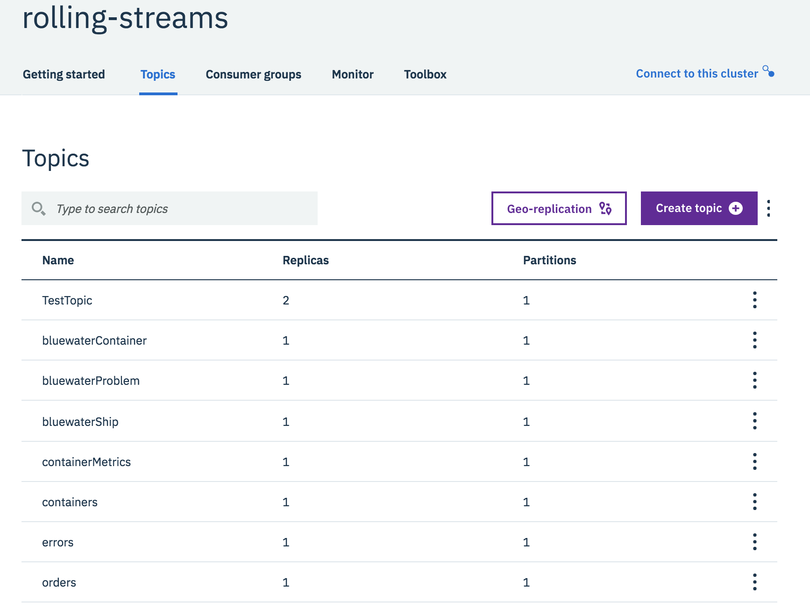

Deployment of application microservices for the Event-Driven Architecture Reference Application

## Environment prerequisites

### Kafka Topic Creation


You can create the topics using the Event Streams console:



or if you have manually deployed Event Streams or Kafka, you can use commands similar to the snippet below:

```shell
# get the name of the Kafka pod
$ export NAMESPACE=<target k8s namespace / ocp project>
$ export KPOF=$(kubectl get pods  -n ${NAMESPACE} | grep kafka | awk '{print $1;}')
$ cat ${KPOF}
rolling-streams-ibm-es-kafka-sts-0
rolling-streams-ibm-es-kafka-sts-1
rolling-streams-ibm-es-kafka-sts-2
# Then get the name of the zookeeper service:
$ export ZOOKSVC=$(kubectl get svc -n ${NAMESPACE} | grep zoo | awk '{print $1;}' | head -1)
rolling-streams-ibm-es-zookeeper-fixed-ip-svc-0
# Then remote exec a shell on one of this broker to configure the topic - for example the "orders" topic
$ kubectl exec -n ${NAMESPACE} -ti ${KPOF} -- bash -c "/opt/kafka/bin/kafka-topics.sh --create  --zookeeper ${ZOOKSVC}:2181 --replication-factor 1 --partitions 1 --topic orders"
```

The topics that need to be created are:

- `bluewater-container`
- `bluewater-ship`
- `bluewater-problem`
- `orders`
- `order-commands`
- `rejected-orders`
- `allocated-orders`
- `errors`
- `containers`
- `containerMetrics`
- `reefer-telemetry`

The command `scripts/createTopicsOnK8S.sh` creates those topics automatically.

## Docker registries

You will need a Docker image registry to push and pull your images to and from.  There are multiple options depending on your use cases and we are only documenting a subset of potential solutions, including but not limited to IBM Cloud Container Registry, Docker Hub, Quay, etc.

### IBM Cloud Container Registry

Install IBM Cloud Container Registry CLI plug-in if needed:

```
ibmcloud plugin install container-registry -r Bluemix
```

### Define a private image repository

Use the [IBM Cloud Container Registry](https://cloud.ibm.com/containers-kubernetes/catalog/registry) to push your images and then deploy them to any Kubernetes cluster with access to the public internet.  When deploying enterprise applications, it is strongly recommended to use private registry to protect your images from being used and changed by unauthorized users. Private registries must be set up by the cluster administrator to ensure that the credentials to access the private registry are available to the cluster users.

Create a namespace inside your Container Registry for use here:

```shell
ibmcloud cr namespace-add ibmcaseeda
```

We will use this namespace when tagging the docker images for our microservices. Here is an example of tagging:

```shell
docker tag ibmcase/kcontainer-ui us.icr.io/ibmcaseeda/kcontainer-ui:latest
```

To see the images in your private registry you can use the user interface at [https://cloud.ibm.com/containers-kubernetes/registry/main/private](https://cloud.ibm.com/containers-kubernetes/registry/main/private) or the command:

```shell
ibmcloud cr image-list
```

#### Private Registry Token

Each Helm Chart specifies the name of the Docker image to load the containers & pods. To enable access from Kubernetes Nodes to your private registry, an image pull secret is required and will be stored in a Kubernetes secret.  If you are using public Docker Hub image repositories, an image pull secret is not required.

*Using secret is also mandatory when registry and clusters are not in the same region.*

* Verify current secrets for a given namespace:

```shell
kubectl describe secrets -n <target namespace>
```

* Get a security token: _(these can be `permanent` or `renewable`)_

```shell
ibmcloud cr token-add --description "private registry secret for <target namespace>" --non-expiring -q
```

* To list the available tokens:

```shell
ibmcloud cr tokens
```

The result:
> TOKEN ID     READONLY   EXPIRY   DESCRIPTION
 2b5ff00e-a..  true       0       token for somebody
 3dbf72eb-6..  true       0       private registry secret for browncompute

* Get the token for a given token identifier:

```shell
ibmcloud cr token-get cce5a800-...
```

* Define the secret to store the Event stream API key token information:

```shell
kubectl --namespace <target namespace> create secret docker-registry
<target namespace>-registry-secret  --docker-server=<registry_url> --docker-username=token --docker-password=<token_value> --docker-email=<docker_email>
```

* Verify the secret

```shell
kubectl get secrets -n <target namespace>
```

You will see something like below.

> | NAME  | TYPE  | DATA | AGE |
| --- | --- | --- | --- |
| browncompute-registry-secret    |       kubernetes.io/dockerconfigjson     |   1  |       2m |
| default-token-ggwl2  |  kubernetes.io/service-account-token  | 3  |   41m  |
| eventstreams-apikey  |  Opaque   |      1   | 24m  |


## Basic Kubernetes

### IBM Cloud Kubernetes Service

To create the cluster follow [this tutorial](https://console.bluemix.net/docs/containers/cs_tutorials.html#cs_cluster_tutorial).

### OpenShift Container Platform 3.11

This needs to be done once per unique deployment of the entire application.

1. If desired, create a non-default Service Account for usage of deploying and running the K Container reference implementation.  This will become more important in future iterations, so it's best to start small:
    * Command: `oc create serviceaccount -n <target-namespace> kcontainer-runtime`
    * Example: `oc create serviceaccount -n eda-refarch kcontainer-runtime`
1. The target Service Account needs to be allowed to run containers as `anyuid` for the time being:
    * Command: `oc adm policy add-scc-to-user anyuid -z <service-account-name> -n <target-namespace>`
    * Example: `oc adm policy add-scc-to-user anyuid -z kcontainer-runtime -n eda-refarch`
    * NOTE: This requires `cluster-admin` level privileges.

### OpenShift Container Platform 4.X

**TODO OpenShift Container Platform 4.X Prereqs**

## Deploy application microservices

### Using the master repository
You can download the necessary application microservice repsoitories using scripts provided in the master repository:

```shell
git clone https://github.com/ibm-cloud-architecture/refarch-kc.git
cd refarch-kc
./scripts/clone.sh
```

### Deploy Order Command microservice

* Go to the repo

```shell
cd refarch-kc-order-ms/order-command-ms
```

* Build the image

```shell
docker build -t order-command-ms:latest -f Dockerfile.multistage .
```

* Tag the image

```shell
docker tag order-command-ms <private-registry>/<image-namespace>/order-command-ms:latest
```

* Push the image

```shell
docker login <private-registry>
docker push <private-registry>/<image-namespace>/order-command-ms:latest
```

* Generate application YAMLs via `helm template` with the following parameters:
    * `--set image.repository=<private-registry>/<image-namespace>/<image-repository>`
    * `--set image.pullSecret=<private-registry-pullsecret>` (only required if pulling from an external private registry)
    * `--set kafka.brokersConfigMap=<kafka brokers ConfigMap name>`
    * `--set eventstreams.enabled=(true/false)` (`true` when connecting to Event Streams of any kind, `false` when connecting to Kafka directly)
    * `--set eventstreams.apikeyConfigMap=<kafka api key Secret name>`
    * `--set eventstreams.truststoreRequired=(true/false)` (`true` when connecting to Event Streams via ICP4I)
    * `--set eventstreams.truststoreSecret=<eventstreams jks file secret name>` (only used when connecting to Event Streams via ICP4I)
    * `--set eventstreams.truststorePassword=<eventstreams jks password>` (only used when connecting to Event Streams via ICP4I)
    * `--set serviceAccountName=<service-account-name>`
    * `--namespace <target-namespace>`
    * `--output-dir <local-template-directory>`
  Example using Event Streams via ICP4I:
   ```shell
   helm template --set image.repository=rhos-quay.internal-network.local/browncompute/order-command-ms --set kafka.brokersConfigMap=es-kafka-brokers --set eventstreams.enabled=true --set eventstreams.apikeyConfigMap=es-eventstreams-apikey --set serviceAccountName=kcontainer-runtime --set eventstreams.truststoreRequired=true --set eventstreams.truststoreSecret=es-truststore-jks --set eventstreams.truststorePassword=password --output-dir templates --namespace eda-refarch chart/ordercommandms
   ```
  Example using Event Streams hosted on IBM Cloud:
   ```shell
   helm template --set image.repository=rhos-quay.internal-network.local/browncompute/order-command-ms --set kafka.brokersConfigMap=kafka-brokers --set eventstreams.enabled=true --set eventstreams.apikeyConfigMap=eventstreams-apikey --set serviceAccountName=kcontainer-runtime --output-dir templates --namespace eda-refarch chart/ordercommandms
   ```

* Deploy application using `kubectl/oc apply`:

```shell
(kubectl/oc) apply -f templates/ordercommandms/templates
```

* Verify default service is running correctly:

Without any previously tests done, the call below should return an empty array: `[]`

```shell
curl http://<cluster endpoints>:31200/orders
```

### Deploy Order Query microservice

* Go to the repo

```shell
cd refarch-kc-order-ms/order-query-ms
```

* Build the image

```shell
docker build -t order-query-ms:latest -f Dockerfile.multistage .
```

* Tag the image

```shell
docker tag order-query-ms <private-registry>/<image-namespace>/order-query-ms:latest
```

* Push the image

```shell
docker login <private-registry>
docker push <private-registry>/<image-namespace>/order-query-ms:latest
```

* Generate application YAMLs via `helm template` with the following parameters:
    * `--set image.repository=<private-registry>/<image-namespace>/<image-repository>`
    * `--set image.pullSecret=<private-registry-pullsecret>` (only required if pulling from an external private registry)
    * `--set kafka.brokersConfigMap=<kafka brokers ConfigMap name>`
    * `--set eventstreams.enabled=(true/false)` (`true` when connecting to Event Streams of any kind, `false` when connecting to Kafka directly)
    * `--set eventstreams.apikeyConfigMap=<kafka api key Secret name>`
    * `--set eventstreams.truststoreRequired=(true/false)` (`true` when connecting to Event Streams via ICP4I)
    * `--set eventstreams.truststoreSecret=<eventstreams jks file secret name>` (only used when connecting to Event Streams via ICP4I)
    * `--set eventstreams.truststorePassword=<eventstreams jks password>` (only used when connecting to Event Streams via ICP4I)
    * `--set serviceAccountName=<service-account-name>`
    * `--namespace <target-namespace>`
    * `--output-dir <local-template-directory>`
  Example using Event Streams via ICP4I:
   ```shell
   helm template --set image.repository=rhos-quay.internal-network.local/browncompute/order-query-ms --set kafka.brokersConfigMap=es-kafka-brokers --set eventstreams.enabled=true --set eventstreams.apikeyConfigMap=es-eventstreams-apikey --set serviceAccountName=kcontainer-runtime --set eventstreams.truststoreRequired=true --set eventstreams.truststoreSecret=es-truststore-jks --set eventstreams.truststorePassword=password --output-dir templates --namespace eda-refarch chart/orderqueryms
   ```
  Example using Event Streams hosted on IBM Cloud:
   ```shell
   helm template --set image.repository=rhos-quay.internal-network.local/browncompute/order-query-ms --set kafka.brokersConfigMap=kafka-brokers --set eventstreams.enabled=true --set eventstreams.apikeyConfigMap=eventstreams-apikey --set serviceAccountName=kcontainer-runtime --output-dir templates --namespace eda-refarch chart/orderqueryms
   ```

* Deploy application using `kubectl/oc apply`:

```shell
(kubectl/oc) apply -f templates/orderqueryms/templates
```

* Verify default service is running correctly:

Without any previously tests done, the call below should return an empty array: `[]`
```shell
curl http://<cluster endpoints>:31100/orders
```

### Deploy Container microservice

**TODO** Container Microservice requires POSTGRES parameters

* Go to the repo

```shell
cd refarch-kc-container-ms/SpringContainerMS
```

* Build the image

```shell
docker build -t kc-spring-container-ms:latest -f Dockerfile .
```

* Tag the image

```shell
docker tag kc-spring-container-ms <private-registry>/<image-namespace>/kc-spring-container-ms:latest
```

* Push the image

```shell
docker login <private-registry>
docker push <private-registry>/<image-namespace>/kc-spring-container-ms:latest
```

* Generate application YAMLs via `helm template` with the following parameters:
    * `--set image.repository=<private-registry>/<image-namespace>/<image-repository>`
    * `--set image.pullSecret=<private-registry-pullsecret>` (only required if pulling from an external private registry)
    * `--set kafka.brokersConfigMap=<kafka brokers ConfigMap name>`
    * `--set eventstreams.enabled=(true/false)` (`true` when connecting to Event Streams of any kind, `false` when connecting to Kafka directly)
    * `--set eventstreams.apikeyConfigMap=<kafka api key Secret name>`
    * `--set eventstreams.caPemFileRequired=(true/false)` (`true` when connecting to Event Streams via ICP4I)
    * `--set eventstreams.caPemSecretName=<eventstreams ca pem file secret name>` (only used when connecting to Event Streams via ICP4I)
    * `--set postgresql.capemRequired=(true/false)` (`true` when connecting to Postgresql Services requiring SSL and CA PEM-secured communication)
    * `--set postgresql.capemSecret=<postgresql CA pem certificate Secret name>`
    * `--set postgresql.urlSecret=<postgresql url Secret name>`
    * `--set postgresql.userSecret=<postgresql user Secret name>`
    * `--set postgresql.passwordSecret=<postgresql password Secret name>`
    * `--set serviceAccountName=<service-account-name>`
    * `--namespace <target-namespace>`
    * `--output-dir <local-template-directory>`
  Example using Event Streams via ICP4I:
   ```shell
   helm template --set image.repository=rhos-quay.internal-network.local/browncompute/kc-spring-container-ms --set kafka.brokersConfigMap=es-kafka-brokers --set eventstreams.enabled=true --set eventstreams.apikeyConfigMap=es-eventstreams-apikey --set eventstreams.truststoreRequired=true --set eventstreams.truststoreSecret=es-truststore-jks --set eventstreams.truststorePassword=password --set postgresql.capemRequired=true --set postgresql.capemSecret=postgresql-ca-pem --set postgresql.urlSecret=postgresql-url --set postgresql.userSecret=postgresql-user --set postgresql.passwordSecret=postgresql-pwd --set serviceAccountName=kcontainer-runtime --output-dir templates --namespace eda-refarch chart/springcontainerms
   ```
  Example using Event Streams hosted on IBM Cloud:
  ```shell
  helm template --set image.repository=rhos-quay.internal-network.local/browncompute/kc-spring-container-ms --set kafka.brokersConfigMap=es-kafka-brokers --set eventstreams.enabled=true --set eventstreams.apikeyConfigMap=es-eventstreams-apikey --set postgresql.capemRequired=true --set postgresql.capemSecret=postgresql-ca-pem --set postgresql.urlSecret=postgresql-url --set postgresql.userSecret=postgresql-user --set postgresql.passwordSecret=postgresql-pwd --set serviceAccountName=kcontainer-runtime --output-dir templates --namespace eda-refarch chart/springcontainerms
  ```

* Deploy application using `kubectl/oc apply`:

```shell
(kubectl/oc) apply -f templates/springcontainerms/templates
```

* Verify default service is running correctly:

```shell
curl http://cluster-endpoints:31900/containers
```

### Deploy Voyages microservice

The *Voyage microservice* is a simple nodejs app to mockup schedule of vessels between two harbors. It is here to illustrate Kafka integration with nodejs app.

* Go to the repo

```shell
cd refarch-kc-ms/voyages-ms
```

* Build the image

```shell
docker build -t kc-voyages-ms:latest -f Dockerfile .
```

* Tag the image

```shell
docker tag kc-voyages-ms <private-registry>/<image-namespace>/kc-voyages-ms:latest
```

* Push the image

```shell
docker login <private-registry>
docker push <private-registry>/<image-namespace>/kc-voyages-ms:latest
```

* Generate application YAMLs via `helm template`:
    * `--set image.repository=<private-registry>/<image-namespace>/<image-repository>`
    * `--set image.pullSecret=<private-registry-pullsecret>` (only required if pulling from an external private registry)
    * `--set kafka.brokersConfigMap=<kafka brokers ConfigMap name>`
    * `--set eventstreams.enabled=(true/false)` (`true` when connecting to Event Streams of any kind, `false` when connecting to Kafka directly)
    * `--set eventstreams.apikeyConfigMap=<kafka api key Secret name>`
    * `--set eventstreams.caPemFileRequired=(true/false)` (`true` when connecting to Event Streams via ICP4I)
    * `--set eventstreams.caPemSecretName=<eventstreams ca pem file secret name>` (only used when connecting to Event Streams via ICP4I)
    * `--set serviceAccountName=<service-account-name>`
    * `--namespace <target-namespace>`
    * `--output-dir <local-template-directory>`
  Example using Event Streams via ICP4I:
   ```shell
   helm template --set image.repository=rhos-quay.internal-network.local/browncompute/kc-voyages-ms --set kafka.brokersConfigMap=es-kafka-brokers --set eventstreams.enabled=true --set eventstreams.apikeyConfigMap=es-eventstreams-apikey --set serviceAccountName=kcontainer-runtime --set eventstreams.caPemFileRequired=true --set eventstreams.caPemSecretName=es-ca-pemfile --output-dir templates --namespace eda-refarch chart/voyagesms
   ```
  Example using Event Streams hosted on IBM Cloud:
   ```shell
   helm template --set image.repository=rhos-quay.internal-network.local/browncompute/kc-voyages-ms --set kafka.brokersConfigMap=kafka-brokers --set eventstreams.enabled=true --set eventstreams.apikeyConfigMap=eventstreams-apikey --set serviceAccountName=kcontainer-runtime --output-dir templates --namespace eda-refarch chart/voyagesms
   ```

* Deploy application using `kubectl/oc apply`:
```shell
(kubectl/oc) apply -f templates/voyagesms/templates
```

* Verify default service is running correctly:
```shell
curl http://cluster-endpoint:31000/voyage
```

### Deploy the Fleet Simulator microservice

The *Fleet simulator* is to move vessels from one harbors to another, and send container metrics while the containers are on a vessel. It has some predefined simulation to trigger some events.

* Go to the repo

```shell
cd cd refarch-kc-ms/fleet-ms
```

* Build the image

```shell
docker build -t kc-fleet-ms:latest -f Dockerfile.multistage .
```

* Tag the image

```shell
docker tag kc-fleet-ms <private-registry>/<image-namespace>/kc-fleet-ms:latest
```

* Push the image

```shell
docker login <private-registry>
docker push <private-registry>/<image-namespace>/kc-fleet-ms:latest
```

* Generate application YAMLs via `helm template`:
    - `--set image.repository=<private-registry>/<image-namespace>/<image-repository>`
    - `--set image.pullSecret=<private-registry-pullsecret>` (only required if pulling from an external private registry)
    - `--set kafka.brokersConfigMap=<kafka brokers ConfigMap name>`
    - `--set eventstreams.enabled=(true/false)` (`true` when connecting to Event Streams of any kind, `false` when connecting to Kafka directly)
    - `--set eventstreams.apikeyConfigMap=<kafka api key Secret name>`
    - `--set eventstreams.truststoreRequired=(true/false)` (`true` when connecting to Event Streams via ICP4I)
    - `--set eventstreams.truststoreSecret=<eventstreams jks file secret name>` (only used when connecting to Event Streams via ICP4I)
    - `--set eventstreams.truststorePassword=<eventstreams jks password>` (only used when connecting to Event Streams via ICP4I)
    - `--set serviceAccountName=<service-account-name>`
    - `--namespace <target-namespace>`
    - `--output-dir <local-template-directory>`
  Example using Event Streams via ICP4I:
   ```shell
   helm template --set image.repository=rhos-quay.internal-network.local/browncompute/kc-fleet-ms --set kafka.brokersConfigMap=es-kafka-brokers --set eventstreams.enabled=true --set eventstreams.apikeyConfigMap=es-eventstreams-apikey --set serviceAccountName=kcontainer-runtime --set eventstreams.truststoreRequired=true --set eventstreams.truststoreSecret=es-truststore-jks --set eventstreams.truststorePassword=password --output-dir templates --namespace eda-refarch chart/fleetms
   ```
  Example using Event Streams hosted on IBM Cloud:
   ```shell
   helm template --set image.repository=rhos-quay.internal-network.local/browncompute/kc-fleet-ms --set kafka.brokersConfigMap=kafka-brokers --set eventstreams.enabled=true --set eventstreams.apikeyConfigMap=eventstreams-apikey --set serviceAccountName=kcontainer-runtime --output-dir templates --namespace eda-refarch chart/fleetms
   ```

* Deploy application using `kubectl/oc apply`:
```shell
(kubectl/oc) apply -f templates/fleetms/templates
```

* Verify default service is running correctly:

  At the beginning the call below should return an empty array: `[]`
```shell
curl http://cluster-endpoint:31300/fleetms/fleets
```

### Deploy User Interface microservice

**TODO** User Interface updates for ES ICP

* Go to the repo

```
cd refarch-kc-ui/
```

* Build the image

```shell
docker build -t kcontainer-ui:latest -f Dockerfile .
```

* Tag the image

```shell
docker tag kc-ui <private-registry>/<image-namespace>/kcontainer-ui:latest
```

* Push the image

```shell
docker login <private-registry>
docker push <private-registry>/<image-namespace>/kcontainer-ui:latest
```

* Generate application YAMLs via `helm template` with the following parameters:
  - `--set image.repository=<private-registry>/<image-namespace>/<image-repository>`
  - `--set image.tag=latest`
  - `--set image.pullSecret=<private-registry-pullsecret>` (only required if pulling from an external private registry)
  - `--set image.pullPolicy=Always`
  - `--set eventstreams.env=ICP`
  - `--set eventstreams.brokersConfigMap=<kafka brokers ConfigMap name>`
  - `--set serviceAccountName=<service-account-name>`
  - `--namespace <target-namespace>`
  - `--output-dir <local-template-directory>`

```shell
# Example parameters
helm template --set image.repository=rhos-quay.internal-network.local/browncompute/kc-ui --set image.tag=latest --set image.pullPolicy=Always --set eventstreams.env=ICP --set eventstreams.brokersConfigMap=kafka-brokers --set serviceAccountName=kcontainer-runtime --output-dir templates --namespace eda-refarch chart/kc-ui
```

* Deploy application using `kubectl/oc apply`:
```shell
(kubectl/oc) apply -f templates/kc-ui/templates
```

* Verify the installed app

Point your web browser to [http://cluster-endpoints:31010](#) and login with username: eddie@email.com and password Eddie.

## Integration Tests

Integration tests are provided in the [itg-tests/](../../itg-tests/itgtests/) directory and are designed to be run in-cluster with the rest of the application components.  However, they are regular Python scripts that can be adapted to be runnable anywhere, given the correct Kafka endpoints and configuration information.  For simplicity, we have created the integration tests as Kubernetes Jobs for ease of deployment and reuse.

## Universal deployment considerations

When deploying kafka consumer it is important to assess the horizontal pod autoscaler settings and needs, as adding consumers will not address scalability if the number of partitions in the topic(s) to consume does not match the increase of consumers. So disable HPA by default. If you want to use HPA you also need to ensure that a metrics-server is running, then set the number of partition, and the `hpa.maxReplicas` to the number of partitions.
