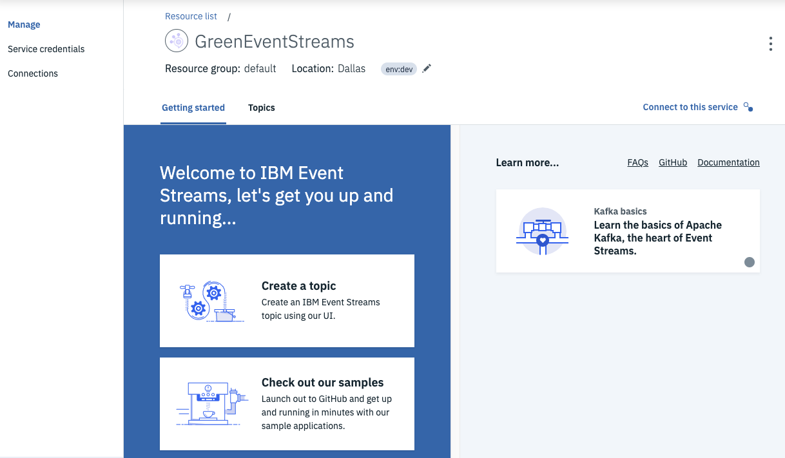
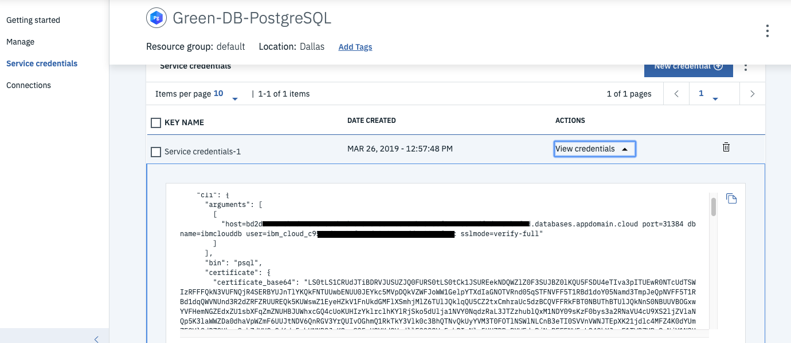

Deployment of backing services for the Event-Driven Architecture Reference Application, which includes Event Streams and Postgresql.  As part of the reference implementation, a Kafka instance is used as the main communication channel for all components of the application, while one of the [components](https://github.com/ibm-cloud-architecture/refarch-kc-container-ms) uses Postgresql for it's backing datastore.  You will need these backing services deployed in the cluster or as a public cloud service before the application will run successfully.

## Kafka & Event Streams

### Using IBM Event Streams, hosted on IBM Cloud

#### Service Deployment

* To provision your service, go to the IBM Cloud Catalog and search for `Event Streams`. It is in the *Integration* category. Create the service and specify a name, a region, and a resource group. Once the service is created, you are redirected to the Event Stream Standard Dashboard:



* In the *Manage* panel add the topics needed for the solution. We need at least the following:

 

* In the Service Credentials tab, create new credentials to get the Kafka broker list, the admim URL and the api_key needed to authenticate the consumers or producers.

 

#### Event Streams Kafka Brokers

Regardless of specific deployment targets (OCP, IKS, k8s), the following prerequisite Kubernetes ConfigMap needs to be created to support the deployments of the application's microservices.  These artifacts need to be created once per unique deployment of the entire application and can be shared between application components in the same overall application deployment.  These values can be acquired from the `kafka_brokers_sasl` section of the service instance's Service Credentials.

```shell
kubectl create configmap kafka-brokers --from-literal=brokers='<replace with comma-separated list of brokers>' -n <target k8s namespace / ocp project>
kubectl describe configmap kafka-brokers -n <target k8s namespace / ocp project>
```

#### Event Streams Kafka Topics

Regardless of specific deployment targets (OCP, IKS, k8s), the following prerequisite Kubernetes ConfigMap needs to be created to support the deployments of the application's microservices.  These artifacts need to be created once per unique deployment of the entire application and can be shared between application components in the same overall application deployment.  The values of each individual topic name set as a value in this ConfigMap will be used by all microservices to communicate via Kafka.

You can _(and should)_ customize the values _(right-hand side)_ of each of the lines in the `data` section below to ensure your topics are only being published to by the correct deployments of microservices. Do not edit the keys _(left-hand side)_ of the any of the lines in the `data` section below, or else your microservice components will fail to start.

```shell
cat <<EOF | kubectl apply -f -
apiVersion: v1
kind: ConfigMap
metadata:
  name: kafka-topics
data:
  allocatedOrdersTopic: allocated-orders
  bluewaterContainerTopic: bluewater-container
  bluewaterProblemTopic: bluewater-problem
  bluewaterShipTopic: bluewater-ship
  containersTopic: containers
  containerAnomalyRetryTopic: container-anomaly-retry
  containerAnomalyDeadTopic: container-anomaly-dead
  errorsTopic: errors
  orderCommandsTopic: order-commands
  ordersTopic: orders
  reeferTelemetryTopic: reefer-telemetry
  rejectedOrdersTopic: rejected-orders
EOF
```


#### Event Streams API Key

The Event Streams Broker API Key is needed to connect any deployed consumers or producers to the service in IBM Cloud. To avoid sharing security keys, create a Kubernetes Secret in the target cluster you will deploy the application microservices to.  This is available from the Service Credentials information you just created above.

```shell
kubectl create secret generic eventstreams-apikey --from-literal=binding='<replace with api key>' -n <target k8s namespace / ocp project>
kubectl describe secret eventstreams-apikey -n <target k8s namespace / ocp project>
```

---

### Using IBM Event Streams, deployed on RedHat OpenShift Container Platform

#### Service Deployment

The installation is documented in the [product documentation](https://ibm.github.io/event-streams/installing/installing-openshift/) and in our [own note here.](https://ibm-cloud-architecture.github.io/refarch-eda/deployments/eventstreams/)

#### Event Streams Kafka Brokers

Regardless of specific deployment targets (OCP, IKS, k8s), the following prerequisite Kubernetes ConfigMap needs to be created to support the deployments of the application's microservices.  These artifacts need to be created once per unique deployment of the entire application and can be shared between application components in the same overall application deployment.

```shell
kubectl create configmap kafka-brokers --from-literal=brokers='<replace with comma-separated list of brokers>' -n <target k8s namespace / ocp project>
kubectl describe configmap kafka-brokers -n <target k8s namespace / ocp project>
```

#### Event Streams Kafka Topics

Regardless of specific deployment targets (OCP, IKS, k8s), the following prerequisite Kubernetes ConfigMap needs to be created to support the deployments of the application's microservices.  These artifacts need to be created once per unique deployment of the entire application and can be shared between application components in the same overall application deployment.  The values of each individual topic name set as a value in this ConfigMap will be used by all microservices to communicate via Kafka.

You can _(and should)_ customize the values _(right-hand side)_ of each of the lines in the `data` section below to ensure your topics are only being published to by the correct deployments of microservices. Do not edit the keys _(left-hand side)_ of the any of the lines in the `data` section below, or else your microservice components will fail to start.

```shell
cat <<EOF | kubectl apply -f -
apiVersion: v1
kind: ConfigMap
metadata:
  name: kafka-topics
data:
  allocatedOrdersTopic: allocated-orders
  bluewaterContainerTopic: bluewater-container
  bluewaterProblemTopic: bluewater-problem
  bluewaterShipTopic: bluewater-ship
  containersTopic: containers
  containerAnomalyRetryTopic: container-anomaly-retry
  containerAnomalyDeadTopic: container-anomaly-dead
  errorsTopic: errors
  orderCommandTopics: order-commands
  ordersTopic: orders
  reeferTelemetryTopic: reefer-telemetry
  rejectedOrdersTopic: rejected-orders
EOF
```

#### Event Streams API Key

The Event Streams Broker API Key is needed to connect any deployed consumers or producers to the service running in your cluster. To avoid sharing security keys, create a Kubernetes Secret in the target cluster you will deploy the application microservices to.  You can specify keys at the topic and consumer group levels or use a unique key for all topics and all consumer groups.

```shell
kubectl create secret generic eventstreams-apikey --from-literal=binding='<replace with api key>' -n <target k8s namespace / ocp project>
kubectl describe secrets -n <target k8s namespace / ocp project>
```

#### Event Streams Certificates

If you are using Event Streams as your Kafka broker provider and it is deployed via the IBM Cloud Pak for Integration (ICP4I), you will need to create an additional Secret to store the generated Certificates & Truststores to connect securely between your application components and the Kafka brokers.  These artifacts need to be created once per unique deployment of the entire application and can be shared between application components in the same overall application deployment.

- From the **Connect to this cluster** tab on the landing page of your Event Streams installation, download both the **Java truststore** and the **PEM certificate**.
- Create the Java truststore Secret:
  - Command: `oc create secret generic <secret-name> --from-file=/path/to/downloaded/file.jks`
  - Example: `oc create secret generic es-truststore-jks --from-file=/Users/osowski/Downloads/es-cert.jks`
- Create the PEM certificate Secret:
  - Command: `oc create secret generic <secret-name> --from-file=/path/to/downloaded/file.pem`
  - Example: `oc create secret generic es-ca-pemfile --from-file=/Users/osowski/Downloads/es-cert.pem`

---

### Using community-based Kafka Helm charts, deployed locally in-cluster

If you simply want to deploy Kafka using the open source, community-supported Helm Charts, you can do so with the following commands to deploy the [bitnami Kafka Stack Helm Charts](https://bitnami.com/stack/kafka/helm).

#### Environment Considerations

As of the time of this document being authored, the Bitnami Kafka Stack Helm Chart does not expose the required security configuration elements to run optimally on OpenShift.  After generating the Helm templates below, you may need to manually update the YAML files to apply the ServiceAccount you have configured for your environment to run the containers accordingly.

#### Service Deployment

1. Add Bitnami Helm Repository:
```shell
helm repo add bitnami https://charts.bitnami.com/bitnami
```
2. Update the Helm repository:
```shell
helm repo update
```
3. Create a Kubernetes Namespace or OpenShift Project.
```shell
kubectl create namespace <target namespace>
```
4. Deploy Kafka and Zookeeper using the `bitnami/kafka` Helm Chart:
```shell
mkdir bitnami
mkdir templates
helm fetch --untar --untardir bitnami 'bitnami/kafka'
helm template kafka --set persistence.enabled=false --set securityContext.enabled=false \
  --set zookeeper.securityContext.enabled=false \
  bitnami/kafka --namespace <target namespace> --output-dir templates
(kubectl/oc) apply -R -f templates/
```
It will take a few minutes to get the pods ready.

#### Kafka Brokers

Regardless of specific deployment targets (OCP, IKS, k8s), the following prerequisite Kubernetes ConfigMap needs to be created to support the deployments of the application's microservices.  These artifacts need to be created once per unique deployment of the entire application and can be shared between application components in the same overall application deployment.

```shell
kubectl create configmap kafka-brokers --from-literal=brokers='<replace with comma-separated list of brokers>' -n <target k8s namespace / ocp project>
kubectl describe configmap kafka-brokers -n <target k8s namespace / ocp project>
```

#### Kafka Topics

Regardless of specific deployment targets (OCP, IKS, k8s), the following prerequisite Kubernetes ConfigMap needs to be created to support the deployments of the application's microservices.  These artifacts need to be created once per unique deployment of the entire application and can be shared between application components in the same overall application deployment.  The values of each individual topic name set as a value in this ConfigMap will be used by all microservices to communicate via Kafka.

You can _(and should)_ customize the values _(right-hand side)_ of each of the lines in the `data` section below to ensure your topics are only being published to by the correct deployments of microservices. Do not edit the keys _(left-hand side)_ of the any of the lines in the `data` section below, or else your microservice components will fail to start.

```shell
cat <<EOF | kubectl apply -f -
apiVersion: v1
kind: ConfigMap
metadata:
  name: kafka-topics
data:
  allocatedOrdersTopic: allocated-orders
  bluewaterContainerTopic: bluewater-container
  bluewaterProblemTopic: bluewater-problem
  bluewaterShipTopic: bluewater-ship
  containersTopic: containers
  containerAnomalyRetryTopic: container-anomaly-retry
  containerAnomalyDeadTopic: container-anomaly-dead
  errorsTopic: errors
  orderCommandTopics: order-commands
  ordersTopic: orders
  reeferTelemetryTopic: reefer-telemetry
  rejectedOrdersTopic: rejected-orders
EOF
```

---

## Postgresql

The [Container Manager microservice](https://github.com/ibm-cloud-architecture/refarch-kc-container-ms/) persists the Reefer Container inventory in a Postgresql database.  The deployment of Postgresql is only necessary to support the deployment of the Container Manager microservice.  If you are not deploying the Container Manager microservice, you do not need to deploy and configure a Postgresql service and database.

### Using Postgresql, hosted on IBM Cloud

#### Service Deployment

 To install the service, follow the [product documentation here](https://cloud.ibm.com/catalog/services/databases-for-postgresql).

 Once the service is deployed, you need to create some service credentials and retreive the following values for the different configurations:

 * `postgres.username`
 * `postgres.password`
 * `postgres.composed`, which will need to be mapped to a JDBC URL in the format of `jdbc:postgresql://<hostname>:<port>/<database-name>?sslmode=verify-full&sslfactory=org.postgresql.ssl.NonValidatingFactory` _(this will remove the `username` and `password` values from the default `composed` string)_

 

#### Creating Postgresql credentials as Kubernetes Secrets

1. Applying the same approach as above, copy the Postgresql URL as defined in the Postegresql service credential and execute the following command:
```shell
kubectl create secret generic postgresql-url --from-literal=binding='<replace with postgresql-url>' -n <target k8s namespace / ocp project>
```

2. For the user:
```shell
kubectl create secret generic postgresql-user --from-literal=binding='ibm_cloud_c...' -n <target k8s namespace / ocp project>
```

3. For the user password:
```shell
kubectl create secret generic postgresql-pwd --from-literal=binding='<password from the service credential>.' -n <target k8s namespace / ocp project>
```

4. When running Postgresql through the IBM Cloud service, additional SSL certificates are required to communicate securely:
    1. Install the IBM Cloud Database CLI Plugin:
   ```shell
   ibmcloud plugin install cloud-databases
   ```
    2. Get the certificate using the name of the postgresql service:
  ```shell
  ibmcloud cdb deployment-cacert $IC_POSTGRES_SERV > postgresql.crt
  ```
    3. Then add it into an environment variable
  ```shell
  export POSTGRESQL_CA_PEM="$(cat ./postgresql.crt)"
  ```
    4. Then define a secret:
  ```shell
  kubectl create secret generic postgresql-ca-pem --from-literal=binding="$POSTGRESQL_CA_PEM" -n browncompute
  ```

---

### Using community-based Postgresql Helm charts, deployed locally in-cluster

If you simply want to deploy Postgresql using the open source, community-supported Helm Charts, you can do so with the following commands.

#### Environment Considerations

Reference [Application Components Pre-reqs](application-components.md#openshift-container-platform-3-11) for details on creating the necessary ServiceAccount with required permissions, prior to deployment.

#### Service Deployment

1. Add Bitnami Helm Repository:
```shell
helm repo add bitnami https://charts.bitnami.com/bitnami
```

2. Update the Helm repository:
```shell
helm repo update
```

3. Create a Kubernetes Namespace or OpenShift Project (if not already created).
```shell
kubectl create namespace <target namespace>
```
4. Deploy Postgresql using the `bitnami/postgresql` Helm Chart:
```shell
mkdir bitnami
mkdir templates
helm fetch --untar --untardir bitnami bitnami/postgresql
helm template --name postgre-db --set postgresqlPassword=supersecret \
  --set persistence.enabled=false --set serviceAccount.enabled=true \
  --set serviceAccount.name=<existing service account> bitnami/postgresql \
  --namespace <target namespace> --output-dir templates
(kubectl/oc) apply -f templates/postgresql/templates
```
  It will take a few minutes to get the pods ready.

#### Creating Postgresql credentials as Kubernetes Secrets

* The `postgresql-url` needs to point to the in-cluster (non-headless) Kubernetes Service created as part of the deployment and should take the form of the deployment name with the suffix of `-postgresql`:

 ```shell
 kubectl get services | grep postgresql | grep -v headless
 kubectl create secret generic postgresql-url --from-literal=binding='jdbc:postgresql://<helm-release-name>-postgresql' -n <target k8s namespace / ocp project>
 ```

* For the user:

 ```shell
 kubectl create secret generic postgresql-user --from-literal=binding='postgres' -n <target k8s namespace / ocp project>
 ```

* For the user password:

 ```shell
 kubectl create secret generic postgresql-pwd --from-literal=binding='<password used in the helm template command>.' -n <target k8s namespace / ocp project>
 ```

#### Service Debugging & Troubleshooting

Access to the in-container password can be made using the following command.  This should be the same value you passed in when you deployed the service.

```
export POSTGRES_PASSWORD=$(kubectl get secret --namespace  <target namespace> postgre-db-postgresql -o jsonpath="{.data.postgresql-password}" | base64 --decode)
```

And then use the `psql` command line interface to interact with postgresql. For that, we use a Docker image as a client to the Postgresql server:

```
kubectl run postgre-db-postgresql-client --rm --tty -i --restart='Never' --namespace <target namespace> --image bitnami/postgresql:11.3.0-debian-9-r38 --env="PGPASSWORD=$POSTGRES_PASSWORD" --command -- psql --host postgre-db-postgresql -U postgres -p 5432
```

To connect to your database from outside the cluster execute the following commands:

```
    kubectl port-forward --namespace <target namespace> svc/postgre-db-postgresql 5432:5432 &&\
    PGPASSWORD="$POSTGRES_PASSWORD" psql --host 127.0.0.1 -U postgres -p 5432
```

## BPM

The containers microservice component of this Reefer Container EDA reference application can be integrated with a BPM process for the the maintenance of the containers. This BPM process will dispatch a field engineer so that the engineer can go to the reefer container to fix it. The process of scheduling an engineer and then completing the work can best be facilitated through a process based, structured workflow. We will be using IBM BPM on Cloud or Cloud Pak for Automation to best demonstrate the workflow. This workflow can be explored in detail [here](https://github.com/ibm-cloud-architecture/refarch-reefer-ml/tree/master/docs/bpm).

In order for the containers microservice to fire the BPM workflow, we need to provide the following information through Kubernetes configMaps and secrets:

1. Provide in a configMap:
   * the **BPM authentication login endpoint**
   * the **BPM workflow endpoint**
   * the **BPM anomaly event threshold**
   * the **BPM authentication token time expiration**

   ```shell
   cat <<EOF | kubectl apply -f -
   apiVersion: v1
   kind: ConfigMap
   metadata:
     name: bpm-anomaly
   data:
     url: <replace with your BPM workflow endpoint>
     login: <replace with your BPM authentication endpoint>
     expiration: <replace with the number of second for the auth token to expire after>
     anomalyThreshold: <replace with the number of anomaly events to receive before calling BPM>
   EOF
   ```

2. Provide your BPM instance's **credentials** in a secret:

   ```shell
   kubectl create secret generic bpm-anomaly --from-literal=user='<replace with your BPM user>' --from-literal=password='<replace with your BPM password>' -n <target k8s namespace / ocp project>
   kubectl describe secrets -n <target k8s namespace / ocp project>
   ```

**IMPORTANT:** The names for both the secret and configMap (`bpm-anomaly`) is the default the container microservice uses in its [helm chart](https://github.com/ibm-cloud-architecture/refarch-kc-container-ms/tree/master/SpringContainerMS/chart/springcontainerms). Make sure the name for the configMap and secret you create **match** the names you used in the containers microservice's helm chart.

If you do not have access to any BPM instance with this field engineer dispatching workflow, you can bypass the call to BPM by disabling such call in the container microservice component. For doing so, you can use the following container microservice's API endpoints:

1. Enable BPM: [`http://<container_microservice_endpoint>/bpm/enable`](#bpm)
2. Disable BPM: [`http://<container_microservice_endpoint>/bpm/disable`](#bpm)
3. BPM status: [`http://<container_microservice_endpoint>/bpm/status`](#bpm)

where `<container_microservice_endpoint>` is the route, ingress or nodeport service you associated to your container microservice component at deployment time.
