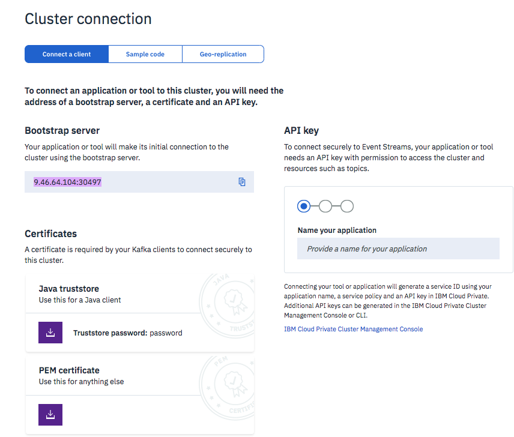

# Work in Progress

### Troubleshouting


#### No resolvable bootstrap urls given in bootstrap.servers

It is obvious reason, but when deploying a kafka consumer or producer on Kubernetes it is important to know which name to use. As the communication will be on the overlay network we should use the internal broker name. The name will be linked to the deployed configuration of Kafka or event streams. Here are a set of commands to debug that:

```shell
# Get the namespace name for the deployed kafka instance
$ kubectl get namespaces
> ...
> streams Active <x>d
# Look at the name of the services of the
$ kubectl get svc -n streams
> rolling-streams-ibm-es-kafka-broker-svc-0         ClusterIP   None           <none>        9092/TCP,8093/TCP,9094/TCP,7070/TCP                               40d
rolling-streams-ibm-es-kafka-broker-svc-1         ClusterIP   None           <none>        9092/TCP,8093/TCP,9094/TCP,7070/TCP                               40d
rolling-streams-ibm-es-kafka-broker-svc-2         ClusterIP   None           <none>        9092/TCP,8093/TCP,9094/TCP,7070/TCP
# Verify the name lookup with busybox... deploy busybox
$  kubectl apply -f https://k8s.io/examples/admin/dns/busybox.yaml
$  kubectl exec -ti busybox -n default -- nslookup streams
> Server:    10.0.0.10
Address 1: 10.0.0.10 kube-dns.kube-system.svc.cluster.local

Name:      streams
Address 1: 10.1.12.101 indexmgr.rolling-streams-ibm-es-indexmgr-svc.streams.svc.cluster.local
Address 2: 10.1.12.102 rolling-streams-ibm-es-elas-ad8d-0.rolling-streams-ibm-es-elastic-svc.streams.svc.cluster.local
Address 3: 10.1.31.245 rolling-streams-ibm-es-elas-ad8d-1.rolling-streams-ibm-es-elastic-svc.streams.svc.cluster.local
Address 4: 10.1.12.97 10-1-12-97.rolling-streams-ibm-es-kafka-broker-svc-1.streams.svc.cluster.local
Address 5: 10.1.12.88 10-1-12-88.rolling-streams-ibm-es-zookeeper-fixed-ip-svc-1.streams.svc.cluster.local
Address 6: 10.1.193.198 10-1-193-198.rolling-streams-ibm-es-zookeeper-fixed-ip-svc-2.streams.svc.cluster.local
Address 7: 10.1.31.249 10-1-31-249.rolling-streams-ibm-es-zookeeper-fixed-ip-svc-0.streams.svc.cluster.local
Address 8: 10.0.48.98 rolling-streams-ibm-es-rest-svc.streams.svc.cluster.local
Address 9: 10.0.104.180 rolling-streams-ibm-es-rest-proxy-svc.streams.svc.cluster.local
Address 10: 10.0.9.68 rolling-streams-ibm-es-zookeeper-fixed-ip-svc-2.streams.svc.cluster.local
Address 11: 10.1.193.253 10-1-193-253.rolling-streams-ibm-es-kafka-broker-svc-2.streams.svc.cluster.local
Address 12: 10.0.187.135 rolling-streams-ibm-es-zookeeper-fixed-ip-svc-0.streams.svc.cluster.local
Address 13: 10.1.31.223 10-1-31-223.rolling-streams-ibm-es-kafka-broker-svc-0.streams.svc.cluster.local
Address 14: 10.0.33.136 rolling-streams-ibm-es-ui-svc.streams.svc.cluster.local
Address 15: 10.0.182.152 rolling-streams-ibm-es-zookeeper-fixed-ip-svc-1.streams.svc.cluster.local
Address 16: 10.0.216.177 rolling-streams-ibm-es-proxy-svc.streams.svc.cluster.local
Address 17: 10.1.12.87 10-1-12-87.rolling-streams-ibm-es-access-controller-svc.streams.svc.cluster.local
Address 18: 10.1.31.251 10-1-31-251.rolling-streams-ibm-es-access-controller-svc.streams.svc.cluster.local
```
For other DNS troubleshooting see [this product note.](https://kubernetes.io/docs/tasks/administer-cluster/dns-debugging-resolution/)

#### Failed to verify broker certificate: self signed certificate

When connecting a client to a deployed Kafka using the SSL protocol, there will be a SSL handcheck protocol done. The client needs to send security credentials using public keys and root certificates. The '.pem' file can be downloaded from Event stream console as `es-cert.pem`.



The producer or consumer code needs to specify where to get the ssl certificates: Here is will be loaded from the local folder. But this file could be mounted into the docker image running the code to a folder referenced in this `ssl.ca.location`.

```json
    'bootstrap.servers':  KAFKA_BROKERS,
    'security.protocol': 'SASL_SSL',
    'ssl.ca.location': 'es-cert.pem',
    'sasl.mechanisms': 'PLAIN',
    'sasl.username': 'token',
    'sasl.password': KAFKA_APIKEY,
```
