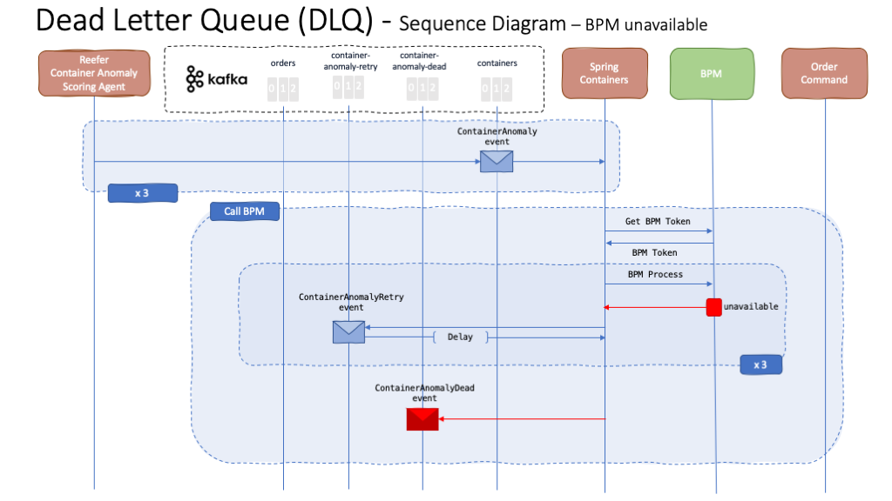
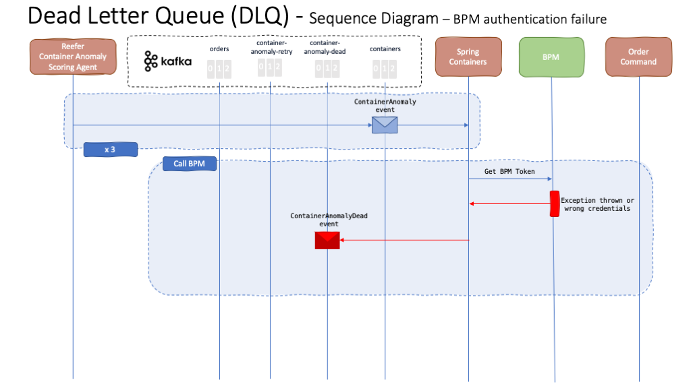

# Dead Letter Queue Pattern

In distributed systems, it is common to find mechanisms for retrying calls to other, potentially external, services and fail gracefully if that service is unavailable for any reason. Here we are going to talk about using non-blocking request reprocessing and dead letter queues (DLQ) to achieve decoupled, observable error-handling without disrupting real-time traffic in the context of the [Container Anomaly Use Case](../containerAnomaly/containerAnomaly.md) of our Reefer Container Reference Application.

A brief description about the problem and how non-blocking reprocessing and dead letter queues can help us can be found [here](https://ibm-cloud-architecture.github.io/refarch-eda/design-patterns/ED-patterns/#event-reprocessing-with-dead-letter-pattern).

## Implementation

As explained in the [Container Anomaly Use Case](../containerAnomaly/containerAnomaly.md) of our Reefer Container Reference Application, the Spring Containers component calls a BPM process in order to get a field engineer assigned to checking and fixing a potentially bad container based on the telemetry events being sent by it.

As said in the introduction above, this call to the BPM process might fail so we need to implement a mechanism whereby we use non-blocking request reprocessing and dead letter queues (DLQ) to achieve decoupled, observable error-handling without disrupting real-time traffic.

We have done so by creating two new topics the Spring Container component will subscribe and publish to: **container-anomaly-retry** and **container-anomaly-dead**.

When the Spring Container receives a **ContainerAnomaly** event (actually three of these to decrease the load on the BPM side), it will call the BPM service. This call is divided into two actions:

1. **Authenticate** against BPM which will give you a token to
2. **Call the BPM process** that will trigger the field engineer assignment process.

Another important thing to have in mind when implementing retry and graceful failure mechanisms is that it only makes sense to retry a call to a, potentially external, service when this service is temporarily unavailable (because it is temporarily overloaded, temporarily down, etc) and not when the call failed (due to bad data sent, bad url used, etc). This way we avoid extra load in the dependent service by not retrying calls we know that will fail again anyway beforehand.

To illustrate this, we have decided that any failure in authenticating with BPM is an error and that it does not make sense to retry since it will fail again due to bad Spring Container component configuration (wrong BPM credentials provided).

### Service Unavailable



As said above, there might be some times when the service we depend on and call (BPM in our case) is temporarily not available. Either because it is temporarily down or overloaded. If this happens, the Spring Container component will send the **ContainerAnomaly** event into the **container-anomaly-retry** topic.

The Spring Container component will also subscribe to that topic and will retry the call to BPM for each **ContainerAnomalyRetry** event it reads from the **container-anomaly-retry** topic. However, it will only make the call to BPM after certain delay, so that we don't collapse the service with retries, which will increase based on the retry attempt number:

```java
@Override
public void onMessage(ConsumerRecord<Integer, String> message) {
    if (message.value().contains(ContainerEvent.CONTAINER_ANOMALY_RETRY)) {
        // --------------------------------------------
        // ContainerAnomalyEventRetry events
        //---------------------------------------------
        LOG.info("Received new ContainerAnomalyEventRetry event: " + message.value());
        // Get the ContainerAnomalyRetryEvent objet from the event received
        ContainerAnomalyEventRetry caer = parser.fromJson(message.value(), ContainerAnomalyEventRetry.class);
        int time_to_wait = caer.getRetries() * 10;
        LOG.info("This is a BPM call retry. Applying a delay of " + time_to_wait + " seconds");
        try {
            Thread.sleep(time_to_wait * 1000);
        } catch (InterruptedException e) {
            // TODO Auto-generated catch block
            e.printStackTrace();
        }
        bpmAgent.callBPM(caer,false);
    }
}
```

The ContainerAnomalyEventRetry events sent to the container-anomaly-retry topic look like this:

```json
{
  "containerID": "1111",
  "payload": {
    "ambiant_temperature": 19.8447,
    "carbon_dioxide_level": 4.42579,
    "content_type": 2,
    "defrost_cycle": 6,
    "humidity_level": 60.3148,
    "kilowatts": 3.44686,
    "latitude": 31.4,
    "longitude": 121.5,
    "nitrogen_level": 79.4046,
    "oxygen_level": 20.4543,
    "target_temperature": 6,
    "temperature": 5.49647,
    "time_door_open": 0.822024,
    "vent_1": true,
    "vent_2": true,
    "vent_3": true
  },
  "retries": 1,
  "timestamp": 1583752031,
  "type": "ContainerAnomalyRetry"
}
```

where you can see a new attribute called **retries** so that we keep the count of how many times we have called the BPM service. If the BPM service is still unreachable/unavailable after three attempts, the Spring Container component will eventually send a **ContainerAnomalyDead** event into the **container-anomaly-dead** topic, which should be somehow monitored to take the appropriate action based on the type of events that get published:

```java
private void toRetryTopic(ContainerAnomalyEvent cae){
    ContainerAnomalyEventRetry caer;

    // Add one retry to ContainerAnomalyEventRetry or create a new one
    if (cae instanceof ContainerAnomalyEventRetry){
        caer = (ContainerAnomalyEventRetry)cae;
        caer.setRetries(caer.getRetries()+1);
    }
    else caer = new ContainerAnomalyEventRetry(cae,1);

    if (caer.getRetries() > 3){
        // send the event to the container anomaly dead queue
        toDeadTopic(cae,"No more BPM process retries left");
    }
    else {
        // Send the event to the container anomaly retry queue
        LOG.info("Sending ContainerAnomalyEventRetry event for containerID: " + cae.getContainerID() + " to the container anomaly retry topic");
        containerAnomalyRetryProducer.emit(caer);
    }
}
```

and the ContainerAnomalyDead event looks like:

```json
{
  "containerID": "1111",
  "payload": {
    "ambiant_temperature": 19.8447,
    "carbon_dioxide_level": 4.42579,
    "content_type": 2,
    "defrost_cycle": 6,
    "humidity_level": 60.3148,
    "kilowatts": 3.44686,
    "latitude": 31.4,
    "longitude": 121.5,
    "nitrogen_level": 79.4046,
    "oxygen_level": 20.4543,
    "target_temperature": 6,
    "temperature": 5.49647,
    "time_door_open": 0.822024,
    "vent_1": true,
    "vent_2": true,
    "vent_3": true
  },
  "reason": "No more BPM process retries left",
  "timestamp": 1583752031,
  "type": "ContainerAnomalyDead"
}
```

where you can see we have added the **reason** so that if any operator or automated system monitors this queue, they know what might be the problem.

### Errors



As said earlier, when implementing request retry and graceful failure mechanisms for a, potentially external, service, we want to retry only when the service is unreachable/unavailable and not when there is an error in the data we are calling the service with, an error with the service url or something on those lines so that we don't keep retrying calls we know they are bound to fail beforehand.

As a result, when this happens, we simply send the the event to the dead letter queue with a meaningful error message/code so that monitoring systems (either automated ones or operators monitoring these queues) can act accordingly.

In our case, we are considering an error any failed attempt to get authenticated against BPM, either due to bad credentials or login url, and consider that retrying those requests will only put more load onto the system. As a result, we simply send a **ContainerAnomalyDead** event into the **container-anomaly-dead** topic instead of retrying.

```java
// Manage BPM token
if (bpm_token == "" || expired) {
    // Logging
    if (bpm_token == "") LOG.info("No BPM token - Calling the BPM authentication service");
    if (expired) LOG.info("BPM token expired - Calling the BPM authentication service");
    // Get the BPM token
    try {
        bpm_token = getBPMToken();
    } catch (Exception ex) {
        /*
        * DEAD
        * We Consider not being able to authenticate with BPM a severe problem as it does not
        * make sense to retry calling a service which we can't authenticate against.
        */
        toDeadTopic(ContainerAnomalyEvent, ex.getMessage());
    }
}
```

In this case, the ContainerAnomalyDead event looks exactly the same as in the service unavailable section but with a different reason, potentially indicating another problem this time.

```json
{
  "containerID": "1111",
  "payload": {
    "ambiant_temperature": 19.8447,
    "carbon_dioxide_level": 4.42579,
    "content_type": 2,
    "defrost_cycle": 6,
    "humidity_level": 60.3148,
    "kilowatts": 3.44686,
    "latitude": 31.4,
    "longitude": 121.5,
    "nitrogen_level": 79.4046,
    "oxygen_level": 20.4543,
    "target_temperature": 6,
    "temperature": 5.49647,
    "time_door_open": 0.822024,
    "vent_1": true,
    "vent_2": true,
    "vent_3": true
  },
  "reason": "BPM authentication exception",
  "timestamp": 1583751647,
  "type": "ContainerAnomalyDead"
}
```

### What to do next

As already said, the idea of implementing the Request Retry and Dead Letter Queue Pattern is not only to alleviate the load an, external or not, system we depend on might have but also as a sink for potential problems. Whether ContainerAnomaly messages end up in the container-anomaly-dead topic because the BPM service was (temporarily or not) unavailable or there was an, expected or not, error in the system, this dead letter queue will ideally have some automated/manual monitoring system/person so that the appropriate action can be taken as a result in an attempt to minimize the incorrect functioning of your system/service. This is, for instance, one good reason to wrap up your messages being sent to the dead letter queue with some code/reason that can be quickly understood by whatever monitor system. Not only understood but possibly aggregated and queried to better understand your system performance over time.
