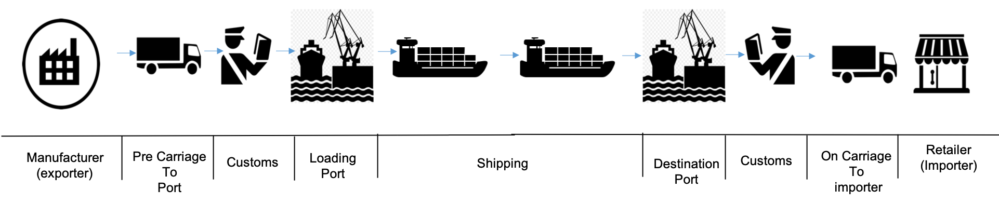

# Introduction

As part of producing the IBM event driven point of view and reference architecture, we wanted to bring together a complete scenario which would cover all aspects of developing an event driven solution including extended connections to devices/IOT and blockchain for trusted business trading networks. We felt that the shipping business could provide a good foundation for this and would enable us to show how to develop event driven solutions following the architecture patterns.

## Business process statement

The high level process can be represented in the following diagram, and is described in detailed in [this section](analysis/readme.md#high-level-view-of-the-shipment-process-flow):

In developing the scenario, it became apparent that the event driven nature of business, extends across the business network, so we have widened the view in the scenario to consider the chain of parties involved in the shipping process, including importer, exporter, land transport and customs. To keep the scenario easy to understand, we have only considered the following cases:

1. Importer Orders goods from exporter overseas
2. Exporter becomes the customer of the shipping agent and uses 'K.Container' shipping service
3. Shipping agent manages process of land transport loading, unloading and shipping. Through the scenario we can see the impact of “events”, which may delay or change the shipping process across all three parties.  

We are using goods to be transported in refrigerator containers or reefer containers to keep the 'cold chain' of transported products.

</img>

## Event storming analysis 

We met with the business users and project stakeholder during an event storming workshop, and we are detailing the outcomes in the [next chapter >>](./analysis/readme.md)
