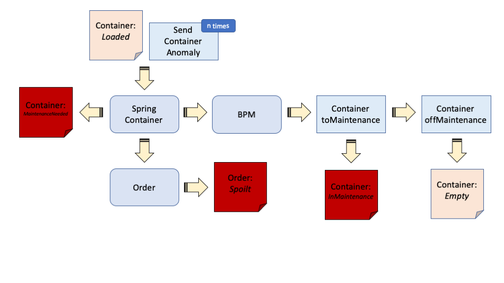
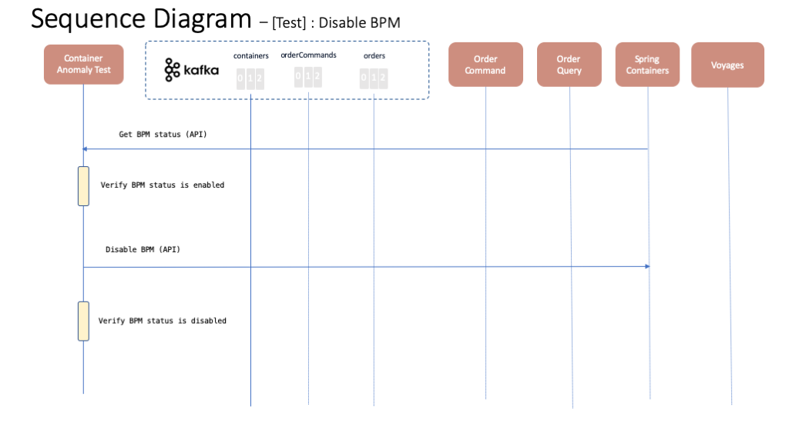
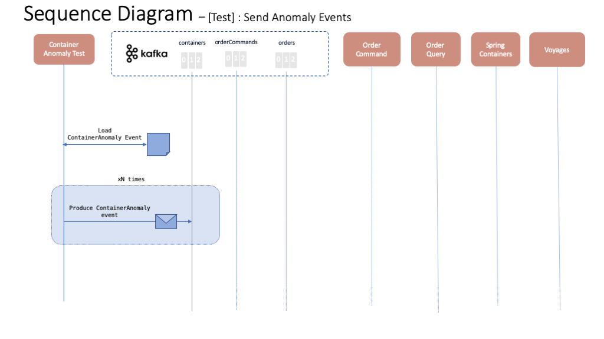
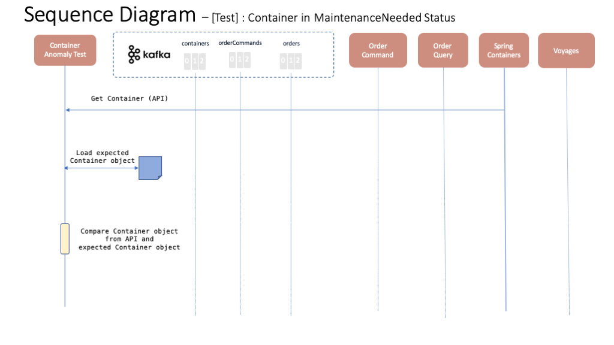
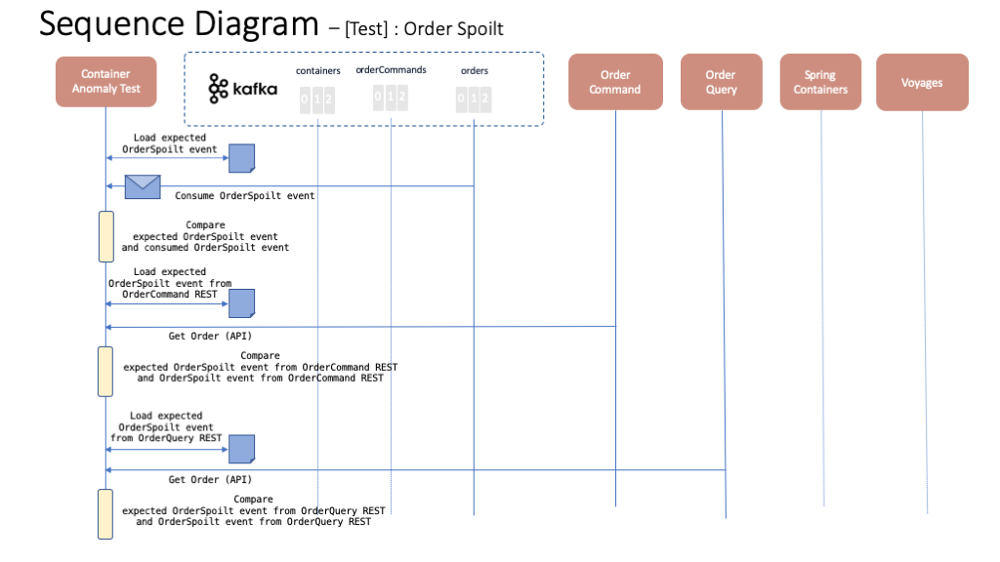
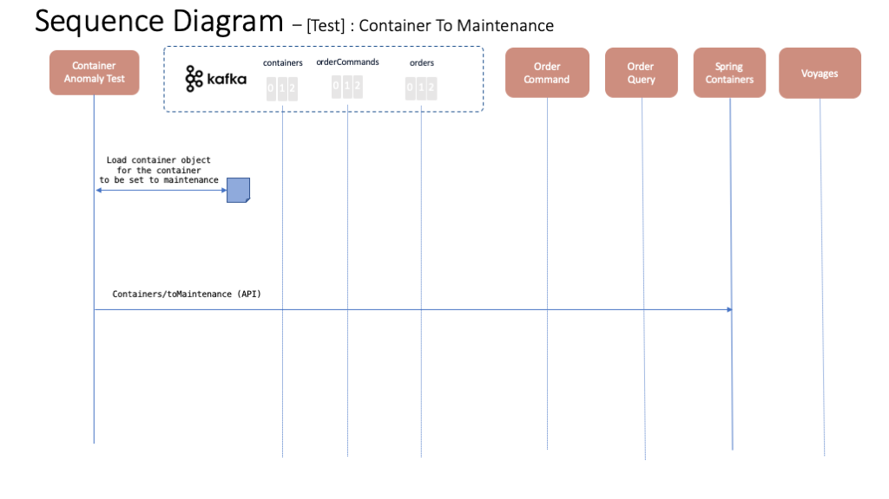
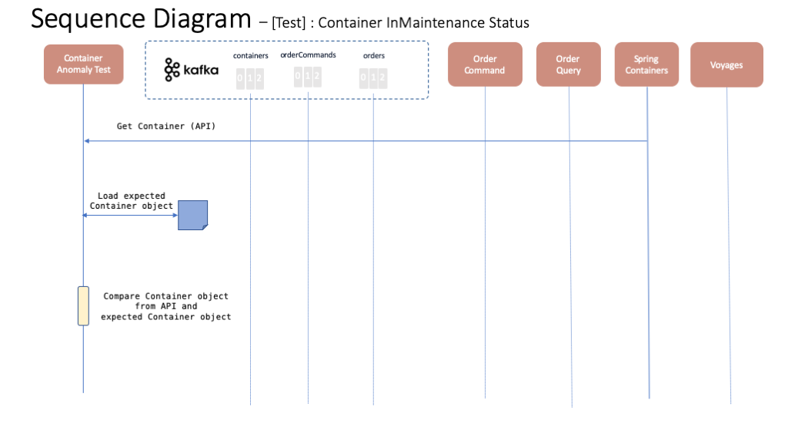
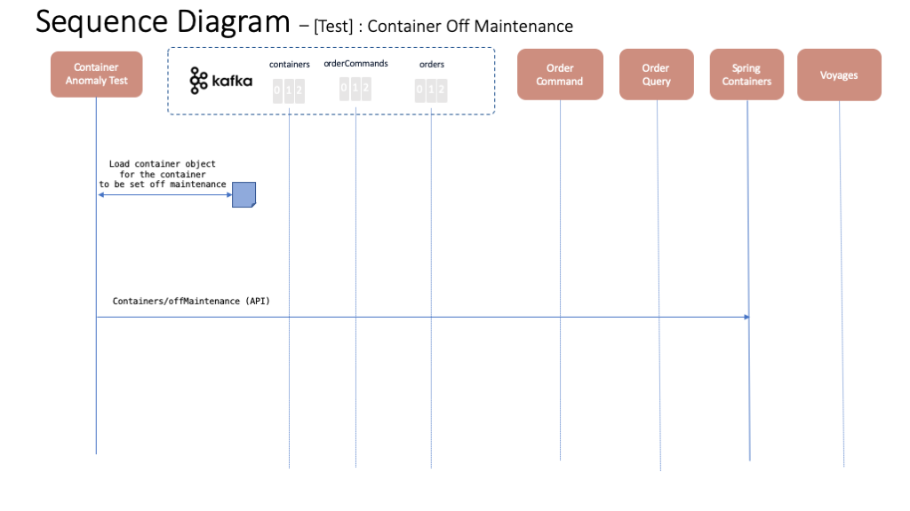
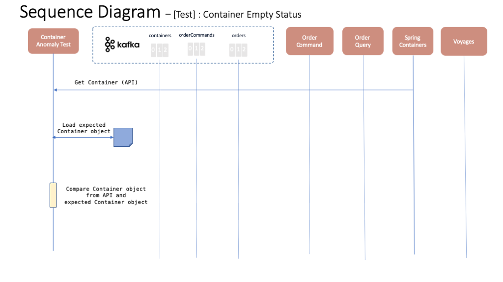

# Container Anomaly test case

This test case will test the use whereby a container suffers some anomaly. As a result, ContainerAnomaly events are sent to set the container for maintenance mode. A BPM process will take care of setting a container into inMaintenance mode, assigning a technician to repair the container and finally setting that container back to being empty and available. This test case will also ensure the order the container with the anomaly was carrying is marked spoilt. The following diagram depics roughly this path on a flow base fashion where the blue square rectangles, purple rounded rectangles and orange rectangles represent actions taken by the test case, events produced to the event backbone (either Kafka or IBM Event Streams) and object statuses respectively.

## Tests

The following sequence diagrams represent each of the tests within this container anomaly integration test case.

### Test 1 - Disable BPM

This test will make sure that when the application is deployed, the BPM anomaly service is enabled. However, it will then disable the BPM anomaly service in order to mockup the call and be able to carry on with this container anomaly test.

### Test 2 - Send Anomaly Events

This tests will send the ContainerAnomaly events needed to trigger the bpm call process and order spoilage.

### Test 3 - Container in MaintenanceNeeded Status

This test will make sure the container which ContainerAnomaly events have been sent for gets into MaintenanceNeeded status as a result.

### Test 4 - Order Spoilt

This test will make sure that the order the container which ContainerAnomaly events have been sent for was carrying gets into spoilt status as a result.

### Test 5 - Container To Maintenance

This test will call the toMaintenance API endpoint for setting a container into inMaintenance mode.

### Test 6 - Container InMaintenance Status

This test will make sure that the container that was set into inMaintenance mode in the previous test, is now indeed into inMaintenance mode.

### Test 7 - Container Off Maintenance

This test will set the container that was inMaintenance status off maintenance.

### Test 8 - Container Empty Status

This test will make sure that the container that was set off maintenance mode in the previous test, is now indeed empty and available.

### Test 9 - Enable BPM

This test will make sure that the BPM anomaly service is enabled for the application to work as expected.

