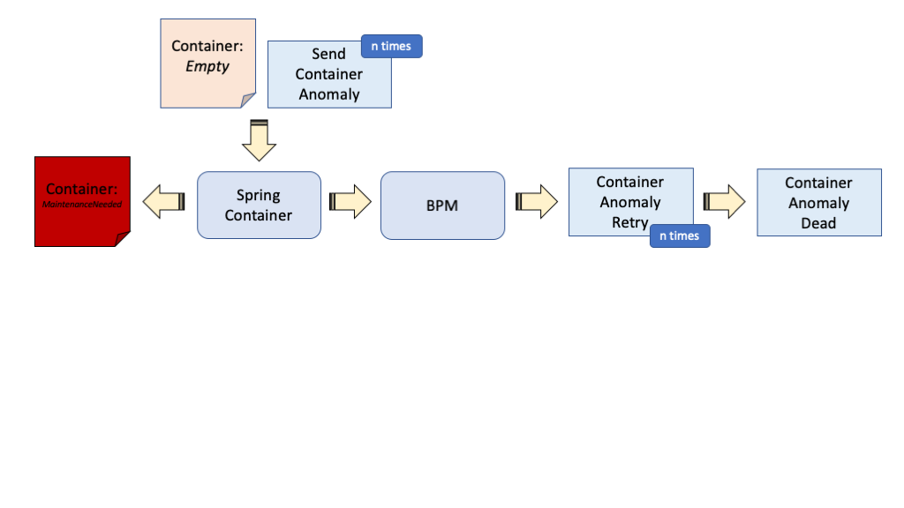
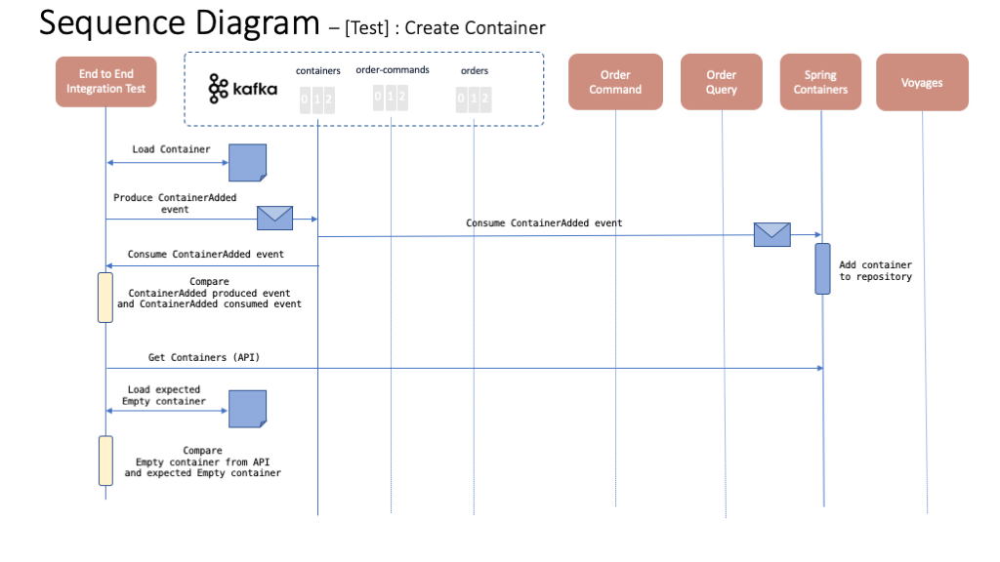
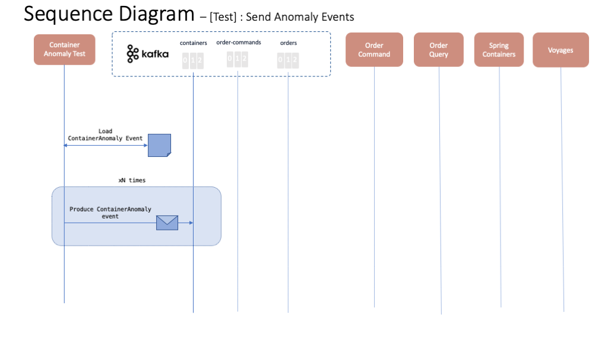
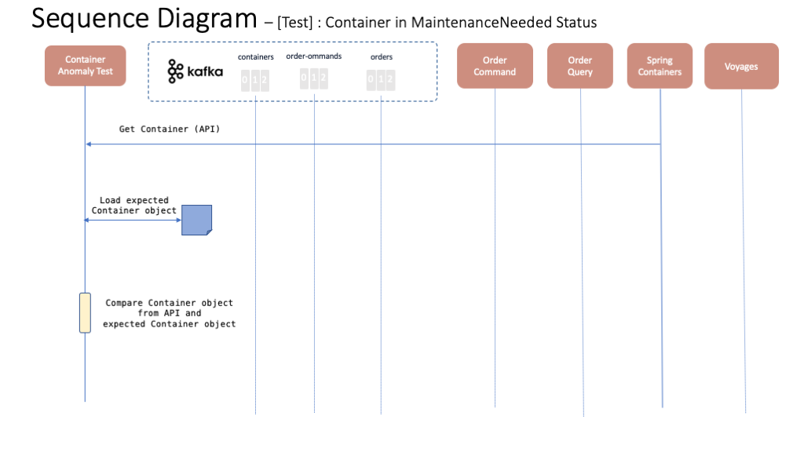
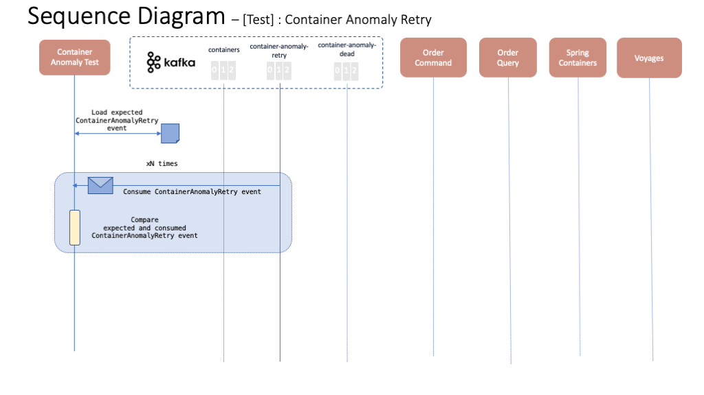
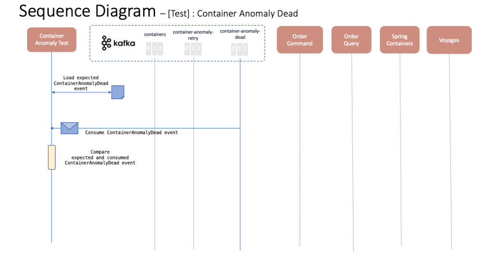

# Dead Letter Queue test case

This test case will test the scenario where the BPM service, which our reference application depends on, is not available. In such scenario, our application should be able to execute the [request retry or dead letter pattern](../../dlq/dlq.md) so that calls to the BPM service are retried, until certain threshold.

## Tests

The following sequence diagrams represent each of the tests within this container anomaly integration test case.

### Test 1 - Create Container

This test will make sure that a new container, which we will then send ContainerAnomaly messages for, is created.

### Test 2 - Send Anomaly Events

This tests will send the ContainerAnomaly events needed to trigger the bpm call process.

### Test 3 - Container in MaintenanceNeeded Status

This test will make sure the container which ContainerAnomaly events have been sent for gets into MaintenanceNeeded status as a result.

### Test 4 - Container Anomaly Retry

This test will make sure that our Spring Containers component sends ContainerAnomalyRetry events into the container-anomaly-retry topic in order to retry calls to the BPM service until a certain threshold (defaults to 3).

### Test 5 - Container Anomaly Dead

This test will ensure that, after we have tried to call the BPM service a certain amount of times, a ContanerAnomalyDead event is sent into the container-anomaly-dead queue.

