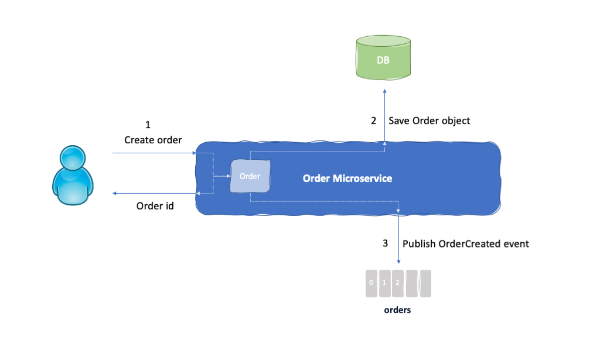
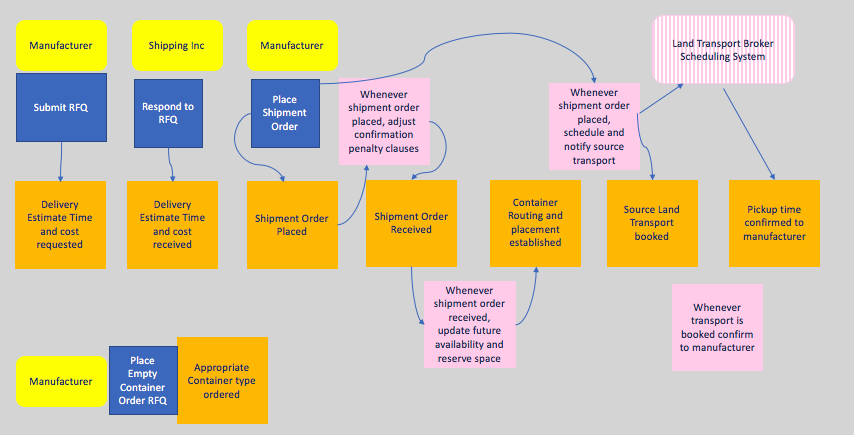
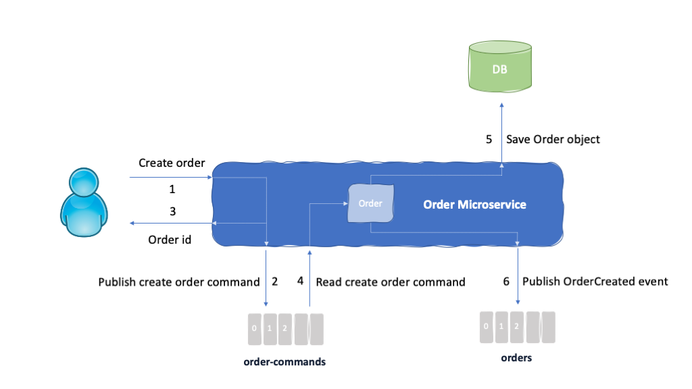
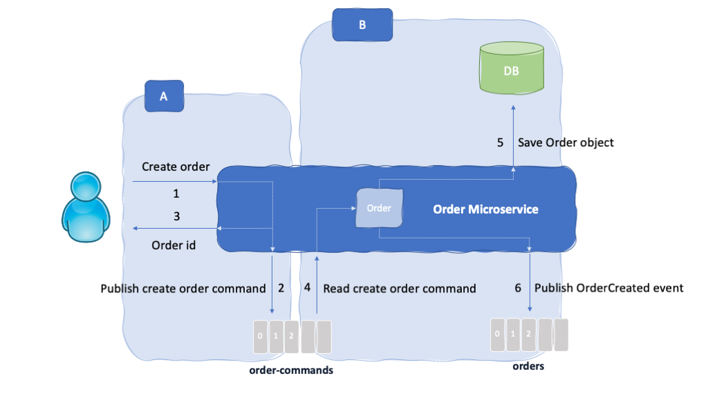

# Create An Order

## Introduction

One of the use cases in our [Reefer Container Shipment reference application](https://ibm-cloud-architecture.github.io/refarch-kc/) for [Event Driven Architectures](https://ibm-cloud-architecture.github.io/refarch-eda/), consist of users (customers of the shipment company) having the ability to create a new order to get their fresh goods shipped overseas from an origin port to a destination port. Customers can also update and reject previously created orders but the mechanism whereby an action from a customer is attended and processed by our reference application is the same regardless of whether it is a new order creation or an update/rejection of a previously created order. Therefore, for the sake of clarity we will refer to new order creation in this documentation.

In this readme, we are going to focus on how we can ensure that any action requested by the user of our application is attended and processed in an Event Driven application by making use of the different mechanisms, patterns and best practices for such type of architectural design.

## Goal

In a nutshell, we want to implement a component, which will be a microservice, in our Reefer Container Shipment reference application to manage the orders. As part of its responsibilities, it will listen/receive commands to create (update and reject as well) new orders from a user/customer.

The order creation process consists of:

1. **Create** an _Order_ object that holds the order information provided by the user/customer (that is, customer id, product id, origin Port, destination port, quantity, etc) along with a unique identifier for the order
2. **Save** the order in a database which will serve to hold the current status for the orders.
3. As in any Event Driven application, we want to **publish** a new order created event so that any other interested parties in your overall solution get notified on this change to system. For instance, in our reference application, this will trigger a long running transaction for finding a container and a voyage to allocate an assign for the proper delivery of the customer's fresh goods. You can read more about this long running transaction process and the [SAGA pattern](https://ibm-cloud-architecture.github.io/refarch-eda/design-patterns/saga/) implementation of it [here](../saga/saga.md)



Implementing the process described above is not as simple as it could sound at first. In order to successfully attend, process and mark any new order creation request from any given customer, we must ensure that the order object created is persisted into a database and an event is published to an [event backbone](https://ibm-cloud-architecture.github.io/refarch-eda/evt-backbone/) such as [Kafka](https://kafka.apache.org/) or [IBM Event Streams](https://www.ibm.com/cloud/event-streams) as a result. In other words, we need to execute those two actions in a transaction-like fashion: **either both or none of them happen**.

Not only that but we would also like to build our Order component/microservice in a way that it **automatically retries** the create new order process if anything goes wrong, without needing any customer interaction. That is, we would like to build our Order component/microservice in a way that once it receives a new order creation request from a customer, it will automatically retry the transaction-like process over and over until it is successfully completed.

### Database

We are not going to cover how database transactions in Software Engineering work because it is a huge field to talk, research and learn about and that is out of the scope of this work. The internet is already plenty of this type of literature in case you want to gain some understanding. Instead, we are going to rely on the transactional capabilities of databases in general so that we will rely on the database to properly store our order object in it or not store anything at all.

### Kafka

For Kafka, we provide a lot of content on the key Kafka concepts [here](https://ibm-cloud-architecture.github.io/refarch-eda/kafka/readme/) and architecture considerations [here](https://ibm-cloud-architecture.github.io/refarch-eda/kafka/arch/) for a good understanding of what the basics components of Kafka are (such as topic, partition, consumer, producer, etc) and the characteristics of Kafka (such as its high availability and resiliency).

Once we understand the above, we still need to dive a bit deeper into Kafka and its technology in order to understand how Kafka provides **exactly-once message delivery**, which is what we need to implement/ensure for the second action in our create new order process. We strongly recommend you going through the following links for a full understanding of the Kafka capabilities (such as idempotence, transactions, acknowledgements, etc) that makes developers available with in order to solve complex problems:

- Kafka Message Delivery semantics in the Apache Kafka documentation [here](https://kafka.apache.org/documentation/#semantics).
- Exactly-once Support in Apache Kafka by Jay Kreps, Co-Creator of Apache Kafka [here](https://medium.com/@jaykreps/exactly-once-support-in-apache-kafka-55e1fdd0a35f).
- Transactions in Apache Kafka Confluent blog by Apurva Mehta and Jason Gustafson [here](https://www.confluent.io/blog/transactions-apache-kafka/).
- Our [Producer](https://ibm-cloud-architecture.github.io/refarch-eda/kafka/producers/) and [consumer](https://ibm-cloud-architecture.github.io/refarch-eda/kafka/consumers/) considerations.

## Solution

### Methodology

We have designed our Reefer Container Shipment reference application by combining some elements of the [design thinking](https://www.ibm.com/garage/method/practices/think/enterprise-design-thinking) methodology with the [Event Storming](https://ibm-cloud-architecture.github.io/refarch-eda/methodology/eventstorming/) and [Domain Driven Design](https://ibm-cloud-architecture.github.io/refarch-eda/methodology/ddd/).

Thanks to the Event Storming work we specifically did for our Reefer Container Shipment business domain (see it [here](https://ibm-cloud-architecture.github.io/refarch-kc/analysis/readme/)), we were able to identify things like the **events and commands** that will flow through our system as well as the domains, subdomains, contexts, etc that will help us identify what microservices/components we should build.

We also wanted to implement one of the most common Event Driven patterns called [Event Sourcing](https://ibm-cloud-architecture.github.io/refarch-eda/design-patterns/event-sourcing/) which dictates to **capture all changes to an application state as a sequence of events**.

#### Events and Commands

From Martin Fowler's Event Sourcing:

>In this discussion I refer to encapsulating all changes to an application state through events, I could easily state all of this using the word (and pattern) 'Command'. Events clearly share most of the properties of commands - the ability to have their own lifetime, to be queued and executed, event reversal is the same as command undo.
>
>One reason for using event is that the term is as widely used in the field for this kind of behavior. It's common hear terms such as event driven architecture and Event Message.
>
>In the end I went with event because I think there's a subtle, but important set of associations that come with it. People think of a command as encapsulating a request - with a command you tell a system to do X. Events, however, just communicate that something happened - with an event you let a system know that Y has happened. Another difference is that you think of broadcasting events to everyone who may be interested but sending commands only the a specific receiver. When it comes to actual behavior it doesn't really matter. The polymorphic reaction of a system to an X command need be no different to a Y event. Yet I think the naming does affect how people think about events and what kind of events they create.
>
>You should also look at the contrast between [Command Message](https://www.enterpriseintegrationpatterns.com/patterns/messaging/CommandMessage.html) and [Event Message](https://www.enterpriseintegrationpatterns.com/patterns/messaging/EventMessage.html).



### Order Commands

Based on the Event Storming exercise, we were able not only to identify the events that will occur but also the commands (among many other outcomes such as actors, domain entities, policies, etc). In the small domain we are focused on in this piece of documentation, we will have three commands:

- Create order.
- Update order.
- Reject order.

and three events as a result:

- OrderCreated.
- OrderUpdated.
- OrderRejected.

Combining the commands concept and the Event Sourcing pattern, which consist of capturing all the changes to our application as a sequence of events, we have decided to create a new topic in our event backbone (either Kafka or IBM Event Streams) called **order-commands** where the requests from our Reefer Container Shipment customers will end up as a command for the application to process and execute.

The interaction between a customer and the system to get a new order created will now consist of just our Order component creating a unique identifier for the new order and logging a command for such new order creation with the customer's request information (customer id, product id, quantity, origin, destination, etc) and the order unique identifier (1, 2 and 3 in the picture above)

The actual creation of the order, that is, creating the order object, saving it to the database and publishing an event as a result to the orders topic for any interested component within our overall application (4, 5 and 6 in the picture above) will be dealt asynchronously by the Order component/microservice guaranteeing the complete processing of all those actions by using the consume-transform-produce loop pattern we will see next.



Having requests from your application users logged as commands in a topic in your event backbone for you Event Driven application has the following advantages:

1. **Event Sourcing** - Implements the Event Sourcing pattern for Event Driven applications. That is, any change/action to be carried out that might change your system status is logged so that the current or past statuses can be achieved by replaying the commands and events.
2. **Asynchronous** - By logging the request to a topic as an action for the system to perform, we move towards a more asynchronous and less blocking action processing methodology that allow user interaction with the system for requests shorter and less prone to fail.
3. **Parallelism** - If a request from a customer needed to trigger another process than the new order creation in the Order microservice/component, by logging the action to a topic where any other application component can subscribe to we are enabling processes to be parallelized.
4. **Automation** - Having customers' requests logged in a topic in our event backbone as commands to be processed and executed by our system, allows us to build our system in such a way that it will automatically retry such commands processing over and over without needing customer interaction until the requests have been successfully completed end-to-end. 

The interaction between a customer and the system to get a new order created will now consist of just our Order component creating a unique identifier for the new order and logging a command for such new order creation with the customer's request information (customer id, product id, quantity, origin, destination, etc) and the order unique identifier (1, 2 and 3 in the picture above)

The actual creation of the order, that is, creating the order object, saving it to the database and publishing an event as a result to the orders topic for any interested component within our overall application (4, 5 and 6 in the picture above) will be dealt asynchronously by the Order component/microservice guaranteeing the complete processing of all those actions by using the consume-transform-produce loop pattern we will see next.

### Consume-transform-produce Loop

As already mentioned in this readme, our Order component/microservice will be responsible for taking in requests from our Reefer Container Shipment customers and satisfy those. For the sake of simplicity, we have focused on the create new order request. We have already said that this request will consist of creating an order object, persisting such order object into a database and publishing an event accordingly to the orders topic, but it could consist of many more actions. Because we want to ensure that requests from our customers are attended, processed and executed successfully but errors might happen and we want to avoid long blocking requests, we have introduced in the previous section, the concept of logging customer requests as commands in a topic in our event backbone (A in the picture below).

Therefore, the most critical part of the Order component/microservice is now the processing of those commands published in the order-command topic of our event backbone that correspond to customer requests. We want to be able to successfully process all of them regardless of how many actions these entail, making sure these actions are all executed and we get confirmation of those. We want to process these actions in a transaction-like manner so that a request is not successfully marked as processed unless all actions were successfully executed (B in the picture below).



As you should already know by now if you read the [Kafka](#kafka) section in this readme in depth, is that with the introduction of the concepts of **idempotence** and **transactions** in Kafka 0.11 we can now execute transformations over an event consumed from Kafka and produce an event as the output to Kafka in a transaction-like manner. This is known as the consume-transform-produce loop pattern.

The key of this loop is that the produced event to the orders topic as the last action of the request (so that all previous actions have successfully been executed already) will be produced along with the offset commitment for the command read as a transaction. That is, either both the event to the orders topic is produced and the offset for the command read from the order-command topic is committed or none of them happen. This allows us to only mark a request completed, that is get his offset in the order-commands topic committed, only if all the actions for such request have been already successfully executed and the resulting event is published into the orders topic.

If anything happens in between for any of the other actions that entail a request such as network failures, timeouts, etc the transaction will not be committed by Kafka which means the command offset in the order-command topic does not get committed and the request itself will get reprocessed event if the Order component/microservice gets killed/restarted.

## Implementation

In this section, we are going to look at the specifics of our implementation for the two main actions, A and B, described in the picture above. The Order component/microservice is implemented in Java using MicroProfile and running on the Open Liberty server.

### A - Order Commands

The Order component/microservice exposes a REST resource for customers to request a new order creation that will create the order object with a random unique identifier and pass that on to the REST service:

```Java
@POST
@Consumes(MediaType.APPLICATION_JSON)
@Produces(MediaType.APPLICATION_JSON)
@Operation(summary = "Request to create an order", description = "")
@APIResponses(value = {
        @APIResponse(responseCode = "400", description = "Bad create order request", content = @Content(mediaType = "text/plain")),
        @APIResponse(responseCode = "200", description = "Order created, return order unique identifier", content = @Content(mediaType = "text/plain")) })
public Response createShippingOrder(ShippingOrderCreateParameters orderParameters) {
    // ... validate input data ...
    ShippingOrder order = ShippingOrderFactory.createNewShippingOrder(orderParameters);
    try {
        shippingOrderService.createOrder(order);
    } catch(Exception e) {
        return Response.serverError().build();
    }
    return Response.ok().entity(order).build();
}
```

The REST service will create the _OrderCommandEvent_ out of the order from the REST resource and call the Order Command Producer to emit the _OrderCommandEvent_ to the order-command topic:

```Java
public void createOrder(ShippingOrder order) throws OrderCreationException {
    OrderCommandEvent createOrderCommandEvent = new OrderCommandEvent(System.currentTimeMillis(), KafkaInfrastructureConfig.SCHEMA_VERSION, order, OrderCommandEvent,TYPE_CREATE_ORDER);
    try {
        emitter.emit(createOrderCommandEvent);
    } catch (Exception e) {
        emitter.safeClose();
        throw new OrderCreationException("Error while emitting create order command event");
    }
}
```

The Order Command Producer will emit the event:

```Java
@Override
@Retry(retryOn=TimeoutException.class,
    maxRetries = 4,
    maxDuration = 10000,
    delay = 200,
    jitter = 100,
    abortOn=InterruptedException.class)
@Timeout(4000)
public void emit(OrderEventBase event) throws Exception {
    if (kafkaProducer == null) initProducer();

    OrderCommandEvent orderCommandEvent = (OrderCommandEvent)event;
    String key = ((ShippingOrder)orderCommandEvent.getPayload()).getOrderID();
    String value = new Gson().toJson(orderCommandEvent);

    try {
        ProducerRecord<String, String> record = new ProducerRecord<>(KafkaInfrastructureConfig.getOrderCommandTopic(), key, value);
        Future<RecordMetadata> send = kafkaProducer.send(record);
        send.get(KafkaInfrastructureConfig.PRODUCER_TIMEOUT_SECS, TimeUnit.SECONDS);
    } catch (KafkaException e){
        logger.error(e.getMessage());
        throw new KafkaException(e);
    }
}
```

The Order Command Producer is enabled for idempotence (so that events are delivered exactly-once) and waits for the acknowledgment of all kafka brokers to ensure the message is HA and resilient:

```Java
private void initProducer() {
    properties = KafkaInfrastructureConfig.getProducerProperties("ordercmd-command-producer");
    properties.put(ProducerConfig.ACKS_CONFIG, "all");
    properties.put(ProducerConfig.ENABLE_IDEMPOTENCE_CONFIG, true);
    kafkaProducer = new KafkaProducer<String, String>(properties);
}
```

With the above implementation, customers will get notified if anything goes wrong during the process of receiving a new order creation request and the production of the OrderCommandEvent as a result. If any exception, timeout, etc with Kafka happens, the Order Command Producer will retry and if that still does not work, the REST service will return a server error, as a result of the exception thrown by the Order Command Producer, so that the customer is informed in order to try again. If the Order component itself fails at some point for whatever reason, when the customer gets into the create new order webpage, they will get listed their orders so that he can decide whether the last one went through before the Order component failed or he needs to create it again instead.

### B - Consume-transform-produce Loop

The implementation for the consume-transform-produce loop is based on the [Exactly Once Processing in Kafka](https://www.baeldung.com/kafka-exactly-once) by Baeldung.

Here we start with the Order Command Runner that will keep polling the order-command topic through the Order Command Agent:

```Java
@Override
public void run() {
    OrderCommandAgent orderCommandAgent = new OrderCommandAgent();
    try {
        while (running && orderCommandAgent.isRunning()) {
            try {
                // poll for OrderCommandEvent events from the order-commands topic
                orderCommandAgent.poll();
            } catch (KafkaException ke) {
                // Treat a Kafka exception as unrecoverable
                // stop this task and queue a new one
                running = false;
            }
        }
    } finally {
        orderCommandAgent.safeClose();  
    }
}
```

where the Order Command Agent will retrieve records from the order-command topic (that are customer requests) and, for each of them, it will deserialize the record, calculate the offset for the record and partition to be committed to (in case everything goes fine) and call a handle function for further processing of the request

```Java
public void poll() {
    // Get records from the order-command topic.
    // The kafka consumer poll api ensures liveness. The consumer sends periodic heartbeats to the server.
    ConsumerRecords<String, String> recs = this.orderCommandsConsumer.poll(this.pollTimeOut);
    for (ConsumerRecord<String, String> rec : recs) {
        // -- Deserialize the record.
        OrderCommandEvent event = OrderCommandEvent.deserialize(rec.value());
        // -- Calculate the offset to commit as part of the transaction
        Map<TopicPartition, OffsetAndMetadata> offsetsToCommit = new HashMap<>();
        TopicPartition partition = new TopicPartition(KafkaInfrastructureConfig.getOrderCommandTopic(),rec.partition());
        OffsetAndMetadata oam = new OffsetAndMetadata(rec.offset()+1);
        offsetsToCommit.put(partition,oam);
        // -- Initiate processing of the command
        handleTransaction(event,offsetsToCommit);
    }
}
```

**IMPORTANT:** The Order Command Consumer is configured to not auto commit offsets as this has to be done by the Order Event Producer as part of a transaction:

```Java
Properties properties = buildCommonProperties();

properties.put(ConsumerConfig.GROUP_ID_CONFIG, "ordercmd-command-consumer-grp");
properties.put(ConsumerConfig.ENABLE_AUTO_COMMIT_CONFIG, Boolean.toString(false));
properties.put(ConsumerConfig.AUTO_OFFSET_RESET_CONFIG, "earliest");
properties.put(ConsumerConfig.KEY_DESERIALIZER_CLASS_CONFIG, StringDeserializer.class.getName());
properties.put(ConsumerConfig.VALUE_DESERIALIZER_CLASS_CONFIG, StringDeserializer.class.getName());
properties.put(ConsumerConfig.CLIENT_ID_CONFIG, "ordercmd-command-consumer");
// Using a value of read_committed ensures that we don't read any transactional messages before the transaction completes.
properties.put(ConsumerConfig.ISOLATION_LEVEL_CONFIG, "read_committed");

this.orderCommandsConsumer = new KafkaConsumer<String, String>(properties);

```

The handle function will process the request based on whether it is a order creation, update or rejection:

```Java
@Override
public void handleTransaction(OrderEventBase event,Map<TopicPartition, OffsetAndMetadata> offsetToCommit) {

    OrderCommandEvent commandEvent = (OrderCommandEvent) event;
    logger.info("handle command event : " + commandEvent.getType());

    switch (commandEvent.getType()) {
    case OrderCommandEvent.TYPE_CREATE_ORDER:
        processOrderCreation(commandEvent,offsetToCommit);
        break;
    case OrderCommandEvent.TYPE_UPDATE_ORDER:
        processOrderUpdate(commandEvent,offsetToCommit);
        break;
    case OrderCommandEvent.TYPE_REJECT_ORDER:
        processOrderRejection(commandEvent,offsetToCommit);
        break;
    }
}
```

Here we get to the main method that will create the order object, persist it into the database and produce an OrderCreated event to be then sent the orders topic by the Order Event Producer:

```Java
private void processOrderCreation(OrderCommandEvent commandEvent,Map<TopicPartition, OffsetAndMetadata> offsetToCommit) {
    // Create the order object
    ShippingOrder shippingOrder = (ShippingOrder) commandEvent.getPayload();
    // Set the status on the shippingOrder to PENDING
    shippingOrder.setStatus(ShippingOrder.PENDING_STATUS);
    try {
        // SAVE the newly created order into the DB.
        // This action MUST support repetition given that the order creation process might get repeated
        // if all the actions to perform do not succeed.
        orderRepository.addOrUpdateNewShippingOrder(shippingOrder);
    } catch (OrderCreationException e) {
        // need other components to fix this save operation: CLI / human or automatic process
        generateErrorEvent(shippingOrder,offsetToCommit);
        return;
    }
    // Create the event to be sent to the orders topic
    OrderEvent orderCreatedEvent = new OrderEvent(new Date().getTime(),OrderEvent.TYPE_ORDER_CREATED,schemaVersion,shippingOrder.toShippingOrderPayload());
    try {
        // Emit the event and consumer offsets as a transaction
        orderEventProducer.emitWithOffsets(orderCreatedEvent,offsetToCommit,"ordercmd-command-consumer-grp");
    } catch (Exception e) {
        // the order is in the repository but the app could not send to event backbone
        // consider communication with backbone as major issue
        e.printStackTrace();
        running = false; // liveness may kill this app and restart it
        return ;
    }
}
```

Finally, the Order Event Producer will be in charge of sending the OrderCreated event to the orders topic as well as committing the offset for the record read and processed from the order-commands topic, both as a transaction:

```Java
@Override
@Retry(retryOn=TimeoutException.class,
    maxRetries = 4,
    maxDuration = 10000,
    delay = 200,
    jitter = 100,
    abortOn=InterruptedException.class)
@Timeout(4000)
public void emitWithOffsets(OrderEventBase event, Map<TopicPartition, OffsetAndMetadata> offsetToCommit, String groupID) throws InterruptedException, ExecutionException, TimeoutException {
    if (kafkaProducer == null) initProducer();

    OrderEvent orderEvent = (OrderEvent)event;
    String key = ((ShippingOrderPayload)orderEvent.getPayload()).getOrderID();
    String value = new Gson().toJson(orderEvent);
    ProducerRecord<String, String> record = new ProducerRecord<>(KafkaInfrastructureConfig.getOrderTopic(), key, value);

    kafkaProducer.beginTransaction();
    Future<RecordMetadata> send = kafkaProducer.send(record);
    send.get(KafkaInfrastructureConfig.PRODUCER_TIMEOUT_SECS, TimeUnit.SECONDS);
    /**
     * Here is where the consume-transform-produce loop pattern magic happens.
     * Kafka transactions allow us to commit the offsets read from the consumer as part of the transaction.
     * That way, both the events produced and the offsets for the records consumed are either both committed or none.
     * As a result, we ensure no command from the order-commands topic is committed, therefore treated as processed,
     * unless we produce the resulting event into the order topics, which is the latest of the actions we must complete
     * for any given command for this microservice. In this case, it will be an OrderCreated, OrderUpdated or OrderRejected event.
     **/
    kafkaProducer.sendOffsetsToTransaction(offsetToCommit, groupID);
    kafkaProducer.commitTransaction();
}
```
