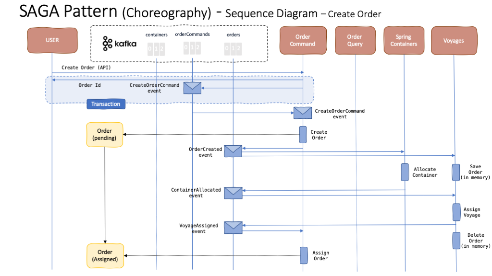
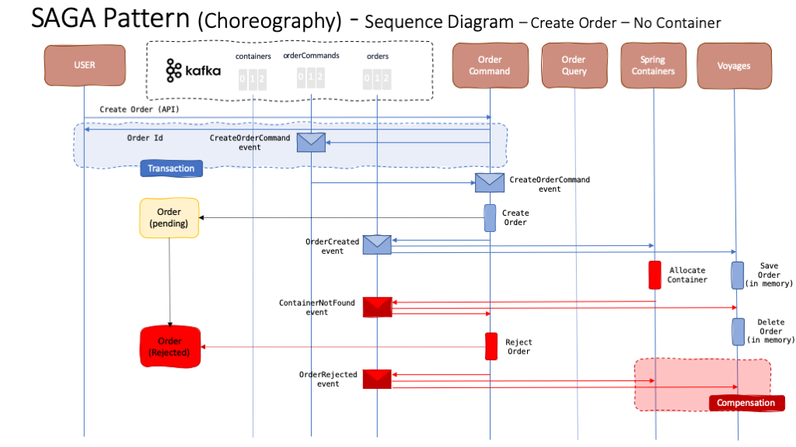
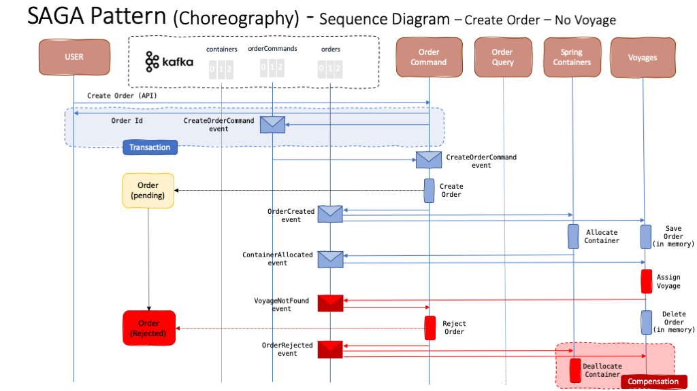

# SAGA Pattern

The SAGA pattern helps to support a **long running transaction** that can be broken down into a collection of sub transactions that can be interleaved any way with other transactions. With microservices, each transaction updates data within a single service, each subsequent steps may be triggered by previous completion. The SAGA pattern supports two types of implementation: Choreography and Orchestration. However, the SAGA pattern comes withe the tradeoff that if any of the sub transactions fails, a compensation process must be implemented and executed.

For more information about the SAGA pattern, read our specific section on it [here](https://ibm-cloud-architecture.github.io/refarch-eda/design-patterns/saga/).

In this readme, we are going to focus on the SAGA pattern implementation details for our [Reefer Container Shipment Reference Application](https://ibm-cloud-architecture.github.io/refarch-kc/).

## Implementation

We have implemented the SAGA pattern in our Reefer Container Shipment Reference Application for the scenario where an order, to carry fresh goods from an origin port to a destination port, is created by a customer. We have decided to implement the Choreography variant of the SAGA pattern.

In this scenario, we have a long running transaction that spans across the Order Command microservice that creates the order and maintains the state of it, to the Spring Container microservice that will try to find an empty container with enough capacity in the origin port to allocate to the order, to the Voyage microservice that will try to find a voyage from the origin port to the destination port with enough capacity on the ship for the container allocated to be assigned to the order.

As you can see in the diagram above, the transaction does not finish until a container has been allocated and a voyage assigned to the order and, as a result, the order stays in pending state until all the sub transactions have successfully finished.

As to the **Transaction** section in the diagram above for the actual create order request from a customer, we explain the reason of it to be a transaction using a command bus for data consistency in the Command Query Responsibility Segregation section [here](https://ibm-cloud-architecture.github.io/refarch-eda/design-patterns/cqrs/).

## Compensation

As said in the introduction to the SAGA pattern, long running transactions spanning multiple microservices implementing the SAGA pattern come with the tradeoff that a compensation process must also be implemented in the case that one, or multiple, of the sub transactions fails or does not achieve to complete so that the system rolls back to the initial state before the transaction began.

In our specific case, a new order creation transaction can fail either because we can not find a container to be allocated to the order or we can not find a voyage to assigned to the order.

### No container

When a new order creation is requested by a customer but there is not a container to be allocated to such order, either because the container(s) do not have enough capacity or there is no container available in the origin port for such order, the compensation process for the order creation transaction is quite simple. In fact, there is little to nothing to be done since the Spring Container or Voyages microservices have not carried any action at all yet.

The Spring Container microservice will emit a ContainerNotFound event that will inform the interested parties (Order Command and Voyages) that there is no container available for a particular order creation request. The Voyages microservices will not need to do anything while the Order Command microservice will transition the order creation request to rejected as a result. It will also emit an OrderRejected event to inform any other interested parties.

### No voyage

This case is, however, a bit more complicate than the previous one as, this time, the Spring Container microservice will have to compensate for the action of allocating a container to the order. As we see, the actions flow remains as expected for the SAGA transaction until the Voyages microservice informs with a VoyageNotFound event that there is no voyage matching the required request of the order. As a result, the Order Command microservice will transition the order to Rejected and emit an OrderRejected event to inform the interested parties. In this case, the Spring Container is one of those interested parties as it will need to kick off the compensation process, which in this case is nothing more than de-allocate the container to the order to make it available for any other coming order.