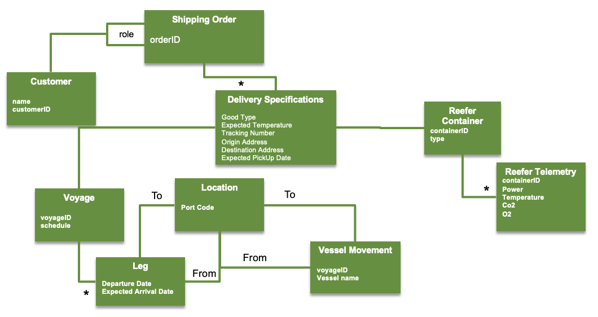
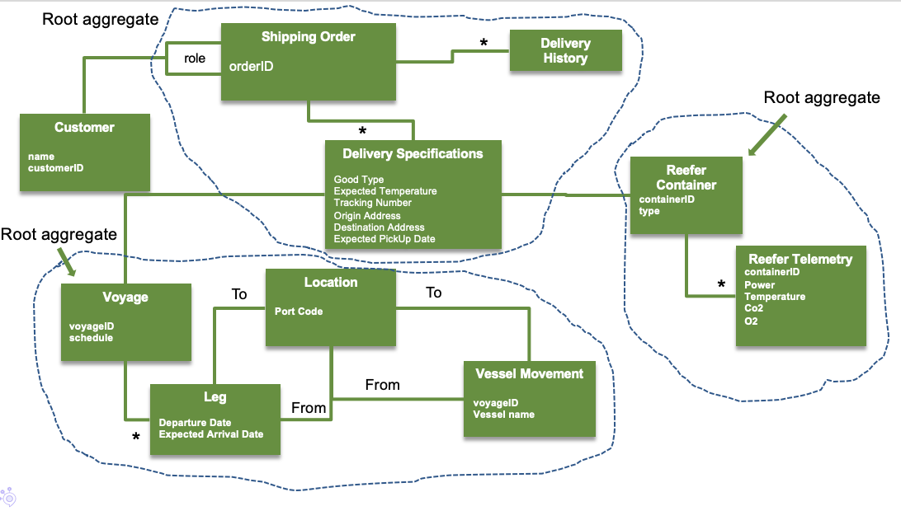
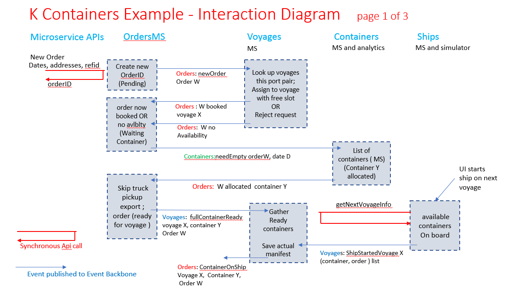
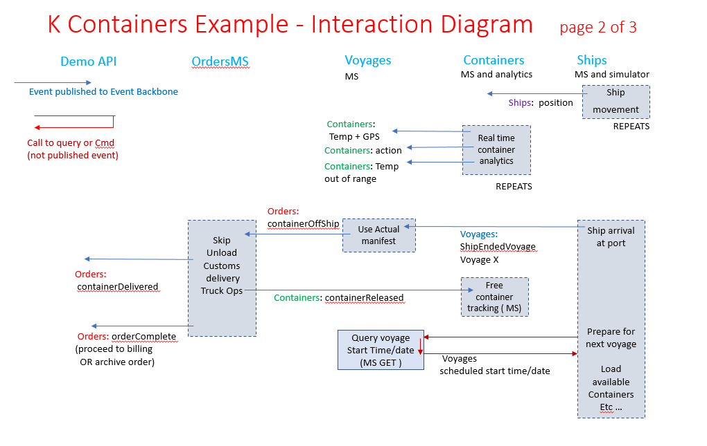
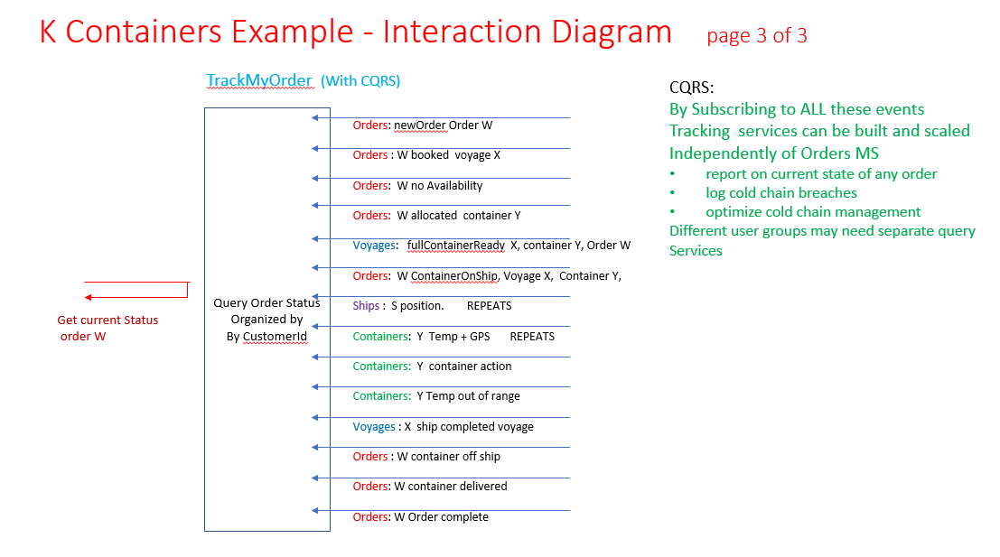
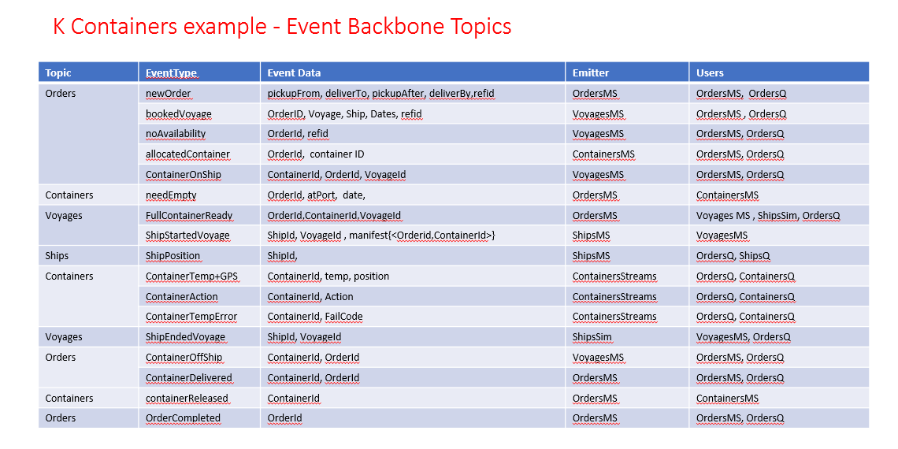

This section describes how to apply the domain driven design principles with the event driven approach to design the reefer container shipment solution.

For methodology discussion we recommend that you review our summary on combining DDD with event storming end event driven microservice design, in [this note.](https://ibm-cloud-architecture.github.io/refarch-eda/methodology/ddd/)

!!! note
        Since, we are delivering a demonstration application there will be some simulator / scaffolding / testing services mixed in with the required business processing.
        This is a common occurrence in agile development and it may be helpful to show how decision to scope and simplify a particular build and test step interacts with decisions relating strictly to microservices design.  

--- 
    
## Applying the DDD and event design approach to Reefer container shipment   

In this section we discuss how the generic steps introduced in previous section can be applied for the Container shipping example:

### Context and scope for demonstration build

An initial scoping decision is that the demonstration will address shipment orders and shipment progress initiated by the "manufacturer" of the fresh goods with the shipment company. In the context of the example there is also discussion of manufacturer and retailer reaching some agreement on the goods to be delivered but this is not part of the demonstrated capabilities. 

The Event Storming analysis of the shipment problem was end-to-end and involved many aggregates including: Orders, Voyages, Trucking operations both at the source (manufacturer pickup)  and at the destination (retailer delivery), Customs and export interactions, Reefer Container loading into ship at source port and unloading from ship at destination port, containers and fleet of ships. To have a simple initial demonstration build showing the role of event-driven architecture and event coupled microservices, as an initial step towards development of a more complete system using agile incremental development and deployment, the initial demonstration build makes the following simplifications and scoping decisions:

* This build will have no implementation of: Trucking operations, Customs and export, or Dockside Handling aggregates 
* It will show a full lifecyle for a manufacturer user to place an order for shipment, seeing a filled reefer container placed on board ship transported to the destination port and delivered.  
* It will include a simulation service for ship movements - tracking the movement of ships carrying containers 
* It will include simulation Container telemetrics such as temperature, current consumption while loaded.  
* It will provide a query for a user to track an order and the current location and state of the associated shipment
* It will include a real time analytic solution to assess problems happening within containers

### 1 - Domain and subdomains

During the event storming analysis, we define the domain to be the Reefer container shipping domain. It groups a set of subdomains like orders, invoice, reefer container, shipping, voyage, inventory and external systems as the vessels monitoring, CRM, invoice, and weather data:

We have three core subdomains and the rest as support. Order can be delivered by an out of the shelf ordering system, but in our case we are implementing it as one or more microservices to support the demonstration of CQRS and event sourcing. The potential competitive advantage is to have a clear traceability of order -> cargo -> container -> itinerary.  

The order subdomain interacts with the contract subdomain via the acceptance of the contract conditions from the customer (e.g. manufacturer) and by building a contract from the created shipment order. 

When the contract is accepted, the order needs to be shipped, but to do so the shipping subdomain needs to interact with the voyage subsystem to get the available vessel itineraries. Voyage is an entity grouping the information about the origin harbor close to the pickup address, to a destination harbor the closest to the shipping address. Finally, the shipping subdomain needs to interact with the container inventory service to get matching Reefer containers, present at the source harbor. 

### 2 -  Applications

To start addressing clear separation of concerns and assign work to different development team, we can identify some user centric applications:

* Booking application: customers enters the shipping order information, and review delivery tracking. 
* Tracking query application: The Shipping clark uses the application to address some complex queries related to reefer, orders, and voyages statistics. 

## 3 - Ubiquitous language

So we identified the Reefer container, that carries fresh product as Cargo. The order is about getting fresh product from origin to destination at a given target temperature and keep the cold chain. The container will be assigned to a voyage that groups legs the ship will follow. The following figure is based on the work from the chapter 7 of Eric Evans's book  with some slight differences to apply to our domain and to illustrate the above concepts:

Customer may have the role of emitter or receiver of the cargo. 

An order can have multiple cargo (but for the current code we will use one to one relationship), and a cargo will be assigned to a Reefer container. 

We reuse the deliver specification object, for the advantages referenced by Eric's book, like separating the specification from the order, to keep the model easier to present, but also the specification, helps us to keep the assisgnment of Reefer and voyage (see below).

The reefer container has refrigerator unit, with sensors and computer to send telemetries on a regular basis (10 to 15 minutes). Those telemetry events will be used for the real time analytics. 

A Voyage is defined by a set of legs going from one port to another port with expected departure and arrival dates. A voyage instance will have a specific vessel name assign to it.

A vessel carries containers, and go from one port to another, following the itinerary defined in the voyage.

Carrier Movement represents one particular trip by a particular Carrier (such as a truck or a ship) from one location to another

A Reefer container will also have its own voyage as it may change vessels during the end to end travel. Carriers are using port as hub, and vessels doing just round trips between the same ports.

Delivery history is an important information, but we will model it as events.

### 3.1 - Entities and Value Objects

What are the object / concepts with an identity?

We have the following entities:

* **Customer**: we assume the customer id is coming from the external CRM system, and the customer enter order from a web app, the shipping company control. (The UI is part of the demonstration component)
* **Reefer**: Our 'company' has already an old container management inventory system, with container identifier. Reefers are in scope of the new application, but they are part of the larger container inventory.
* **Order**: order id will be created during the operation of placing an order.
* **Vessel**: their identity is defined in external system, we are interested by their travel only.
* **Voyage**: defined by unique identity. It lists the planned port to port passages with dates and manifests for each vessel. 

The value objects:

* the different addresses
* the location for the ports
* the telemetry
* the cargo

### 3.2 - Aggregate boundaries

In Domain-driven design, an aggregate groups related object as a unique entity. One object is the aggregate root. It ensures the integrity of the whole. Here the root is the Order. The product to ship is part of the aggregate. The Order is what we will persist in one unique transaction. 

The Reefer and Order and Voyage seem to be an obvious aggregates.

Customer and Vessets are also aggregates, but we will not consider them as scope for the solution implementation.

### 3.3 - Repositories

Each of those aggregates has its own repository. But in fact we can also foresee other reference data, like the list of locations served by the shipping company. So the repository list may look like:

* Customer (not in scope)
* Order
* Reefer and Container
* Vessel movement
* Voyage

### 3.4 - Events

The event backbone will be configured with a topic for each of the above aggregated. We expect to see multiple event types on each topic, but subscriptions and sequencing of events will be within these high level topics. 

Command APIs will be provided to: 

* Place a new shipment order.   
* Track an existing order, to confirm its booking state or to resolve the actual location and status of the container in transit.   
* Modify an order request which could not be booked within the requested time window.
* Create container
* Assign container to order   

A more complete and complex build could include an API for a shipping company person to optimally and manually assign orders to voyages, but for this initial demonstration we will automate this process and assign orders automatilly to the first voyage found meeting the requested requirements.  Specifically, each order is assigned to the first located voyage:

* Going from the port nearest to pickup location  
* To  the port nearest  the delivery location,   
* Within the requested time window  for pickup and delivery   
* With available capacity for an additional container on that voyage.
 
Additional APIs will be need:

* To initiate the overall demonstration 
* To manage and view specific simulation component - container simulation and analytics and ship simulation and analytics. 

### 4- Modules

This is where this implementation differ from Eric Evans's proposed list of modules, as we apply a microservices approach, meaning basically that each aggregate with its repository are excellent candidate to be separate microservice.

#### Order microservice 

For this one, we can see from the business requirements that we need to have complex tracking queries that enforce doing join between data from Voyage, Reefer, and Order, so we propose to implement CQRS for this order microservice, which means we will have at least two standalone, deployable microservices: the orders-command-ms to support the "write model" and the orders-query-ms for queries. We are detailing the design in [the repository itself](https://ibm-cloud-architecture.github.io/refarch-kc-order-ms/).

#### Voyages microservice 

For Voyages we will need a voyages-command-ms which will maintain a list of all voyages and their current state. In any given run of the demonstration we will work with a fixed set of voyages - effectively the schedule for the container fleet - so there is no need for an API to create additional voyages. The voyage definition will be read from file when the build is initializing. We expect this voyage data to be well formed:

* each voyage has a vessel in the fleet allocated to make the voyage 
* the voyages assigned to any one vessel are properly "chained".  For the sequence of voyages assigned to any one container carrier, the destination port of the nth voyage is always the start port of the (n+1)th voyage.

The states of a voyage are:

* SCHEDULED - in this state it can accept order bookings, knows how much free space is available for additional bookings, and knows the orderIDs of each shipment already booked on the voyage 
* IN_PROGRESS -  in this state it includes a manifest  a list of the orderIDs and containerIDs on board the ship 
* COMPLETED - a voyage in the completed state supports tracing continers, may know which containers in the voyage were spoiled etc 

It will be helpful for the voyage-command-ms to include a query service to lookup voyages with a particular source port and destination port in a particular time windaw. This will help process booking request event but does not need to be an external API hence there is no strong argument for realizing this as a separate CQRS query service. 

#### Reefer Containers microservice

For Reefer containers we will use an agent based implementation as the main container inventory is managed by an external system. The agent listen to new reefer container added to the main inventory, and keeps a view of this Reefer inventory internally. It adds different attributes to the basic reefer container and persists metrics.

!!! Note
        The container inventory is in fact coded in a [separate project](https://ibm-cloud-architecture.github.io/refarch-container-inventory/) to proof the strangler pattern and data replication using MQ and kafka or change data capture and kafka.

This service maintain a list of defined containerIDs and track the state of each container. A fixed set of valid container IDs will be initialized at demonstration start time. As noted previously we will assume this to be enough for all requested orders to be assigned a container without availability issues. Since the collection of containers is fixed the component will not need a command API.

The reefer container current state maintained in container-ms is:

*  `state = FREE` - this container is not in use and is available to be assigned to a new shipment order 
*  `state = ALLOCATED` - this container is allocated to an order orderID  and potentially in use for that shipment.

We will be modelling and performing streaming analytics on temperature inside a (refrigerated) container. 
Conceptually, while a container is ALLOCATED to a shipment order with `state = CONTAINER_ON_SHIP`, its internal temperature, and all its sensors will be generated as event streams and process by an real time analytics component. 

#### Fleet/Ships Simulator

For Ships we will have a monolithic fleet simulation service providing continuous simulation of ship position for each ship and modelling of ship events. 
This service will include a UI to enable viewing the positions and states of the ships.
It may have a separate UI to control the overall demonstration.
There is no requirement for any separate microservice maintining additional information on ship state.

--- 

TODO rework next sections

### 6 - Microservice interactions

Using the understanding of the event flow from the Event Storming session, the list of microservices and data within each microservices developed in the steps above, we can write out in a complete interaction flow. This flow illustrates how the microservices are linked together via the Event backbone using event interactions for all non API interactions between distinct microservices. 

#### Command microservice interactions - order create through voyage start with container on board

The diagram below shows all command interactions from initial order creation through voyage start. 

The grey (shaded) columns of processing blocks are organized to show processing by the different command microservices.

* Column 1 shows processing by the orders-command-ms
* Column 2 shows processing by the voyages-command-ms
* Column 3 shows processing by the containers-command-ms and in a later figure by containers-streaming-ms
* Column 4 shows processing by the fleet/ships-simulator-ms

Comments on steps in the command flow:

* A new shipment order request is initiated with the synchronous createOrder API at top left 
    * The orders-command-ms will create a new order record in its tale of active orders and populate it with order details.
    * A *NewOrder* event is emitted on the Orders Topic. 
    * The generated orderID or the new shipment order is returned to the requester in the createOrder response. This enables the requester to query the status of an order and possibly modify the parameters of an unbooked order.  
 * The voyages-command-ms subscribes to all newOrder events on the Orders topic and tries to assign each new order to an available voyage:
    * This operation is simplified by internally maintaining some list of vayages organized by port pair ( Starting port - ending port combination) and by time within port pair.
    * Using such a list each voyage matching the port pair requirement of the new order can be checked or available capacity.
    * If a voyage meeting all requirements for the new order is found, a booking event is emitted; if not, a rejected (No availability) event is emitted.
    * A booked event causes state change in both the voyage - available capacity reduced, new order added to bookings - and to the order. We choose to make both booking and rejected (no Availabiity) events on the Orders topic rather than the Voyages topic.
* The orders-command-ms subscribes to *Orders: booking*  and to *Orders: Rejected (no availability)* events and updates the current state of the affected order with the received information.
    * For bookings, the current state of order is updated with the booking information including VoyageID and now specific pickup and delivery expected dates  
    * A rejected order has its state updated to rejected. This enables the requester to modify the order, suggesting different required dates or locations and trigerring a new search for a voyage meeting the modified requirements.  
    *  Booked orders now have a specific schedule from the booked voyage of when they will need a container allocated for their use 
    *  A *Containers: needEmpty* event is emitted to get a specific container allocated for use by the booked shipment
* The containers-command-ms subscribes to *Containers: needEmpty* events and allocates an available container for each one:
    * This microservice is maintaining a list of all containers and their current states.
    * For each incoming needEmpty event, it assigns a free container to that order and emits an *Orders: allocatedContainer* event specifying the containerID of the allocated container. 
    * It is very natural/necessary for the allocation of a container to be reported as an asynchronous event since this may occur at any time before the container is needed, possibly significanly later that he Containers:needEmpty event occurs 
    * We make  *Orders: allocatedContainer* an event on the Orders topic since that is the most significant state change which it drives.  
* The orders-command-ms subscribes to all*Orders: allocatedContainer* events and updates the order current state with its allocated containerID   
    * Once an order is booked on a voyage and has a container allocated for it to use, the actual physical process of shipment canbegin at this point.
    * Since the delivery of empty container, loading it with goods at the pick up site, truck operations to get it to dockside etc are out of scope for this build, we can consider the container ready for its voyage at this point. Hence the *Voyages:fullContainerReady* event is emitted at this point by the orders-command-ms. This event includes the containerID of the allocated container. 
*  The voyages-command-ms subscribes to *Voyages: fullContainerReady* events and uses these to construct a complete manifest -  the list of  <containerID, orderID> pairs which will travel on this voyage 
* At this point the voyage-command-ms interacts with the fleet/ships-simulation-ms to simulate start of voyage 
    * We have shown this in the figure as a synchronous call to getNextVoyageInfo. This could also be handled with one or more event interactions 
    * The ship-simulator-ms will update the state of this ship to show the available containers and orders on board
    * It will start the simulation of the ship moving on its course tocomplete the vogage
    * The ship-simulator-ms willemit a *Voyages: ShipStartedVoyage*  event 
* The Voyages-command-ms receives this event and for each order/container in the manifest emits an *Orders: ContainerOnShip* event
* The orders-command-ms will subscribe to *Orders: ContainerOnShip* events and update the current state of each identified order with this information.

#### Command microservice interaction - container on ship at sea through shipment complete

The diagram below shows all command interactions from container on ship in voyage through shipment delivered and order completed. 

As in the previous interaction diagram, the columns with grey/shaded processing blocks show work by (1) orders-command-ms (2) voyages-command-ms (3) containers-command-ms and containers-streaming-ms (4) fleet/ships-simulator service respectively.

This diagram starts with containers on board a ship which is sailing on specific voyage and is at sea. 

* The fleet/ships-simulator-ms repeatedly simulated movement of the ship along its course 
    * It emits *Ships: GPSposition* events recording the position of the ship at different points in simulated time. 
* Similarly, while the ship is at sea, the container-streams-svc is continuously simulating temperature within the container and edge monitoring to adjust controls if necessary and to report a cold chain breach in that container if it occurs. 
    *  This will result in a repeated stream of *Containers: tempAndGpsState* events reporting the temperature, GPS coordinates and possibly power consumption of the container
    *  There could also be on or more *Containers: action* events to adjust or reset controls of the refrigeration unit in the container
    *  These adjustment event are initiated by predictive real-ime analytics on the container state
    *  If the temperature in the container goes out of range and there is a cold chain failure, a Containers: temperature Out of Range event is emitted
* After some period of simulated time tracked by these ship position and container state repeated events, the ship will be simulated as arriving at the destination port of the voyage. 
    * The ship-simulator-ms emits a *Voyages: ShipEndedVoyage* event  
* The voyages-command-ms subscribes to *Voyages: ShipEndedVoyage* and for each such event, emits *Orders: containerOffShip*
    * It can do this because the current state record for each voyage includes the manifest of <orderID, containerID> pairs which travelled on that voyage 
    * the current state of the voyage is updated to COMPLETED
* The orders-command-ms subscribes to *Orders: containerOffShip* and updates the state of all orders which have completed their shipping leg as a result of completion of their booked voyage
    * Now, since simulation of the dockside unloading, customs processes, trucking operation to support deliver are out of scope for this build, we can consider the shipment delivered at this point 
    * orders-command-ms emits *Orders: containerDelivered* and marks this as current state of container 
    *  With the shipment delivered, there is no further need for a container to be associated with this order; orders-command-ms emits *Containers: containerReleased*
* The containers-command-ms subscribes to *Containers: containerReleased*  and marks the current state of the identified container as FREE and available to be allocated to other shipment orders 
* The order-command-ms considers process of the shipment order complete at this point 
    * It emits *Orders: orderComplete* and marks this as the current state of the order 
    * A more complete and realistic build would statr invoicing and billing event at this poitn , but this was decided to be out of scope at this point 
* The fleet/ships-simulator-ms will continue at this point to start the next voyage in its planned itenerary and interact with voyages-command-ms to do this 
*  this is a cycled repetition of start of voyage interaction discussed previously 
   

#### Query microservice service  - CQRS Order and  Shipment tracking microservices 

The diagram below shows all interactions with the shipment tracking microservice. This microservice subscribes to many events carrying required information and supports one or more query APIs for different flavors of order and shipment tracking 

There could be multiple flavors of order and shipment tracking query APIs supported:
* Order confirmation query could address orders, bookings, rejections, modified orders etc 
* Shipment state query could cover: container assignment, on board ship, ship position, off ship, delivery, etc 
* Cold chain certification query could want to augment the above with a full temperature log of the container while in transit and expect reporting on temperature range violations. 

Since we are using a CQRS approach, and all queries are non state changing, we could combine these multiple query levels into a single microservice or separate them out into separate microservices. If query load is intense there could be multiple instances of each such query microservices with load balancing of user requests. 

The design of these different flavors query services is essentially the same.  The internal state data to respond to queries is obtained by subscribing to the necessary Topics. For cold chain and shipment reporting, this will involve all four topics Orders, Voyages, Containers and Ships.  Internally the data will be organized by requester of the order, then by orderID, then current state and possibly summaries of repeated event history. 

The inteaction diagram 3 above illustrates this organization. For any order and shipment tracking query service there are synchronous APIs offered at one side and subscribed events received at the other to gather required state information from the vent backbone.  

#### Topics, event types and the event emit and consumption lists

From the interaction diagrams we can compile  a list of all event types which will occur in the build and check that they are organized into topics in a way which preserves all essential event sequencing. 

The diagram below lists the event types and topics, showing emitters ( publishers) and consumers ( subscribers) of each event type. 

