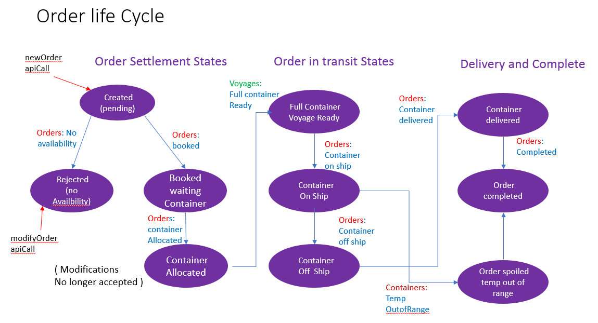

# From Analysis to Microservice Specifications 
## Goals and outline of section 
This section describes the design step which uses output from the event storming session and subsequent analysis and derives a set of micro services design specification.
The goals for ts design step and the resulting specifications are: 
* Highly modular cloud native microservices 
* Event coupled microservices -  facilitating independent modification and evolution of each microservice separatelys
* Allow for event sourcing – eventual correctness and recovery using event base) 
* Illustrate CQRS and its scaling advantages 

Since we are delivering a demonstration application there will be some simulator / scaffolding / testing services mixed in with the required business processing.
This is a common occurrence in agile development and it may be helpful to show how decision to scope and simplify a particular build and test step interact with decisions relating strictly to microservices design.  

Requirements for scalability, coupling of microservices *only* through the event back bone and eventual correctness   differentiate this step from previous Event Storming and Domain Driven Design activities which were 100% business requirement driven.

## Starting materials generated during Event Storming and Analysis
In this microservices specification step we make use of the following materials generated during Event Storming and analysis of the Container Shipment example problem: 
* Event Sequence flow
* Events – business description
* Critical events 
* Aggregates and services  
   * Users – roles user stories 
   * Commands
   * Event linkages
   * Policies 
   * Event prediction and probability flows 
* Data  ( Conceptual ) 
The derivation of these material was described in: [Analysis](../analysis/readme.md) .

## Event linked microservices design - structure 
A complete microservices specification ( the target of this design step ) will include specifications of the following: 
* Event Topics 
   * Used to configure the Kafka Event Backbone 
* Event types within each event topic 
* Microservices: 
   * These are finer grained than aggregates 
   * May separate query and command; possibly multiple queries  
   * May Separate whether simulation or business processing component 
   * Demonstration Control –main UI 
   * Scaffolding and testing services  - whether local and cloud versions 
* Microservice specification ( for each identified 
   * Data within Each microservice
   * APIs  ( Synchronous ) 
   * Topics and events Subscribed to
   * Events published / emitted   
* List of end to end interactions 
   * List of logic segments per microservice 
* Recovery processing, scaling 
   * We expect this to be highly patterned and template driven not requiring example-specific design 
With the above information coging of each microservice and other components of the sprint should be straightforward.    

## Steps in the design process 
Here we describe in generic terms, each step in the process of deriving event-linked microservice specification. In following section we will describe in more detail how each of these steps plays out in the specific context of the the container shippment example.

### List of generic steps:
*  **Step 1 - limit the context and scope for this particular build / sprint** 
   * we assume that we are developing a particular build for a sprint within some agile development ; additional functions and complexity may be added in later sprints
   * working from the initial list of aggregates, select which aggregates will be included in this build
   * for each aggregate possible choices are: (1) to completely skip and workaround the aggregate in this build (2) to include a full lifecycle implementation of the aggregate (3) to provide a simplified lifecycle implementation - typicall a table of entities is initialized at s.  tart up, and state changes to existing entities are tracked 
   * determine whether there are simulation services or predictive analytics service to be included in the build 
   * identify the external query apis and command apis which this build will support 
   * create entity lifecycle diagrams for entites having a full lifecycle implementation in this build / sprint .
*  **Step 2 -    identify specific microservices in each aggregate**
   *  each aggregate will be implemented as some composition of (1) a command microservice managing state chsnges to the entities in this aggregate (2) possibly one or more separate ( CQRS) query services providing internal or external API query capabilities (3) additional simulation, predictive analytics or User Interface microservices 
   * The command microservice will be built around and manage a collection of active entites for the aggregate, keyed by some primary key
   * The separation of each aggregate into specific component microservices as outlined above, will be a complete list of microservices for the build / sprint. 
   * Identify the data collections, and collection organization (keying structure)  in each command and query microservice for this build.
*  **Step 3 -  generate microservice interaction diagrams for the build** 
   * The diagram will show API calls initiating state change 
   * It shows for each interaction whether this is a synchronous API calls or an asynchronous event interaction via the event backbone
   * The diagram labels each specific event interaction between microservices trigerring a state change
   * ( Typically queries are synchronous API calls since the caller cannot usefully proceeed until a result is returned )
   * From this we can extract: (1)  a complete  list of event types on each topic, with information passed on each event type (2) the complete list of “logic segments” for each microservice processing action in response to an API call or initiating event 
   * When, at the next level of detail, the individual fields in each event are specified and typed, the CloudEvents standard  in https://github.com/cloudevents/spec should be assumed as a start point 
*  **Step 4 - specify recovery approach in case a microservice fails**
   * If a microservice fails it will need to recover its internal state date by resubscribing to one or more topics on the event bus  
   * In general, commamd and query microservices will have a standard pattern for doing this 
   * Any custom event filtering and service specific logic should be specified 

### Concepts and rationale underlying this design approach
* What is the difference between event information stored in the event backbone and state data stored in the microservices ?
   * the event information stored persistently in the event backbone is organized by topic and, within each topic, entirely by event time-of-occurrence.
   * the state information in a command microservice is a list (collection) of  all **currently active** entities of the owning aggregate ( e.g. all orders, all voyages etc ) and the **current** state of each such entity 
   * each command microservice will consist of a collection of entity records keyed by primary key 
   * this is complementary to the historically organized information in the event backbone. 
* When is it OK to be using synchronous interactions between services instead of asyncrhonous event interacts through the event backbone?
    * For non-state-changing queries, for which the response is always instantaneously available a synchronous query callmy be Ok and will provide a simpler more understandable interface.
    * Any processing which can be though of as being triggered by some state change in anothe aggregate should be modelled with an asynchronous, because as the solution eveolves other new microservices may also need to be aware of this event. We do not want to have to go back and change logic n the service where this event originated to have that microservice actively report the event to all potential consumers. 
*   How do we save microservices from having to maintain data collections with complex secondary indexing for which eventual consistency will be hard to implement? 
    * Each command  microservice should do all its state changing updates using the primary key lookup only for its entities.
    * Each asynchronous event interaction between microservices should carry primary entityIds ( orderID, VoyageID, shipID) for any entities associated with the interaction.
    * Each query which might require speciaoized secondary indexing to respond to queries can be implemented in a separate CQRS query service which subscribes to events  to do all internal updating and receives events from the event backbone in a ( Consistent) eventually correct order. 
    * This allows for recovery of any failed service by rebuilding it in "eventually correct" order.
    
## Specific application to Container Shipment example   
In this section we discuss how the generic steps introduced above can be applied for the Container shipping example 
### Step1 - context and scope for demonstration build
An initial scoping decision is that the demonstration will address shipment orders and shipment progress initiated by the "manufacturer" of the goods with the shipment company. In the context of the example there is also discussion of manufacturer and retailer reaching some agreement on the goods to be delivered but this is not part of the demonstrated capabilities. 

The Event Storming analysis of the shipment problem was end-to-end and involved many aggregates including: Orders, Voyages, Trucking operations both at the source (maufacturer pickup )  and destination (retailer delivery), Customs and export interactions, Container loading into ship at source port and unloading from ship at destination port, containers and fleet of ships. To have a simple initial demonstration build showing the role of EDA architecture and event coupled microservices, as an initial step towards development of a more complete system using agile incremental development and deployment, the initial demonstration build makes the following simplifications and scoping decisions:   
*   This build will have no implementation of:  Trucking operations, Customs and export, or Dockside Handling aggregates 
*   It will show a full lifecyle for a manufacturer user to place an order for shipment, seeing a filled container placed on board ship transported to the destination port and delivered.  
*   It will include a simulation  Service for ship movements - tracking the movement of ships carrying containers 
*   It will include simulation and analytics for  Container temperatures  in while onboard ship  
*   It will provide a query for a user to track an order and the current location and state of the associated shipment

Based on the scope selection above, active aggregates in the build will be:
* Orders  - with support for a complete order lifecycle 
* Voyages  - list of planned port to port passges with dates and manifests for each sip 
* Containers - with allocation of a container to each order and temperature tracking of refrigerated containers 
* Ships - with tracking of current voyage and current geographical position of each container ship 

The event backbone will be configured with a topic for each of the above aggregated. We expect to see multiple event typs on each topic, but subscriptions and sequencing of events will be within these high level topics. 
Command API.s will be provided to: 
* place a new shipment order 
* track an existing order, eith to confirmits booking state or to resolve the actual location and status of the container in transit 
* modify an order request which could not be booked within the requested time window 

A more complete and complex build could include an api for a shipping company person to optimally and manually assign orders to voyages, but for this initial demonstration we will automate this process and assign orders automatilly to the first voyage found meeting the requested requirements.  Specifically, each order is assigned to the first located voyage:
*  going from the port nearest to  pickup location
*  to  the port nearest  the delivery location, 
*  within the requested time window  for pickup and delivery 
*  with available capacity for an additional container on that voyage.
 
Additional APIwill be need:
* to initiate the overall demonstration 
* to manage and view specific simulation component - container simulation and analytics abd ship simulation and analytics. 

### Shipment order lifecycle and state change events 

The scoping decisions for the demonstration build listed above are reflected in a shipment order life cycle diagram shown below.

A shipment order is initially created with an API call made by a manufacturer. The order request specifies: 
*  the pickup location where  emptry container will be loaded 
*  the delivery location where the container is to be delivered to (we expect this to be in a remote country requiring a sea voyage ) 
*  the shipment time window i.e. 
   *  earliest date at which goods are available at pickup location for loading into the container 
   *  date by which delivery to the destination address is required 
Since our initial demonstration build expects to show refrigeration behavior snd track preservation of a cold chain, we asume that orders are for some commodity which requires refrigeration during its shipment.    
   
A graphical view of this API with some additional field specification is provided in [Create order Request](./createOrderApi.png) . 

When a new shipment order is placed, the shipping company must determine whether there is available capacity in some planned ship voyage which meets all the requirements specified by the manufacturer / customer. If there is a planned voyage with available cpacity for ne additional container going from the source port nearest the pickup location to the destination port nearest to the delivery location then the order can transition to state=BOOKED and positive confirmation of the order returned to the requester.  If no such voyage is available then the shipment order transitions to state=REJECTED(No Availability) and this is reported back to the requester. 

Once an order is BOOKED, then the expected dates and locations where for which a container will be needed are known. A request can be issued to book a specific (refrigerated) container for use with this shipment. We assume that the shipping company always has enough container available to meet expected shipment demand, hence the shipment order will transition to state=CONTAINER_ALLOCATED when this container booking is received. 

Since the scope for this demonstration build excliuded the simulation of trucking operations to get the goods from the manufacturer's pickup location, export clearance and actual dockside loading operations, once an order has a container allocated it is " ready to go" and transitions to state=FULL_CONTAINER_VOYAGE_READY.  The actual event of recording the container as being on board ship and at sea will not happen until simulated time in the demonstration reaches the scheduled start of the voyage on which that container is booked and the container ship assigned to that voyage is in the source port and also ready to go. At that point in simulated time, the state of the shipment order changes from state = FULL_CONTAINER_VOYAGE_READY  to state = CONTAINER_ON_SHIP.

While the order has state = CONTAIN_ON_SHIP, then we will be receiving temperature information from the COntainer simulation and analytics and Ship position information from the ship simulation service. Both provide a continuous streaming souces of information which should be considered part of the extended shipment state. 

After some period of simulated time, the ship will reach the destination port of the voyage. at this time the Oder transitions to state = CONTAINER_OFF_SHIP since our scope excluded simulation of actual dockside unloading information. Since we are not modelling customs clearance or trucking operations, there are no further events to be modelled  until the order state = CONTAINER_DELIVERED. 

Since we are not modelling invoicing and billing operations the Container can be deallocated from this order and retruned to some pool of free containers. When that has occurred the oder state can be considered state = ORDER_COMPLETED. 
