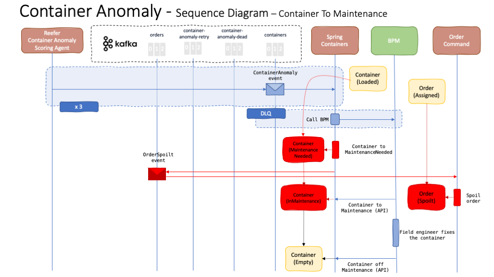

# Container Anomaly Use Case

## Introduction

We have implemented a [Container Anomaly](https://ibm-cloud-architecture.github.io/refarch-reefer-ml/) use case whereby our Reefer containers will send telemetry health status (1), in terms of temperature, CO2 level, power level, etc, to a [Reefer Telemetry Agent](https://ibm-cloud-architecture.github.io/refarch-reefer-ml/infuse/dev-scoring/) (4), that we have built using the Reactive Messaging feature from the MicroProfile 3.0 specification onwards, through a _reeferTelemety_ topic (3). This Reefer Telemetry Agent will, in turn, call an [Anomaly Detection Scoring service](https://ibm-cloud-architecture.github.io/refarch-reefer-ml/analyze/ws-ml-dev/) (5) we have built following our [Data and AI Reference Architecture](https://ibm-cloud-architecture.github.io/refarch-data-ai-analytics/) that will determine whether there is an anomaly in a given containers based on the data sent by their IoT sensors. If an anomaly is predicted, a **ContainerAnomaly** event will get dropped into the _containers_ topic the container management component (7) of our Reefer Container Reference Application listens to. The Container management component will call an [IBM Business Process Management (BPM) process](https://ibm-cloud-architecture.github.io/refarch-reefer-ml/bpm/readme/) (8) which will end up with a field engineer fixing the container.

## Container Anomaly process

This section outlines the process the container management component of our Reefer Container Reference Application follows to handle the **ContainerAnomaly** events for a given container:

As we can see in the image, the container management component called **Spring Containers** (since it is written using the Spring Framework) listens to the **containers** topic. The Spring Containers component expects **ContainerAnomaly** events. However, it will not trigger the "container to maintenance" process until it receives 3 ContainerAnomaly events for a given container (this decreases the load on the BPM process).

Once we have received 3 ContainerAnomaly events for a specific container, the Spring Container component will:

1. Call the BPM process that will manage the assignment of a field engineer to have a look at and fix, if needed, the container at the destination port.
2. Set the container into **MaintenanceNeeded** state which will prevent that container from getting any order assigned. This is important as containers does not always fail while carrying goods overseas in a ship but also while they are at the docks.
3. Send an **OrderSpoilt** event to the orders topic, in case the container was allocated to an order and was carrying goods overseas, to notify any other Reefer Container Reference Application component that is interested on this event.

Once the BPM process has received the call from the Spring Container component, it will trigger a process whereby a field engineer will get assigned the task of checking and fixing the container, either at the dock where it is if it was not carrying goods overseas in a ship when the anomaly happened or once it gets to the destination port otherwise. Before the field engineer starts its work, the BPM process will interact to put the container into **InMaintenance** state. It will also interact to get the container off maintenance mode into **Empty** state, so that the container is again available for order allocation, once the container has been fixed.

As a result of the **OrderSpoilt** event sent into the orders topic, the Order Command component of our Reefer Container Reference Application that manages the orders will set the order, which the container with anomalies was allocated to and carrying goods for, to **Spoilt**. This could potentially trigger a customer care interaction process whereby the customer gets notified.

## IBM Business Process Manager (BPM) process

As we can see in the diagram and explanation above, the Spring Containers component calls a BPM process for a field engineer to get assigned to checking and fixing the potentially bad container. However, the fact that our Spring Containers component calls another, potentially external, service through an HTTP or RPC call introduces a dependency that could actually be troublesome if the call fails.

What can we do in this case? We have a look at this usual scenario in distributed systems in the [Dead Letter Queue section](../dlq/dlq.md).
