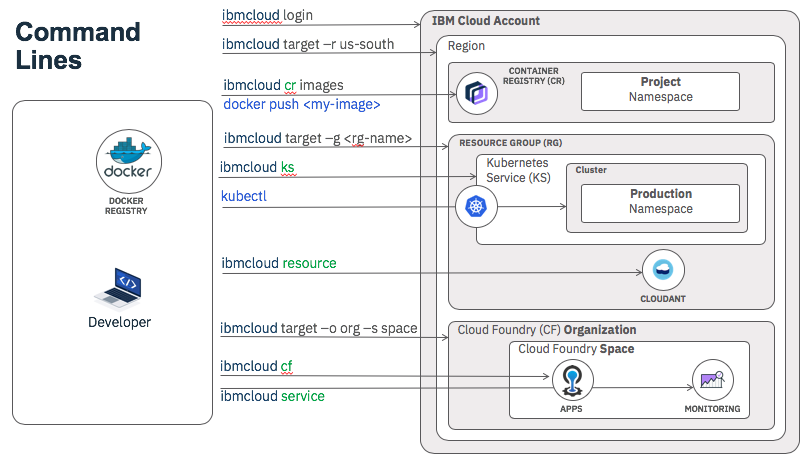
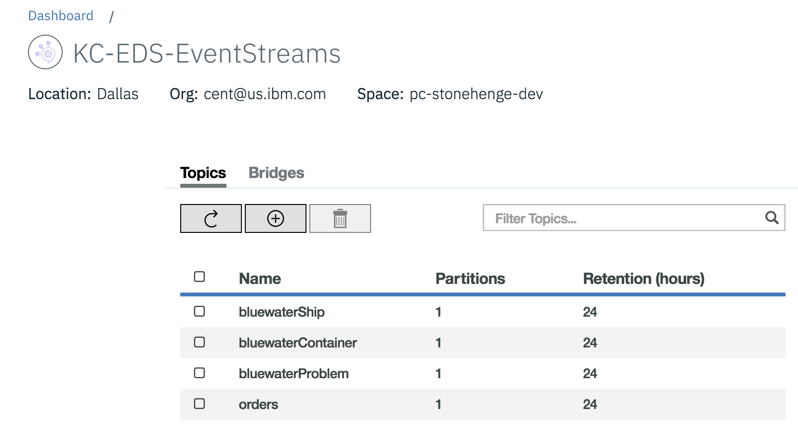

# IKS Deployment

In this document, you will learn how to deploy different microservices as part of the solution into IBM Cloud Kubernetes services, how to use IBM Event Streams and postgresql on IBM Cloud while running the solution locally, or only some services locally.
First you need to configure the needed services. 

## Prepare IBM Cloud Services to run the solution

IBM Cloud offers a set of services to run part of your event driven solution. We are using the following services:

* [Kubernetes Service](https://cloud.ibm.com/containers-kubernetes/catalog/cluster)
* [Streaming Analytics Service](https://cloud.ibm.com/catalog/services/streaming-analytics) - As of now it is optional.
* [Event Streams](https://cloud.ibm.com/catalog/services/event-streams)
* And if you want to use the container microservice with springboot and postgresql, you need [postgresql](https://cloud.ibm.com/catalog/services/databases-for-postgresql)

At the high level the deployed solution on IKS, will look like in the following figure:

  

At least five microservices will be deployed (six if the container manager microservice is deployed) and three services created. You do not need to deploy `Streaming Analytics` service as it is still under construction.

Here is a dependency graph:


## Pre-requisites

* Create an account on [IBM Cloud](https://cloud.ibm.com).
* Install the following CLIs:
    * [Docker CLI](https://docs.docker.com/install/)
    * [IBM Cloud CLI](https://cloud.ibm.com/docs/cli/reference/ibmcloud/download_cli.html#install_use)
    * [Kubernetes CLI](https://kubernetes.io/docs/tasks/tools/install-kubectl/)
    * IBM Cloud Kubernetes Service [plug-in](https://cloud.ibm.com/docs/cli/reference/ibmcloud/extend_cli.html#plug-ins) using the following command:
      
```
ibmcloud plugin install container-service -r Bluemix
```

* Install IBM Cloud Container Registry CLI plug-in, using the command:
```
ibmcloud plugin install container-registry -r Bluemix
```

The following diagram illustrates the command lines interface and how they interact with IBM Cloud components:



Each helm chart to deploy each component of the solution uses the private repository like: `us.icr.io/ibmcaseeda/`. As it is recommended to use your own private image repository, we are presenting a quick summary of what to do to define your own private registry in the next section.

## Define an image private repository

Use the [docker container image private registry](https://cloud.ibm.com/containers-kubernetes/catalog/registry) to push your images and then deploy them to IBM Kubernetes Service. When deploying enterprise application it is strongly recommended to use private registry to protect your images from being used and changed by unauthorized users. Private registries must be set up by the cluster administrator to ensure that the credentials to access the private registry are available to the cluster users. 

In the IBM Cloud Catalog, use the `Containers` category and `Container Registry` tile. Create the repository with the `create` button. You can share a repository between multi IKS clusters within the same region.

Once you access your registry, create a namespace for your solution. We used `ibmcaseeda` name. 

*The namespace can also be created with the command: 

```
ibmcloud cr namespace-add ibmcaseeda
```
Here is a screen shot of the created image repository:


We will use this namespace when tagging the docker images for our microservices. Here is an example of tagging:

```shell
docker tag ibmcase/kc-ui us.icr.io/ibmcaseeda/kc-ui:latest
```

To see the images in your private registry you can use the user interface at [https://cloud.ibm.com/containers-kubernetes/registry/main/private](https://cloud.ibm.com/containers-kubernetes/registry/main/private) or the command: 

```
ibmcloud cr image-list
```

But first let add a kubernetes cluster.

## Kubernetes Cluster Service

If you need to know more about kubernetes, read the [basic concepts here](https://kubernetes.io/docs/tutorials/kubernetes-basics/).

To create the cluster follow [this tutorial](https://console.bluemix.net/docs/containers/cs_tutorials.html#cs_cluster_tutorial).

Here is an image of our cluster, with three nodes and the smallest possible configuration:

 

### Modify the setenv.sh script

If not already done rename the setenv.sh.tmpl:

```
mv ./scripts/setenv.sh.tmpl setenv.sh
```

This file is in the .gitignore so will not be commited to git has it includes important secure information.

Once you have the information about the cluster modify the setting for the different environment variables under the "case IBMCLOUD".

```
  export IKS_CLUSTER_NAME=""
  export IKS_ZONES=""
  export IKS_NAMESPACE="browncompute"
  export IKS_REGION="us-east"
  export IBMCLOUD_USER=""
  export IBMCLOUD_PWD=""
  export IBMCLOUD_ACCOUNT=""
```

### Access the cluster

To access to the cluster you can use the following commands or use the scripts: `./scripts/iks/connectToIKS.sh`:

* Login to IBM Cloud. Do not need to be done each time.
```sh
ibmcloud login -a https://api.us-east.bluemix.net
```
* Target the IBM Cloud Container Service region in which you have created the IKS cluster.
```
ibmcloud ks region-set us-east
```
* You may need to update the CLI, as it changes quite often

```
ibmcloud plugin update container-service
```

* Set the KUBECONFIG environment variable.

```
export KUBECONFIG=/Users/$USER/.bluemix/plugins/container-service/clusters/$IKS_CLUSTER_NAME/kube-config-$IKS_REGION-$IKS_CLUSTER_NAME.yml
```

* Verify you have access to your cluster by listing the node:
```
kubectl get nodes
```

To set the cluster config to your cluster use: 
```
ibmcloud ks cluster-config <cluster_name_or_ID>
```

As it is recommended to ilosate your deployment from kubernetes default setting, create a namespace that can be the same as the container registry namespace name or something else. Below we create the browncompute namespace: 

```
kubectl create namespace browncompute
```

## Event Streams Service on IBM Cloud

To provision your service, go to the IBM Cloud Catalog and search for `Event Streams`. It is in the *Integration* category. Create the service and specify a name, a region, and a space. 

* In the service credentials create new credentials to get the Kafka broker list, the admim URL and the api_key needed to authenticate the consumers or producers.

 

We will use a kubernetes secret to define the api key (see detail [in this section](#using-api-keys))

* In the *Manage* panel add the topics needed for the solution. We need at least the following:

  


## Streaming Analytics Service

This service is only need when doing real time analytics with Streaming analytics service. 

The documentation located [here](https://github.com/ibm-cloud-architecture/refarch-kc-streams#application-development-and-deployment) describes how to configure the IBM Cloud based Streaming Analytics Service and how to build/deploy the example application. 

## The postgresql service

The container manager microservice persists the Reefer container inventory in postgresql. To install the service follow the [product documentation here](https://cloud.ibm.com/catalog/services/databases-for-postgresql).

> If you do not plan to use this container manager service you do not need to create a Postgresql service.

When the service is configured, you need to create some credentials and retreive the following values for the different configurations:

* postgres.username
* postgres.password
* postgres.composed which will be map to a JDBC URL.


## Run the solution on IBM Cloud Kubernetes Services

### Event stream API key

The Event streams broker API key is needed to connect any deployed consumers or producers within kubernetes cluster to access the service in IBM Cloud. To avoid sharing security keys, we propose to define a kubernetes secret and deploy it to the IKS cluster.

* Define a Event Stream API key secret: to use Event Streams, we need to get the API key and configure a secret under the `browncompute` namespace.  

```shell
kubectl create secret generic eventstreams-apikey --from-literal=binding='<replace with api key>' -n browncompute
```

* Verify the secrets:

```
kubectl describe secrets -n browncompute
```   

This secret is used by all the solution microservices which are using Kafka / Event Streams. The detail of how we use it with environment variables, is described in one of the project [here.](https://github.com/ibm-cloud-architecture/refarch-kc-ms/blob/master/fleet-ms/README.md#run-on-ibm-cloud-with-kubernetes-service)

### Postgresql URL, User, PWD and CA certificate as secrets

Applying the same approach as above, copy the Postgresql URL as defined in the Postegresql service credential and execute the following command:
```
kubectl create secret generic postgresql-url --from-literal=binding='<replace with postgresql-url>' -n browncompute
```

For the user:

```
kubectl create secret generic postgresql-user --from-literal=binding='ibm_cloud_c...' -n browncompute
```

For the user password:

```
kubectl create secret generic postgresql-pwd --from-literal=binding='<password from the service credential>.' -n browncompute
```

For the SSL certificate:

* Get the certificate using the name of the postgresql service:

```
ibmcloud cdb deployment-cacert $IC_POSTGRES_SERV > postgresql.crt
```

* Then add it into an environment variable

```
export POSTGRESQL_CA_PEM="$(cat ./postgresql.crt)"
```

* Then define a secret:

```
kubectl
create secret generic postgresql-ca-pem --from-literal=binding="$POSTGRESQL_CA_PEM" -n browncompute
```

Now those variables and secrets are used in the deployment.yml file of the service that needs them. Like the Springboot container microservice. Here is an example of such settings:

```yaml
- name: POSTGRESQL_CA_PEM 
  valueFrom: 
    secretKeyRef:
      name: postgresql-ca-pem
      key: binding
- name: POSTGRESQL_USER 
  valueFrom: 
    secretKeyRef:
      name: postgresql-user
      key: binding
- name: POSTGRESQL_PWD 
  valueFrom: 
    secretKeyRef:
      name: postgresql-pwd
      key: binding
```


### Private Registry Token

Each helm chart specifies the name of the docker image to load to create the containers / pods. The image name is from a private repository. To let kubernetes scheduler being able to access the registry, we need to define a secret to hold the security token. Here is an extract of a deployment yaml file referencing the `browncompute-registry-secret` secret.

```yaml
spec:
      imagePullSecrets:
        - name: browncompute-registry-secret
      containers:
      - name: "kc-ui"
        image: "us.icr.io/ibmcaseeda/kc-ui:latest"
        imagePullPolicy: Always
```

*Using secret is also mandatory when registry and clusters are not in the same region.*

* Verify current secrets for a give namespace

```shell
kubectl describe secrets -n browncompute
```

* Get a security token: you can use permanent or renewable one:

```shell
ibmcloud cr token-add --description "private registry secret for browncompute" --non-expiring -q
```

* To list the token use the command

```shell
ibmcloud cr tokens
```
The result:
> TOKEN ID     READONLY   EXPIRY   DESCRIPTION   
 2b5ff00e-a..  true       0       token for somebody
 3dbf72eb-6..  true       0       private registry secret for browncompute

* To get the token for a given token identifier

```shell
ibmcloud cr token-get cce5a800-...
```

* Define the secret to store the Event stream API key token information:

```shell
kubectl --namespace browncompute create secret docker-registry 
browncompute-registry-secret  --docker-server=<registry_url> --docker-username=token --docker-password=<token_value> --docker-email=<docker_email>
```

* Verify the secret   
  
```shell
kubectl get secrets -n browncompute  
```   

You will see something like below.   
  
> | NAME  | TYPE  | DATA | AGE |  
| --- | --- | --- | --- |
| browncompute-registry-secret    |       kubernetes.io/dockerconfigjson     |   1  |       2m |
| default-token-ggwl2  |  kubernetes.io/service-account-token  | 3  |   41m  |  
| eventstreams-apikey  |  Opaque   |      1   | 24m  |   

Now for each microservice as part of the solution, we have defined helm chart and a script (deployHelm) to deploy to IKS. 

This step is done one time only.
See also the product documentation [for more detail.](https://console.bluemix.net/docs/containers/cs_dedicated_tokens.html)

### Push images

The following steps are done each time you want to deploy the solution to IKS. When using continuous deployment, these steps will be automated.

If you are not connected to IBM Cloud, use our `scripts/iks/connectToICP.sh`:  

```shell
ibmcloud login -a https://api.us-east.bluemix.net
```

* Target the IBM Cloud Container Service region in which you want to work.

```shell
ibmcloud ks region-set us-east   
```

* Set the KUBECONFIG environment variable.

```shell
ibmcloud ks cluster-config fabio-wdc-07
```

```shell
export KUBECONFIG=/Users/$USER/.bluemix/plugins/container-service/clusters/fabio-wdc-07/kube-config-wdc07-fabio-wdc-07.yml   
```

* Verify you have access to your cluster by listing the node:

```shell
kubectl get nodes   
```

* login to the container registry

```shell
ibmcloud cr login
```   

Then execute the script: `./scripts/pushToPrivate`  to deploy all component, or go to each repository and use the script `deployHelm`.

* Verify the images are in you private repo:

```shell
ibmcloud cr image-list
```

* Deploy the helm charts for each component using the `scripts/deployHelm` in each of the component folder. 

```

```

* Verify the deployments and pods:  

```shell
kubectl get deployments -n browncompute
```
>  | NAME | DESIRED | CURRENT  | UP-TO-DATE  | AVAILABLE  | AGE |
  | --- | --- | --- | --- | --- | --- |
  | fleetms-deployment  |  1  |       1     |    1     |       1     |      23h |
  | kc-ui              |  1  |  1  |  1   |  1  |     18h |
  | ordercommandms-deployment | 1  | 1  | 1  |  1  |   1d |
  | orderqueryms-deployment | 1  |   1 |  1  |  1  |   23h  |
  | voyagesms-deployment |   1   |  1  |  1  |  1  |   19h |    

```shell
kubectl get pods -n browncompute
``` 

>  | NAME |                                       READY  |   STATUS  |  RESTARTS |  AGE |
  | --- | --- | --- | --- | --- |
  | fleetms-deployment-564698b998-7pb2n   |      1/1   |    Running  | 0    |      23h |
  | kc-ui-749d7df9db-jl6tv          |           1/1      | Running  | 0       |   14h |
  | ordercommandms-deployment-d6dc4fdc7-5wjtp |  1/1   |  Running  | 0      |    1d | 
  | orderqueryms-deployment-5db96455f-6fqp5   |  1/1   |   Running |  0     |     23h |  
  | voyagesms-deployment-6d7f8cdc8d-hnvq6     |  1/1   |    Running |  0     |     19h |   

* You can perform a smoke test with the `scripts/smokeTestsIKS` or you can try to access some of the read APIs using the web browser. So first to get the public IP address of your cluster, go to the `Worker Nodes` view of the Clusters console.  


Then to get the service exposed NodePort use `kubectl get services -n browncompute` and then get the port number mapped from one of the exposed ports (9080, 3010, 3000...):

```
kubectl get services -n browncompute
NAME                      TYPE       CLUSTER-IP         PORT(S)                         
fleetms-service           NodePort   172.21.234.250     9080:31300/TCP,9443:31962/TCP  
kc-ui-service             NodePort   172.21.130.130     3010:31010/TCP                 
ordercommandms-service    NodePort   172.21.75.48       9080:31200/TCP,9443:31931/TCP  
orderqueryms-service      NodePort   172.21.223.212     9080:31100/TCP,9443:30176/TCP  
springcontainerms-service NodePort   172.21.254.144     8080:32302/TCP                 
voyagesms-service         NodePort   172.21.31.43       3000:31000/TCP                 
```

  * fleetms: here is an example of URL : http://Public IP:31300/fleetms/fleets
  * UI: http://Public IP:31010/
  * For containers: http://public IP:32302/containers
* Access the kubernetes console from your IKS deployment to see the deployed solution:


