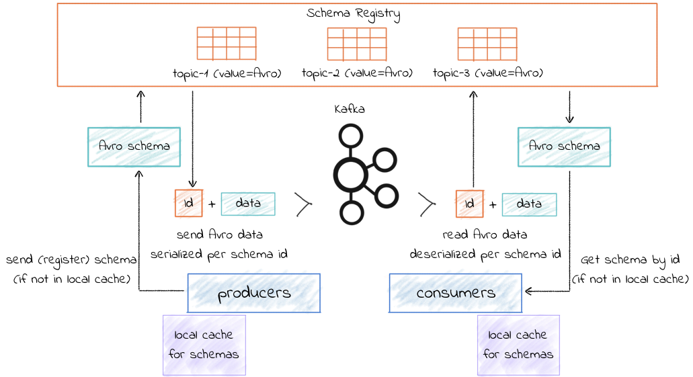

# Apache Avro

## Introduction

Here we explain the [Apache Avro](https://avro.apache.org/) messaging integration we have done in one of our integration tests for the **refarch-kc-container-ms** component, which is part of the [Reefer Containers reference implementation](https://ibm-cloud-architecture.github.io/refarch-kc/) of the [IBM Event Driven Architectures reference architecture](https://ibm-cloud-architecture.github.io/refarch-eda/). The Reefer Containers reference implementation is a simulation of what a container shipment process could look like in reality. From a manufacturer creating some goods to the delivery of those to a retailer, going through requesting a container, loading the goods into the container, finding a voyage for that container on a ship, monitoring the container's temperature and GPS location, delivering the container, unloading the goods, etc. As you can imagine, this scenario is ideal for an Event Driven architecture where we not only have a microservices based application but also the integration of these using Event Driven Architecture components (such as Kafka) and patterns (such as Saga, CQRS, Event Sourcing, etc).

### What is Apache Avro

Avro is an open source data serialization system that helps with data exchange between systems, programming languages, and processing frameworks. Avro helps define a binary format for your data, as well as map it to the programming language of your choice.

### Why Apache Avro

There are several websites that discuss the Apache Avro data serialization system benefits over other messaging data protocols. A simple google search will list dozens of them. Here, we will highlight just a few from a [confluent blog post](https://www.confluent.io/blog/avro-kafka-data/):

- It has a direct mapping to and from JSON
- It has a very compact format. The bulk of JSON, repeating every field name with every single record, is what makes JSON inefficient for high-volume usage.
- It is very fast.
- It has great bindings for a wide variety of programming languages so you can generate Java objects that make working with event data easier, but it does not require code generation so tools can be written generically for any data stream.
- It has a rich, extensible schema language defined in pure JSON
- It has the best notion of compatibility for evolving your data over time.

## Avro, Kafka and Schema Registry

Avro relies on schemas. When Avro data is produced or read, the Avro schema for such piece of data is always present. This permits each datum to be written with no per-value overheads, making serialization both fast and small. An Avro schema defines the structure of the Avro data format. Schema Registry defines a scope in which schemas can evolve, and that scope is the subject. The name of the subject depends on the configured subject name strategy, which by default is set to derive subject name from topic name.

In our case, this Avro data are messages (also called events) sent to a kafka topic. Each message is a key-value pair. Either the message key or the message value, or both, can be serialized as Avro. Integration with Schema Registry means that Kafka messages do not need to be written with the entire Avro schema. Instead, Kafka messages are written with the **schema id**. The producers writing the messages and the consumers reading the messages must be using the same Schema Registry to get the same mapping between a schema and schema id.

Kafka is used as Schema Registry storage backend. The special Kafka topic `<kafkastore.topic>` (default `_schemas`), with a single partition, is used as a highly available write ahead log. All schemas, subject/version and ID metadata, and compatibility settings are appended as messages to this log. A Schema Registry instance therefore both produces and consumes messages under the `_schemas` topic. It produces messages to the log when, for example, new schemas are registered under a subject, or when updates to compatibility settings are registered. Schema Registry consumes from the `_schemas` log in a background thread, and updates its local caches on consumption of each new `_schemas` message to reflect the newly added schema or compatibility setting. Updating local state from the Kafka log in this manner ensures durability, ordering, and easy recoverability.

### How does it all work



When the producer sends a message/event to a Kafka topic for the first time, it sends the schema for that message/event to the Schema Registry. The Schema Registry registers this schema to the subject for the Kafka topic we want to send the message/event to, and returns the **schema id** to the producer. The producer **caches this mapping between the schema and schema id** for subsequent message writes, so **it only contacts Schema Registry on the first message/event write** (unless the schema has changed, that is evolved, when the schema registry will be contacted again for validation and storage of this new version of the schema). Kafka messages are written along with the **schema id** rather than with the entire data schema.

When a consumer reads this data, it sees the **Avro schema id and sends a schema request to Schema Registry**. Schema Registry retrieves the schema associated to that schema id, and **returns the schema to the consumer**. The consumer **caches** this mapping between the schema and schema id for subsequent message reads, so it only contacts Schema Registry on the first schema id read.

## Our implementation

As mentioned in the introduction, the integration of the Apache Avro data serialization system has been done in one of the integration test for the `refarch-kc-container-ms` component of the [Reefer Containers reference implementation](https://ibm-cloud-architecture.github.io/refarch-kc/) of the [IBM Event Driven Architectures reference architecture](https://ibm-cloud-architecture.github.io/refarch-eda/).

The **refarch-kc-container-ms** component will take care of the containers status. From adding new containers to the available containers list to assigning a container to a particular order and managing the status of that container throughout the shipment process aforementioned. 

The integration tests for our Reefer Containers reference implementation can be found [here](https://github.com/ibm-cloud-architecture/refarch-kc/tree/master/itg-tests) (still under development). The integration tests are being developed in python and their main goal is to validate the successful deployment of the Reefer Containers reference implementation end-to-end.

The particular integration test (still under development) where we have integrated the Apache Avro serialization system can be found under the `ContainersPython` folder. More precisely, these are the files and folders involved in our implementation:

```shell
├── data_schemas
│   ├── container_event.avsc
│   ├── container_event_key.avsc
│   ├── container_event_payload.avsc
│   ├── container_event_type.avsc
│   ├── container_status.avsc
│   └── utils
│       └── avroEDAUtils.py
└── itg-tests
    ├── ContainersPython
    │   ├── ConsumeAvroContainers.py
    │   └── ContainerAvroProducer.py
    └── kafka
        ├── KcAvroConsumer.py
        └── KcAvroProducer.py
```

that will allow us to send **container events** into the **containers** Kafka topic and read from such topic.

By using these python scripts, we will be able to validate:

- Sending/Receiving **Apache Avro encoded messages**.
- **Apache Avro data schema definitions** for data correctness.
- **Schema Registry** for Apache Avro data schema management.

### Data Schemas

Avro schemas are defined with JSON. An example of a Container Event for creating a new container to the available list of containers for our reference application looks like:

```json
{
  "containerID": "container01",
  "timestamp": 1569410690,
  "type": "ContainerAdded",
  "payload": {
    "containerID": "container01",
    "type": "Reefer",
    "status": "Empty",
    "latitude": 37.8,
    "longitude": -122.25,
    "capacity": 110,
    "brand": "itg-brand"
  }
}
```

An Avro schema could be a nested schema which allows us to have a smaller reusable data schemas to define bigger and more complex ones. This is the case for our Container Event data schema. For instance, the payload is defined on its own data schema (`container_event_payload.avsc`) which the Container Event data schema refers to:

```json
{
  "namespace": "ibm.eda.kc.container.event",
  "name": "payload",
  "type": "record",
  "fields": [
    {
      "name": "containerID",
      "type": "string"
    },
    {
      "name": "type",
      "type": "string"
    },
    {
      "name": "status",
      "type": "ibm.eda.kc.container.status"
    },
    {
      "name": "latitude",
      "type": "float"
    },
    {
      "name": "longitude",
      "type": "float"
    },
    {
      "name": "capacity",
      "type": "int"
    },
    {
      "name": "brand",
      "type": "string"
    }
  ]
}
```

As you can see, the status attribute of the payload is yet another data schema itself which, in this case, is of type enum:

```json
{
  "namespace": "ibm.eda.kc.container",
  "name": "status",
  "type": "enum",
  "symbols": [
    "Loaded",
    "Empty",
    "Unassignable",
    "PartiallyLoaded"
  ]
}
```

All the different data schemas for a Container Event can be found under the `data_schemas` folder.

In that folder we have also developed a util script (`avroEDAUtils.py`) to be able to construct the final Container Event data schema that is needed by our producer:

```python
def getContainerEventSchema(schema_files_location):
  # Read all the schemas needed in order to produce the final Container Event Schema
  known_schemas = avro.schema.Names()
  container_status_schema = LoadAvsc(schema_files_location + "container_status.avsc", known_schemas)
  container_event_payload_schema = LoadAvsc(schema_files_location + "container_event_payload.avsc", known_schemas)
  container_event_type_schema = LoadAvsc(schema_files_location + "container_event_type.avsc", known_schemas)
  container_event_schema = LoadAvsc(schema_files_location + "container_event.avsc", known_schemas)
  return container_event_schema

def LoadAvsc(file_path, names=None):
  # Load avsc file
  # file_path: path to schema file
  # names(optional): avro.schema.Names object
  file_text = open(file_path).read()
  json_data = json.loads(file_text)
  schema = avro.schema.SchemaFromJSONData(json_data, names)
  return schema
```

#### See it in action

Here, we are going to see how data schemas help with data correctness. Using the payload for our container messages/events as the example, this is the output of a correct message being sent:

```
--- Container event to be published: ---
{
  "containerID": "container01",
  "type": "Reefer",
  "status": "Empty",
  "latitude": 37.8,
  "longitude": -122.25,
  "capacity": 110,
  "brand": "itg-brand"
}

Message delivered to containers [0]
```

However, if we try to send a payload where, for instance the container ID is an integer rather than a string, we will get an `avro.io.AvroTypeException`:

```
avro.io.AvroTypeException: The datum {'containerID': 12345, 'type': 'Reefer', 'status': 'Empty', 'latitude': 37.8, 'longitude': -122.25, 'capacity': 110, 'brand': 'itg-brand'} is not an example of the schema
{
    "type": {
        "type": "record",
        "name": "payload",
        "namespace": "ibm.eda.kc.container.event",
        "fields": [
          {
            "type": "string",
            "name": "containerID"
          },
          {
            "type": "string",
            "name": "type"
          },
          {
            "type": {
              "type": "enum",
              "name": "status",
              "namespace": "ibm.eda.kc.container",
              "symbols": [
                "Loaded",
                "Empty",
                "Unassignable",
                "PartiallyLoaded"
              ]
            },
            "name": "status"
          },
          {
            "type": "float",
            "name": "latitude"
          },
          {
            "type": "float",
            "name": "longitude"
          },
          {
            "type": "int",
            "name": "capacity"
          },
          {
            "type": "string",
            "name": "brand"
          }
        ]
      }
```

### Producer and Consumer

The python scripts developed to implement a producer and consumer to a kafka topic that sends Avro messages whose data schemas are managed by a schema registry are:

```shell
└── itg-tests
    ├── ContainersPython
    │   ├── ConsumeAvroContainers.py
    │   └── ContainerAvroProducer.py
    └── kafka
        ├── KcAvroConsumer.py
        └── KcAvroProducer.py
```

We have used the **confluent_kafka avro libraries** to implement our producer and consumer.

```python
from confluent_kafka.avro import AvroProducer, AvroConsumer
```

#### Producer

We create our `KafkaProducer` object where we define some of the **AvroProducer** options such as the schema registry url for data schema registration and management. But it is not until we call the `prepareProducer` method that we actually create the **AvroProducer** with that **schema registry** to be used as well as the **data schemas for the key and value** of our Container Event to be sent.

Finally, in the `publishEvent` method we send a value plus a key to a kafka topic.

producer when we call `prepareProducer`

```python
import json
from confluent_kafka import KafkaError
from confluent_kafka.avro import AvroProducer

class KafkaProducer:

    def __init__(self,kafka_brokers = "",kafka_apikey = "",schema_registry_url = ""):
        self.kafka_brokers = kafka_brokers
        self.kafka_apikey = kafka_apikey
        self.schema_registry_url = schema_registry_url

    def prepareProducer(self,groupID = "pythonproducers",key_schema = "", value_schema = ""):
        options ={
                'bootstrap.servers':  self.kafka_brokers,
                'schema.registry.url': self.schema_registry_url,
                'group.id': groupID
        }
        self.producer = AvroProducer(options,default_key_schema=key_schema,default_value_schema=value_schema)

    def publishEvent(self, topicName, value, key):
        # Important: value DOES NOT come in JSON format from ContainerAvroProducer.py. Therefore, we must convert it to JSON format first
        self.producer.produce(topic=topicName,value=json.loads(value),key=json.loads(value)[key], callback=self.delivery_report)
        self.producer.flush()
```

#### Consumer

Similarly to the producer, when we create a `KafkaConsumer` object we are just setting some of its attributes such as the kafka topic we will listen to and the schema registry url the producer will retrieve the data schemas from based on the schema ids messages comes with. It is only when we call the `prepareConsumer` method that we actually create the **AvroConsumer** and subscribe it to the intended kafka topic.

```python
import json
from confluent_kafka.avro import AvroConsumer

class KafkaConsumer:

    def __init__(self, kafka_brokers = "", kafka_apikey = "", topic_name = "", schema_registry_url = ""):
        self.kafka_brokers = kafka_brokers
        self.kafka_apikey = kafka_apikey
        self.topic_name = topic_name
        self.schema_registry_url = schema_registry_url 

    def prepareConsumer(self, groupID = "pythonconsumers"):
        options ={
                'bootstrap.servers':  self.kafka_brokers,
                'group.id': groupID,
                'auto.offset.reset': 'earliest',
                'schema.registry.url': self.schema_registry_url,
        }
        self.consumer = AvroConsumer(options)
        self.consumer.subscribe([self.topic_name])

    def pollNextEvent(self, keyID, keyname):
        return msg = self.consumer.poll(timeout=10.0)

    def close(self):
        self.consumer.close()
```

### Schema registry

For now, we have used the [confluent schema registry](https://hub.docker.com/r/confluentinc/cp-schema-registry/) for our work although our goal is to use **IBM Event Streams**.

The integration of the schema registry with your kafka broker is quite easy. In fact, all you need is to provide the schema registry with your zookeeper cluster url and give your schema registry a hostname: https://docs.confluent.io/current/installation/docker/config-reference.html#schema-registry-configuration

Once you have your schema registry up and running, this provides a rich API endpoint to operate with: https://docs.confluent.io/current/schema-registry/using.html#common-sr-usage-examples

For example:

Let's assume we have created a new kafka topic called `avrotest` for testing our work. And let's also assume we are sending persona messages/events whose data schema is the following:

```json
{
    "namespace": "avro.test",
    "name": "persona",
    "type": "record",
    "fields" : [
        {
            "name" : "name",
            "type" : "string"
        },
        {
            "name" : "age",
            "type" : "int"
        },
        {
            "name" : "gender",
            "type" : "string"
        }
    ]
 }
```

- Get the **subjects** (that is, the kafka topics to which we have a schema registered against. As explained before, we either have registered the schema manually ourselves or the Avro producer has registered it when we have sent the first message)

  ```http
  curl -X GET http://localhost:8081/subjects

  ["avrotest-value","avrotest-key"]
  ```

- Get versions for a subject:

  ```http
  curl -X GET http://localhost:8081/subjects/avrotest-value/versions

  [1]
  ```

- Get a specific version:

  ```http
  curl -X GET http://localhost:8081/subjects/avrotest-value/versions/1/

  {
    "subject": "avrotest-value",
    "version": 1,
    "id": 1,
    "schema": "{\"type\":\"record\",\"name\":\"persona\",\"namespace\":\"avro.test\",\"fields\":[{\"name\":\"name\",\"type\":\"string\"},{\"name\":\"age\",\"type\":\"int\"},{\"name\":\"gender\",\"type\":\"string\"}]}"
  }
  ```

- Get the schema of a specific subject version:

  ```http
  curl -X GET http://localhost:8081/subjects/avrotest-value/versions/1/schema

  {
    "type": "record",
    "name": "persona",
    "namespace": "avro.test",
    "fields": [
      {
        "name": "name",
        "type": "string"
      },
      {
        "name": "age",
        "type": "int"
      },
      {
        "name": "gender",
        "type": "string"
      }
    ]
  }
  ```

- Get the schema of a specific subject latest version:

  ```http
  curl -X GET http://localhost:8081/subjects/avrotest-value/versions/latest/schema

  {
    "type": "record",
    "name": "persona",
    "namespace": "avro.test",
    "fields": [
      {
        "name": "name",
        "type": "string"
      },
      {
        "name": "age",
        "type": "int"
      },
      {
        "name": "gender",
        "type": "string"
      }
    ]
  }
  ```

The above looks very good but let's dive into more interesting real-case scenarios.

1. Sending a correct message:

   ```
   --- Persona event to be published: ---
   {'name': 'david', 'age': 25, 'gender': 'male'}
   ----------------------------------------
   Message delivered to avrotest [0]
   ```

2. What happens if I send incorrect data types in my message/event, for instance sending the age as a string rather than as an integer (already seen in the data schema section but take it as a refresher)?:

    ```
    avro.io.AvroTypeException: The datum {'name': 'david', 'age': '25', 'gender': 'male'} is not an example of the schema {
      "type": "record",
      "name": "persona",
      "namespace": "avro.test",
      "fields": [
        {
          "type": "string",
          "name": "name"
        },
        {
          "type": "int",
          "name": "age"
        },
        {
          "type": "string",
          "name": "gender"
        }
      ]
    }
    ```
  
    We see that the Avro Producer will give us an `avro.io.AvroTypeException` error.

3. What if we decide to change the data schema to add a new attribute such as place of birth?

   that is,
   
   ```json
   {
       "namespace": "avro.test",
       "name": "persona",
       "type": "record",
       "fields" : [
           {
               "name" : "name",
               "type" : "string"
           },
           {
               "name" : "age",
               "type" : "int"
           },
           {
               "name" : "gender",
               "type" : "string"
           },
           {
               "name" : "place_of_birth",
               "type" : "string"
           }
       ]
    }
   ```
   and here is what we get
   
   ```
   --- Persona event to be published: ---
   {'name': 'david', 'age': '25', 'gender': 'male', 'place_of_birth': 'USA'}
   ----------------------------------------
   Traceback (most recent call last):
     File "ContainerAvroProducer.py", line 73, in <module>
       kp.publishEvent(TOPIC_NAME,container_event,"1")
     File "/home/kafka/KcAvroProducer.py", line 42, in publishEvent
       self.producer.produce(topic=topicName,value=json.loads(value),key=json.loads(key), callback=self.delivery_report)
     File "/root/.local/lib/python3.7/site-packages/confluent_kafka/avro/__init__.py", line 80, in produce
       value = self._serializer.encode_record_with_schema(topic, value_schema, value)
     File "/root/.local/lib/python3.7/site-packages/confluent_kafka/avro/serializer/message_serializer.py", line 105, in encode_record_with_schema
       schema_id = self.registry_client.register(subject, schema)
     File "/root/.local/lib/python3.7/site-packages/confluent_kafka/avro/cached_schema_registry_client.py", line 223, in register
       raise ClientError("Invalid Avro schema:" + str(code))
   confluent_kafka.avro.error.ClientError: Invalid Avro schema:422
   ```
   
   We see we get an `Invalid Avro schema` error because Avro data schema not only validates the data being sent complies with the schema registered for a particular Kafka topic/subject but it also validates schema evolution. That is, based on the [compatibility type configured](https://docs.confluent.io/current/schema-registry/avro.html), a new schema version might be compatible or not.
   
   In this case, because the compatibility set for schema evolution is _BACKWARD_ we can't just simply add a new attribute (since consumers using the new schema must be able to read data produced with the last schema).
   
   ```http
   curl -X POST -H "Content-Type: application/vnd.schemaregistry.v1+json" --data '{"schema": "{\"type\":\"record\",\"name\":\"persona\",\"namespace\":\"avro.test\",\"fields\":[{\"name\":\"name\",\"type\":\"string\"},{\"name\":\"age\",\"type\":\"int\"},{\"name\":\"gender\",\"type\":\"string\"},{\"name\":\"place_of_birth\",\"type\":\"string\"}]}"}' http://localhost:8081/compatibility/subjects/avrotest-value/versions/latest
   
   {"is_compatible":false}
   ```
   
   How do we evolve our schema to add new attributes in a wat that the schema is _BACKWARD_ compatible? Adding a **default** for such attribute:
   
   ```json
   {
       "namespace": "avro.test",
       "name": "persona",
       "type": "record",
       "fields" : [
           {
               "name" : "name",
               "type" : "string"
           },
           {
               "name" : "age",
               "type" : "int"
           },
           {
               "name" : "gender",
               "type" : "string"
           },
           {
               "name" : "place_of_birth",
               "type" : "string",
               "default": "nonDefined"
           }
       ]
    }
   ```
   
   Rather than changing it straight in my code, I want first to do some sort of validation:
   
   ```http
   curl -X POST -H "Content-Type: application/vnd.schemaregistry.v1+json" --data '{"schema": "{\"type\":\"record\",\"name\":\"persona\",\"namespace\":\"avro.test\",\"fields\":[{\"name\":\"name\",\"type\":\"string\"},{\"name\":\"age\",\"type\":\"int\"},{\"name\":\"gender\",\"type\":\"string\"},{\"name\":\"place_of_birth\",\"type\":\"string\", \"default\":\"nonDefined\"}]}"}' http://localhost:8081/compatibility/subjects/avrotest-value/versions/latest
   
   {"is_compatible":true}
   ```
   
   So we see that adding a default value of "nonDefined" to the "place_of_birth" attribute makes our new schema _BACKWARD_ compatible. That is, will make our old persona events/messages compatible when a consumer reads them with the new schema.
   
   Then, by sending a new persona event/message the Avro producer will register our new schema which we can now validate using the schema registry API endpoint:
   
   ```http
   
   curl -X GET http://localhost:8081/subjects/avrotest-value/versions
   
   [1,2]
   
   curl -X GET http://localhost:8081/subjects/avrotest-value/versions/latest/schema
   
   {"type":"record","name":"persona","namespace":"avro.test","fields":[{"name":"name","type":"string"},{"name":"age","type":"int"},{"name":"gender","type":"string"},{"name":"place_of_birth","type":"string","default":"nonDefined"}]}
   ```

4. What if we want to remove an attribute from our persona events/messages now? Well, this one is easy since the Avro consumer will simply ignore/drop all those attributes in the persona events/messages that are not defined in the new data schema and just take in those that are defined.

   Let's try to remove the `gender` attribute:
   
   ```http
   curl -X POST -H "Content-Type: application/vnd.schemaregistry.v1+json" --data '{"schema": "{\"type\":\"record\",\"name\":\"persona\",\"namespace\":\"avro.test\",\"fields\":[{\"name\":\"name\",\"type\":\"string\"},{\"name\":\"age\",\"type\":\"int\"},{\"name\":\"place_of_birth\",\"type\":\"string\", \"default\":\"nonDefined\"}]}"}' http://localhost:8081/compatibility/subjects/avrotest-value/versions/latest
   
   {"is_compatible":true}
   ```

5. How about removing an attribute when the compatibility type configured is set to _FORWARD_ (data produced with a new schema can be read by consumers using the last schema)? In this case, it is not as simple as removing the attribute from the new schema as the consumer will expect such attribute the producer will not add to the events/messages.


   First, let's set the compatibility type to _FORWARD_:
   
   ```http
   curl -X PUT -H "Content-Type: application/vnd.schemaregistry.v1+json" --data '{"compatibility": "FORWARD"}' http://localhost:8081/config
   
   {"compatibility":"FORWARD"}
   
   ```
   
   ```http
   curl -X GET http://localhost:8081/config
   
   {"compatibilityLevel":"FORWARD"}
   ```
   
   Now, let's try to remove the gender attribute from the persona messages/events:
   
   ```http
   curl -X POST -H "Content-Type: application/vnd.schemaregistry.v1+json" --data '{"schema": "{\"type\":\"record\",\"name\":\"persona\",\"namespace\":\"avro.test\",\"fields\":[{\"name\":\"name\",\"type\":\"string\"},{\"name\":\"age\",\"type\":\"int\"},{\"name\":\"place_of_birth\",\"type\":\"string\", \"default\":\"nonDefined\"}]}"}' http://localhost:8081/compatibility/subjects/avrotest-value/versions/latest
   
   {"is_compatible":false}
   ```
   
   So, how can we produce new persona events/messages (which do not include the gender attribute) that are compatible with the last data schema used by consumers (that expects an attribute called gender)?
   
   The trick here is to first register an "intermediate" schema that adds a default value to gender if it is not defined. This way, the "intermediate" schema will become the last schema for the consumers and when we producer sent messages that do not contain the gender attribute, the consumer will know what to do:
   
   Intermediate schema:
   
   ```http
   curl -X POST -H "Content-Type: application/vnd.schemaregistry.v1+json" --data '{"schema": "{\"type\":\"record\",\"name\":\"persona\",\"namespace\":\"avro.test\",\"fields\":[{\"name\":\"name\",\"type\":\"string\"},{\"name\":\"age\",\"type\":\"int\"},{\"name\":\"gender\",\"type\": \"string\",\"default\": \"nonProvided\"},{\"name\":\"place_of_birth\",\"type\":\"string\", \"default\":\"nonDefined\"}]}"}' http://localhost:8081/compatibility/subjects/avrotest-value/versions/latest
   
   {"is_compatible":true}
   ```
   
   New schema:
   
   ```http
   curl -X POST -H "Content-Type: application/vnd.schemaregistry.v1+json" --data '{"schema": "{\"type\":\"record\",\"name\":\"persona\",\"namespace\":\"avro.test\",\"fields\":[{\"name\":\"name\",\"type\":\"string\"},{\"name\":\"age\",\"type\":\"int\"},{\"name\":\"place_of_birth\",\"type\":\"string\", \"default\":\"nonDefined\"}]}"}' http://localhost:8081/compatibility/subjects/avrotest-value/versions/latest
   
   {"is_compatible":true}
   ```
   
   If we send a persona message that does not contain the gender attribute now, we should succeed:
   
   ```
   --- Container event to be published: ---
   {'name': 'david', 'age': 25, 'place_of_birth': 'USA'}
   ----------------------------------------
   Message delivered to avrotest [0]
   ```

As you can imagine, there are few other cases to play with given the changes you could make to a data schema in conjunction with the compatibility types you can configure your schema registry to be like but we have already covered the basics for a good understanding.

## Links

Here are some links we have visited to carry out our work and found interesting:

https://www.confluent.io/blog/avro-kafka-data/

https://avro.apache.org/docs/current/

https://docs.confluent.io/current/schema-registry/index.html

https://docs.confluent.io/current/schema-registry/schema_registry_tutorial.html#schema-registry-tutorial-definition

https://docs.oracle.com/database/nosql-11.2.2.0/GettingStartedGuide/schemaevolution.html