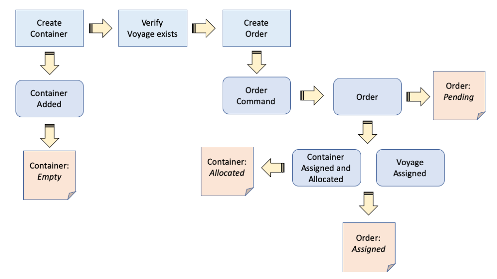
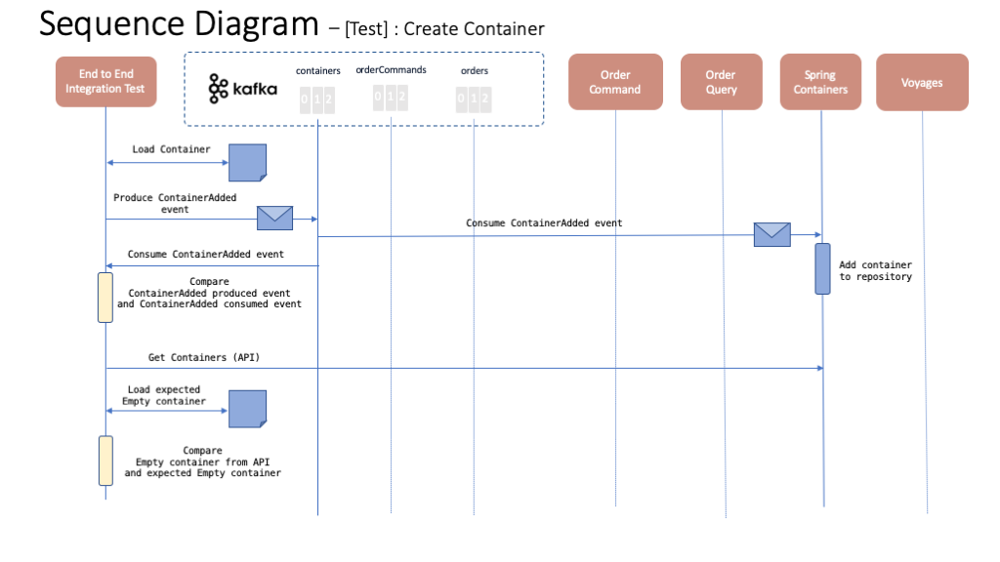
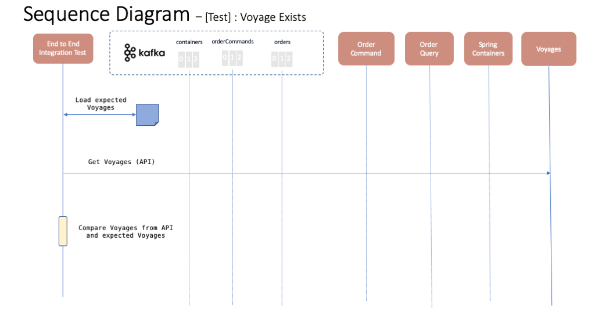
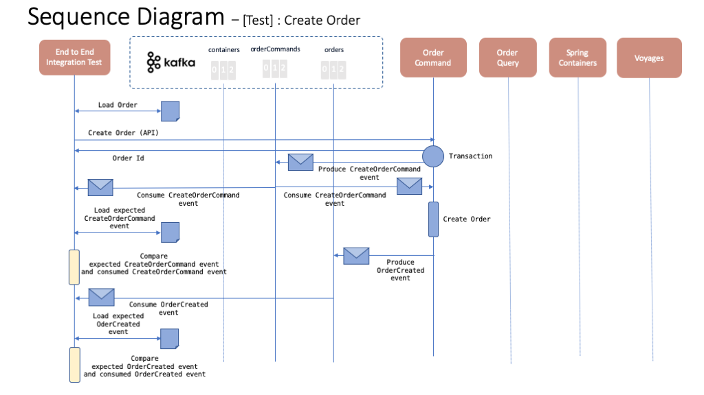
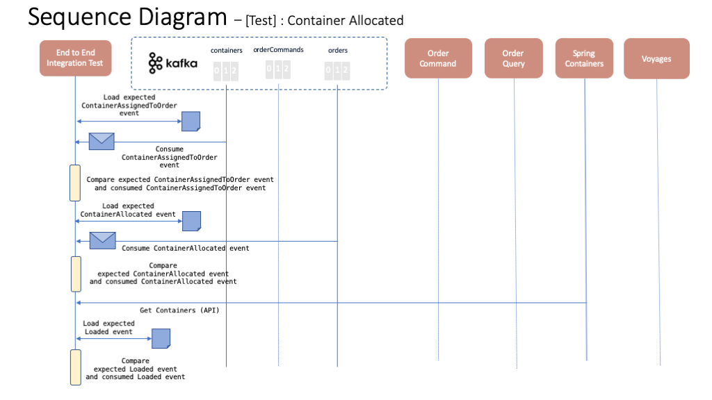
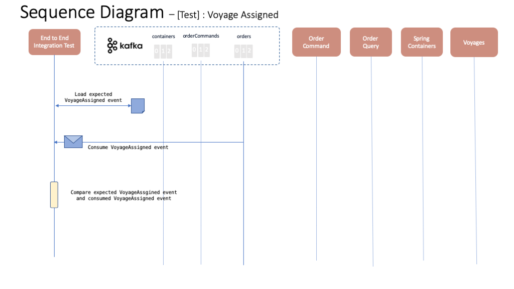
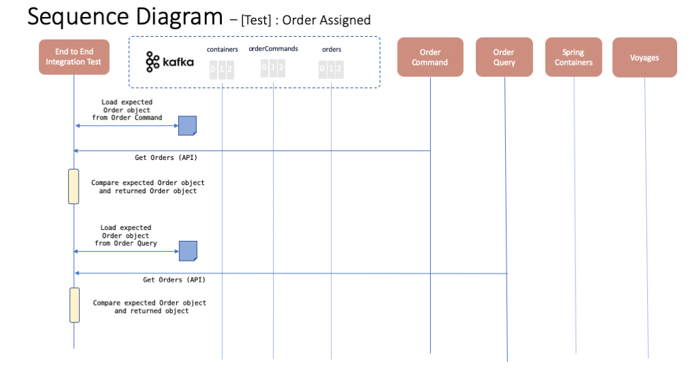

# Happy Path integration test case

Here you can find the so called "happy path" integration test for the Reefer Containers EDA reference implementation. This test case tests the expected happy path for the application where a new order is created, the order gets a container and a voyage assigned and this new order becomes an assigned order. The following diagram depics roughly this path on a flow base fashion where the blue square rectangles, purple rounded rectangles and orange rectangles represent actions taken by the test case, events produced to the event backbone (either Kafka or IBM Event Streams) and object statuses respectively.

The idea behind this integration test case is to be used as a validation for any new deployment of the Reefer Containers EDA reference implementation. This test case is intended to be extended along with the creation of other tests cases to verify other scenarios or edge cases.

## Tests

The following sequence diagrams represent each of the tests within this happy path integration test case.

### Test 1 - Create container

This tests will make sure that a container with the appropriate capacity and location for the expected new order to be created exists.

### Test 2 - Voyages exist

This test will make sure the expected voyages exist.

### Test 3 - Create order

This test will make sure that the expected new order event is created along with a new order command event.

### Test 4 - Container Allocated

This test will make sure that the expected container is assigned to the new order.

### Test 5 - Voyage Assigned

This test will make sure that the expected voyage is assigned to the new order.

### Test 6 - Order Assigned

This test will make sure that the resulting order is as expected. That is, it transitions to the assigned status and has a container and voyage assigned to it.

