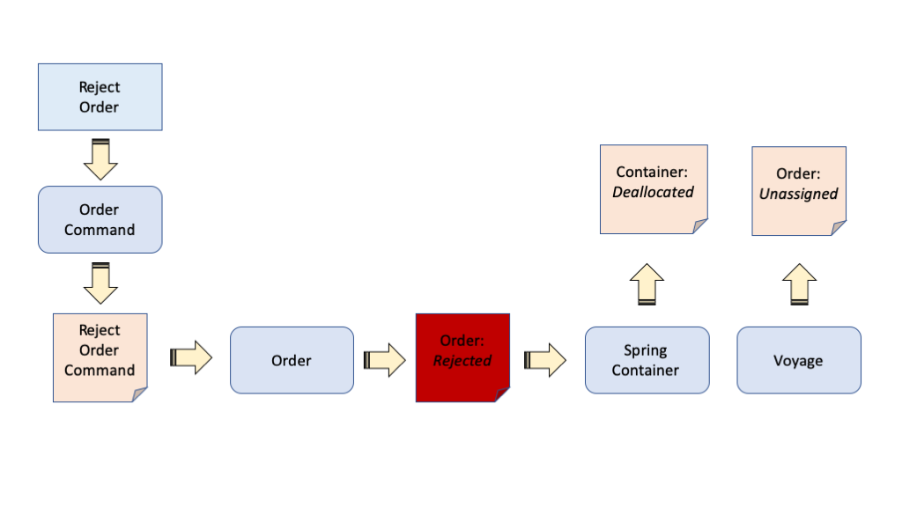
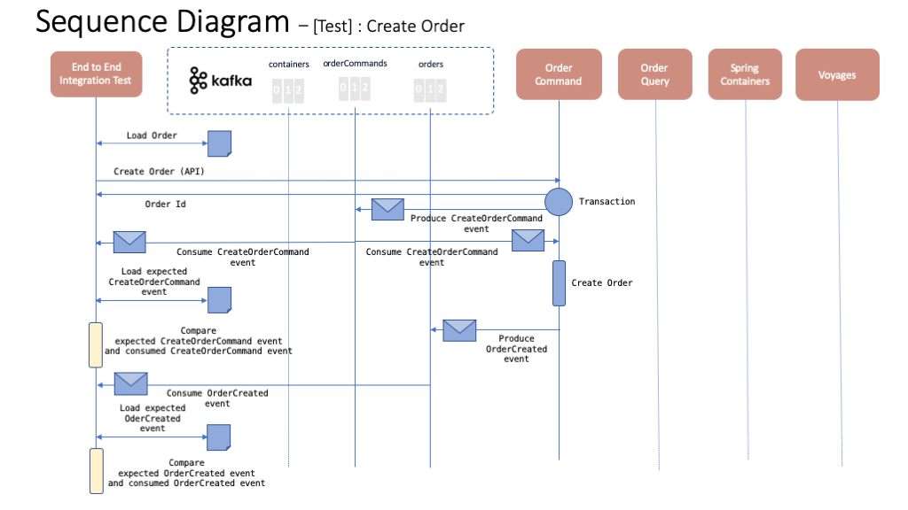
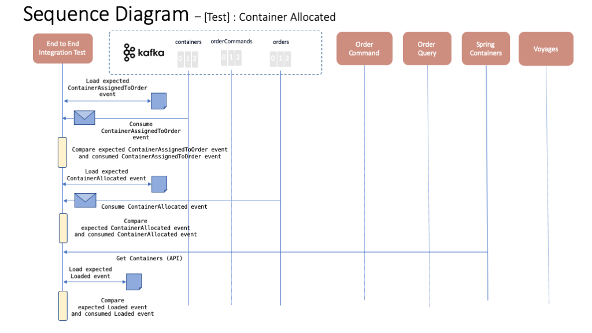
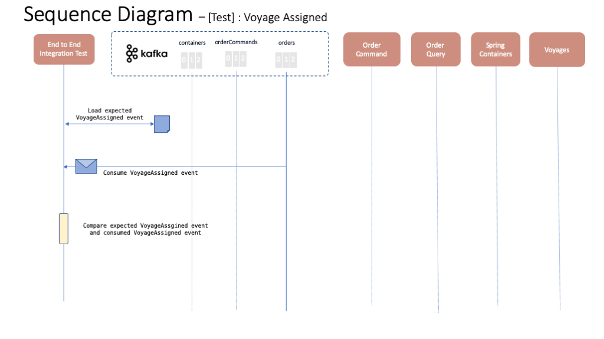
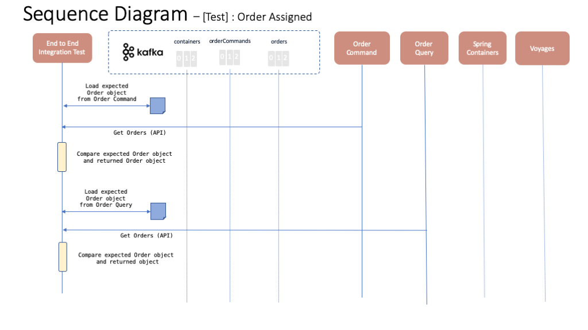
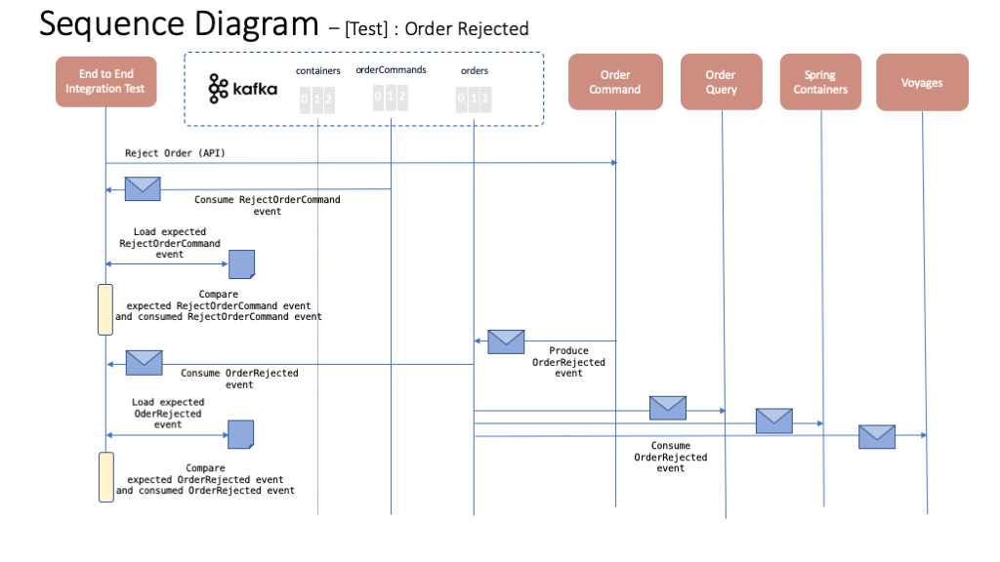
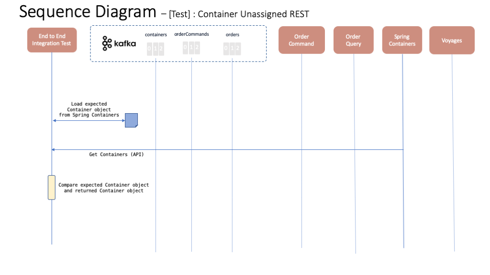
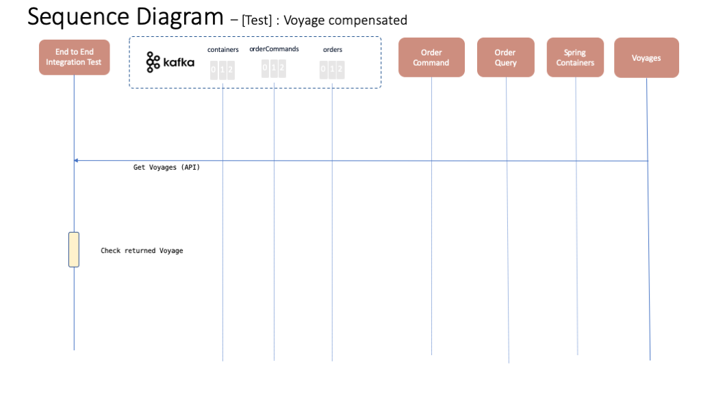

# Order Rejection integration test case

Here you can find the order rejection integration test for the Reefer Containers EDA reference implementation. This test case tests the compensation process that must happen once an order is rejected. That is, if an order is rejected, the container allocated to such order must become empty and available again as well as the voyage assigned to them that will now reflect the space the container was taking from the voyage as free to be used. The following diagram depics roughly this path on a flow base fashion where the blue square rectangles, purple rounded rectangles and orange rectangles represent actions taken by the test case, events produced to the event backbone (either Kafka or IBM Event Streams) and object statuses respectively.

## Tests

The following sequence diagrams represent each of the tests within this order rejection integration test case.

### Test 1 - Create order

This test will make sure that a CreateOrderCommand event is created and delivered to the appropriate kafka topic and, as a result, a new order with the correspondent events are also created.

### Test 2 - Container Allocated

This test will make sure that the expected container is assigned to the new order.

### Test 3 - Voyage Assigned

This test will make sure that the expected voyage is assigned to the new order.

### Test 4 - Order Assigned

This test will make sure that the resulting order is as expected. That is, it transitions to the assigned status and has a container and voyage assigned to it.

### Test 5 - Order Rejected

This test will ensure that once the reject order API is called, the appropriate RejectOrderCommand event is created so that the order is eventually rejected as a result.

### Test 6 - Order Rejected REST

This tests will use the Order Command microservice's and Order Query microservice's API endpoints to ensure the order is eventually rejected as expected.

### Test 7 - Container Unassigned REST

This test will ensure the compensation process for the Containers microservice is properly executed so that the container previously allocated to the order is now empty and available to be used.

### Test 8 - Voyage Compensated

This test will ensure the compensation process for the Voyage microservice is properly executed so that the voyage previously assigned to the order now reflects that space the container for such order was taking is available to be used.

