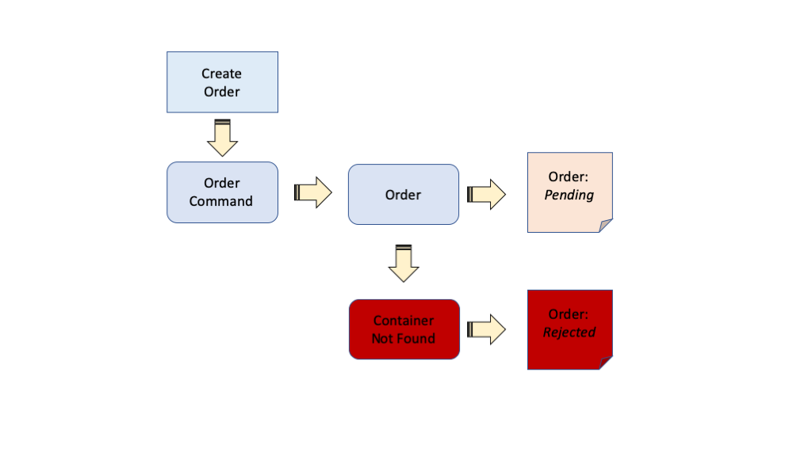
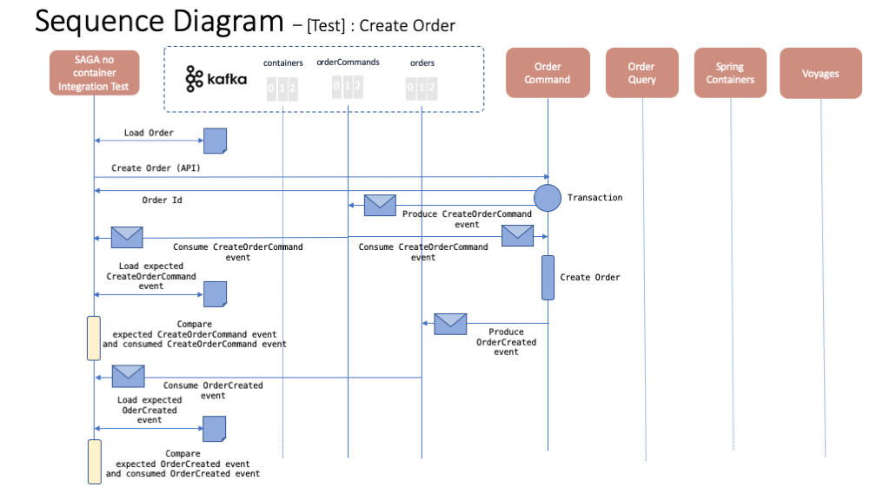
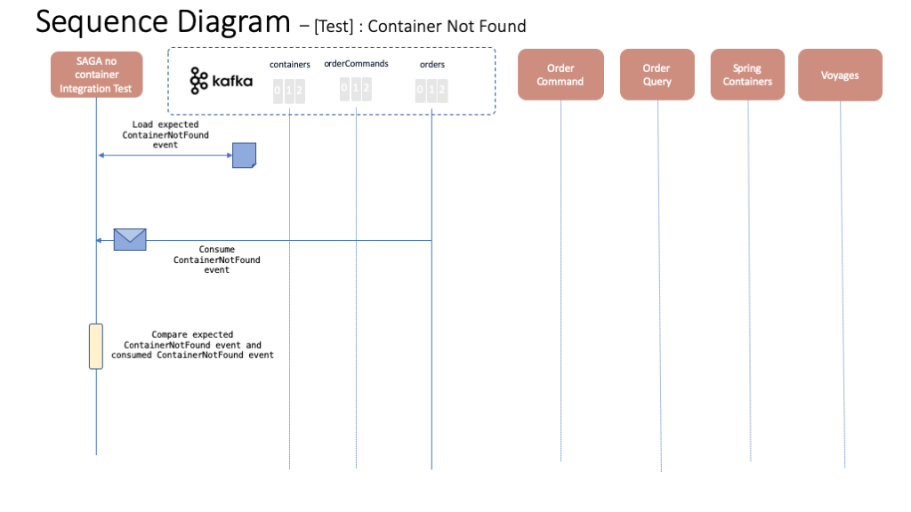
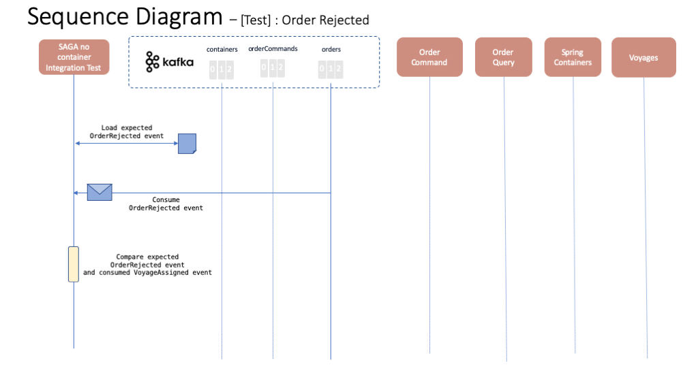
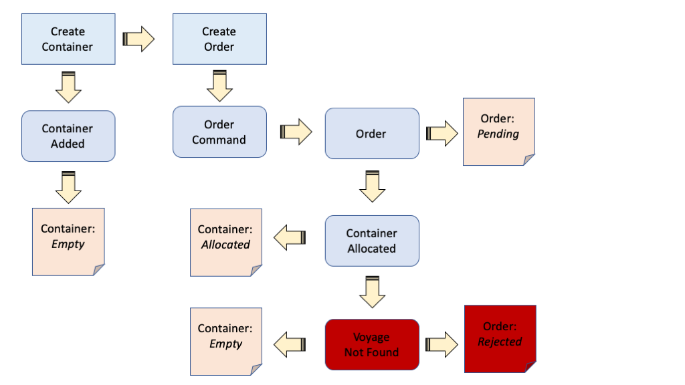
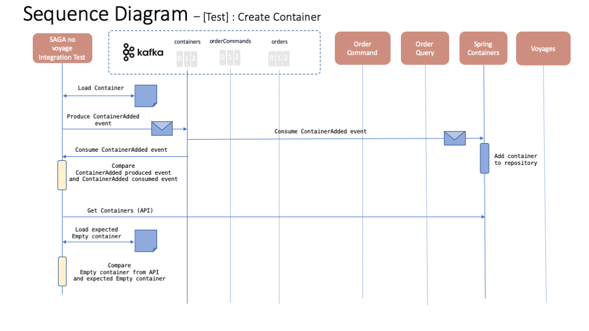
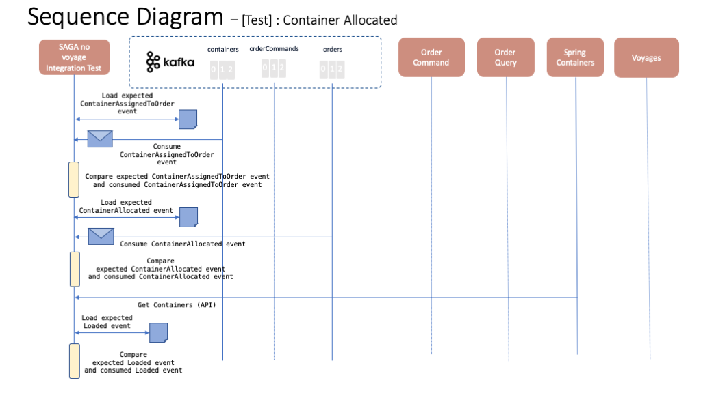
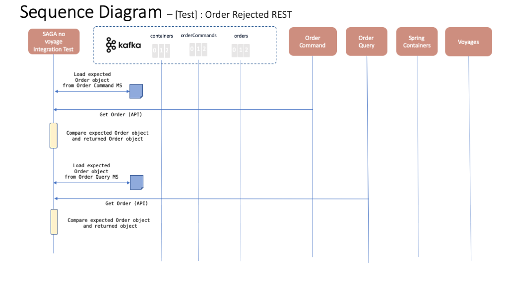

# SAGA pattern integration test case

Here you can find two test cases to test the SAGA pattern implemented for our Reefer Container EDA reference application. These test cases verify a new order creation does not get into assigned state unless a container and a voyage are allocated and assigned to it. These test cases are meant to be executed after the [happy path test case](../happy-path/happy_path.md). Since the case that a container is allocated and a voyage assigned to an newly created order is tested previously by our happy path test case, in these test cases we're actually testing the behavior when either a container or  a voyage does not exist for the order.

## SAGA pattern - no container

This test case will ensure that the SAGA pattern for our EDA application works as expected by setting the newly created order to **rejected** as a result of not finding a suitable container available for the order. The following diagram depics roughly this case on a flow base fashion where the blue square rectangles, purple rounded rectangles and orange rectangles represent actions taken by the test case, events produced to the event backbone (either Kafka or IBM Event Streams) and object statuses respectively.

The following sequence diagrams represent each of the tests within this SAGA pattern - no container integration test case.

### Test 1 - No Container - Create order

This test will make sure that the expected CreateOrderCommand event to create an order is delivered into the order-commands topic after the Create Order API endpoint is called. It will also ensure that an OrderCreated event is also delivered into the orders topic.

### Test 2 - No Container - Container Not Found

This test will make sure that the expected ContainerNotFound event is delivered into the orders topic once the Spring Container microservice could not find a container suitable for the order available.

### Test 3 - No Container - Order Rejected

This test will make sure that the expected OrderRejected event is delivered into the orders topic after the Order Command microservice received the ContainerNotFound event.

### Test 4 - No Container - Order Rejected REST

This test will make sure that the order is set to **rejected** through the Order Command and Order Query microservices.

## SAGA pattern - no voyage

This test case will ensure that the SAGA pattern for our EDA application works as expected by setting the newly created order to **rejected** as a result of not finding a suitable voyage available for the order. The following diagram depics roughly this case on a flow base fashion where the blue square rectangles, purple rounded rectangles and orange rectangles represent actions taken by the test case, events produced to the event backbone (either Kafka or IBM Event Streams) and object statuses respectively.

The following sequence diagrams represent each of the tests within this SAGA pattern - no voyage integration test case.

### Test 1 - No Voyage - Create container

This test will make sure that the expected ContainerAdded event to create a new container is delivered into the containers topic. It will then make sure the container is properly created through the Spring Container API endpoints.

### Test 2 - No Voyage - Create order

This test will make sure that the expected CreateOrderCommand event to create an order is delivered into the order-commands topic after the Create Order API endpoint is called. It will also ensure that an OrderCreated event is also delivered into the orders topic.

### Test 3 - No Voyage - Container Allocated

This test will make sure that the expected ContainerAssignedToOrder event is delivered into the containers topic as well as the expected ContainerAllocated event is delivered into the orders topic. It will then verify the container state is as expected through the Spring Container API endpoint.

### Test 4 - No Voyage - Voyage Not Found

This test will make sure that the expected VoyageNotFound event is delivered into the orders topic.

### Test 5 - No Voyage - Order Rejected

This test will make sure that the expected OrderRejected event is delivered into the orders topic after the Order Command microservice received the ContainerNotFound event.

### Test 6 - No Voyage - Order Rejected REST

This test will make sure that the order is set to **rejected** through the Order Command and Order Query microservices.

