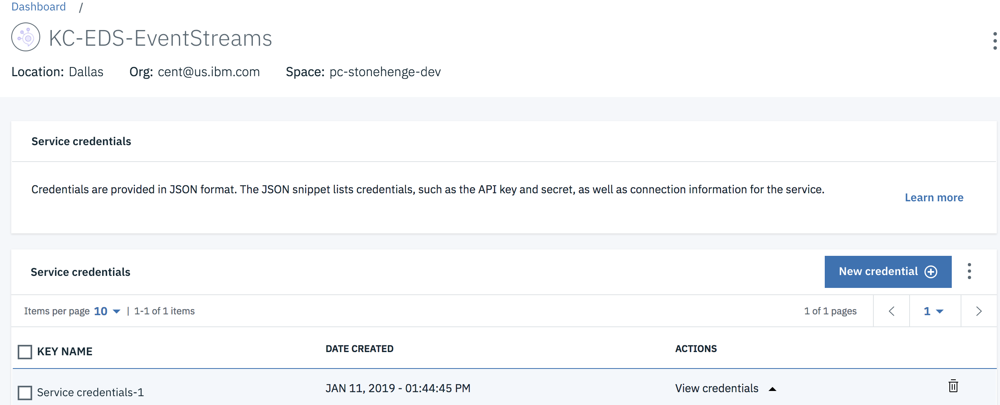

# Prepare IBM Cloud Services to run the solution

IBM Cloud offers a set of services to run part of your event driven architecture. We are using the following services:
* [Kubernetes Service](https://console.bluemix.net/containers-kubernetes/catalog/cluster)
* [Streaming Analytics Service](https://cloud.ibm.com/catalog/services/streaming-analytics)

## Pre-requisites

* Create an account on [IBM Cloud](https://cloud.ibm.com).
* Install the following CLIs:
    * [IBM Cloud CLI](https://cloud.ibm.com/docs/cli/reference/ibmcloud/download_cli.html#install_use)
    * IBM Cloud Kubernetes Service [plug-in](https://cloud.ibm.com/docs/cli/reference/ibmcloud/extend_cli.html#plug-ins)
    ```
    $ ibmcloud plugin install container-service -r Bluemix
    ```
    * [Kubernetes CLI](https://kubernetes.io/docs/tasks/tools/install-kubectl/)
    * IBM Cloud Container Registry plug-in
    ```
    $ ibmcloud plugin install container-registry -r Bluemix
    ```

All our docker images for this solution are in public docker registry: dockerhub under ibmcase.

## Kubernetes Cluster Service

To create the cluster follow [this tutorial](https://console.bluemix.net/docs/containers/cs_tutorials.html#cs_cluster_tutorial).

Here is an image of our cluster, with 3 nodes and the smallest configuration:

 

To access to the cluster:
```
ibmcloud login -a https://api.us-east.bluemix.net
```

Set the KUBECONFIG environment variable.

To set the cluster config to your cluster use: `ibmcloud ks cluster-config <cluster_name_or_ID>`

Create a namespace: `kubectl create namespace browncompute`

Now for each component, microservice or cloud function, we are deploying as part of this solution, we have its helm chart or scripts to deploy to IKS.

##  Event Streams Service on IBM Cloud

To provision your service, go to the IBM Cloud Catalog and search for `Event Streams`. It is in the Integration category. Create the service and specify a name, a region, and a space. 

* In the service credentials create new credentials to get the Kafka brokers list, the admim URL and the api_key needed to authenticate the consumers or producers.
 
* In the Manage panel add the topics needed for the solution. 
  
* Modify the Broker and APIkey configuration for each service of the solution. See each project for that:
  * For the `Ship / Fleet microservice and simulator` see the [config.properties](https://github.com/ibm-cloud-architecture/refarch-kc-ms/blob/master/fleet-ms/src/main/resources/config.properties.tmpl) file. Then repackage with `mvn package`


## Streaming Analytics Service

The documentation located [here](https://github.com/ibm-cloud-architecture/refarch-kc-streams#application-development-and-deployment) describes how to configure the IBM Cloud based Streaming Analytics Service and how to build/deploy the example application. 


