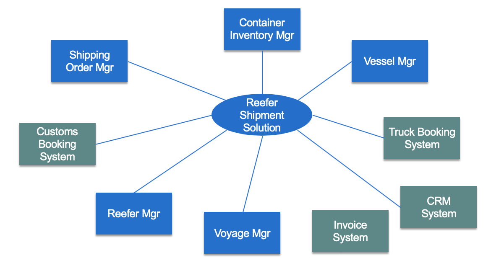
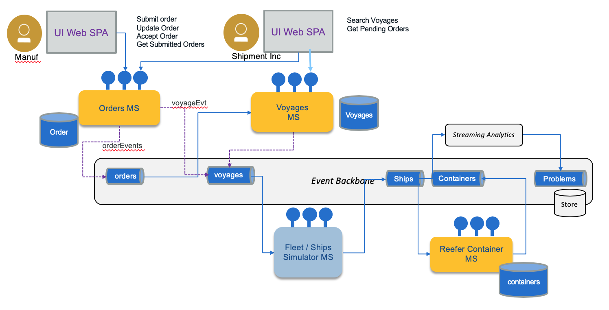

## Architecture

### System Context

When dealing with a microservices architecture, we want to start with a high-level understanding and drill down into more detailed view. The system context view for the solution can be seen in the diagram below:

### Components view

Deploying the different components using event-driven and microservice patterns, we organize them in the following figure _(where the event backbone ensures pub/sub implementation and supports the event sourcing pattern)_:

* Top left represents the [user interface](https://ibm-cloud-architecture.github.io/refarch-kc/microservices/user-interface/) to support the demonstration of the Reefer Container Shipment solution, with a set of widgets to present the ships movements, the container tracking / monitoring and the event dashboards.
* The event backbone is used to define a set of topics used in the solution and as event sourcing for microservice to microservice data eventual consistency support.
* Each service supports the top-level process with a context boundary defining the microservice scope.
* Streaming analytics is used to process aggregates and analytics on containers and ship movement data ingested in real-time.

As we develop through multiple iterations, the current scope of the Minimum Viable Product is only addressing the following components:

Which can also be represented in a deployment view as the figure below:

### Summary of microservice scopes for shipment handling:

We are using a set of event-driven design patterns to develop the overall solution. One of them is the **[sub domain decomposition](https://www.ibm.com/cloud/architecture/architectures/eventDrivenArchitecture/patterns#decomposebysubdomain)**. From the analysis output, we have the aggregates, actors and data that are helping us to extract a set of subdomains.

_**NOTE:**_ The details below are the initial outputs from the original [event storming analysis](https://ibm-cloud-architecture.github.io/refarch-kc/implementation/event-storming-analysis/) and [domain-driven design](https://ibm-cloud-architecture.github.io/refarch-kc/implementation/domain-driven-design/) activities. However, the application model has evolved to keep up with the use case and the details for the currently implemented use case can be found on the [Topics](https://ibm-cloud-architecture.github.io/refarch-kc/microservices/topic-details/) and [Events](https://ibm-cloud-architecture.github.io/refarch-kc/microservices/event-details/) pages.

* **Fleet Service**: responsible for managing the fleet of ships (container carriers), per major ocean.
    * **Information model:**
         * Fleet has multiple ships.
         * Ship has unique identifier (we will use its name), a container capacity (represented as a matrix to make it simple), current position, status, voyage identifier for the voyage it is doing.
    * **Events:** Ship commission, ship position, load container event, unload container event, start itinerary X, arrive at port, docked,...
    * **Operations:** CRUD operations for Fleet and Ship management and the relationship between the two entities.
    * **Implementation:** [github.com/ibm-cloud-architecture/refarch-kc-ms](https://github.com/ibm-cloud-architecture/refarch-kc-ms/tree/master/fleet-ms)
* **Voyages Service**: define a set of voyage schedules supported by the shipping company.
    * **Information model:** voyageID, shipID, src_Port, planned_departure_date, dest_port, planned_arrival_dates, free_space_this_leg
    * **Events:** add itinerary route, OrderAssigned
    * **Operations:** CRUD on itinerary routes, query on capacity availability, assign slot to order, free slot for order.
    * **Implementation:** [github.com/ibm-cloud-architecture/refarch-kc-ms](https://github.com/ibm-cloud-architecture/refarch-kc-ms/tree/master/voyages-ms)
* **Order Service**: manage the shipment order.
    * **Information model:** Booking id , customer, pickup location, pickup after date, deliver location, expected deliver date, order status, assigned container
    * **Events:** order placed, order assigned to voyage (sets VoyageID, ship ID), container assigned to order (sets container ID), Landorder, Transport associated with pickup container, Order status event, Order billing/accounting event
    * **Operations:** CRUD on order, update order status
    * **Implementation:** [github.com/ibm-cloud-architecture/refarch-kc-order-ms](https://github.com/ibm-cloud-architecture/refarch-kc-order-ms)
* **Container Service**:
    * **Information model:** Container Id, Container temperature, container position, container condition ( maintenance goods), current associated order
    * **Events:** order created, order assigned, container added, container anomaly, container maintenance, ...
    * **Operations:** CRUD on container
    * **Implementation:** [github.com/ibm-cloud-architecture/refarch-kc-container-ms](https://github.com/ibm-cloud-architecture/refarch-kc-container-ms)
