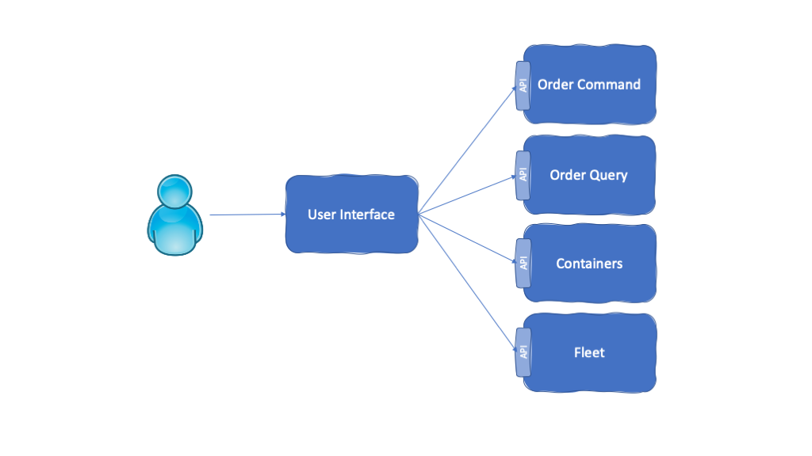
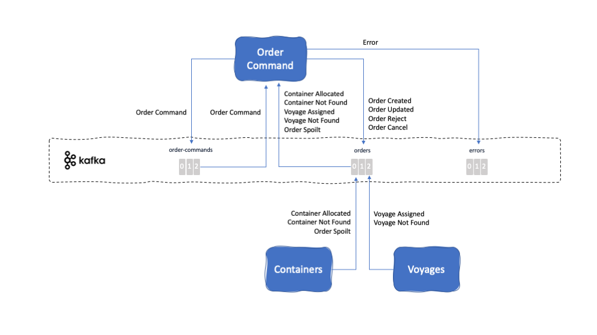
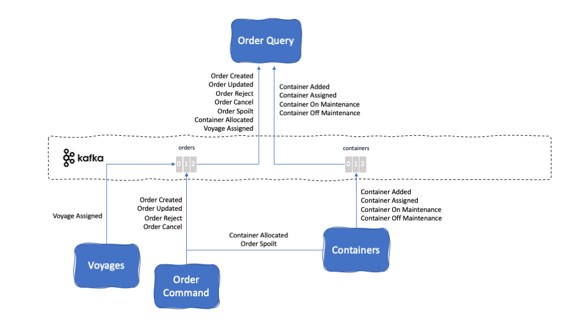
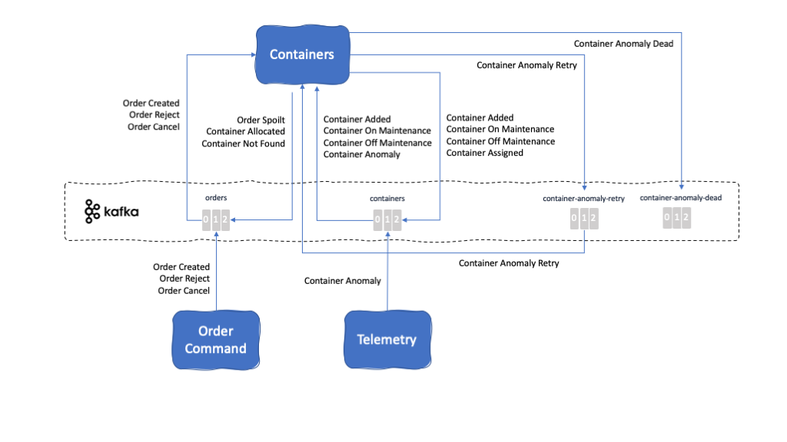
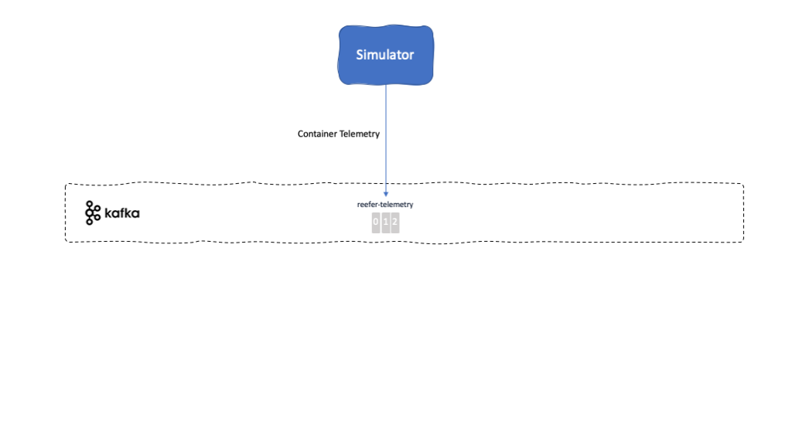
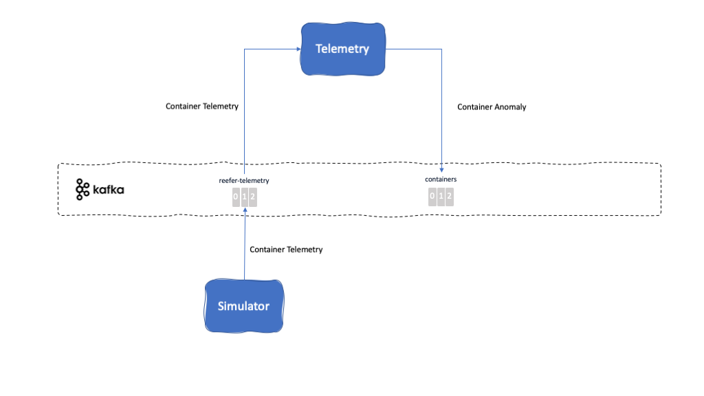
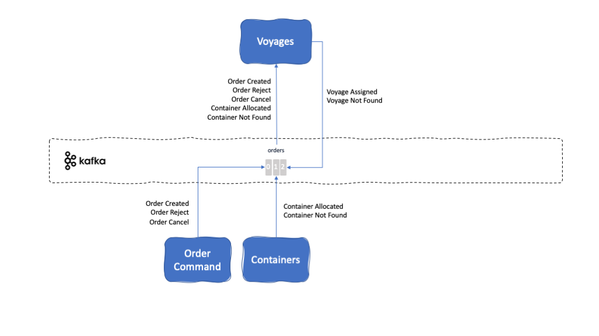

<PageDescription>
An overview of the Reefer Container Shipment solution's component microservices.
</PageDescription>

<AnchorLinks>
  <AnchorLink>User Interface</AnchorLink>
  <AnchorLink>Order Command</AnchorLink>
  <AnchorLink>Order Query</AnchorLink>
  <AnchorLink>Container Management</AnchorLink>
  <AnchorLink>Vessel Simulator</AnchorLink>
  <AnchorLink>Telemetry Simulator</AnchorLink>
  <AnchorLink>Anomalous Container Scoring</AnchorLink>
  <AnchorLink>Fleet</AnchorLink>
  <AnchorLink>Voyages</AnchorLink>
</AnchorLinks>

## User Interface

**Description:** The user interface for our Reefer Container Shipment reference application is implemented as a single microservice using Node.js and Angular.js. The goal of this component is to serve a user interface for customers to:

- Log in
- Create an order
- List all orders
- List all containers
- Initiate shipping simulation

**Further details:** [Microservices Details > Orders UI](/microservices/orders-ui)

## Order Command

**Description:** Main goal of the Orders component is to manage the shipping orders. This component is made up of two microservices, one called Order Command and the other Order Query. The reason for this component to be split into two microservices is to implement the [**Command Query Responsibility Segregation (CQRS)**](#command-query-responsibility-segregation-(cqrs)) pattern.

**Further details:** [Microservices Details > Order Command](/microservices/order-command)

## Order Query

**Description:** Main goal of the Orders component is to manage the shipping orders. This component is made up of two microservices, one called Order Command and the other Order Query. The reason for this component to be split into two microservices is to implement the [**Command Query Responsibility Segregation (CQRS)**](#command-query-responsibility-segregation-(cqrs)) pattern.

**Further details:** [Microservices Details > Order Query](/microservices/order-query)

## Container Management

**Description:** This microservice manages the container inventory. That is, this microservice will be in charge of keeping an inventory of all the containers registered in the system along with their status, size and location. When a new order is created and received, the container microservice will be in charge of assigning a container to this new shipping order based if a container is available that suits the order's quantity and source port. Otherwise, will emit a ContainerNotFound event for the interested parties in the overall Reefer Container Shipment solution.

This microservice will also manage any container anomaly during the shipping of goods. That is, this microservice will monitoring ContainerAnomaly Events received for any particular container and in the case that these are received, it will mark the container for maintenance, send a OrderSpoilt Event so that any other microservice in the overall solution is aware that the fresh goods this container was carrying are now spoilt and will call a Business Process Manager (BPM) process in to automatically trigger the assignment of a field engineer to repair the container when it reaches the destination port.

This microservice is implemented with Spring Framework and runs on Tomcat.

**Further details:** [Microservices Details > Container Management](/microservices/container-management)

## Vessel Simulator

_TODO Vessel Simulator microservice image needed_

**Description:** This a simple vessel source events generatator taking into account the route from two harbors, the vessel characteristic and the geodetic curve shortest path.

This microservice has been implemented using the [Appsody Microprofile 3.2 OpenLiberty stack](https://github.com/appsody/stacks/tree/master/incubator/java-openliberty).

**Further details:** [Microservices Details > Vessel Simulator](/microservices/vessel-simulator)

## Telemetry Simulator

**Description:** The Simulator webapp is a simple Python (3.7) Flask web app exposing a REST POST endpoint to control the type of simulation to run and to produce Reefer telemetry events to kafka reeferTelemetry topic.

This microservice has been implemented using the [Appsody Python Flask stack](https://github.com/appsody/stacks/tree/master/incubator/python-flask).

**Further details:** [Microservices Details > Telemetry Simulator](/microservices/telemetry-simulator)

## Anomalous Container Scoring

**Description:** This microservice will be responsible for listening to the [Reefer Telemetry Topic](#reefer-telemetry-topic) topic where the IOT sensor devices of the Reefer Containers will be sending their telemetry data to. These telemetry events will be read and used to contact a container anomaly prediction service based on Watson Machine Learning hosted on the IBM Cloud. Depending on whether the prediction service predicts a container anomaly, this Telemetry microservice will send a [Container Anomaly Event](#container-anomaly-event) to the [Containers Topic](#containers-topic) for the [Containers microservice](#containers) to handle the shipping goods spoilage.

This microservice has been implemented using the latest [Reactive Messaging](#reactive-messaging) feature of MicroProfile 3.0, running on the OpenLiberty server.

**Further details:** [Microservices Details > Anomalous Container Scoring](/microservices/scoring-mp)

## Fleet

_TODO Fleet microservice image needed_

**Description:** This microservice will manage the fleet of ships.

**Further details:** [Microservices Details > Fleet Management](/microservices/fleet)

## Voyages

**Description:** This microservice manages the voyages for each ship, written in NodeJS. A voyage consist of carrying a limited amount of goods from a source port to a destination port being the goods carried by a uniquely identified ship on a specific date. All those attributes make a voyage unique and these voyages are managed by this microservice. Voyages microservice will then be responsible to allocate a voyage to an order based on where this order needs to be carried from and to, the window time the goods need to be carried within and the amount of goods to be carried. This microservice assigns a voyage to an order (and manage the remaining capacity on the ship making such voyage) if any suitable voyage is found and emit the consequent VoyageAssigned Event or will otherwise emit a VoyageNotFound Event.

**Further details:** [Microservices Details > Voyage Management](/microservices/voyages)
