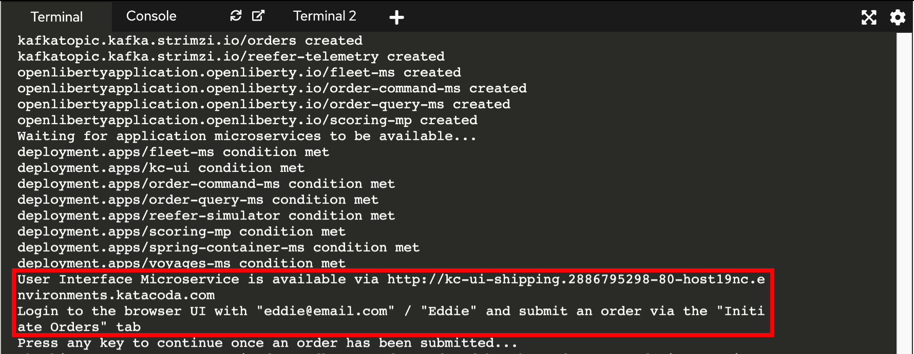
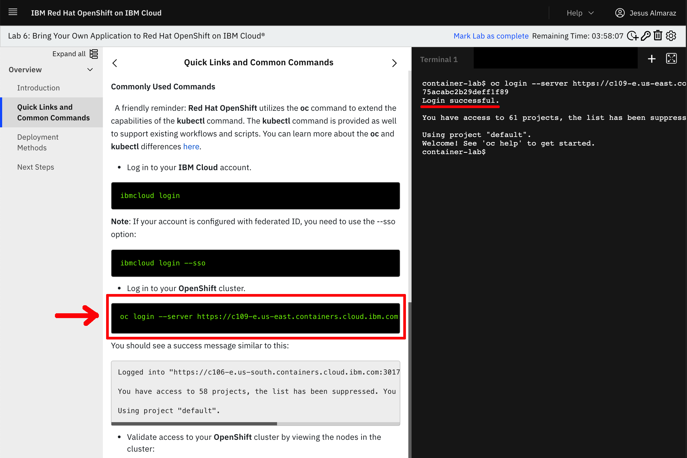
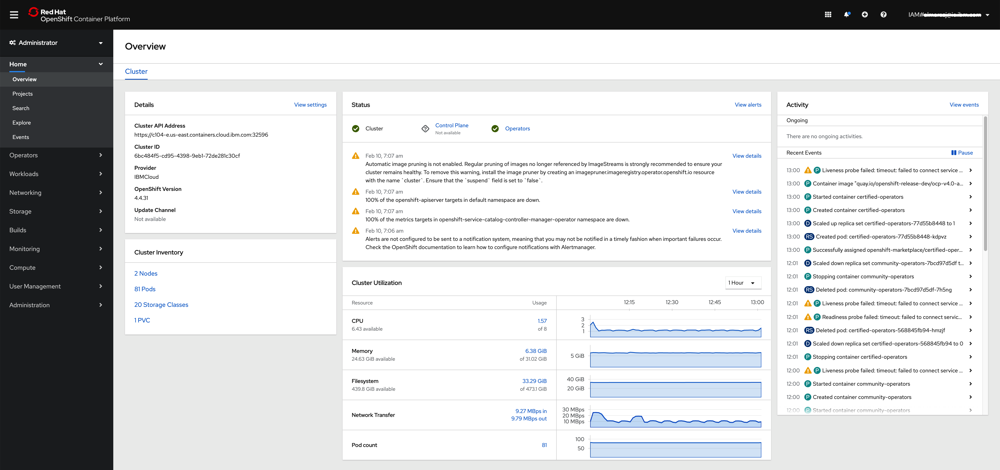

In this tutorial, you will:

- Deploy the reference implementation to a standalone OpenShift cluster.
- Create an order via the UI.
- Check on existing orders.
- View information about the Fleet.

Each of these business processes will be executed step-by-step using the demonstration APIs and some scripts.

## Pre-requisites

- **Red Hat OpenShift Container Platform** - this quickstart utilizes either the [OpenShift Playgrounds](https://learn.openshift.com/playgrounds/openshift45/) or the [IBM OpenLabs](https://developer.ibm.com/openlabs/openshift).
- ... and that's it!!! Everything else is provided for you via OpenShift Operators or through existing GitHub repositories.
- Additional self-paced learning can be done to integrate the deployed reference implementation with additional Kafka offerings, such as _IBM Event Streams_, _Red Hat AMQ Streams_, or _Confluent Platform_.

## Step 1: Deploy the reference implementation

In this section, we are going to see how to deploy the KContainer Shipping Container Reference Implementation both in the OpenShift Playgrounds and the IBM OpenLabs.

### OpenShift Playgrounds

1. Go to [`https://learn.openshift.com/playgrounds/openshift45/`](https://learn.openshift.com/playgrounds/openshift45/) in a browser and click **Start Scenario**.

  

1. From a terminal that has access to your OpenShift cluster, download the [kcontainer-quickstart-ocp.sh](https://github.com/ibm-cloud-architecture/refarch-kc/tree/master/scripts/kcontainer-quickstart-ocp.sh) file:
  ```
  curl -o kcontainer-quickstart-ocp.sh https://raw.githubusercontent.com/ibm-cloud-architecture/refarch-kc/master/scripts/kcontainer-quickstart-ocp.sh
  chmod +x kcontainer-quickstart-ocp.sh
  ```
  
   
   _(\*) To override the default username and password used in the quickstart script for use in a different OpenShift environment, set environment variables with names of_ `OCP_ADMIN_USER` _and_ `OCP_ADMIN_PASSWORD` _to the appropriate values before executing the script._

1. Execute the quickstart deployment script with the following command:
  ```
  ./kcontainer-quickstart-ocp.sh
  ```

1. Wait for the deployment to be active and ready when you are prompted with `Press any key to continue once an order has been submitted...`.

  

1. Grab the User Interface Microservice url and credentials and open it up in your web browser.

  

   _(\*) This will be referred to as_ `kc-ui-shipping.cluster.local` _in the step 2 of this quickstart._

1. You can also check all the resources created by the `kcontainer-quickstart-ocp.sh` script in the RedHat OpenShift console by clicking on the console tab and using the appropriate credentials displayed on the instructions section to log in.

  

### IBM OpenLabs

1. Go to [IBM OpenLabs](https://developer.ibm.com/openlabs/openshift) in a browser and click on `Launch Lab` button for **Lab 1**.

  

1. Sign in with your IBM Cloud account or register for an IBM Cloud account.

  

1. You will be presented with a dialog asking you whether you have an **Opportunity Id** or not. If you don't have it or don't no, just select **No** and click on **Launch Lab**.

1. You should now see your IBM OpenLabs environment.

  

1. On the left hand side navigation menu, click on **Excercise 3** to expand that section and then click on **Using the command line interface (CLI)** section. Now, click on the the first **oc** command displayed on the instructions section that would allow you to get logged into your RedHat OpenShift cluster from the terminal section on the right hand side of the screen.

  

1. From a terminal section, download the [kcontainer-quickstart-ocp.sh](https://github.com/ibm-cloud-architecture/refarch-kc/tree/master/scripts/kcontainer-quickstart-ocp.sh) file:

  ```
  curl -o kcontainer-quickstart-ocp.sh https://raw.githubusercontent.com/ibm-cloud-architecture/refarch-kc/master/scripts/kcontainer-quickstart-ocp.sh
  chmod +x kcontainer-quickstart-ocp.sh
  ```

  

1. Execute the quickstart deployment script with the following command:

  ```
  ./kcontainer-quickstart-ocp.sh --skip-login
  ```
  **IMPORTANT:** do not forget the **- -skip-login** flag since we have already logged into the RedHat OpenShift cluster above.

1. Wait for the deployment to be active and ready when you are prompted with `Press any key to continue once an order has been submitted...`.

  

1. Grab the User Interface Microservice url and credentials and open it up in your web browser.

  

   _(\*) This will be referred to as_ `kc-ui-shipping.cluster.local` _in the step 2 of this quickstart._

1. You can also check all the resources created by the `kcontainer-quickstart-ocp.sh` script in the RedHat OpenShift console by clicking on the left hand side navigation menu, then clicking on **Exercise 1** to expand that section and then clicking on **RedHat OpenShift on IBM Cloud Basics**. You should now see on the instructions section the url for your **IBM Cloud portal**. Click on that link.

  

1. You should now be on your RedHat OpenShift on IBM Cloud cluster dashboard.

  

1. Click on the **OpenShfit web console** button that is presented on the top right corner of your RedHat OpenShift of IBM Cloud cluster dashboard page. This, should open up your RedHat OpenShift dashboard.

  

## Step 2: KContainer Manufacturer creating an order

Orders are created via the manufacturer. For a reminder of the different personas, view the [Scenario Overview](/business-scenario/scenario-overview/).

* Navigate to `http://kc-ui-shipping.cluster.local` (replacing the actual URL of the `kc-ui` microservice with the value output while running the quickstart script or available via `oc get route kc-ui`) to access the UI home page:


To log in to the home page, you will need the following user email and password:

- Email: eddie@email.com
- Password: Eddie

The initial UI homepage shows an illustrated version of the business process. There are four tiles that can be used to simulate different parts of the outlined business process.

* From the `Initiate Orders - Manufacturer` create a new 'fresh product' order to ship overseas. This simulates the activity that would usually be carried out by the manufacturer in our scenario.

<InlineNotification kind="warning">Do we need to have specific input here for containers to match/be found?</InlineNotification>

To represent different manufacturers, the first select box has been designed to support multiple scenarios in the future. For the purposes of this quickstart tutorial, select 'GoodManuf'.


Once the manufacturer is selected, a list of existing orders will be displayed.


* Select one order using the `Arrow` icon. This will allow you to view the order details:


As illustrated in the CQRS diagram:

The creation of the order goes to the [Order Command microservice](/microservices/order-command/) which publishes an `OrderCreated` event to the `orders` topic and then consumes it to persist the data to its database. See the [source code here](https://github.com/ibm-cloud-architecture/refarch-kc-order-ms/blob/master/order-command-ms/src/main/java/ibm/gse/orderms/domain/service/ShippingOrderService.java#L39-L47).

* We can create a consumer to take messages from the `orders` topic by running the following command from the same terminal the quickstart deployment script was run from:

```oc rsh my-cluster-kafka-0 bin/kafka-console-consumer.sh --bootstrap-server localhost:9092 --from-beginning --timeout-ms 10000 --topic orders```

After running this, you should be able to see the following order with the status of `pending` and the type of event being `OrderCreated`.

```json
{"payload":{
    "orderID":"1fcccdf2-e29d-4b30-8e52-8116dc2a01ff",
    "productID":"Carrot",
    "customerID":"GoodManuf",
    "quantity":10000,
    "pickupAddress": "...",
    "expectedDeliveryDate":"2019-03-31T13:30Z",
    "status":"pending"},
"type":"OrderCreated",
"version":"1"}

```

## Step 2: K Container Shipment Manager looking at Orders

* From the home page, click on the Shipment Manager - Shipping Inc tile:


The home page lists the order that the shipment company received in the previous step.


The status of events will be modified over time while the order is processed down stream by the voyage and container services. The following sequence diagram illustrates the flow:


Looking at the events in the voyage service
```
voyages_1     |  emitting {"timestamp":1548788544290,"type":"OrderAssigned","version":"1","payload":{"voyageID":100,"orderID":"1fcccdf2-e29d-4b30-8e52-8116dc2a01ff"}}
```

or on the `orders` topic:

```json
{"timestamp":1548792921679,
"type":"OrderAssigned","version":"1",
"payload":{"voyageID":100,"orderID":"1fcccdf2-e29d-4b30-8e52-8116dc2a01ff"}}

```

## Step3: View Fleet information

<InlineNotification kind="warning"><strong>UNDER CONSTRUCTION</strong></InlineNotification>

Note: *The term 'Blue Water' referred to here means at sea (including ports and coastal waters).*

* From the home page, select the `Simulate Blue Water` tile. Select one of the available fleet. As of now, only the North Pacific has fleet data:


The fleet panel lists the ships, their location and status and a map:


* Select one ship with the edit button. You will see the ship detail view:


This view contains information about the ship itself, it's position at sea and the load. There is also an option to simulate a number of disaster scenarios that could play out at sea, however this functionality is not yet implemented.

There are currently three pre-defined scenarios, which will be implemented in the future:

* Fire affecting some containers
* Reefer down
* Ship experiencing conditions that cause reefers to exceed desired temperature.

This quickstart guide will be updated as the project evolves and new capability is added. If you have any issues or queries with this quickstart guide, please [raise an issue](https://github.com/ibm-cloud-architecture/refarch-kc/issues) in the github repo.
