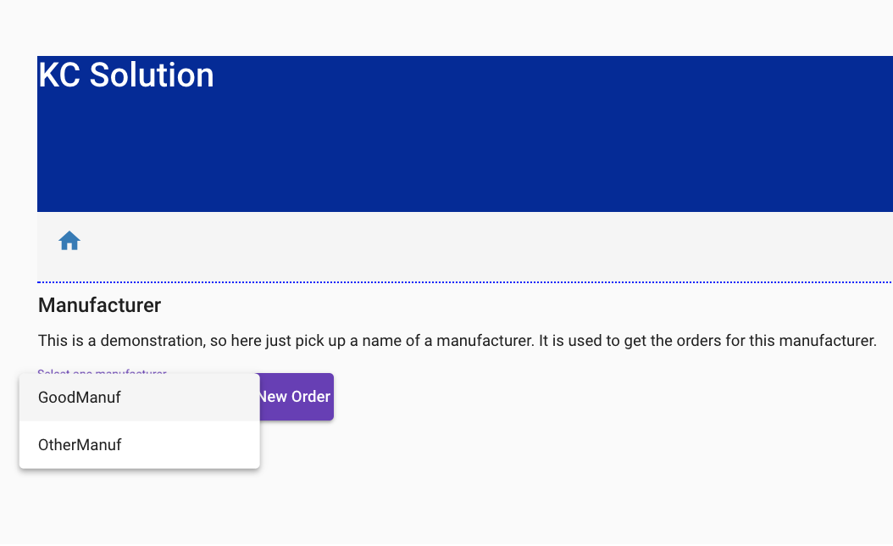
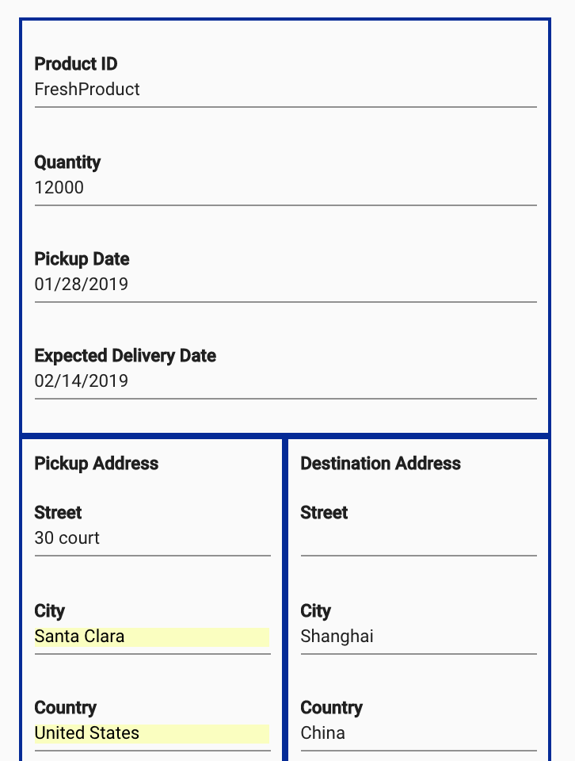
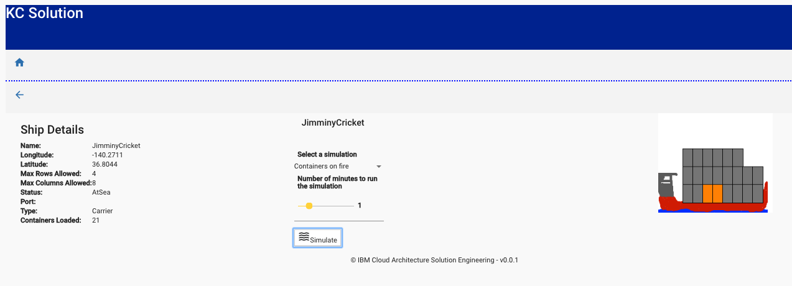

<InlineNotification kind="warning"><strong>TODO</strong> - UNDER CONSTRUCTION</InlineNotification>

In this tutorial, we will show you how to:

- Create an order via the UI.
- Check on existing orders.
- Simulate a ship sailing.

Each of these business processes will be executed step by step using the demonstration APIs and some scripts.

## Pre-requisites

- This quickstart tutorial assumes you have deployed the microservices as per the (local Kubernetes deployment)[https://github.com/ibm-cloud-architecture/refarch-kc/tree/master/scripts/localk8s].


## Step 1: Create an order

Orders are created via the manufacturer. For a reminder of the different personas please see the [Scenario Overview](https://ibm-cloud-architecture.github.io/refarch-kc/business-scenario/scenario-overview/). 

* Go to the http://localhost:3110 URL to access the UI home page:


To log in to the home page, you will need a user email and password:

- Email: eddie@email.com
- Password: Eddie

The initial UI homepage shows an illustrated version of the business process. There are five tiles that can be used to simulate different parts of the outlined business process. Tiles that are grey are not implemented at this time. 

* From the `Initiate Orders - Manufacturer` create a new 'fresh product' order to ship overseas. This simulates the activity that would usually be carried out by the manufacturer in our scenario.

To represent different manufacturers, the first select box has been designed to support multiple scenarios in the future. For the purposes of this quickstart tutorial, select 'GoodManuf'.



Once the manufacturer is selected a list of existing orders may be displayed. You can add order with the UI, but you can also use a script in the order command microservice project: https://github.com/ibm-cloud-architecture/refarch-kc-order-ms/blob/master/order-command-ms/scripts/createOrder.sh

Below is an example of how to use the createOrder script to add a 'GoodManuf's' order to book a voyage from Oakland to Shanghai for a fresh product:
```
./createOrder.sh localhost:10080 ./orderOacklandToChinaCreate.json

```


> There is a lot happening here. The Angular is getting orders using the [orders.service.ts](https://github.com/ibm-cloud-architecture/refarch-kc-ui/blob/master/ui/src/app/features/orders/orders.service.ts) service within the BFF component at the address: `http://localhost:3010/api/orders`.
The BFF is calling the [Order Query Microservice](https://github.com/ibm-cloud-architecture/refarch-kc-order-ms/tree/master/order-query-ms) via a javascript client code: [getOrders(manuf) function.](https://github.com/ibm-cloud-architecture/refarch-kc-ui/blob/4b9d7d1241eaeeaee7fc01247a35b696f0b6d5b2/server/routes/OrderClient.ts#L12-L25). The Order Query microservice URL is defined in environment variable or defaulted in the config file. It is mapped to the deployed Order service. (e.g. http://ordercmd:9080/orders)

* Select one order using the `Arrow` icon. This will allow you to view the order details:



As illustrated in the CQRS diagram:

The creation of the order goes to the [order command microservice](https://github.com/ibm-cloud-architecture/refarch-kc-order-ms/tree/master/order-command-ms) which publishes a `OrderCreated` event to the `orders` topic and then consumes it to persist the data to its database. See [source code here](https://github.com/ibm-cloud-architecture/refarch-kc-order-ms/blob/6de424c443c05262ae013620f5f11b4a1b2e6f90/order-command-ms/src/main/java/ibm/labs/kc/order/command/service/OrderCRUDService.java#L51-L74)


We can create a consumer to take messages from the 'orders topic' by running the following command:

```bin/kafka-console-consumer.sh --bootstrap-server $BROKERS --topic orders --from-beginning```

After running this, you should be able to see the following trace with the status of the order being `pending` and the type of event being `OrderCreated`.

```json
{"payload":{
    "orderID":"1fcccdf2-e29d-4b30-8e52-8116dc2a01ff",
    "productID":"Carrot",
    "customerID":"GoodManuf",
    "quantity":10000,
    "pickupAddress": "...",
    "expectedDeliveryDate":"2019-03-31T13:30Z",
    "status":"pending"},
"type":"OrderCreated",
"version":"1"}

```

## Step 2: K Container Shipment Manager looking at Orders

From the home page, click on the Shipment Manager - Shipping Inc tile:


The home page lists the order that the shipment company received from the previous step. 


The status of events will be modified over time while the order is processed down stream by the voyage and container services. The following sequence diagram illustrates the flow:


Looking at the traces in the voyage service
```
voyages_1     |  emitting {"timestamp":1548788544290,"type":"OrderAssigned","version":"1","payload":{"voyageID":100,"orderID":"1fcccdf2-e29d-4b30-8e52-8116dc2a01ff"}}
```

or at the `orders` topic:

```json
{"timestamp":1548792921679,
"type":"OrderAssigned","version":"1",
"payload":{"voyageID":100,"orderID":"1fcccdf2-e29d-4b30-8e52-8116dc2a01ff"}}

```

## Step3: Simulate the ship at sea

Note: *The term 'Blue Water' referred to here means at sea.*

From the home page, select the `Simulate Blue Water` tile. Select one of the available fleet. As of now, only the North Pacific has fleet data:


The fleet panel lists the ships, their location and status and a map:


Select one ship with the edit button. You will see the ship detail view:


To start a simulation of ship movement, you can select from one of three pre-defined scenarios:

* Fire affecting some containers
* Reefer down
* Ship experiencing conditions that cause reefers to exceed desired temperature. 


The command is sent to the Simulator and the ship will start to move and generate container metrics:



The simulation implementation is yet not completed.
