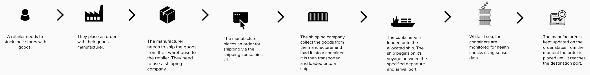

<InlineNotification kind="warning"><strong>TODO</strong> - UNDER CONSTRUCTION</InlineNotification>

As part of producing IBM best practice and reference architectures for event driven, we have brought together a complete scenario which covers all aspects of developing an event driven solution. The shipping business provides a good foundation for many of these concepts and enables us to show how to develop event driven solutions using some of the common architecture patterns.

## Business process statement

This reference scenario is based on a shipping supply chain from manufacturer to retailer. There are three main actors; the retailer, the manufacturer and the shipping company.

1. A retailer orders goods from an overseas manufacturer.
2. The manufacturer needs to ship goods from their warehouse to the retailer. To do this they use a shipping company.
3. The manufacturer interacts with the shipping company through the shipping companies UI, where they are able to place and keep track of order.
4. The shipping company operates a fleet of ships, loaded with 'reefer' containers. It allocates orders to containers and voyages depending on the load and shipping route needed.
5. While at sea the containers are monitored for health using their in-built sensors.
6. The manufacturer is kept informed on the status of their order during the lifecycle of the process.

We are using goods to be transported in refrigerator containers or reefer containers to keep the 'cold chain' of transported products.

