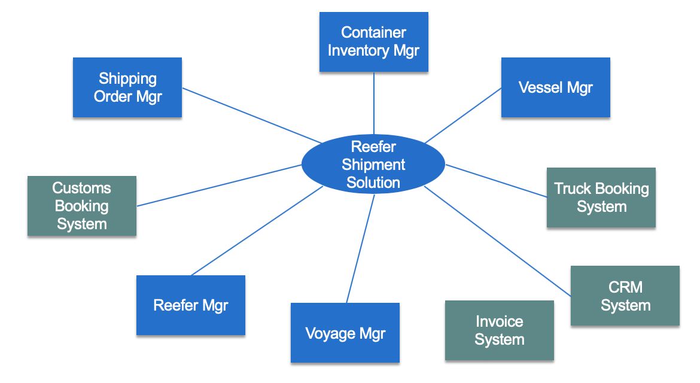
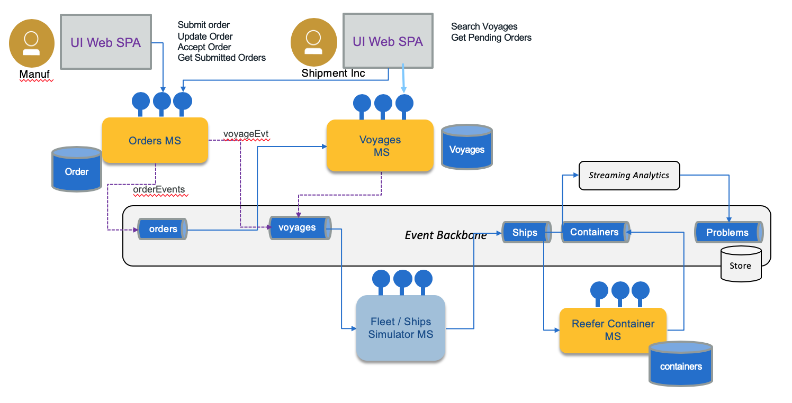
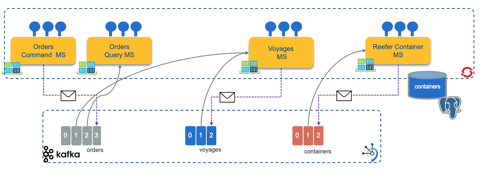

## System Context

When dealing with architecture we want to start by high level and drill down into more detail view. The system context view for the solution looks like the diagram below:

## Components view

Deploying the different components using event-driven and microservice patterns, we may organize them as in the following figure where event backbone ensures pub/sub implementation and supports the event sourcing:

* Top left represents the [user interface](https://github.com/ibm-cloud-architecture/refarch-kc-ui) to support the demonstration of the K.Container solution, with a set of widgets to present the ships movements, the container tracking / monitoring and the event dashboards. The botton of the UI will have controls to help performaing the step by step demonstration.
* The event backbone is used to define a set of topics used in the solution and as event sourcing for microservice to microservice data eventual consistency support.
* Each service supports the top-level process with context boundary defining the microservice scope.
* Streaming analytics is used to process aggregates and analytics on containers and ships movement data coming in real time.

As we develop by iterations the current scope of the Minimum Viable Product is only addressing the following components:

Which can also be represented in a deployment view as the figure below:

[Read more on EDA design pattern...](https://github.com/ibm-cloud-architecture/refarch-eda/blob/master/docs/evt-microservices/ED-patterns.md)

The [12 factors application](https://12factor.net/) is also used for order management microservice.

## Summary of microservice scopes for shipment handling:

As presented in [the note about event driven microservice patterns](https://github.com/ibm-cloud-architecture/refarch-eda/blob/master/docs/evt-microservices/README.md#understanding-event-driven-microservice-patterns), we are using a set of event-driven design patterns to develop this solution. One of them is the **sub domain decomposition**. From the analysis output we have the aggregates, actors and data that are helping us to extract a set of subdomains.

* **Fleet Service**: responsibles to group the ship (container carriers), in fleet, per major ocean. 
    * Information model: 
         * Fleet has multiple ships,
         * Ship has unique identifier (we will use its name), and a container capacity (represented as a matrix to make it simple), current position, status, voyage identifier for the voyage it is doing. 
    * Events: Ship commission, ship position, load container event, unload container event, start itinerary X, arrive at port, docked,...
    * Operations: getFleets, get ships in a fleet, get ship by ID. CRUD Fleet and Ship.
    * Implementation in [this project.](https://github.com/ibm-cloud-architecture/refarch-kc-ms/tree/master/fleet-ms)
* **Voyages Service**: define a set of voyage schedules supported by the shipping company
    * Information model: voyageID, shipID, src_Port, planned_departure_date, dest_port, planned_arrival_dates, free_space_this_leg
    * Events: add itinerary route, OrderAssigned
    * Operations: CRUD on itinerary routes, query on capacity availability, assign slot to order, free slot for order.
     * Implementation in [this project.](https://github.com/ibm-cloud-architecture/refarch-kc-ms/tree/master/voyages-ms)
* **Order Service**: manage the shipment order
    * Information model: Booking id , customer, pickup location, pickup after date, deliver location, expected deliver date, order status, assigned container  
    * Events: order placed, order assigned to voyage( sets VoyageID, ship ID ), container assigned to order ( Sets container ID), Landorder, Transport associated with pickup container, Order status event, Order billing/accounting event
    * Operations: CRUD on order, update order status
     * Implementation in [the order ms projects.](https://github.com/ibm-cloud-architecture/refarch-kc-order-ms)
* **Container Service**: 
    * Information model: Container Id, Container temperature, container position, container condition ( maintenance goods), current associated order
    * Events: 
    * Operations: CRUD on container
    * Implementation in [the container ms project.](https://github.com/ibm-cloud-architecture/refarch-kc-container-ms)
* Customs and Export Service (not yet implemented)
* Land Transport Service: (not yet implemented)