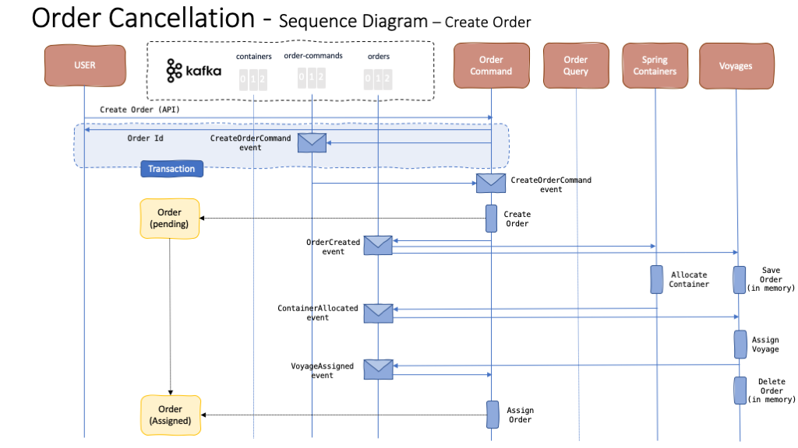
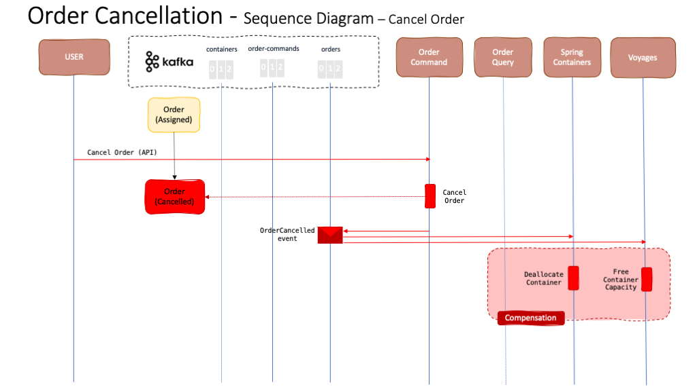

This use case consist of giving the ability to the Reefer Container Shipment administrator/operator or a customer of its services to cancel an order. This could be because the customer wants to wait until they have more fresh goods to get them sent, the final client of those goods do not require these anymore, the Reefer Container Shipment have problems with containers, ships, workforce, etc. Whatever the reason might be, we want to offer all parties of our Event Driven solution the option to cancel an order.

A new order successful request flow, implementing the [SAGA pattern](https://ibm-cloud-architecture.github.io/refarch-eda/patterns/saga/) for long running transactions, looks like the following sequence diagram:

At this point, if any of the interested parties cancels an order, a compensation process kicks off that looks like the following diagram:

where the Order Command microservice in charge of receiving such rejection request will:

1. Transition the order to **Cancelled** state.
2. Emit an **OrderCancelled** event so that any other interested party in the overall application take the appropriate action. In our case, the Spring Containers and Voyages microservices will kick off a kind of compensation process whereby the container allocated to the order will get de-allocated and the voyage assigned to the order will get unassigned respectively. As a result, the container will become empty and available for a coming new order as well as the ship making the voyage will get the container's capacity freed up.
