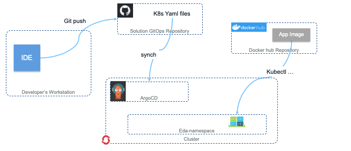
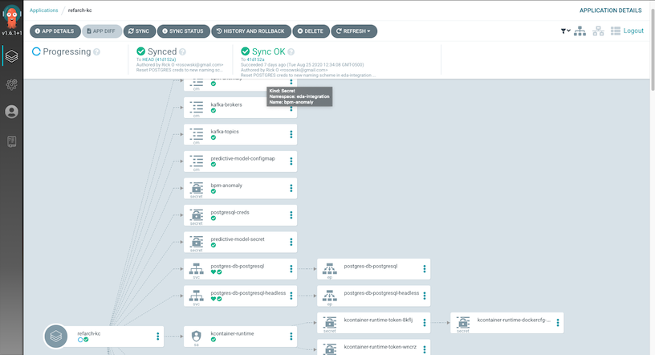
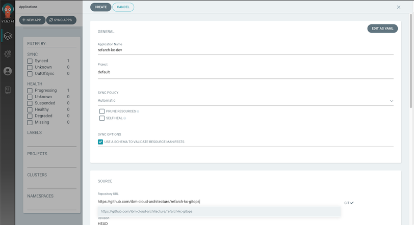
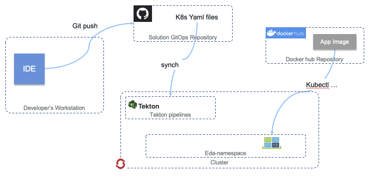
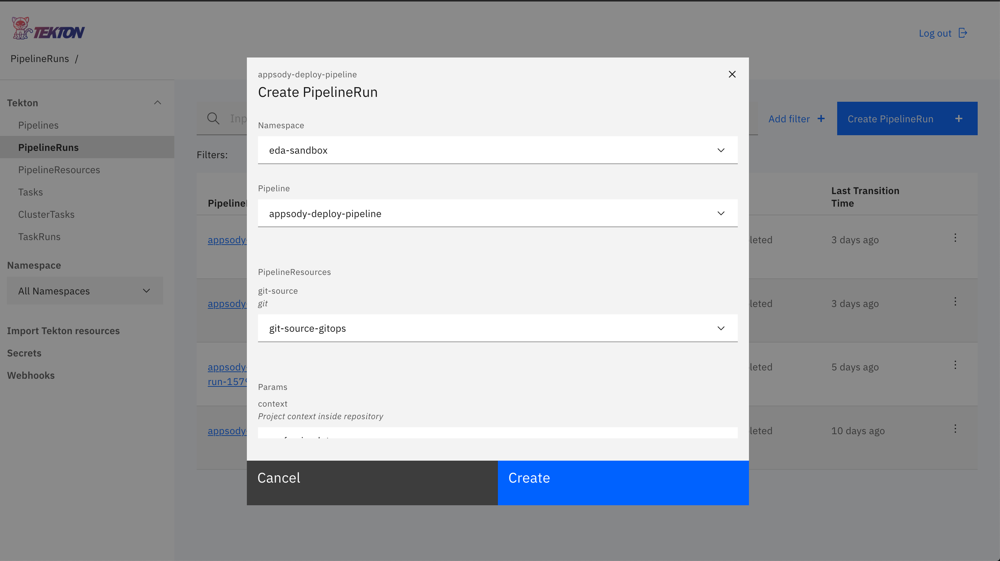

<PageDescription>
The implemented DevOps pipelines for the Reefer Container Shipment solution reference implementation of the Event-Driven Reference Architecture. This chapter focuses on the <strong>Continuous Delivery</strong> capability implemented in the reference implementation.
</PageDescription>

# Overview

Our [Continuous Integration (CI) approach](/infrastructure/devops-continuous-integration) is one of "zero-infrastructure overhead". To accomplish this goal, we utilize [GitHub Actions](https://github.com/features/actions) to build and push a microservice's associated container images to [Docker Hub](https://hub.docker.com/u/ibmcase) for public consumption. The GitHub Actions workflows are defined in the owning repository's `.github/workflows/dockerbuild.yaml` file.

Our [GitOps approach](/infrastructure/devops-gitops) focuses on a single-repository, environment-per-subdirectory model which can be forked and cloned to replicate deployments to other clusters and environments. The reference implementation utilizes [Kustomize](https://kustomize.io/) as its templating technology to utilize the `app-deploy.yaml` files, provided by each individual microservice, as a base and then layer in environment-specific configuration and credentials as needed.

Our [Continuous Delivery (CD) approach](#continuous-delivery), _the topic of this chapter_, focuses on a GitOps-based delivery model, using a GitHub repository as a single source of truth for the deployment, management, and operations of our running application components. In this model, we have the flexibility to use multiple open-source technologies to apply the single source of truth from a given GitHub repository onto a desired cluster environment.

# Continuous delivery

One of the main tools used in this space is a GitOps-focused continuous delivery project named [ArgoCD](https://argoproj.github.io/argo-cd/). As documented by the [IBM Garage for Cloud](https://ibm-garage-cloud.github.io/ibm-garage-developer-guide/guides/continuous-delivery) team, ArgoCD can monitor GitHub-based projects and apply changes stored in that repository's YAML files to a running Kubernetes-based cluster.

<!-- Another DevOps tool which provides the opportunity to deployment applications via the GitOps methodology is [Tekton](https://tekton.dev/). The Tekton Pipelines project provides a declarative language for defining and executing both CI and CD-style pipelines, all defined with common Kubernetes-like nomenclature. It even has the capability to kick off pipeline runs based off of GitHub webhooks. -->

We have documented our general GitOps strategy & methodology for generation of deployment source configuration files in the [GitOps chapter](/infrastructure/devops-gitops/) of this manual, while the details of our ArgoCD-based deployments of those GitOps-based artifacts are covered in the [ArgoCD deployments](#argocd-deployments) section below. <!-- and the details of our Tekton-based deployments are covered in the [Tekton deployments](#tekton-deployments) section below.-->

## ArgoCD deployments

Our main continuous delivery pattern operates on the same principle of _"zero-infrastructure overhead"_ as our [continuous integration](/infrastructure/devops-continuous-integration/) implementations. This allows us to be agile, adaptable, and efficient in what we deploy where.  ArgoCD is a perfect companion to this principle, as we do not need additional long-running CD infrastructure to monitor either a source environment or a target deployment environment. Our CI process sits with our code (on the same hosted infrastructure), while our CD process sits with the target deployment environment (on the same Kubernetes-based cluster).



To utilize ArgoCD in this manner, we leverage the Appsody-based, Kustomize-extended Kubernetes YAML files that define the necessary [`AppsodyApplication`](https://github.com/appsody/appsody-operator/blob/master/doc/user-guide.md#custom-resource-definition-crd) and [`OpenLibertyApplication`](https://github.com/OpenLiberty/open-liberty-operator/blob/master/doc/user-guide.adoc#custom-resource-definition-crd) custom resources our application's microservices require. ArgoCD will handle deploying the entirety of a single `environment` subdirectory, as defined in the [GitOps repository](https://github.com/ibm-cloud-architecture/refarch-kc-gitops/tree/master/environments). For details on how the environments subdirectory and its component files are structured, refer to the peer [GitOps Environments](/infrastructure/devops-gitops/) chapter of this manual.

An ArgoCD application is created on the ArgoCD server inside the target environment that can read from the GitOps repository. ArgoCD can also deploy between clusters, which does come in handy in certain use cases, but remember our squad's goal of _"zero-infrastructure overhead"_, so we deploy from ArgoCD into the same cluster it is deployed on the majority of the time. The ArgoCD application is a Custom Resource Definition, comprising of the details necessary to determine the remote code repository URL, the branch of the code to use, the target namespace, and any formatting capabilities that are necessary.



ArgoCD then handles automatically (or manually) syncing and applying the deployments into the target namespace with the state that is described in the Kustomized YAMLs from the desired environment's subdirectory in the remote GitOps repository.

### Deploying a microservice with ArgoCD

#### Prerequisites

1. Ensure all necessary Kubernetes ConfigMaps and Secrets have been created in the namespace in which the application will be running. This may vary depending upon your level of exposure to the public Internet, as well as cluster tenancy.
2. Ensure ArgoCD has been deployed to the local cluster with connectivity to the Internet. **Reference:** [ArgoCD Operator Documentation](https://github.com/argoproj-labs/argocd-operator)

#### Using the ArgoCD dashboard



1. Access the ArgoCD Dashboard via it's exposed Route in the `argocd` namespace. This should be in the form of `https://argocd-server-[namespace].apps.[cluster-based-route]`.
2. Depending upon your cluster and ArgoCD, you will have specific login credentials. Login as directed and click **NEW APPLICATION**.
3. Enter the following parameters for the `dev` environment of the reference implementation and click **CREATE**.
      * **Application Name:** `refarch-kc-dev`
      * **Project:** Select `default` from the drop-down
      * **Sync Policy:** Select `Automatic` from the drop-down
      * **Repository URL:** `https://github.com/ibm-cloud-architecture/refarch-kc-gitops.git`
      * **Path:** `environments/dev`
      * **Cluster:** Select `in-cluster (https://kubernetes.default.svc)` _(this is our local cluster)_
      * **Namespace:** Your desired target namespace
      * Click the **Directory** section label and select **Kustomize**
4. Once the application is successfully created inside ArgoCD, you can click the application tile to see the latest status of the ArgoCD-managed, GitOps-deployed microservice instances. It should begin synchronizing immediately upon creation.
5. As ArgoCD applies the desired configuration to the cluster, you should see the pods of the microservices being created:
```shell
kubectl get Pods
```

#### Using the command-line interface

ArgoCD provides a command-line interface as well, however we are not covering that in this reference implementation. Once you are satisfied with the ArgoCD dashboard-based deployment pattern, you can reference the [ArgoCD Getting Started docs](https://argoproj.github.io/argo-cd/getting_started/) for further details on using the [ArgoCD CLI](https://argoproj.github.io/argo-cd/cli_installation/) and CRD YAMLs for programmatic interaction.

<!--

## Tekton deployments

We have also implemented some facets of the project deployment workflows using the [Tekton Pipelines](https://tekton.dev/) project and its inherent ease of support of the [Appsody](https://appsody.dev/) open-source developer experience project through the standard integration between the two built into the [Kabanero](https://kabanero.io/) open-source project, or more formally, the [IBM Cloud Pak for Applications](https://www.ibm.com/cloud/cloud-pak-for-applications).



Defined in the [/scripts/tekton](https://github.com/ibm-cloud-architecture/refarch-reefer-ml/tree/master/scripts/tekton) directory, we have a simple pipeline that will utilize the `appsody deploy` command to deploy the generated **AppsodyApplication** custom resource definition YAML to the target environment. Similar to our ArgoCD-based deployments of Helm-generated, standard Kubernetes YAMLs, AppsodyApplication YAMLs can also be deployed through ArgoCD in a GitOps manner. However, for demonstration inside this project, additional capabilities are provided to showcase how we can utilize different pieces of the platform to deploy similar applications when different requirements are presented. Similar to ArgoCD, Tekton Pipelines run on the same cluster _(and often in the same namespace!)_ as your running application code, thus allowing for more programmatic control over the deployment, management, operations, and existence of your application components.

The key artifact that enables Tekton to deploy our Appsody-based `refarch-reefer-ml/simulator` microservice is the generated `app-deploy.yaml` file. The [refarch-reefer-ml/simulator/app-deploy.yaml](https://github.com/ibm-cloud-architecture/refarch-reefer-ml/blob/master/simulator/app-deploy.yaml) file was generated according to the `appsody build` command and then annotated with the required environment variables and metadata for successful operation in a given namespace, very similar to the pattern required for generating our Helm-templated YAMLs in the [ArgoCD deployments](#argocd-deployments) section above.



We then make use of the [Appsody Operator](https://appsody.dev/docs/using-appsody/building-and-deploying#deployment-via-the-appsody-operator---overview) to apply the AppsodyApplication to the target environment through the `appsody deploy --no-build` command. As documented in the [Appsody Docs](https://appsody.dev/docs/using-appsody/building-and-deploying#deploying-your-application-through-docker-hub), we are able to take advantage of the pre-built container images available on Docker Hub and the annotated `app-deploy.yaml` file that is now a synonymous GitOps-like deployment artifact to quickly apply the change to the target namespace in the same cluster. Once the `appsody deploy` command is succesful, the Appsody Operator and Kubernetes takes care of the rest and reconciles the necessary underlying Kubernetes artifacts that are required to fulfill the requirements of serving up the application code in real-time!


### Deploying the simulator microservice with Tekton & Appsody

### Prerequisites

1. Ensure all necessary Kubernetes ConfigMaps and Secrets have been created in the namespace in which the application will be running.
2. Ensure an [Appsody Operator](https://appsody.dev/docs/using-appsody/building-and-deploying#deployment-via-the-appsody-operator---overview) has been configured to watch the namespace in which the application will be running.
3. Create a new or modify an existing Service Account in the target namespace and bind the required API RBAC requirements for the Appsody Operator.
    * Further details available in the [Appsody Docs](https://appsody.dev/docs/using-appsody/building-and-deploying#rbac-considerations-for-the-use-of-appsody-deploy-and-appsody-operator-commands)
    * A sample YAML document has been provided via [rbac-sa.yaml](https://github.com/ibm-cloud-architecture/refarch-reefer-ml/blob/master/scripts/tekton/rbac-sa.yaml), with environment-specific updates to the Namespace and Service Account name fields being required.
3. From the `refarch-reefer-ml` directory, import the Tekton pipeline artifacts:
```shell
kubectl apply -f scripts/tekton/
```
4. Validate these items have been imported successfully by querying the cluster:
```shell
kubectl get Pipeline,Task,PipelineResource
```

### Using the command-line interface

1. Open the `/scripts/tekton/manual/simulator-pipeline-run.yaml` file in a text editor and ensure everything makes sense.
2. Kick off a new pipeline run with the Kubernetes CLI:
```shell
kubectl create -f scripts/tekton/manual/simulator-pipeline-run.yaml
```
3. You can monitor the pipeline by common `kubectl get` and `kubectl describe` commands:
```shell
kubectl get PipelineRun
```
For further details on how to access the logs of a PipelineRun, reference the [Tekton Pipelines documentation](https://github.com/tektoncd/pipeline/blob/v0.9.2/docs/logs.md).
4. Once the pipeline completes, you should see a deployed instance of the Simulator Appsody application:
```shell
kubectl get Pods
```

### Using the Tekton dashboard

1. Access the Tekton Pipelines dashboard from your Kabanero installation or directly via the defined Route. This will be something similar to [https://tekton-dashboard-tekton-pipelines.apps.[cluster-based-route]](https://tekton-dashboard-tekton-pipelines.apps.green.ocp.csplab.local).
2. Click **PipelineRuns** in the left-nav menu and click **Create PipelineRun** from the upper-right of the page.
3. Enter the following parameters and click **Create**:
    * **Namespace:** Target namespace for application deployment target
    * **Pipeline:** `appsody-deploy-pipeline`
    * **PipelineResources > git-source:** `git-source-reefer-ml`
    * **Params > context:** `simulator`
    * **Service Account:** `reefer-simulator`
4. A new PipelineRun will be created. Click on the name of the running PipelineRun.
5. From here, you can monitor the live running logs of the pipeline, as well as see what is running from the command-line with Kubectl (`kubectl get pods`). Note that the pipeline is actually running in pods deployed to the target namespace!

-->

# Next steps

_Once your ArgoCD-deployed application instances are deployed, synchronized, and running,_ you are ready to run the [Integration Tests](/integration-tests/overview/) to validate your environment!
