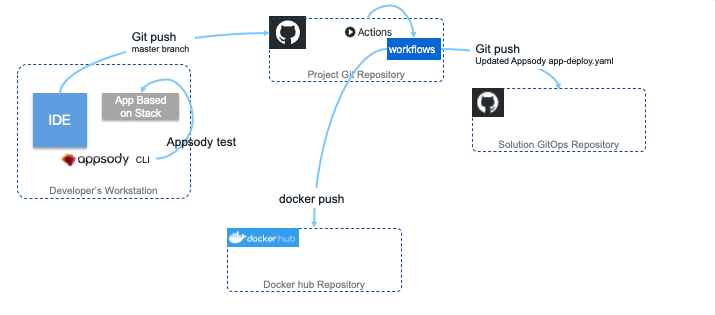
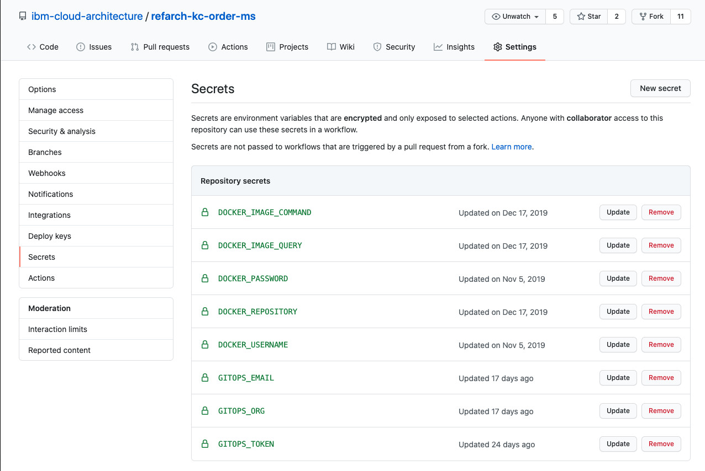
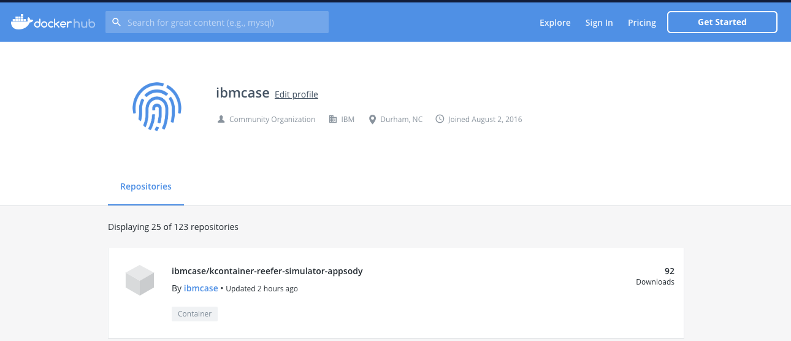

<PageDescription>
The implemented DevOps pipelines for the Reefer Container Shipment solution reference implementation of the Event-Driven Reference Architecture. This chapter focuses on the <strong>Continuous Integration</strong> capability implemented in the reference implementation.
</PageDescription>

# Overview

Our [Continuous Integration (CI) approach](#continuous-integration), _the topic of this chapter_, is one of "zero-infrastructure overhead". To accomplish this goal, we utilize [GitHub Actions](https://github.com/features/actions) to build and push a microservice's associated container images to [Docker Hub](https://hub.docker.com/u/ibmcase) for public consumption. The GitHub Actions workflows are defined in the owning repository's `.github/workflows/dockerbuild.yaml` file.

Our [GitOps approach](/infrastructure/devops-gitops) focuses on a single-repository, environment-per-subdirectory model which can be forked and cloned to replicate deployments to other clusters and environments. The reference implementation utilizes [Kustomize](https://kustomize.io/) as its templating technology to utilize the `app-deploy.yaml` files, provided by each individual microservice, as a base and then layer in environment-specific configuration and credentials as needed.

Our [Continuous Delivery (CD) approach](/infrastructure/devops-continuous-delivery/) focuses on a GitOps-based delivery model, using a GitHub repository as a single source of truth for the deployment, management, and operations of our running application components. In this model, we have the flexibility to use multiple open-source technologies to apply the single source of truth from a given GitHub repository onto a desired cluster environment.

# Continuous integration

The continuous integration workflow for our project is detailed figure below:

On the left side, the developer uses their environment with Appsody CLI to build and test the code. Once tests have run successfully, they commit and push the code to the main branch, which triggers the GitHub Actions workflow. For the walkthrough of our CI process, we will be using the [Order Command](https://github.com/ibm-cloud-architecture/refarch-kc-order-ms/tree/master/order-command-ms) microservice as our reference point.

## Task 1 - Validate Docker Secrets

The first task in each GitHub Actions workflow, **[validate-docker-secrets](https://github.com/ibm-cloud-architecture/refarch-kc-order-ms/blob/master/.github/workflows/dockerbuild.yaml#L11-L53)**, ensures that all the necessary Secrets are defined on the repository under which the build action is running. Similar to Kubernetes Secrets, [GitHub Repository Secrets](https://help.github.com/en/actions/automating-your-workflow-with-github-actions/creating-and-using-encrypted-secrets) allow you to store encrypted, sensitive information in a programmatically accessible way.

Here is an example of such secret definitions:

## Task 2 - Build Component Images

The majority of the microservices that comprise the Reefer Container Shipment solution reference implementation are built using the [Appsody](https://appsody.dev) open-source project. While each microservice is free to choose its own specific technology for implementation via [Appsody Stacks](https://appsody.dev/docs/stacks/stacks-overview), each component can be easily built in any given environment by issuing the [`appsody build` commands](https://appsody.dev/docs/using-appsody/building-and-deploying).

The second task in each component microservice's workflow, **[build-docker-image](https://appsody.dev/docs/using-appsody/building-and-deploying)**:
  - runs on a base Ubuntu container image
  - creates a new semantically-versioned tag _(in the form of `0.1.2`)_ for the repository
  - installs the latest Appsody CLI tools, performs the `appsody build` command with the [appropriate parameters](https://appsody.dev/docs/using-appsody/building-and-deploying#building-your-runtime-docker-image-with-appsody)
  - tags the newly created version-specific image with `latest` as well
  - pushes the image with both tags to the public Docker Hub repository defined by the aforementioned repository secrets
  - and stores the `app-deploy.yaml` generated by the `appsody build` for use in the next task of updating the GitOps repository.

## Task 3 - Update GitOps

The final task, **[update-gitops](https://github.com/ibm-cloud-architecture/refarch-kc-order-ms/blob/master/.github/workflows/dockerbuild.yaml#L119-L153)**, is the linkage to our [GitOps implementation](/infrastructure/devops-gitops/), which is publicly available via [ibm-cloud-architecture/refarch-kc-gitops](https://github.com/ibm-cloud-architecture/refarch-kc-gitops).

This task updates the `app-deploy.yaml` file in every environment subdirectory in the GitOps repository for that specific microservice, by replacing each copy with the newly revised `app-deploy.yaml` generated in the previous task.

This simple approach of overwriting works for two reasons:
 - The `app-deploy.yaml` that is checked into the original microservice repository is patched by the `appsody build` command, such as updating the image tag.
 - No changes are made directly to the `app-deploy.yaml` file within the GitOps repo. Instead, modifications required for each environment are stored as patches, applied using `kustomize` at deployment time.

The update is performed via a standard `git commit` process, as this allows for a visible audit trail of environment management and operations updates - one of the key advantages of the GitOps approach!

# Next steps

_For details on how the GitOps repository is structured and how to create your own environment definitions,_ reference the peer [GitOps Environments](/infrastructure/devops-gitops/) chapter of this manual.

_For details on how the Continuous Delivery implementation leverages the GitOps artifacts,_ reference the peer [Continuous Delivery (CD)](/infrastructure/devops-continuous-delivery/) chapter of this manual.
