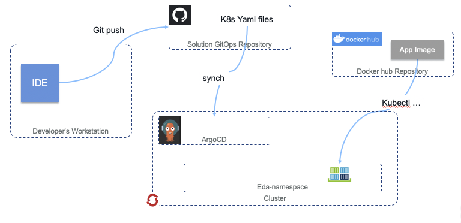
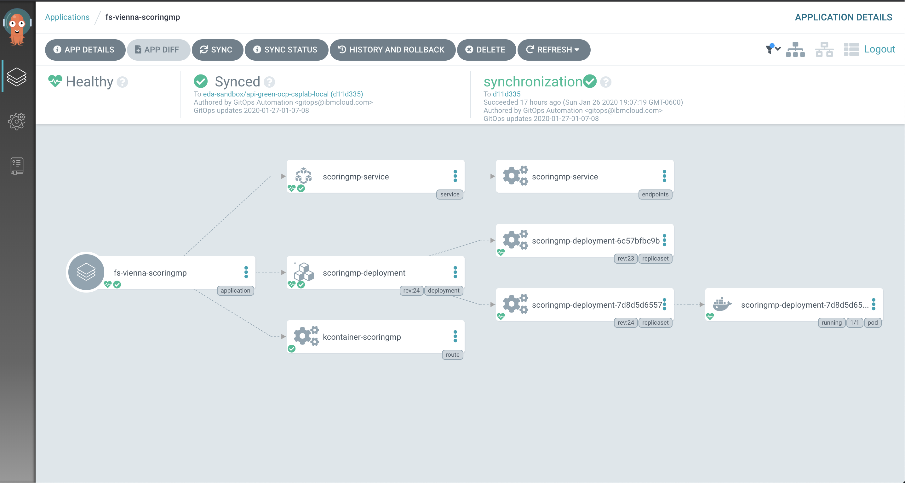
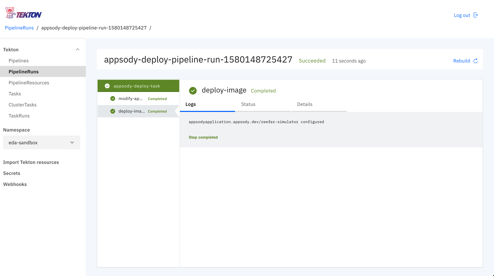

<PageDescription>
The implemented DevOps pipelines for the Reefer Container Shipment solution reference implementation of the Event-Driven Reference Architecture.
</PageDescription>

## Overview

Our [Continuous Integration (CI) approach](#continuous-integration) is one of "zero-infrastructure overhead". As such, we utilize GitHub Actions to build and push a microservice's associated container images to Docker Hub for public consumption. The GitHub Actions workflows are defined in the owning repository's `.github/workflows/dockerbuild.yaml` file.

Our [Continuous Deployment (CD) approach](#continuous-deployment) focuses on a GitOps-based deployment model, using Git as a single source of truth for the deployment, management, and operations of our running application components. In this model, we have the flexibility to use multiple open-source technologies to apply the single source of truth from a given Git repository onto a desired cluster environment. More detail around the background of GitOps and how it differs from traditional deployment models can be found in [this blog post](https://www.weave.works/technologies/gitops/) from WeaveWorks.

## Continuous integration

The continuous integration workflow for our project is detailed figure below:


On the left side, the developer uses his environment with Appsody CLI to build and test his code. Once tests have run successfully, they commit and push the code to the master branch, which triggers the GitHub Actions workflow. For the walkthrough of our CI process, we will be using the [Order Command microservice](https://github.com/ibm-cloud-architecture/refarch-kc-order-ms/tree/master/order-command-ms) as our reference point.

### Step 1 - Validate Docker Secrets

The first job in each GitHub Actions workflow, **[validate-docker-secrets](https://github.com/ibm-cloud-architecture/refarch-kc-order-ms/blob/master/.github/workflows/dockerbuild.yaml#L11-L47)**, ensures that all the necessary Secrets are defined on the repository under which the build action is running. Similar to Kubernetes Secrets, [GitHub Repository Secrets](https://help.github.com/en/actions/automating-your-workflow-with-github-actions/creating-and-using-encrypted-secrets) allow you to store encrypted, sensitive information in a programmatically accessible way.

Here is an example of such secret definitions:


### Step 2 - Build Component Images

#### Container builds via Appsody

The majority of the microservices that comprise the Reefer Container Shipment solution reference implementation are built using the [Appsody](https://appsody.dev) open-source project. While each microservice is free to choose its own specific technology for implementation via Appsody Stacks, each component can easily built in any given environment by issuing the []`appsody build` commands](https://appsody.dev/docs/using-appsody/building-and-deploying).

The second job in each component microservice's workflow, **[build-docker-image](https://appsody.dev/docs/using-appsody/building-and-deploying)**, runs on a base Ubuntu container image, creates a new semantically-versioned tag _(in the form of `0.1.2`)_ for the repository, installs the latest Appsody CLI tools, performs the `appsody build` command with the [appropriate parameters](https://appsody.dev/docs/using-appsody/building-and-deploying#building-your-runtime-docker-image-with-appsody), tags the newly created version-specific image with `latest` as well, and pushes the image with both tags to the public Docker Hub repository defined by the aforementioned repository secrets.


#### Manual container builds

While most microservices in the reference implementation have been implemented using Appsody, some have not - either due to legacy or technical reasons. For these microservices, we leverage the native build method for each project's technology inside of a `Dockerfile` - a Maven-based `mvn clean install` build for Java microservices, an `npm install && ng build` for Node & Angular microservices, etc.

For this example, we will reference the [User Interface](/microservices/user-interface/) component of the solution implementation. The second job in the Github Action workflow file, **[build-docker-image](https://github.com/ibm-cloud-architecture/refarch-kc-ui/blob/master/.github/workflows/dockerbuild.yaml#L48-L77)**, runs on a base Ubuntu container image, creates a new semantically-versioned tag _(in the form of `0.1.2`)_ for the repository, performs a traditional `docker build` using the [Dockerfile](https://github.com/ibm-cloud-architecture/refarch-kc-ui/blob/master/Dockerfile), tags the newly created version-specific image with `latest` as well, and pushes the image with both tags to the public Docker Hub repository defined by the aforementioned repository secrets.

### Step 3 - GitOps Updates

The final job, **[gitops-repo-webhook](https://github.com/ibm-cloud-architecture/refarch-kc-order-ms/blob/master/.github/workflows/dockerbuild.yaml#L115-L123)**, is a linkage to our general [continuous deployment process](#continuous-deployment), which is GitOps-based and available via [ibm-cloud-architecture/refarch-kc-gitops](https://github.com/ibm-cloud-architecture/refarch-kc-gitops). This step performs a webhook call to our GitOps repository to notify it that a component microservices CI build has completed and it should scan for the latest version of all the known container images and update the associated environment deployment files. The repository action dispatcher triggers the remote [GitHub Actions workflow](https://github.com/ibm-cloud-architecture/refarch-kc-gitops/blob/master/.github/workflows/update-gitops-deployments-(eda-integration).yaml) in the GitOps repository, so all corresponding YAML files can be updated.

_For details on how the GitOps process is applied,_ including how to create the necessary source files that the continuous deployment process requires, reference the [GitOps chapter](/infrastructure/devops/) of this manual.

_For implementation details on how the GitHub Actions automation works to update the GitOps components to the latest versions,_ reference the [github.com/ibm-cloud-architecture/actions-update-gitops](https://github.com/ibm-cloud-architecture/actions-update-gitops) repository to understand the update workflow

## Continuous deployment

<InlineNotification kind="warning"><strong>TODO</strong> This section needs to be revised based on the updated GitOps pattern</InlineNotification>

One of the main tools used in this space is a GitOps-focused continuous deployment project named [ArgoCD](https://argoproj.github.io/argo-cd/). As documented by the [IBM Garage for Cloud](https://ibm-garage-cloud.github.io/ibm-garage-developer-guide/guides/continuous-delivery) team, ArgoCD can monitor GitHub-based projects and apply changes stored in that repository's YAML files to a running Kubernetes-based cluster.

Another DevOps tool which provides the opportunity to deployment applications via the GitOps methodology is [Tekton](https://tekton.dev/). The Tekton Pipelines project provides a declarative language for defining and executing both CI and CD-style pipelines, all defined with common Kubernetes-like nomenclature. It even has the capability to kick off pipeline runs based off of GitHub webhooks.

We have documented our general GitOps strategy & methodology for generation of deployment source configuration files in the [GitOps chapter](/infrastructure/devops/) of this manual, while the details of our ArgoCD-based deployments are covered in the [ArgoCD deployments](#argocd-deployments) section below and the details of our Tekton-based deployments are covered in the [Tekton deployments](#tekton-deployments) section below.

## ArgoCD deployments

Our main continuous deployment pattern operates on the same principle of _"zero-infrastructure overhead"_ as our [continuous integration](#continuous-integration) implementations. This allows us to be agile, adaptable, and efficient in what we deploy where.  ArgoCD is a perfect companion to this principle, as we do not need additional long-running CD infrastructure to monitor either a source environment or a target deployment environment. Our CI process sits with our code (on the same hosted infrastructure), while our CD process sits with the target deployment environment (on the same Kubernetes-based cluster).



To utilize ArgoCD in this manner, we define a set of Kubernetes YAMLs generated from `helm template` commands, with environment, namespace, and cluster-specific parameters provided as needed.  The details of generating those `helm template` YAMLs can be found in our main [Application Components](/microservices/application-components/#deploy-application-microservices) documentation. The templated YAMLs are generated with the names of the required ConfigMaps and Secrets specific to a namespace on the eventual target deployment cluster. This allows us to create a deployment artifact programmatically without exposing confidential and secret credentials via source code.

Once these YAMLs are generated, they are checked in to the main [GitOps repository](https://github.com/ibm-cloud-architecture/refarch-kc-gitops) for the project, under a new branch with a branch name in the format of `<namespace>/<cluster>` for ease of identification. These will then have a folder structure of `/<component-name>/templates/<artifact-type>.yaml`, with most components providing Deployment, Service, and Route artifact YAMLs.

An ArgoCD application is then created on the ArgoCD deployment inside the target environment that can read from the GitOps repository. ArgoCD can also deploy between clusters, which does come in handy in certain use cases, but remember our squads main goal of _"zero-infrastructure overhead"_, so we deploy from ArgoCD into the same cluster it is deployed on the majority of the time. The ArgoCD application is a Custom-Resource Definition, comprising of the details necessary to determine the remote code repository URL, the branch of the code to use, the target namespace, and any formatting capabilities that are necessary.



ArgoCD then handles automatically (or manually) syncing the deployments in the target namespace with the state that is described in the YAMLs on the specific branch in the GitOps repository. To keep in sync with the continuous integration implementation we have defined in [continuous integration](#continuous-integration), we have an additional GitHub Actions workflow defined in this repository that will update the YAML files contained in the repository with the latest microservice container images as they are modified, thus enabling a completely automated build-to-deployment lifecycle.

Defined in the [.github/workflows/update-gitops-deployments-(eda-integration).yaml](https://github.com/ibm-cloud-architecture/refarch-kc-gitops/blob/master/.github/workflows/update-gitops-deployments-(eda-integration).yaml) workflow file, the workflow will scan the repository for all templated use of container images in Kubernetes Deployment files (and recently updated to be extensible to any YAML-based file!), search Docker Hub for the latest version of that container image, update the YAML file in-place, and check in the YAML updates back to the same repository and branch. This process is kicked off by the webhook Jobs mentioned in our CI process, as well as on a regularly-scheduled cron-like timer.

### Deploying a microservice with ArgoCD

You can deploy both the `simulator` and the `scoring-mp` microservices using ArgoCD in this reference implementation. The process is the same for either microservice, with minor parameter configuration being the only difference between the two.

#### Prerequisites

1. Ensure all necessary Kubernetes ConfigMaps and Secrets have been created in the namespace in which the application will be running.
2. Ensure ArgoCD has been deployed to the local cluster with connectivity to the internet.

#### Using the ArgoCD dashboard

1. Access the ArgoCD Dashboard via it's exposed Route in the `argocd` namespace. This should be in the form of `https://argocd-server-argocd.apps.[cluster-based-route]`.
2. Depending upon your cluster and ArgoCD, you will have specific login credentials. Login as directed and click **NEW APPLICATION**.
3. Enter the following parameters for either the _**SpringContainerMS**_ or _**scoring-mp**_ microservice and click **CREATE**.
    * **SpringContainerMS**
        * **Application Name:** `springcontainerms`
        * **Project:** Select `default` from the drop-down
        * **Sync Policy:** Select `Automatic` from the drop-down
        * **Repository URL:** `https://github.com/ibm-cloud-architecture/refarch-kc-gitops.git`
        * **Revision:** `eda-sandbox/api-green-ocp-csplab-local` _(this is the branch in the GitOps repository for our specific project on our specific cluster)_
        * **Path:** `springcontainerms`
        * **Cluster:** `https://kubernetes.default.svc` _(this is our local cluster)_
        * **Namespace:** Your desired target namespace
        * Check the **Directory: Include subdirectories** checkbox
    * **scoring-mp**
        * **Application Name:** `scoring-mp`
        * **Project:** Select `default` from the drop-down
        * **Sync Policy:** Select `Automatic` from the drop-down
        * **Repository URL:** `https://github.com/ibm-cloud-architecture/refarch-kc-gitops.git`
        * **Revision:** `eda-sandbox/api-green-ocp-csplab-local` _(this is the branch in the GitOps repository for our specific project on our specific cluster)_
        * **Path:** `scoring-mp`
        * **Cluster:** `https://kubernetes.default.svc` _(this is our local cluster)_
        * **Namespace:** Your desired target namespace
        * Check the **Directory: Include subdirectories** checkbox
4. Once the application is successfully created inside ArgoCD, you can click the application tile to see the latest status of the ArgoCD-managed, GitOps-deployed microservice instance. It should begin synchronizing immediately upon creation.
5. As ArgoCD applies the desired configuration to the cluster, you should see the pods of the microservice being created:
```shell
kubectl get Pods
```

#### Using the command-line interface

ArgoCD provides a command-line interface as well, however we are not covering that in this reference implementation. Once you are satisfied with the ArgoCD dashboard-based deployment pattern, you can reference the [ArgoCD Getting Started docs](https://argoproj.github.io/argo-cd/getting_started/) for further details on using the [ArgoCD CLI](https://argoproj.github.io/argo-cd/cli_installation/) and CRD YAMLs for programmatic interaction.

## Tekton deployments

We have also implemented some facets of the project deployment workflows using the [Tekton Pipelines](https://tekton.dev/) project and its inherent ease of support of the [Appsody](https://appsody.dev/) open-source developer experience project through the standard integration between the two built into the [Kabanero](https://kabanero.io/) open-source project, or more formally, the [IBM Cloud Pak for Applications](https://www.ibm.com/cloud/cloud-pak-for-applications).


Defined in the [/scripts/tekton](https://github.com/ibm-cloud-architecture/refarch-reefer-ml/tree/master/scripts/tekton) directory, we have a simple pipeline that will utilize the `appsody deploy` command to deploy the generated **AppsodyApplication** custom resource definition YAML to the target environment. Similar to our ArgoCD-based deployments of Helm-generated, standard Kubernetes YAMLs, AppsodyApplication YAMLs can also be deployed through ArgoCD in a GitOps manner. However, for demonstration inside this project, additional capabilities are provided to showcase how we can utilize different pieces of the platform to deploy similar applications when different requirements are presented. Similar to ArgoCD, Tekton Pipelines run on the same cluster _(and often in the same namespace!)_ as your running application code, thus allowing for more programmatic control over the deployment, management, operations, and existence of your application components.

The key artifact that enables Tekton to deploy our Appsody-based `refarch-reefer-ml/simulator` microservice is the generated `app-deploy.yaml` file. The [refarch-reefer-ml/simulator/app-deploy.yaml](https://github.com/ibm-cloud-architecture/refarch-reefer-ml/blob/master/simulator/app-deploy.yaml) file was generated according to the `appsody build` command and then annotated with the required environment variables and metadata for successful operation in a given namespace, very similar to the pattern required for generating our Helm-templated YAMLs in the [ArgoCD deployments](#argocd-deployments) section above.


We then make use of the [Appsody Operator](https://appsody.dev/docs/using-appsody/building-and-deploying#deployment-via-the-appsody-operator---overview) to apply the AppsodyApplication to the target environment through the `appsody deploy --no-build` command. As documented in the [Appsody Docs](https://appsody.dev/docs/using-appsody/building-and-deploying#deploying-your-application-through-docker-hub), we are able to take advantage of the pre-built container images available on Docker Hub and the annotated `app-deploy.yaml` file that is now a synonymous GitOps-like deployment artifact to quickly apply the change to the target namespace in the same cluster. Once the `appsody deploy` command is succesful, the Appsody Operator and Kubernetes takes care of the rest and reconciles the necessary underlying Kubernetes artifacts that are required to fulfill the requirements of serving up the application code in real-time!



### Deploying the simulator microservice with Tekton & Appsody

#### Prerequisites

1. Ensure all necessary Kubernetes ConfigMaps and Secrets have been created in the namespace in which the application will be running.
2. Ensure an [Appsody Operator](https://appsody.dev/docs/using-appsody/building-and-deploying#deployment-via-the-appsody-operator---overview) has been configured to watch the namespace in which the application will be running.
3. Create a new or modify an existing Service Account in the target namespace and bind the required API RBAC requirements for the Appsody Operator.
    * Further details available in the [Appsody Docs](https://appsody.dev/docs/using-appsody/building-and-deploying#rbac-considerations-for-the-use-of-appsody-deploy-and-appsody-operator-commands)
    * A sample YAML document has been provided via [rbac-sa.yaml](https://github.com/ibm-cloud-architecture/refarch-reefer-ml/blob/master/scripts/tekton/rbac-sa.yaml), with environment-specific updates to the Namespace and Service Account name fields being required.
3. From the `refarch-reefer-ml` directory, import the Tekton pipeline artifacts:
```shell
kubectl apply -f scripts/tekton/
```
4. Validate these items have been imported successfully by querying the cluster:
```shell
kubectl get Pipeline,Task,PipelineResource
```

#### Using the command-line interface

1. Open the `/scripts/tekton/manual/simulator-pipeline-run.yaml` file in a text editor and ensure everything makes sense.
2. Kick off a new pipeline run with the Kubernetes CLI:
```shell
kubectl create -f scripts/tekton/manual/simulator-pipeline-run.yaml
```
3. You can monitor the pipeline by common `kubectl get` and `kubectl describe` commands:
```shell
kubectl get PipelineRun
```
For further details on how to access the logs of a PipelineRun, reference the [Tekton Pipelines documentation](https://github.com/tektoncd/pipeline/blob/v0.9.2/docs/logs.md).
4. Once the pipeline completes, you should see a deployed instance of the Simulator Appsody application:
```shell
kubectl get Pods
```

#### Using the Tekton dashboard

1. Access the Tekton Pipelines dashboard from your Kabanero installation or directly via the defined Route. This will be something similar to [https://tekton-dashboard-tekton-pipelines.apps.[cluster-based-route]](https://tekton-dashboard-tekton-pipelines.apps.green.ocp.csplab.local).
2. Click **PipelineRuns** in the left-nav menu and click **Create PipelineRun** from the upper-right of the page.
3. Enter the following parameters and click **Create**:
    * **Namespace:** Target namespace for application deployment target
    * **Pipeline:** `appsody-deploy-pipeline`
    * **PipelineResources > git-source:** `git-source-reefer-ml`
    * **Params > context:** `simulator`
    * **Service Account:** `reefer-simulator`
4. A new PipelineRun will be created. Click on the name of the running PipelineRun.
5. From here, you can monitor the live running logs of the pipeline, as well as see what is running from the command-line with Kubectl (`kubectl get pods`). Note that the pipeline is actually running in pods deployed to the target namespace!
