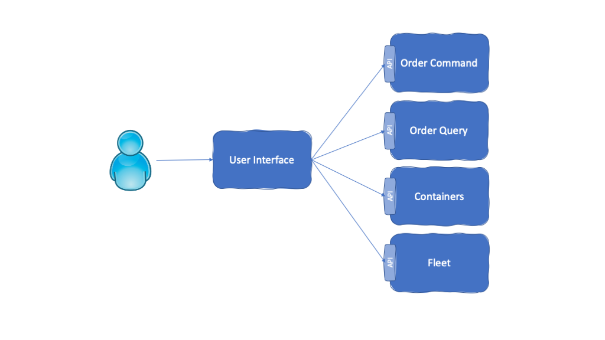
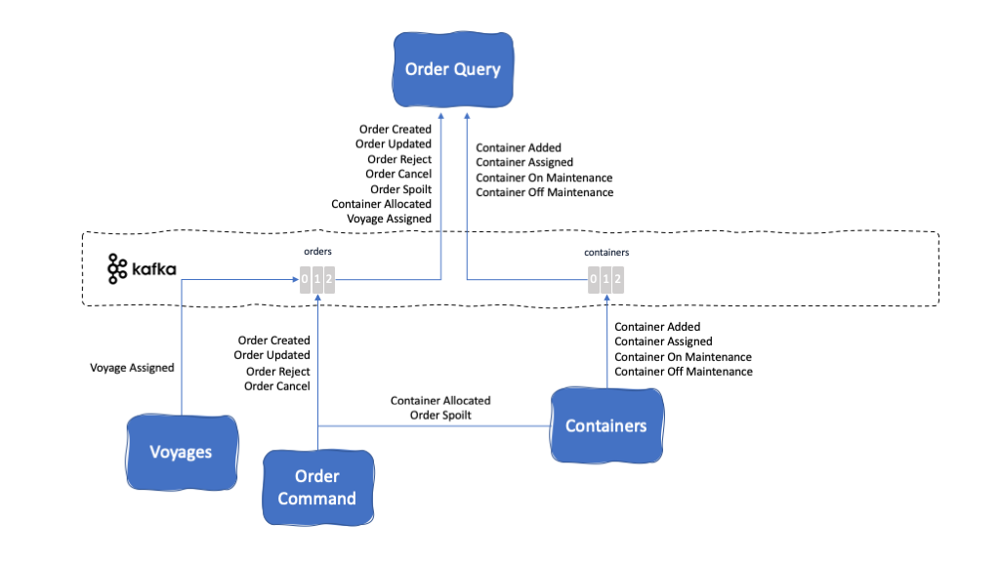

The following list represents the main components of our [Reefer Container Shipment reference application](https://ibm-cloud-architecture.github.io/refarch-kc/) for [Event Driven Architectures](https://ibm-cloud-architecture.github.io/refarch-eda/).

- [User Interface](#user-interface)
- [Orders](#orders)
- [Fleet](#fleet)
- [Voyages](#voyages)
- [Containers](#containers)
- [Telemetry](#telemetry)
- [Simulator](#simulator)

As you will see for each of these components in their respective sections, these can be made up of several microservices. We try to follow the 12 factors for building cloud native applications as well as the best modern and agile development principles such as Domain Driven Design, Test Driven Development, Pair Programming, etc the best we can. However, in some cases, either for simplicity, team bandwidth or own evolution of the components, we might be at a point where we don't tie to the already mentioned best practices as much as we would like to. As we iterate and work through the components to develop and implement new Event Driven patterns as well as new client requirements, we will try to align to the best practices, again, as much as we can. We are also open for contributions, which we will very much appreciate, and have even written a contribution guideline for it [here](../contributing.mdx)

For each of the components above, we will relate them with the events they produce and consume, the Kafka topics they produce to and consume from and the EDA patterns they are part of.

- [Events](#events)
- [Topics](#topics)
- [EDA Patterns](#eda-patterns)

## User Interface



Description: The user interface for our Reefer Container Shipment reference application is implemented as a single microservice using Node.js and Angular.js. The goal of this component is to serve a user interface for customers to:

- Log in
- Create an order
- List all orders
- List all containers
- Initiate shipping simulation

Github repository: [refarch-kc-ui](https://github.com/ibm-cloud-architecture/refarch-kc-ui)

Kafka topics it subscribes to: None

Kafka topics it produces to: None

## Orders

Description: Main goal of the Orders component is to manage the shipping orders. This component is made up of two microservices, one called Order Command and the other Order Query. The reason for this component to be split into two microservices is to implement the [**Command Query Responsibility Segregation (CQRS)**](#command-query-responsibility-segregation-(cqrs)) pattern.

### Order Command


This microservice will implement the write logic in the CQRS pattern. That is, will be in charge of managing the state of shipping orders.

This microservice has been implemented using MicroProfile 3.0. and runs on OpenLiberty.

Github repository: [refarch-kc-order-ms](https://github.com/ibm-cloud-architecture/refarch-kc-order-ms)

Folder: [order-command-ms](https://github.com/ibm-cloud-architecture/refarch-kc-order-ms/order-command-ms)

Kafka topics it subscribes to:

- [Order Commands Topic](#order-commands-topic)
- [Order Topic](#orders-topic)

Kafka topics it produces to:

- [Order Commands Topic](#order-commands-topic)
- [Order Topic](#orders-topic)
- [Errors Topic](#errors-topic)

Events that listens (and reacts) to:

- [Order Command Event](#order-command-event)
- [Container Allocated Event](#container-allocated-event)
- [Container Not Found Event](#container-not-found-event)
- [Voyage Assigned Event](#voyage-assigned-event)
- [Voyage Not Found Event](#voyage-not-found-event)
- [Order Spoilt Event](#order-spoilt-event)

Events that produces:

- [Order Command Event](#order-command-event)
- [Order Created Event](#order-created-event)
- [Order Updated Event](#order-updated-event)
- [Order Reject Event](#order-reject-event)
- [Order Cancel Event](#order-cancel-event)
- [Error Event](#error-event)

EDA Patterns that implements:

- [Command Query Responsibility Segregation (CQRS)](#command-query-responsibility-segregation-(cqrs))
- [SAGA](#saga)
- [Consume-transform-produce Loop](#consume-transform-produce-loop)
- [Order Cancellation](#order-cancellation)

### Order Query



This microservice will implement the query logic in the CQRS pattern. That is, will be in charge of implementing any type of query that is needed based on building the necessary projections over the totality of the data. In order to build those projections, this microservice might well listen to several topics and events.

This microservice has been implemented using MicroProfile 3.0. and runs on OpenLiberty.

Github repository: [refarch-kc-order-ms](https://github.com/ibm-cloud-architecture/refarch-kc-order-ms)

Folder: [order-query-ms](https://github.com/ibm-cloud-architecture/refarch-kc-order-ms/order-query-ms)

Kafka topics it subscribes to:

- [Order Topic](#orders-topic)
- [Containers Topic](#containers-topic)

Kafka topics it produces to: None

Events that listens (and reacts) to:

- [Order Created Event](#order-created-event)
- [Order Updated Event](#order-updated-event)
- [Order Reject Event](#order-reject-event)
- [Order Cancel Event](#order-cancel-event)
- [Order Spoilt Event](#order-spoilt-event)
- [Voyage Assigned Event](#voyage-assigned-event)
- [Container Allocated Event](#container-allocated-event)
- [Container Added Event](#container-added-event)
- [Container On Maintenance Event](#container-on-maintenance-event)
- [Container Off Maintenance Event](#container-off-maintenance-event)
- [Container Assigned Event](#container-assigned-event)

Events that produces: None

EDA Patterns that implements:

- [Command Query Responsibility Segregation (CQRS)](#command-query-responsibility-segregation-(cqrs))

## Fleet

Description: This microservice will manage the fleet of ships.

Github repository: [refarch-kc-ms](https://github.com/ibm-cloud-architecture/refarch-kc-ms)

Folder: [fleet-ms](https://github.com/ibm-cloud-architecture/refarch-kc-ms/fleet-ms)

Kafka topics it subscribes to:

Kafka topics it produces to:

Events that listens (and reacts) to:

Events that produces:

EDA Patterns that implements:

## Voyages


Description: This microservice manages the voyages for each ship. A voyage consist of carrying a limited amount of goods from a source port to a destination port being the goods carried by a uniquely identified ship on a specific date. All those attributes make a voyage unique and these voyages are managed by this microservice. Voyages microservice will then be responsible to allocate a voyage to an order based on where this order needs to be carried from and to, the window time the goods need to be carried within and the amount of goods to be carried. So far, this microservice will assign a voyage to an order (and manage the remaining capacity on the ship making such voyage) if any suitable voyage is found and emit the consequent VoyageAssigned Event or will otherwise emit a VoyageNotFound Event.

This microservice is written in NodeJS.

Github repository: [refarch-kc-ms](https://github.com/ibm-cloud-architecture/refarch-kc-ms)

Folder: [voyage-ms](https://github.com/ibm-cloud-architecture/refarch-kc-ms/voyage-ms)

Kafka topics it subscribes to:

- [Order Topic](#orders-topic)

Kafka topics it produces to:

- [Order Topic](#orders-topic)

Events that listens (and reacts) to:

- [Order Created Event](#order-created-event)
- [Order Reject Event](#order-reject-event)
- [Order Cancel Event](#order-cancel-event)
- [Container Allocated Event](#container-allocated-event)
- [Container Not Found Event](#container-not-found-event)

Events that produces:

- [Voyage Assigned Event](#voyage-assigned-event)
- [Voyage Not Found Event](#voyage-not-found-event)

EDA Patterns that implements:

- [SAGA](#saga)

## Containers


Description: This microservice manages the container inventory. That is, this microservice will be in charge of keeping an inventory of all the containers registered in the system along with their status, size and location. When a new order is created and received, the container microservice will be in charge of assigning a container to this new shipping order based if a container is available that suits the order's quantity and source port. Otherwise, will emit a ContainerNotFound event for the interested parties in the overall Reefer Container Shipment solution.

This microservice will also manage any container anomaly during the shipping of goods. That is, this microservice will monitoring ContainerAnomaly Events received for any particular container and in the case that these are received, it will mark the container for maintenance, send a OrderSpoilt Event so that any other microservice in the overall solution is aware that the fresh goods this container was carrying are now spoilt and will call a Business Process Manager (BPM) process in to automatically trigger the assignment of a field engineer to repair the container when it reaches the destination port.

This microservice is implemented with Spring Framework and runs on Tomcat.

Github repository: [refarch-kc-container-ms](https://github.com/ibm-cloud-architecture/refarch-kc-container-ms)

Kafka topics it subscribes to:

- [Order Topic](#orders-topic)
- [Containers Topic](#containers-topic)
- [container Anomaly Retry Topic](#container-anomaly-retry-topic)

Kafka topics it produces to:

- [Order Topic](#orders-topic)
- [Containers Topic](#containers-topic)
- [container Anomaly Retry Topic](#container-anomaly-retry-topic)
- [Container Anomaly Dead Topic](#container-anomaly-dead-topic)

Events that listens (and reacts) to:

- [Order Created Event](#order-created-event)
- [Order Reject Event](#order-reject-event)
- [Order Cancel Event](#order-cancel-event)
- [Container Added Event](#container-added-event)
- [Container Anomaly Event](#container-anomaly-event)
- [Container Anomaly Retry Event](#container-anomaly-retry-event)
- [Container On Maintenance Event](#container-on-maintenance-event)
- [Container Off Maintenance Event](#container-off-maintenance-event)

Events that produces:

- [Order Spoilt Event](#order-spoilt-event)
- [Container Allocated Event](#container-allocated-event)
- [Container Not Found Event](#container-not-found-event)
- [Container Assigned Event](#container-assigned-event)
- [Container Anomaly Retry Event](#container-anomaly-retry-event)
- [Container Anomaly Dead Event](#container-anomaly-dead-event)
- [Container On Maintenance Event](#container-on-maintenance-event)
- [Container Off Maintenance Event](#container-off-maintenance-event)

EDA Patterns that implements:

- [SAGA](#saga)
- [Dead Letter Queue (DLQ)](#dead-letter-queue(dlq))
- [Container Anomaly](#container-anomaly)

## Telemetry


Description: This microservice will be responsible for listening to the [Reefer Telemetry Topic](#reefer-telemetry-topic) topic where the IOT sensor devices of the Reefer Containers will be sending their telemetry data to. These telemetry events will be read and used to contact a container anomaly prediction service based on Watson Machine Learning hosted on the IBM Cloud. Depending on whether the prediction service predicts a container anomaly, this Telemetry microservice will send a [Container Anomaly Event](#container-anomaly-event) to the [Containers Topic](#containers-topic) for the [Containers microservice](#containers) to handle the shipping goods spoilage.

This microservice has been implemented using the latest [Reactive Messaging](#reactive-messaging) feature of MicroProfile 3.0. running on the OpenLiberty server.

Github repository: [refarch-reefer-ml](https://github.com/ibm-cloud-architecture/refarch-reefer-ml)

Folder: [scoring-mp](https://github.com/ibm-cloud-architecture/refarch-reefer-ml/scoring-mp)

Kafka topics it subscribes to:

- [Reefer Telemetry Topic](#reefer-telemetry-topic)

Kafka topics it produces to:

- [Containers Topic](#containers-topic)

Events that listens (and reacts) to:

- [Container Telemetry Event](#container-telemetry-event)

Events that produces:

- [Container Anomaly Event](#container-anomaly-event)

EDA Patterns that implements:

- [Reactive Messaging](#reactive-messaging)

## Simulator


Description: The Simulator webapp is a simple python (3.7) flask web app exposing a REST POST end point to control the type of simulation to run and to produce Reefer telemetry events to kafka reeferTelemetry topic.

This microservice has been implemented using the Appsody python flask stack.

Github repository: [refarch-reefer-ml](https://github.com/ibm-cloud-architecture/refarch-reefer-ml)

Folder: [simulator](https://github.com/ibm-cloud-architecture/refarch-reefer-ml/simulator)

Kafka topics it subscribes to: None

Kafka topics it produces to:

- [Reefer Telemetry Topic](#reefer-telemetry-topic)

Events that listens (and reacts) to: None

Events that produces:

- [Container Telemetry Event](#container-telemetry-event)

EDA Patterns that implements: None

## Events

### Order Command Event

Description: These events are produced as a result of user interaction through the [User Interface](#user-interface). These events will command the creation, update or cancellation of a shipping order. In EDA space, a command is an action demanded or triggered by an actor. These events are of important relevance in the [Consume-transform-produce loop](#consume-transform-produce-loop) pattern.

Topic these events are produced to/consumed from:

- [Order Commands Topic](#order-commands-topic)

Components that produce these events:

- [Order Command](#order-command)

Components that react to these events:

- [Order Command](#order-command)

Patterns these events are relevant to:

- [Consume-transform-produce loop](#consume-transform-produce-loop)

Data Schema: [Order Command Event Schema](https://github.com/ibm-cloud-architecture/refarch-kc/data_schemas/ibm/eda/kc/order/orderCommandEvent.avsc)

Example:

```json
{
  "payload": {
    "customerID": "FishFarm",
    "destinationAddress": {
      "city": "Oakland",
      "country": "USA",
      "state": "CA",
      "street": "100 Main street",
      "zipcode": "95053"
    },
    "expectedDeliveryDate": "2019-03-31T13:30Z",
    "orderID": "85eb9236-ed11-4ba5-b4ec-055cb261ae6d",
    "pickupAddress": {
      "city": "Shanghai",
      "country": "China",
      "state": "NE",
      "street": "1 a new street",
      "zipcode": "090"
    },
    "pickupDate": "2019-01-25T13:30Z",
    "productID": "Fish",
    "quantity": 100,
    "status": "toBeCreated"
  },
  "timestampMillis": 1588010525662,
  "type": "CreateOrderCommand",
  "version": "1"
}
```

### Order Created Event

Description: These events are produced as a result of a new shipping order being created. These events are emitted in order to inform any other component of the overall Reefer Container Shipment solution such as the [Containers](#containers) and [Voyage](#voyage) components, that are part of the [SAGA](#saga) pattern to find a container and a voyage to get allocated and assigned, or the [Order Query](#order-query) component, that will track the status of the orders and containers for the query part of the [Command Query Responsibility Segregation (CQRS)](#command-query-responsibility-segregation-(cqrs)) pattern for the overall solution.

Topic these events are produced to/consumed from:

- [Order Topic](#orders-topic)

Components that produce these events:

- [Order Command](#order-command)

Components that react to these events:

- [Order Query](#order-query)
- [Containers](#containers)
- [Voyage](#voyage)

Patterns these events are relevant to:

- [SAGA](#saga)
- [Command Query Responsibility Segregation (CQRS)](#command-query-responsibility-segregation-(cqrs))

Data Schema: [Order Created Event Schema](https://github.com/ibm-cloud-architecture/refarch-kc/data_schemas/ibm/eda/kc/order/orderCreatedEvent.avsc)

Example:

```json
{
  "payload": {
    "customerID": "FishFarm",
    "destinationAddress": {
      "city": "Oakland",
      "country": "USA",
      "state": "CA",
      "street": "100 Main street",
      "zipcode": "95053"
    },
    "expectedDeliveryDate": "2019-03-31T13:30Z",
    "orderID": "85eb9236-ed11-4ba5-b4ec-055cb261ae6d",
    "pickupAddress": {
      "city": "Shanghai",
      "country": "China",
      "state": "NE",
      "street": "1 a new street",
      "zipcode": "090"
    },
    "pickupDate": "2019-01-25T13:30Z",
    "productID": "Fish",
    "quantity": 100,
    "status": "pending"
  },
  "timestampMillis": 1588010525896,
  "type": "OrderCreated",
  "version": "1"
}
```

### Order Updated Event

Description: These events are produced as a result of a shipping order being updated. These events are emitted in order to inform any other component of the overall Reefer Container Shipment solution such as the [Containers](#containers) and [Voyage](#voyage) components, that are part of the [SAGA](#saga) pattern to find a container and a voyage to get allocated and assigned, or the [Order Query](#order-query) component, that will track the status of the orders and containers for the query part of the [Command Query Responsibility Segregation (CQRS)](#command-query-responsibility-segregation-(cqrs)) pattern for the overall solution.

Topic these events are produced to/consumed from:

- [Order Topic](#orders-topic)

Components that produce these events:

- [Order Command](#order-command)

Components that react to these events:

- [Order Query](#order-query)
- [Containers](#containers)
- [Voyage](#voyage)

Patterns these events are relevant to:

- [SAGA](#saga)
- [Command Query Responsibility Segregation (CQRS)](#command-query-responsibility-segregation-(cqrs))

Data Schema: [Order Updated Event Schema](https://github.com/ibm-cloud-architecture/refarch-kc/data_schemas/ibm/eda/kc/order/orderUpdatedEvent.avsc)

Example:

```json
{
  "payload": {
    "customerID": "FishFarm",
    "destinationAddress": {
      "city": "Oakland",
      "country": "USA",
      "state": "CA",
      "street": "100 Main street",
      "zipcode": "95053"
    },
    "expectedDeliveryDate": "2019-03-31T13:30Z",
    "orderID": "85eb9236-ed11-4ba5-b4ec-055cb261ae6d",
    "pickupAddress": {
      "city": "Shanghai",
      "country": "China",
      "state": "NE",
      "street": "1 a new street",
      "zipcode": "090"
    },
    "pickupDate": "2019-01-25T13:30Z",
    "productID": "Fish",
    "quantity": 100,
    "status": "pending"
  },
  "timestampMillis": 1588010525896,
  "type": "OrderUpdated",
  "version": "1"
}
```

### Order Spoilt Event

Description: These events denote that a container, which is carrying fresh goods from a source port to a destination port, has spoilt these fresh goods due to an anomaly detected by one or more of its IOT sensors.

Topic these events are produced to/consumed from:

- [Order Topic](#orders-topic)

Components that produce these events:

- [Containers](#containers)

Components that react to these events:

- [Order Command](#order-command)
- [Order Query](#order-query)

Patterns these events are relevant to:

- [Container Anomaly](#container-anomaly)
- [Command Query Responsibility Segregation (CQRS)](#command-query-responsibility-segregation-(cqrs))

Data Schema: [Order Spoilt Event Schema](https://github.com/ibm-cloud-architecture/refarch-kc/data_schemas/ibm/eda/kc/order/orderSpoiltEvent.avsc)

Example:

```json
{
  "orderID": "85eb9236-ed11-4ba5-b4ec-055cb261ae6d",
  "payload": {
    "containerID": "8919",
    "orderID": "85eb9236-ed11-4ba5-b4ec-055cb261ae6d"
  },
  "timestamp": 1588010710172,
  "type": "OrderSpoilt"
}
```

### Order Reject Event

Description: These events are produced as a result of receiving a [Container Not Found Event](#container-not-found-event) or [Voyage Not Found Event](#voyage-not-found-event) as part of the [SAGA](#saga) pattern and will trigger a compensation process for the components in that [SAGA](#saga) pattern.

Topic these events are produced to/consumed from:

- [Order Topic](#orders-topic)

Components that produce these events:

- [Order Command](#order-command)

Components that react to these events:

- [Containers](#containers)
- [Voyages](#voyages)
- [Order Query](#order-query)

Patterns these events are relevant to:

- [SAGA](#saga)
- [Command Query Responsibility Segregation (CQRS)](#command-query-responsibility-segregation-(cqrs))

Data Schema: [Order Reject Event Schema](https://github.com/ibm-cloud-architecture/refarch-kc/data_schemas/ibm/eda/kc/order/orderRejectEvent.avsc)

Example:

```json
{
  "payload": {
    "customerID": "FishFarm",
    "destinationAddress": {
      "city": "Oakland",
      "country": "USA",
      "state": "CA",
      "street": "100 Main street",
      "zipcode": "95053"
    },
    "expectedDeliveryDate": "2019-03-31T13:30Z",
    "orderID": "b00a3d0f-c9f9-4cbd-a6ea-36b8b455c489",
    "pickupAddress": {
      "city": "Shanghai",
      "country": "China",
      "state": "NE",
      "street": "1 a new street",
      "zipcode": "090"
    },
    "pickupDate": "2019-01-25T13:30Z",
    "productID": "Fish",
    "quantity": 100,
    "reason": "A container could not be found for this order",
    "status": "rejected"
  },
  "timestampMillis": 1588010563056,
  "type": "OrderRejected",
  "version": "1"
}
```

### Order Cancel Event

Description: These events are produced as a result of a user/administrator demanding/requesting the cancellation of a shipping order. These events will trigger the process described in the [Order Cancellation](#order-cancellation) pattern.

Topic these events are produced to/consumed from:

- [Order Topic](#orders-topic)

Components that produce these events:

- [Order Command](#order-command)

Components that react to these events:

- [Containers](#containers)
- [Voyages](#voyages)
- [Order Query](#order-query)

Patterns these events are relevant to:

- [SAGA](#saga)
- [Command Query Responsibility Segregation (CQRS)](#command-query-responsibility-segregation-(cqrs))
- [Order Cancellation](#order-cancellation)

Data Schema: [Order Cancel Event Schema](https://github.com/ibm-cloud-architecture/refarch-kc/data_schemas/ibm/eda/kc/order/orderCancelEvent.avsc)

Example:

```json
{
  "payload": {
    "containerID": "1392",
    "customerID": "FishFarm",
    "destinationAddress": {
      "city": "Oakland",
      "country": "USA",
      "state": "CA",
      "street": "100 Main street",
      "zipcode": "95053"
    },
    "expectedDeliveryDate": "2019-03-31T13:30Z",
    "orderID": "649fa8b2-9340-423d-b08c-7fcc633b3a49",
    "pickupAddress": {
      "city": "Shanghai",
      "country": "China",
      "state": "NE",
      "street": "1 a new street",
      "zipcode": "090"
    },
    "pickupDate": "2019-01-25T13:30Z",
    "productID": "Fish",
    "quantity": 100,
    "reason": "Cancel order command received",
    "status": "cancelled",
    "voyageID": "101"
  },
  "timestampMillis": 1588010677588,
  "type": "OrderCancelled",
  "version": "1"
}
```

### Error Event

Description: These events are produced as a result of any error that occurs in the [Order Command](#order-command) component.

Topic these events are produced to/consumed from:

- [Errors Topic](#errors-topic)

Components that produce these events:

- [Order Command](#order-command)

Components that react to these events: None

Patterns these events are relevant to: None

Data Schema: [Error Event Schema](https://github.com/ibm-cloud-architecture/refarch-kc/data_schemas/ibm/eda/kc/order/errorEvent.avsc)

Example:

```json
{
  "errorMessage" : "Repository access issue",
  "payload": {
    "containerID": "1392",
    "customerID": "FishFarm",
    "destinationAddress": {
      "city": "Oakland",
      "country": "USA",
      "state": "CA",
      "street": "100 Main street",
      "zipcode": "95053"
    },
    "expectedDeliveryDate": "2019-03-31T13:30Z",
    "orderID": "649fa8b2-9340-423d-b08c-7fcc633b3a49",
    "pickupAddress": {
      "city": "Shanghai",
      "country": "China",
      "state": "NE",
      "street": "1 a new street",
      "zipcode": "090"
    },
    "pickupDate": "2019-01-25T13:30Z",
    "productID": "Fish",
    "quantity": 100,
    "reason": "Cancel order command received",
    "status": "cancelled",
    "voyageID": "101"
  },
  "timestampMillis": 1588010677588,
  "type": "Error",
  "version": "1"
}
```

### Container Added Event

Description: These events would make the [Containers](#containers) component to create a new container and add it to the container inventory it manages.

Topic these events are produced to/consumed from:

- [Containers Topic](#containers-topic)

Components that produce these events:

- [Containers](#containers)

Components that react to these events:

- [Containers](#containers)
- [Order Query](#order-query)

Patterns these events are relevant to:

- [Command Query Responsibility Segregation (CQRS)](#command-query-responsibility-segregation-(cqrs))

Data Schema: [Container Added Event Schema](https://github.com/ibm-cloud-architecture/refarch-kc/data_schemas/ibm/eda/kc/container/containerAddedEvent.avsc)

Example:

```json
{
  "containerID": "8919",
  "payload": {
    "brand": "itgtests-brand",
    "capacity": 100,
    "containerID": "8919",
    "latitude": 31.4,
    "longitude": 121.5,
    "status": "Empty",
    "type": "Reefer"
  },
  "timestamp": 1588010515,
  "type": "ContainerAdded"
}
```

### Container Assigned Event

Description: These messages denote that a container has been assigned to a shipping order as this container suited the quantity and source port of the shipping order.

Topic these events are produced to/consumed from:

- [Containers Topic](#containers-topic)

Components that produce these events:

- [Containers](#containers)

Components that react to these events:

- [Order Query](#order-query)

Patterns these events are relevant to:

- [Command Query Responsibility Segregation (CQRS)](#command-query-responsibility-segregation-(cqrs))

Data Schema: [Container Assigned Event Schema](https://github.com/ibm-cloud-architecture/refarch-kc/data_schemas/ibm/eda/kc/container/containerAssignedEvent.avsc)

Example:

```json
{
  "containerID": "8919",
  "payload": {
    "containerID": "8919",
    "orderID": "85eb9236-ed11-4ba5-b4ec-055cb261ae6d"
  },
  "timestamp": 1588010526382,
  "type": "ContainerAssignedToOrder"
}
```

### Container Allocated Event

Description: These events denote that a container, to carry the amount of fresh goods and from the source port specified in the shipping order, has been found and allocated to a shipping order, and viceversa, as part of the [SAGA](#saga) pattern for a long running transaction. These events are emitted by the [Containers](#containers) component.

Topic these events are produced to/consumed from:

- [Order Topic](#orders-topic)

Components that produce these events:

- [Containers](#containers)

Components that react to these events:

- [Order Command](#order-command)
- [Order Query](#order-query)

Patterns these events are relevant to:

- [SAGA](#saga)
- [Command Query Responsibility Segregation (CQRS)](#command-query-responsibility-segregation-(cqrs))

Data Schema: [Container Allocated Event Schema](https://github.com/ibm-cloud-architecture/refarch-kc/data_schemas/ibm/eda/kc/container/containerAllocatedEvent.avsc)

Example:

```json
{
  "orderID": "85eb9236-ed11-4ba5-b4ec-055cb261ae6d",
  "payload": {
    "containerID": "8919",
    "orderID": "85eb9236-ed11-4ba5-b4ec-055cb261ae6d"
  },
  "timestamp": 1588010526294,
  "type": "ContainerAllocated"
}
```

### Container Not Found Event

Description: These events denote that a container to carry the amount of fresh goods from the source port specified in a new shipping order could not be found. As a result, the new shipping order will become rejected.

Topic these events are produced to/consumed from:

- [Order Topic](#orders-topic)

Components that produce these events:

- [Containers](#containers)

Components that react to these events:

- [Order Command](#order-command)

Patterns these events are relevant to:

- [SAGA](#saga)

Data Schema: [Container Not Found Event Schema](https://github.com/ibm-cloud-architecture/refarch-kc/data_schemas/ibm/eda/kc/container/containerNotFoundEvent.avsc)

Example:

```json
{
  "orderID": "b00a3d0f-c9f9-4cbd-a6ea-36b8b455c489",
  "payload": {
    "orderID": "b00a3d0f-c9f9-4cbd-a6ea-36b8b455c489",
    "reason": "A container could not be found for this order"
  },
  "timestamp": 1588010563033,
  "type": "ContainerNotFound"
}
```

### Container Telemetry Event

Description: These events are produced by the [Simulator](#simulator) to simulate the container's IOT sensor telemetries that are then consumed by the [#Telemetry] component for the [Container Anomaly](#container-anomaly) pattern.

Topic these events are produced to/consumed from:

- [Containers Topic](#containers-topic)

Components that produce these events:

- [Simulator](#simulator)

Components that react to these events:

- [Containers](#containers)

Patterns these events are relevant to:

- [Container Anomaly](#container-anomaly)

Data Schema: [Container Telemetry Event Schema](https://github.com/ibm-cloud-architecture/refarch-kc/data_schemas/ibm/eda/kc/container/containerTelemetryEvent.avsc)

Example:

```json
{
  "containerID": "1111",
  "payload": "(1111, 2020-01-15 17:59:45, P05, 5.02702153, 5., 20.52035697, 2.62176459, 0, 1, 5, 21.56977522, 75.97754859, 39.85714797, 110.74727473, True, True, True, 37.8226902168957, -122.324895, 0)",
  "timestamp": "2020-01-15 17:59:45",
  "type": "ReeferTelemetries"
}
```

### Container Anomaly Event

Description: These events denote an anomaly being predicted for a container based on the telemetry reported by the IOT sensors in the containers. These events will trigger the Business Process Manager (BPM) process whereby a field engineer will get the container assigned in order to repair it. These events are part of the [Container Anomaly](#container-anomaly), [Reactive Messaging](#reactive-messaging) and [Dead Letter Queue (DLQ)](#dead-letter-queue-(dlq)) patterns.

Topic these events are produced to/consumed from:

- [Containers Topic](#containers-topic)

Components that produce these events:

- [Telemetry](#telemetry)

Components that react to these events:

- [Containers](#containers)

Patterns these events are relevant to:

- [Container Anomaly](#container-anomaly)
- [Dead Letter Queue (DLQ)](#dead-letter-queue-(dlq))
- [Reactive Messaging](#reactive-messaging)

Data Schema: [Container Anomaly Event Schema](https://github.com/ibm-cloud-architecture/refarch-kc/data_schemas/ibm/eda/kc/container/containerAnomalyEvent.avsc)

Example:

```json
{
  "containerID": "8919",
  "payload": {
    "ambiant_temperature": 19.8447,
    "carbon_dioxide_level": 4.42579,
    "content_type": 2,
    "defrost_cycle": 6,
    "humidity_level": 60.3148,
    "kilowatts": 3.44686,
    "latitude": 31.4,
    "longitude": 121.5,
    "nitrogen_level": 79.4046,
    "oxygen_level": 20.4543,
    "target_temperature": 6,
    "temperature": 5.49647,
    "time_door_open": 0.822024,
    "vent_1": true,
    "vent_2": true,
    "vent_3": true
  },
  "timestamp": 1588010563033,
  "type": "ContainerAnomaly"
}
```

### Container Anomaly Retry Event

Description: These events denote that the Business Process Manager (BPM) process was not called successfully and, as a result, another call attempt will be made. These events are part of the [Container Anomaly](#container-anomaly) and [Dead Letter Queue (DLQ)](#dead-letter-queue-(dlq)) patterns.

Topic these events are produced to/consumed from:

- [container Anomaly Retry Topic](#container-anomaly-retry-topic)

Components that produce these events:

- [Containers](#containers)

Components that react to these events:

- [Containers](#containers)

Patterns these events are relevant to:

- [Container Anomaly](#container-anomaly)
- [Dead Letter Queue (DLQ)](#dead-letter-queue-(dlq))

Data Schema: [Container Anomaly Retry Event Schema](https://github.com/ibm-cloud-architecture/refarch-kc/data_schemas/ibm/eda/kc/container/containerAnomalyRetryEvent.avsc)

Example:

```json
{
  "containerID": "5982",
  "payload": {
    "ambiant_temperature": 19.8447,
    "carbon_dioxide_level": 4.42579,
    "content_type": 2,
    "defrost_cycle": 6,
    "humidity_level": 60.3148,
    "kilowatts": 3.44686,
    "latitude": 31.4,
    "longitude": 121.5,
    "nitrogen_level": 79.4046,
    "oxygen_level": 20.4543,
    "target_temperature": 6,
    "temperature": 5.49647,
    "time_door_open": 0.822024,
    "vent_1": true,
    "vent_2": true,
    "vent_3": true
  },
  "retries": 1,
  "timestamp": 1588010563033,
  "type": "ContainerAnomalyRetry"
}
```

### Container Anomaly Dead Event

Description: These events denote that the Business Process Manager (BPM) process was not called successfully either because the [Containers](#containers) component could not successfully authenticate against the Business Process Manager (BPM) or the call to the process did not succeed despite the retries. These events will keep the original container anomaly message's data and a reason for this message to happen for further analysis by system administrators. These events are part of the [Container Anomaly](#container-anomaly) and [Dead Letter Queue (DLQ)](#dead-letter-queue-(dlq)) patterns.

Topic these events are produced to/consumed from:

- [Container Anomaly Dead Topic](#container-anomaly-dead-topic)

Components that produce these events:

- [Containers](#containers)

Components that react to these events: None

Patterns these events are relevant to:

- [Container Anomaly](#container-anomaly)
- [Dead Letter Queue (DLQ)](#dead-letter-queue-(dlq))

Data Schema: [Container Anomaly Dead Event Schema](https://github.com/ibm-cloud-architecture/refarch-kc/data_schemas/ibm/eda/kc/container/containerAnomalyDeadEvent.avsc)

Example:

```json
{
  "containerID": "5982",
  "payload": {
    "ambiant_temperature": 19.8447,
    "carbon_dioxide_level": 4.42579,
    "content_type": 2,
    "defrost_cycle": 6,
    "humidity_level": 60.3148,
    "kilowatts": 3.44686,
    "latitude": 31.4,
    "longitude": 121.5,
    "nitrogen_level": 79.4046,
    "oxygen_level": 20.4543,
    "target_temperature": 6,
    "temperature": 5.49647,
    "time_door_open": 0.822024,
    "vent_1": true,
    "vent_2": true,
    "vent_3": true
  },
  "reason": "No more BPM process retries left",
  "timestamp": 1588010563033,
  "type": "ContainerAnomalyDead"
}

```

### Container On Maintenance Event

Description: These events denote that a container has been set into maintenance mode as a result of a field engineer getting the container assigned to be repaired due to an anomaly being reported for such container. These events are a consequence of the [Container Anomaly](#container-anomaly) pattern.

Topic these events are produced to/consumed from:

- [Containers Topic](#containers-topic)

Components that produce these events:

- [Containers](#containers)

Components that react to these events:

- [Containers](#containers)
- [Order Query](#order-query)

Patterns these events are relevant to:

- [Container Anomaly](#container-anomaly) pattern.
- [Command Query Responsibility Segregation (CQRS)](#command-query-responsibility-segregation-(cqrs))

Data Schema: [Container On Maintenance Event Schema](https://github.com/ibm-cloud-architecture/refarch-kc/data_schemas/ibm/eda/kc/container/containerOnMaintenanceEvent.avsc)

Example:

```json
{
  "containerID": "8919",
  "payload": {
    "brand": "itgtests-brand",
    "capacity": 100,
    "containerID": "8919",
    "latitude": 31.4,
    "longitude": 121.5,
    "status": "Empty",
    "type": "Reefer"
  },
  "timestamp": 1588010716374,
  "type": "ContainerOnMaintenance"
}
```

### Container Off Maintenance Event

Description: These events denote that a container has been set out of maintenance mode as a result of a field engineer having repaired the container as a result of a container anomaly reported. These events are a consequence of the [Container Anomaly](#container-anomaly) pattern.

Topic these events are produced to/consumed from:

- [Containers](#containers)

Components that produce these events:

- [Containers](#containers)

Components that react to these events:

- [Containers](#containers)
- [Order Query](#order-query)

Patterns these events are relevant to:

- [Container Anomaly](#container-anomaly) pattern.
- [Command Query Responsibility Segregation (CQRS)](#command-query-responsibility-segregation-(cqrs))

Data Schema: [Container Off Maintenance Event Schema](https://github.com/ibm-cloud-architecture/refarch-kc/data_schemas/ibm/eda/kc/container/containerOffMaintenanceEvent.avsc)

Example:

```json
{
  "containerID": "8919",
  "payload": {
    "brand": "itgtests-brand",
    "capacity": 100,
    "containerID": "8919",
    "latitude": 31.4,
    "longitude": 121.5,
    "status": "Empty",
    "type": "Reefer"
  },
  "timestamp": 1588010721423,
  "type": "ContainerOffMaintenance"
}

```

### Voyage Assigned Event

Description: These events denote that a voyage has been found and assigned to a shipping order, and viceversa, as part of the [SAGA](#saga) pattern for a long running transaction which is triggered as a result of a new shipping order being created. A voyage is a unique carriage of fresh goods by a ship from a source port to a destination port on a specific date.

Topic these events are produced to/consumed from:

- [Order Topic](#orders-topic)

Components that produce these events:

- [Voyages](#voyages)

Components that react to these events:

- [Order Command](#order-command)
- [Order Query](#order-query)

Patterns these events are relevant to:

- [SAGA](#saga)
- [Command Query Responsibility Segregation (CQRS)](#command-query-responsibility-segregation-(cqrs))

Data Schema: [Voyage Assigned Event Schema](https://github.com/ibm-cloud-architecture/refarch-kc/data_schemas/ibm/eda/kc/voyage/voyageAssignedEvent.avsc)

Example:

```json
{
  "payload": {
    "orderID": "85eb9236-ed11-4ba5-b4ec-055cb261ae6d",
    "voyageID": "101"
  },
  "timestamp": 1588010536409,
  "type": "VoyageAssigned",
  "version": "1"
}
```

### Voyage Not Found Event

Description: These events denote that a voyage for carrying the amount of fresh goods from the source port to the destination port on the specific date could not be found. As a result, the new shipping order will become rejected.

Topic these events are produced to/consumed from:

- [Order Topic](#orders-topic)

Components that produce these events:

- [Voyages](#voyages)

Components that react to these events:

- [Order Command](#order-command)

Patterns these events are relevant to:

- [SAGA](#saga)

Data Schema: [Voyage Not Found Event Schema](https://github.com/ibm-cloud-architecture/refarch-kc/data_schemas/ibm/eda/kc/voyage/voyageNotFoundEvent.avsc)

Example:

```json
{
  "payload": {
    "orderID": "564fa4ac-836a-4826-90f7-8ae50dd90790",
    "reason": "Insufficient free capacity"
  },
  "timestamp": 1588010613958,
  "type": "VoyageNotFound",
  "version": "1"
}
```

## Topics

This section tries to list all the topics being used in the Reefer Container Shipment reference application and the events that will flow through them.

### Order Commands Topic

Topic name: **order-commands**

Description: The purpose for this topic is not other than to store the commands requested from users for creating, updating and cancelling orders for the [Order Command](#order-command) component to process these later by implementing the [Consume-transform-produce Loop](#consume-transform-produce-loop) pattern.

Components that produce events to this topic:

- [Order Command](#order-command)

Components that consume events from this topic:

- [Order Command](#order-command)

Messages that flow through:

- [Order Command Event](#order-command-event)

### Orders Topic

Topic name: **orders**

Description: This is probably the busiest topic in the overall Reefer Container Shipment reference application. This topic would be the place for any event that has to do with shipping orders. From having events from the [Order Command](#order-command) to notify other components of the solution that orders have been created, updated, cancelled and rejected to having events from other components to notify that an order has got a container allocated, a voyage assigned or event that a container has spoilt the fresh goods it is carrying due to an anomaly in the container.

Components that produce events to this topic:

- [Order Command](#order-command)
- [Order Query](#order-query)
- [Containers](#containers)
- [Voyages](#voyages)

Components that consume events from this topic:

- [Order Command](#order-command)
- [Containers](#containers)
- [Voyages](#voyages)

Messages that flow through:

- [Order Created Event](#order-created-event)
- [Order Updated Event](#order-updated-event)
- [Order Spoilt Event](#order-spoilt-event)
- [Order Reject Event](#order-reject-event)
- [Order Cancel Event](#order-cancel-event)
- [Container Allocated Event](#container-allocated-event)
- [Container Not Found Event](#container-not-found-event)
- [Voyage Assigned Event](#voyage-assigned-event)
- [Voyage Not Found Event](#voyage-not-found-event)

### Errors Topic

Topic name: **errors**

Description: Messages in this topic will denote errors while processing user commands by the [Order Command](#order-command) component.

Components that produce events to this topic:

- [Order Command](#order-command)

Components that consume events from this topic: None

Messages that flow through:

- [Error Event](#error-event)

### Containers Topic

Topic name: **containers**

Description: This is the second busiest topic of the overall Reefer Container Shipment reference application since it will be used for creating containers, receiving container anomalies, setting containers to maintenance, etc.

Components that produce events to this topic:

- [Containers](#containers)
- [Telemetry](#telemetry)

Components that consume events from this topic:

- [Containers](#containers)
- [Order Query](#order-query)

Messages that flow through:

- [Container Added Event](#container-added-event)
- [Container Assigned Event](#container-assigned-event)
- [Container Anomaly Event](#container-anomaly-event)
- [Container On Maintenance Event](#container-on-maintenance-event)
- [Container Off Maintenance Event](#container-off-maintenance-event)

### Container Anomaly Retry Topic

Topic name: **container-anomaly-retry**

Description: This topic will only contain [Container Anomaly Retry Events](#container-anomaly-retry-event) as part of the [Dead Letter Queue (DLQ)](#dead-letter-queue-(dlq)) pattern implementation.

Components that produce events to this topic:

- [Containers](#containers)

Components that consume events from this topic:

- [Containers](#containers)

Messages that flow through:

- [Container Anomaly Retry Event](#container-anomaly-retry-event)

### Container Anomaly Dead Topic

Topic name: **container-anomaly-dead**

Description: This topic will only contain [Container Anomaly Dead Events](#container-anomaly-dead-event) as part of the [Dead Letter Queue (DLQ)](#dead-letter-queue-(dlq)) pattern implementation.

Components that produce events to this topic:

- [Containers](#containers)

Components that consume events from this topic:

- [Containers](#containers)

Messages that flow through:

- [Container Anomaly Dead Event](#container-anomaly-dead-event)

### Reefer Telemetry Topic

Topic name: **reefer-telemetry**

Description: This topic will only hold [Container Telemetry Events](#container-telemetry-event) as part of the [Container Anomaly](#container-anomaly) and [Reactive Messaging](#reactive-messaging) patterns. These events are simply the sensor telemetries reported back from the containers.

Components that produce events to this topic:

- [Simulator](#simulator)

Components that consume events from this topic:

- [Telemetry](#telemetry)

Messages that flow through:

- [Container Telemetry Event](#container-telemetry-event)

## EDA patterns

### Command Query Responsibility Segregation (CQRS)

Refactor a domain model to separate operations for querying data and operations for updating data so that they may be handled independently.

The CQRS pattern strictly segregates operations that read data from operations that update data. An operation can read data (the R in CRUD) or can write data (the CUD in CRUD), but not both.

You can read more about the Command Query Responsibility Segregation (CQRS) [here](https://ibm-cloud-architecture.github.io/refarch-eda/design-patterns/cqrs/)

### Consume-transform-produce Loop

This pattern has been used along with the [Event Sourcing pattern](https://ibm-cloud-architecture.github.io/refarch-eda/design-patterns/event-sourcing/) and [the commands concept](https://www.enterpriseintegrationpatterns.com/patterns/messaging/CommandMessage.html) in Event Driven Architectures to ensure that any request (command) from users is eventually attended and processed by our system.

The most critical part is the processing of those commands published in the [Order Commands Topic](#order-commands-topic) of our event backbone that correspond to customer requests. We want to be able to successfully process all of them regardless of how many actions these entail, making sure these actions are all executed and we get confirmation of those. We want to process these actions in a transaction-like manner so that a request is not successfully marked as processed unless all actions were successfully executed.

The key of this loop is that the produced event to the [Orders Topic](#orders-topic) as the last action of the request (so that all previous actions have successfully been executed already) will be produced along with the offset commitment for the command read as a transaction. That is, either both the event to the [Orders Topic](#orders-topic) is produced and the offset for the command read from the [Order Commands Topic](#order-commands-topic) is committed or none of them happen.

You can read more about this pattern [here](https://ibm-cloud-architecture.github.io/refarch-kc/orders/order/)

### SAGA

The Saga pattern help to support a long running transaction that can be broken up to a collection of sub transactions that can be interleaved any way with other transactions. With microservice each transaction updates data within a single service, each subsequent steps may be triggered by previous completion.

You can read more about the SAGA pattern [here](https://ibm-cloud-architecture.github.io/refarch-eda/design-patterns/saga) and have a closer look at how we have implemented it in our Reefer Container Shipment solution [here](https://ibm-cloud-architecture.github.io/refarch-kc/saga/saga)

### Order Cancellation

This isn't as much of a pattern as it is of a use case. This use case consist of giving the ability to the Reefer Container Shipment administrator/operator or a customer of its services to cancel an order. However, because the creation of an order is part of a SAGA pattern where for getting an order ready for delivery other several components of your overall solution need to work together, the cancellation of such order requires a **compensation process** which is more of a piece of the SAGA pattern and thus the special mentioning in this documentation.

You can read more about the end-to-end cancellation process with the compensation process [here](https://ibm-cloud-architecture.github.io/refarch-kc/cancellation/cancellation)

### Container Anomaly

Again, the Container Anomaly is more of a use case than a pattern itself. We have implemented a Container Anomaly use case whereby our [Reefer containers will send telemetry health status](#simulator), in terms of temperature, CO2 level, power level, etc, to a [Reefer Telemetry Agent](#telemetry), that we have built using the Reactive Messaging feature from the MicroProfile 3.0 specification onwards, through a [Reefer Telemetry Topic](#reefer-telemetry-topic). This [Reefer Telemetry Agent](#telemetry) will, in turn, call an Anomaly Detection Scoring service we have built following our Data and AI Reference Architecture that will determine whether there is an anomaly in a given containers based on the data sent by their IoT sensors. If an anomaly is predicted, a [Container Anomaly Event](#container-anomaly-event) will get dropped into the [Containers Topic](#containers-topic) the [container management component](#containers) of our Reefer Container Reference Application listens to. The [container management component](#containers) will call an IBM Business Process Management (BPM) process which will end up with a field engineer fixing the container.

You can read more about the implementation of this use case [here](https://ibm-cloud-architecture.github.io/refarch-kc/containerAnomaly/containerAnomaly/)

### Dead Letter Queue (DLQ)

In distributed systems, it is common to find mechanisms for retrying calls to other, potentially external, services and fail gracefully if that service is unavailable for any reason.

You can read more about using non-blocking request reprocessing and dead letter queues (DLQ) to achieve decoupled, observable error-handling without disrupting real-time traffic in the context of the [Container Anomaly Use Case](#container-anomaly) of our Reefer Container Reference Application [here](https://ibm-cloud-architecture.github.io/refarch-kc/dlq/dlq)

### Reactive Messaging

Reactive Systems provide an architecture style to deliver responsive systems. By infusing asynchronous messaging passing at the core of the system, applications enforcing the reactive system’s characteristics are inherently resilient and become more elastic by scaling up and down the number of message consumers. Microservices as part of reactive systems interact using messages. The MicroProfile Reactive Messaging specification aims to deliver applications embracing the characteristics of reactive systems.

You can read more about how we have implemented the [Telemetry](#telemetry) component as a reactive system by using the MicroProfile Reactive Messaging feature [here](https://ibm-cloud-architecture.github.io/refarch-reefer-ml/infuse/dev-scoring/)
