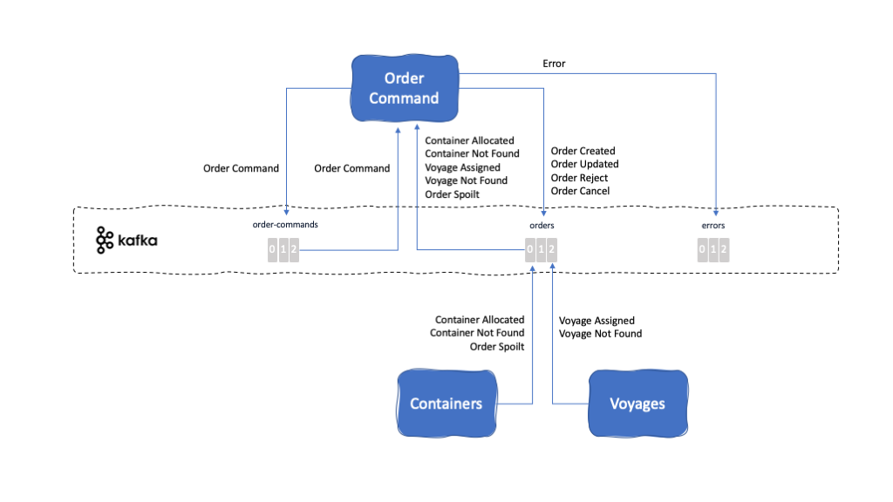

<PageDescription>
This project is demonstrating one possible implementation of the Command Query Responsibility Segregation (CQRS) and event sourcing patterns, as applied to the refrigerated shipping container order subdomain. It implements the order management component, responsible for managing the full lifecycle of a shipping order issued by a customer who wants to ship fresh goods overseas.
</PageDescription>

<AnchorLinks>
  <AnchorLink>Overview</AnchorLink>
  <AnchorLink>Build</AnchorLink>
  <AnchorLink>Run</AnchorLink>
  <AnchorLink>Usage Details</AnchorLink>
</AnchorLinks>

## Overview

**Description:** Main goal of the Order Management component is to manage the shipping orders for the entire shipping fleet. This component is made up of two microservices - one named Order Command and one named Order Query. The reason for the component to be split into two microservices is to implement the **Command Query Responsibility Segregation (CQRS)** pattern.

This microservice implements the **write logic** in the CQRS pattern. That is, will be in charge of managing the state of shipping orders.

This microservice has been implemented using [MicroProfile 3.0](https://microprofile.io/) and runs on [OpenLiberty](https://openliberty.io/).

**Github repository:** [refarch-kc-order-ms](https://github.com/ibm-cloud-architecture/refarch-kc-order-ms)

**Folder:** [order-command-ms](https://github.com/ibm-cloud-architecture/refarch-kc-order-ms/tree/master/order-command-ms)

**Kafka topics consumed from:**

- [Order Commands Topic](/microservices/topic-details/#order-commands-topic)
- [Order Topic](/microservices/topic-details/#orders-topic)

**Kafka topics produced to:**

- [Order Commands Topic](/microservices/topic-details/#order-commands-topic)
- [Order Topic](/microservices/topic-details/#orders-topic)
- [Errors Topic](/microservices/topic-details/#errors-topic)

**Events reacted to:**

- [Order Command Event](/microservices/event-details/#order-command-event)
- [Container Allocated Event](/microservices/event-details/#container-allocated-event)
- [Container Not Found Event](/microservices/event-details/#container-not-found-event)
- [Voyage Assigned Event](/microservices/event-details/#voyage-assigned-event)
- [Voyage Not Found Event](/microservices/event-details/#voyage-not-found-event)
- [Order Spoilt Event](/microservices/event-details/#order-spoilt-event)

**Events produced:**

- [Order Command Event](/microservices/event-details/#order-command-event)
- [Order Created Event](/microservices/event-details/#order-created-event)
- [Order Updated Event](/microservices/event-details/#order-updated-event)
- [Order Reject Event](/microservices/event-details/#order-reject-event)
- [Order Cancel Event](/microservices/event-details/#order-cancel-event)
- [Error Event](/microservices/event-details/#error-event)

**EDA Patterns implemented:**

- Command Query Responsibility Segregation (CQRS) _(TBD LINK)_
- [Saga Patterns](/implementation/saga-patterns/)
- [Consume-transform-produce Loop](/implementation/consume-transform-produce/)
- [Order Cancellation](/implementation/order-cancellation/)

## Build

This microservice is built using the [Appsody](https://appsody.dev/) development framework. The [Appsody CLI](https://appsody.dev/docs/installing/installing-appsody) is a required prerequisite for building the application locally.

Appsody will build the application by pulling the contents of the Appsody Stack it is based on and then performing the local application build inside the containerized environment:

`appsody build -t <yournamespace>/kcontainer-order-command-ms[:tag] [--push]`

- You can optionally specify a container tag. If left blank, `latest` will be used.
- You can optionally supply the `--push` flag to automatically push the built image to specified remote repository.

Performing an Appsody build will update the `app-deploy.yaml` file in the same directory with current information for the application image, labels, and annotations fields.

## Run

### Deployment parameters

The following deployment parameters are defined in the `app-deploy.yaml` file:

| Name                                     | Required | Description                                                                                                            |
|------------------------------------------|----------|------------------------------------------------------------------------------------------------------------------------|
| KAFKA_BROKERS                            | YES      | Comma-separated list of Kafka brokers to connect to                                                                    |
| KAFKA_APIKEY                             | NO       | API Key used to connect to SASL-secured Kafka brokers. This is required when connecting to IBM Event Streams clusters. |
| TRUSTSTORE_ENABLED                       | NO       | Required to be set to `true` when connecting to IBM Event Streams on the IBM Cloud Pak for Integration (CP4I).         |
| TRUSTSTORE_PATH                          | NO       | The local path to the required truststore file when connecting to IBM Event Streams on CP4I. See [**Volume Mounts**](#volume-mounts) below.  |
| TRUSTSTORE_PWD                           | NO       | The password for the truststore file used for IBM Event Streams server verification.                                   |
| ORDER_TOPIC                              | YES      | The topic name used for communication relating to the orders entity.                                                   |
| ORDER_COMMAND_TOPIC                      | YES      | The topic name used for communication relating to the orders command entity.                                           |
| ERROR_TOPIC                              | YES      | The topic name used for communication relating to general application errors.                                          |

### Volume Mounts

The Order Command microservice requires up to one file to be injected at runtime for proper operation. As noted in the `TRUSTSTORE_PATH` parameter above, these files are SSL-based certificates which are required to verfiy the identity of the external service when calling it. These files are provided as `--docker-options "-v host-src:container-dest ..."` when running the microservice locally and as a Volume Mount when running the microservice on a Kubernetes cluster.

The `TRUSTSTORE_PATH` parameter is documented in the **Event Streams Certificates** section of the [Prerequisites](/microservices/prereqs/#ibm-event-streams-on-redhat-openshift-container-platform) page. The Appsody run command should include a parameter similar to `-v /Users/myuser/Downloads/es-cert.jks:/config/resources/security/es-ssl/es-cert.jks` in its `--docker-options` string to run this microservice locally.

**Example:** `appsody run --docker-options "-v /Users/myuser/Downloads/es-cert.jks:/config/resources/security/es-ssl/es-cert.jks" ...`

### Running the microservice locally

When running the microservice locally, you must specify all the required [deployment parameters](#deployment-parameters) from above as environment variables via the `--docker-options` flag being passed in from the Appsody CLI command.

**Example:** `appsody run --docker-options "-e KAFKA_BROKERS=remotebroker1:9092,remotebroker2:9092 -e ORDER_TOPIC=orders -e ORDER_COMMAND_TOPIC=order-commands -v /Users/myuser/Downloads/es-cert.jks:/config/resources/security/es-ssl/es-cert.jks" ...`

For more details on running the microservice locally, consult the [Appsody run documentation](https://appsody.dev/docs/using-appsody/local-development#appsody-local-development) as well as the deployment information contained in the [`app-deploy.yaml`](https://github.com/ibm-cloud-architecture/refarch-kc-order-ms/blob/master/order-command-ms/app-deploy.yaml) file.

### Running the microservice remotely

The [Appsody Operator](https://appsody.dev/docs/reference/appsody-operator/) is a required prerequisite for deploying the microservice to a remote Kubernetes or OpenShift cluster.

To deploy the microservice to a remote cluster:

`appsody deploy <yournamespace>/kcontainer-order-command-ms[:tag] --no-build`

- You can omit the `--no-build` flag to have Appsody perform a build before deploying the application.
- _**Note:**_ Performing a build at deploy time requires specifying the absolute container reference path, as well as the `--push` flag.
- The neccesary deployment parameter information will be read from the `app-deploy.yaml` file in the same directory.

## Usage Details

### REST APIs

<InlineNotification kind="info"><strong>TODO</strong> REST APIs documentation via Swagger</InlineNotification>
