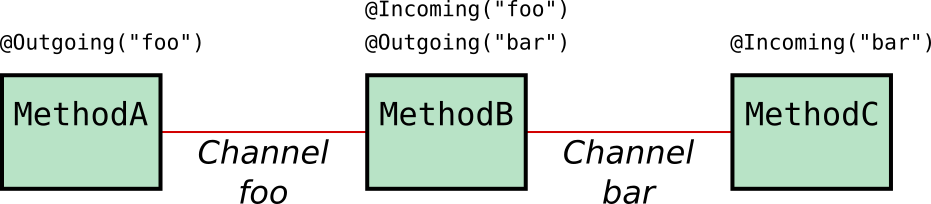

<InlineNotification kind="warning"><strong>TODO</strong> UNDER CONSTRUCTION</InlineNotification>

<PageDescription>
The Anomalous Container Scoring microservice consumes telemetry events for reefer containers and applies a predictive scoring model to determine whether or not the specific shipping container is in need of maintenance or not. The scoring service uses an analytics scoring model build using machine learning techniques, and depending upon deployment options, can be serialized and loaded into memory.
</PageDescription>

<AnchorLinks>
  <AnchorLink>Overview</AnchorLink>
  <AnchorLink>Build</AnchorLink>
  <AnchorLink>Run</AnchorLink>
  <AnchorLink>Usage Details</AnchorLink>
</AnchorLinks>

## Overview

**Description:** This microservice is responsible for listening to the [Reefer Telemetry Topic](#reefer-telemetry-topic) topic where the IOT sensor devices of the Reefer Containers will be sending their telemetry data to. These telemetry events will be read and used to contact a container anomaly prediction service based on Watson Machine Learning, hosted on the IBM Cloud. Depending on whether the prediction service predicts a container anomaly, this Telemetry microservice will send a [Container Anomaly Event](#container-anomaly-event) to the [Containers Topic](#containers-topic) for the [Containers microservice](#containers) to handle the shipping goods spoilage.

This microservice has been implemented using the latest [Reactive Messaging](#reactive-messaging) feature of MicroProfile 3.0. running on the OpenLiberty server.


**Further details:** [Microservices Details > Anomalous Container Scoring](/microservices/scoring-mp)

**Github repository:** [refarch-reefer-ml](https://github.com/ibm-cloud-architecture/refarch-reefer-ml)

**Folder:** [scoring-mp](https://github.com/ibm-cloud-architecture/refarch-reefer-ml/tree/master/scoring-mp)

**Kafka topics consumed from:**

- [Reefer Telemetry Topic](#reefer-telemetry-topic)

**Kafka topics produced to:**

- [Containers Topic](#containers-topic)

**Events reacted to:**

- [Container Telemetry Event](#container-telemetry-event)

**Events produced:**

- [Container Anomaly Event](#container-anomaly-event)

**EDA Patterns implemented:**

- [Reactive Messaging](#reactive-messaging)

## Build

<InlineNotification kind="info"><strong>TODO</strong> Build instructions for current scoring-mp</InlineNotification>

**Reference:** https://github.com/ibm-cloud-architecture/refarch-reefer-ml/blob/master/docs/infuse/dev-scoring.md

## Run

<InlineNotification kind="info"><strong>TODO</strong> Run instructions for current scoring-mp</InlineNotification>

**Reference:** https://github.com/ibm-cloud-architecture/refarch-reefer-ml/blob/master/docs/infuse/dev-scoring.md

## Usage Details

### REST APIs

<InlineNotification kind="info"><strong>TODO</strong> REST APIs documentation via Swagger</InlineNotification>

### Reactive Messaging

Reactive Systems provide an architecture style to deliver responsive systems. By infusing asynchronous messaging passing at the core of the system, applications enforcing the reactive system’s characteristics are inherently resilient and become more elastic by scaling up and down the number of message consumers. Microservices as part of reactive systems interact using messages. The MicroProfile Reactive Messaging specification aims to deliver applications embracing the characteristics of reactive systems.

Reactive Systems provide an architecture style to deliver responsive systems. By infusing asynchronous messaging passing at the core of the system, applications enforcing the reactive system’s characteristics are inherently resilient and become more elastic by scaling up and down the number of message consumers.


Microservices as part of reactive systems interact using messages. The location and temporal decoupling, promoted by this interaction mechanism, enable numerous benefits such as:

- Better failure handling as the temporal decoupling enables message brokers to resend or reroute messages in the case of remote service failures.
- Improved elasticity as under fluctuating load the system can decide to scale up and down some of the microservices.
- The ability to introduce new features more easily as components are more loosely coupled by receiving and publishing messages.

#### Use Cases

MicroProfile Reactive Messaging aims to provide a way to connect event-driven microservices. The key characteristics of the specification make it versatile and suitable for building different types of architecture and applications.

First, asynchronous interactions with different services and resources can be implemented using Reactive Messaging. Typically, asynchronous database drivers can be used in conjunction with Reactive Messaging to read and write into a data store in a non-blocking and asynchronous manner.

When building microservices, the CQRS and event-sourcing patterns provide an answer to the data sharing between microservices. Reactive Messaging can also be used as the foundation to CQRS and Event-Sourcing mechanism, as these patterns embrace message-passing as core communication pattern.

IOT applications, dealing with events from various devices, and data streaming applications can also be implemented using Reactive Messaging. The application receives events or messages, process them, transform them, and may forward them to another microservices. It allows for more fluid architecture for building data-centric applications.

#### MicroProfile Reactive Messaging

MicroProfile Reactive Messaging provides a very easy-to-use way to send, receive, and process messages and is well-suited to writing applications that process streams of events. With MicroProfile Reactive Messaging, you annotate application beans' methods and, under the covers, OpenLiberty (in our specific case) converts these to [reactive streams](http://www.reactive-streams.org/)-compatible publishers, subscribers and processors and connects them up to each other.



Although sending messages within our application is nice, it’s more useful to be able to send and receive messages from other systems. For this, MicroProfile Reactive Messaging also provides a Connector API to allow your methods to be connected to external messaging systems. Open Liberty includes the liberty-kafka connector for sending and receiving messages from an Apache Kafka broker.

It is important to understand that [MicroProfile Reactive Messaging](https://github.com/eclipse/microprofile-reactive-messaging) does not contain an implementation itself but only provides the specified API, a TCK and documentation. It is down to application server or external libraries to provide such implementation. For instance, [Open Liberty 19.0.0.9](https://openliberty.io/blog/2019/09/13/microprofile-reactive-messaging-19009.html) provides a full implementation of MicroProfile Reactive Messaging 1.0. OpenLiberty's implementation of the MicroProfile Reactive Messaging capabilities is based on [SmallRye Reactive Messaging](https://smallrye.io/smallrye-reactive-messaging/).

### Implement

We have based our implementation on [MicroProfile](https://microprofile.io/) as the standardization for building microservices-based applications. The application server we have chosen, that provides full MicroProfile support, is [OpenLiberty](https://openliberty.io/).

As already introduced, the scoring agent will react to a stream of data, in the form of messaging being sent from an IOT device in the Reefer Containers to Kafka (through an MQTT connector), which is used as our event backbone. The scoring agent will react to that stream of data being sent into a kafka topic through the MicroProfile Reactive Messaging feature that OpenLiberty implements and supports. It will do some computation for each of the messages coming as a stream of data, which in this case is to call the container anomaly predictive system, and send out a container anomaly message a to specific kafka topic where the Reefer Container EDA reference application listens to and will act in consequence.

The main chunk of code that implements the scoring agent use case just described looks like this:

```Java
@Incoming("reefer-telemetry")
@Outgoing("containers")
@Acknowledgment(Acknowledgment.Strategy.MANUAL)
public PublisherBuilder<Message<String>> processTelemetry(Message<String> message) {

    // Get the message as String
    String input = message.getPayload();

    Gson g = new Gson();
    // Parsing the message into a TelemetryEvent Java Object
    TelemetryEvent te = g.fromJson(input, TelemetryEvent.class);
    // Getting the Telemetry out of the event.
    Telemetry t = new Telemetry(te.getPayload());

    // Calling the Anomaly Scoring service
    ScoringResult scoringResult = scoringClient.callAnomalyScoring(t);
    // Getting the Scoring Prediction Results
    ScoringPredictionValues result = scoringResult.getScoringPredictionValues();

    Boolean anomaly = result.getPrediction().equalsIgnoreCase("Issue");

    if (!anomaly){
        System.out.println("No container anomaly");
        message.ack(); // All processing of this message is done, ack it now
        return ReactiveStreams.empty();
    }
    else{
        System.out.println("A container anomaly has been predicted. Therefore, sending a ContainerAnomaly Event to the appropriate topic");
        ContainerAnomalyEvent cae = new ContainerAnomalyEvent(te.getContainerID(), te.getTimestamp(), t);
        System.out.println("ContainerAnomalyEvent object sent: " + cae.toString());

        // This message will be sent on, create a new message which acknowledges the incoming message when it is acked
        return ReactiveStreams.of(Message.of(cae.toString(), () -> message.ack()));
    }
}
```

We are consuming/producing the data from/to Kafka by simply annotating our method with **@Incoming** and **@Outgoing** and leaving the rest of the magic required to create the reactive streams to the MicroProfile Reactive Messaging implementation of the OpenLiberty server. Although there is certain magic in this process, there is still some configuration we need to provide OpenLiberty with in order for it to properly create the reactive streams.

This configuration is provided in the [microprofile-configuration.properties](https://github.com/ibm-cloud-architecture/refarch-reefer-ml/blob/master/scoring-mp/src/main/resources/META-INF/microprofile-config.properties) file:

```properties
# Config specific to reefer-telemetry kafka topic
mp.messaging.incoming.reefer-telemetry.connector=liberty-kafka
mp.messaging.incoming.reefer-telemetry.group.id=reefer-telemetry-reactive
mp.messaging.incoming.reefer-telemetry.topic=reefer-telemetry
mp.messaging.incoming.reefer-telemetry.key.deserializer=org.apache.kafka.common.serialization.StringDeserializer
mp.messaging.incoming.reefer-telemetry.value.deserializer=org.apache.kafka.common.serialization.StringDeserializer

# Config specific to containers kafka topic
mp.messaging.outgoing.containers.connector=liberty-kafka
mp.messaging.outgoing.containers.group.id=containers-reactive
mp.messaging.outgoing.containers.topic=containers
mp.messaging.outgoing.containers.key.serializer=org.apache.kafka.common.serialization.StringSerializer
mp.messaging.outgoing.containers.value.serializer=org.apache.kafka.common.serialization.StringSerializer

#### Config shared between all kafka connections

# bootstrap server is the only config needed for plain insecure local kafka instance
mp.messaging.connector.liberty-kafka.bootstrap.servers=
```

We can see the configuration for each of the incoming and outgoing reactive streams based on their names (_reefer-telemetry_ and _containers_) that match with the Kafka topics these reactive streams will be consuming/producing from/to. We also specify the serializer/deserializer we want MicroProfile Reactive Messaging to apply to our reactive streams for data processing but more importantly is the fact that we are telling OpenLiberty that the connector to be used is the **liberty-kafka** connector. Otherwise, OpenLiberty would not be able to interact with Kafka.

Finally, we are providing to the liberty-kafka connector the appropriate configuration for OpenLiberty to successfully connect and consume/produce data to Kafka. In the example above we are providing the Kafka bootstrap server but there are other properties that can be set here _(such as security)_ that can be found in the [MicroProfile Reactive Messaging Specification](https://download.eclipse.org/microprofile/microprofile-reactive-messaging-1.0/microprofile-reactive-messaging-spec.html#_supported_method_signatures)
