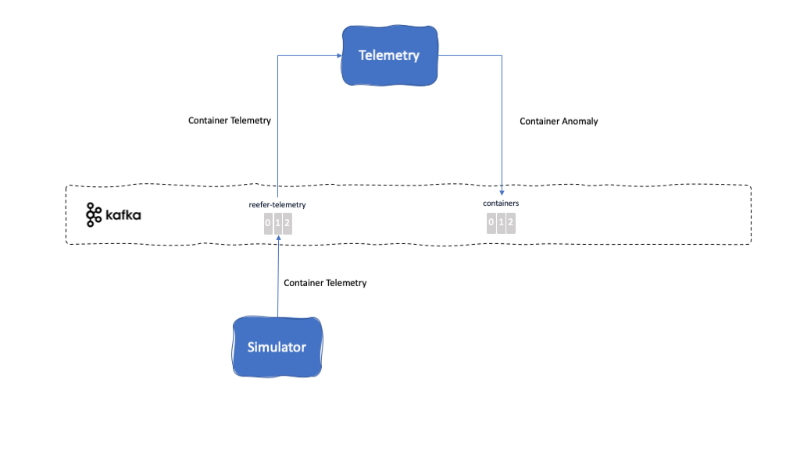

<InlineNotification kind="warning"><strong>TODO</strong> - UNDER CONSTRUCTION</InlineNotification>

<PageDescription>
The Anomalous Container Scoring microservice consumes telemetry events for reefer containers and applies a predictive scoring model to determine whether or not the specific shipping container is in need of maintenance or not. The scoring service uses an analytics scoring model build using machine learning techniques, and depending upon deployment options, can be serialized and loaded into memory.
</PageDescription>

<AnchorLinks>
  <AnchorLink>Overview</AnchorLink>
  <AnchorLink>Build</AnchorLink>
  <AnchorLink>Run</AnchorLink>
  <AnchorLink>Usage Details</AnchorLink>
</AnchorLinks>

## Overview

**Description:** This microservice is responsible for listening to the [Reefer Telemetry Topic](#reefer-telemetry-topic) topic where the IOT sensor devices of the Reefer Containers will be sending their telemetry data to. These telemetry events will be read and used to contact a container anomaly prediction service based on Watson Machine Learning, hosted on the IBM Cloud. Depending on whether the prediction service predicts a container anomaly, this Telemetry microservice will send a [Container Anomaly Event](#container-anomaly-event) to the [Containers Topic](#containers-topic) for the [Containers microservice](#containers) to handle the shipping goods spoilage.

This microservice has been implemented using the latest [Reactive Messaging](/implementation/reactive-messaging) feature of MicroProfile 3.0. running on the OpenLiberty server.

**Further details:** [Microservices Details > Anomalous Container Scoring](/microservices/scoring-mp)

**Github repository:** [refarch-reefer-ml](https://github.com/ibm-cloud-architecture/refarch-reefer-ml)

**Folder:** [scoring-mp](https://github.com/ibm-cloud-architecture/refarch-reefer-ml/tree/master/scoring-mp)

**Kafka topics consumed from:**

- [Reefer Telemetry Topic](#reefer-telemetry-topic)

**Kafka topics produced to:**

- [Containers Topic](#containers-topic)

**Events reacted to:**

- [Container Telemetry Event](#container-telemetry-event)

**Events produced:**

- [Container Anomaly Event](#container-anomaly-event)

**EDA Patterns implemented:**

- [Reactive Messaging](/implementation/reactive-messaging/)

## Build

<InlineNotification kind="info"><strong>TODO</strong> Build instructions for current scoring-mp</InlineNotification>

**Reference:** https://github.com/ibm-cloud-architecture/refarch-reefer-ml/blob/master/docs/infuse/dev-scoring.md

## Run

<InlineNotification kind="info"><strong>TODO</strong> Run instructions for current scoring-mp</InlineNotification>

**Reference:** https://github.com/ibm-cloud-architecture/refarch-reefer-ml/blob/master/docs/infuse/dev-scoring.md

## Usage Details

### REST APIs

<InlineNotification kind="info"><strong>TODO</strong> REST APIs documentation via Swagger</InlineNotification>
