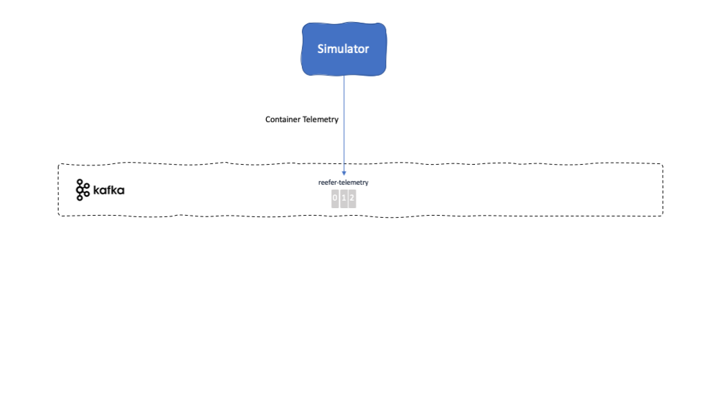

<PageDescription>
The telemetry simulator component is a Python-based application for generating anomalous data events for refrigerated shipping containers (also known as 'reefers').
</PageDescription>

<AnchorLinks>
  <AnchorLink>Overview</AnchorLink>
  <AnchorLink>Build</AnchorLink>
  <AnchorLink>Run</AnchorLink>
  <AnchorLink>Usage Details</AnchorLink>
</AnchorLinks>

## Overview

**Description:** The Simulator webapp is a simple python (3.7) flask web app exposing a REST POST end point to control the type of simulation to run and to produce Reefer telemetry events to kafka reeferTelemetry topic.

This microservice has been implemented using the [Appsody Python Flask stack](https://github.com/appsody/stacks/tree/master/incubator/python-flask).

**Github repository:** [refarch-reefer-ml](https://github.com/ibm-cloud-architecture/refarch-reefer-ml)

**Folder:** [simulator](https://github.com/ibm-cloud-architecture/refarch-reefer-ml/tree/master/simulator)

**Kafka topics consumed from:** None

**Kafka topics produced to:**

- [Reefer Telemetry Topic](/microservices/topic-details/#reefer-telemetry-topic)

**Events reacted to:** None

**Events produced:**

- [Container Telemetry Event](/microservices/event-details/#container-telemetry-event)

**EDA Patterns implemented:** None

## Build

This microservice is built using the [Appsody](https://appsody.dev/) development framework. The [Appsody CLI](https://appsody.dev/docs/installing/installing-appsody) is a required prerequisite for building the application locally.

Appsody will build the application by pulling the contents of the Appsody Stack it is based on and then performing the local application build inside the containerized environment:

`appsody build -t <yournamespace>/kcontainer-reefer-simulator-appsody[:tag] [--push]`

- You can optionally specify a container tag. If left blank, `latest` will be used.
- You can optionally supply the `--push` flag to automatically push the built image to specified remote repository.

Performing an Appsody build will update the `app-deploy.yaml` file in the same directory with current information for the application image, labels, and annotations fields.

## Run

### Deployment parameters

The following deployment parameters are defined in the `app-deploy.yaml` file:

| Name                                     | Required | Description                                                                                                            |
|------------------------------------------|----------|------------------------------------------------------------------------------------------------------------------------|
| KAFKA_BROKERS                            | YES      | Comma-separated list of Kafka brokers to connect to                                                                    |
| KAFKA_APIKEY                             | NO       | API Key used to connect to SASL-secured Kafka brokers. This is required when connecting to IBM Event Streams clusters. |
| KAFKA_CERT                               | NO       | The local path to the required certifcate file when connecting to IBM Event Streams on CP4I. See [**Volume Mounts**](#volume-mounts) below.  |
| CONTAINER_TOPIC                          | YES      | The topic name used for communication relating to the containers entity.                                                   |
| TELEMETRY_TOPIC                          | YES      | The topic name used for communication relating to the reefer telemetry  entity.                                                   |

### Volume Mounts

The Voyage Management microservice requires up to one file to be injected at runtime for proper operation. As noted in the `KAFKA_CERT` parameter above, these files are SSL-based certificates which are required to verfiy the identity of the external service when calling it. These files are provided as `--docker-options "-v host-src:container-dest ..."` when running the microservice locally and as a Volume Mount when running the microservice on a Kubernetes cluster.

The `KAFKA_CERT` parameter is documented in the **Event Streams Certificates** section of the [Prerequisites](/microservices/prereqs/#ibm-event-streams-on-redhat-openshift-container-platform) page. The Appsody run command should include a parameter similar to `-v /Users/myuser/Downloads/es-cert.pem:/certs/es-cert.pem` in its `--docker-options` string to run this microservice locally.

**Example:** `appsody run --docker-options "-v /Users/myuser/Downloads/es-cert.pem:/certs/es-cert.pem" ...`

### Running the microservice locally

When running the microservice locally, you must specify all the required [deployment parameters](#deployment-parameters) from above as environment variables via the `--docker-options` flag being passed in from the Appsody CLI command.

**Example:** `appsody run --docker-options "-e KAFKA_BROKERS=remotebroker1:9092,remotebroker2:9092 -e CONTAINER_TOPIC=containers -v /Users/myuser/Downloads/es-cert.pem:/certs/es-cert.pem" ...`

For more details on running the microservice locally, consult the [Appsody run documentation](https://appsody.dev/docs/using-appsody/local-development#appsody-local-development) as well as the deployment information contained in the [`app-deploy.yaml`](https://github.com/ibm-cloud-architecture/refarch-reefer-ml/blob/master/simulator/app-deploy.yaml) file.

### Running the microservice remotely

The [Appsody Operator](https://appsody.dev/docs/reference/appsody-operator/) is a required prerequisite for deploying the microservice to a remote Kubernetes or OpenShift cluster.

To deploy the microservice to a remote cluster:

`appsody deploy <yournamespace>/kcontainer-reefer-simulator-appsody[:tag] --no-build`

- You can omit the `--no-build` flag to have Appsody perform a build before deploying the application.
- _**Note:**_ Performing a build at deploy time requires specifying the absolute container reference path, as well as the `--push` flag.
- The neccesary deployment parameter information will be read from the `app-deploy.yaml` file in the same directory.

## Usage Details

### REST APIs

<InlineNotification kind="info"><strong>TODO</strong> REST APIs documentation via Swagger</InlineNotification>

**Reference:** https://github.com/ibm-cloud-architecture/refarch-reefer-ml/blob/master/simulator/api/controlapi.yml
