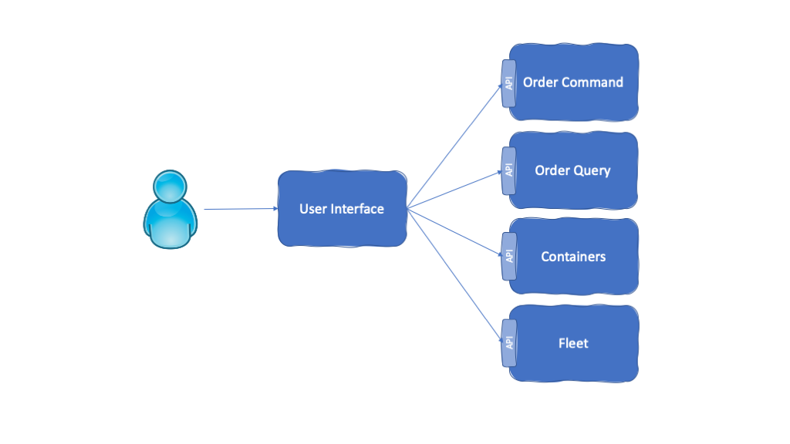
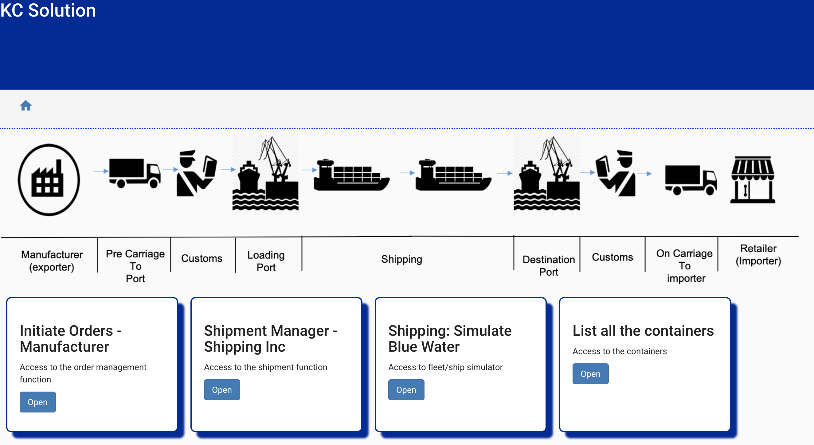

<InlineNotification kind="warning">UNDER CONSTRUCTION</InlineNotification>

<PageDescription>
The user interface for our Reefer Container Shipment reference application is implemented as a single microservice using Node.js and Angular.js.
</PageDescription>

<AnchorLinks>
  <AnchorLink>Overview</AnchorLink>
  <AnchorLink>Build</AnchorLink>
  <AnchorLink>Run</AnchorLink>
  <AnchorLink>Usage Details</AnchorLink>
</AnchorLinks>

## Overview

**Description:** The goal of this component is to serve a user interface for customers to:

- Log in
- Create an order
- List all orders
- List all containers
- Initiate shipping simulation

**Github repository:** [refarch-kc-ui](https://github.com/ibm-cloud-architecture/refarch-kc-ui)

<InlineNotification kind="warning">TBD Update this section with revised simulation design</InlineNotification>

**Kafka topics consumed from:** None

**Kafka topics produced to:** None

**Events reacted to:** None

**Events produced:** None

**EDA Patterns implemented:** None

## Build

This microservice is built using the [Appsody](https://appsody.dev/) development framework. The [Appsody CLI](https://appsody.dev/docs/installing/installing-appsody) is a required prerequisite for building the application locally.

Appsody will build the application by pulling the contents of the Appsody Stack it is based on and then performing the local application build inside the containerized environment:

`appsody build -t <yournamespace>/kcontainer-spring-container-ms[:tag] [--push]`

- You can optionally specify a container tag. If left blank, `latest` will be used.
- You can optionally supply the `--push` flag to automatically push the built image to specified remote repository.

Performing an Appsody build will update the `app-deploy.yaml` file in the same directory with current information for the application image, labels, and annotations fields.

## Run

### Deployment parameters

The following deployment parameters are defined in the `app-deploy.yaml` file:

| Name                                     | Required | Description                                                                                                            |
|------------------------------------------|----------|------------------------------------------------------------------------------------------------------------------------|
| KAFKA_BROKERS                            | YES      | Comma-separated list of Kafka brokers to connect to                                                                    |
| KAFKA_APIKEY                             | NO       | API Key used to connect to SASL-secured Kafka brokers. This is required when connecting to IBM Event Streams clusters. |
| TRUSTSTORE_ENABLED                       | NO       | Required to be set to `true` when connecting to IBM Event Streams on the IBM Cloud Pak for Integration (CP4I).         |
| TRUSTSTORE_PATH                          | NO       | The local path to the required truststore file when connecting to IBM Event Streams on CP4I. See [**Volume Mounts**](#volume-mounts) below.  |
| TRUSTSTORE_PWD                           | NO       | The password for the truststore file used for IBM Event Streams server verification.                                   |
| PROBLEM_TOPIC                            | NO       | The topic name used for communication relating to bluewater ship errors. Defaults to `bluewater-problem`.              |
| SHIP_TOPIC                               | NO       | The topic name used for communication relating to the bluewater ship entity. Defaults to `bluewater-ship`.             |
| FLEETMS_SERVICE_HOST                     | NO       | Hostname of the dependent Fleet microservice. Defaults to `simulator`.                                                 |
| FLEETMS_SERVICE_PORT                     | NO       | Port number of the dependent Fleet microservice. Defaults to `9080`.                                                   |
| ORDERCOMMANDMS_SERVICE_HOST              | NO       | Hostname of the dependent Order Command microservice. Defaults to `ordercmd`.                                          |
| ORDERCOMMANDMS_SERVICE_PORT              | NO       | Port number of the dependent Order Command microservice. Defaults to `9080`.                                           |
| ORDERQUERYMS_SERVICE_HOST                | NO       | Hostname of the dependent Order Query microservice. Defaults to `orderquery`.                                          |
| ORDERQUERYMS_SERVICE_PORT                | NO       | Port number of the dependent Order Query microservice. Defaults to `9080`.                                             |
| VOYAGESMS_SERVICE_HOST                   | NO       | Hostname of the dependent Voyages microservice. Defaults to `voyages`.                                                 |
| VOYAGESMS_SERVICE_PORT                   | NO       | Port number of the dependent Voyages microservice. Defaults to `3000`.                                                 |
| CONTAINERMS_SERVICE_HOST                 | NO       | Hostname of the dependent Container Management microservice. Defaults to `springcontainerms`.                          |
| CONTAINERMS_SERVICE_PORT                 | NO       | Port number of the dependent Container Management microservice. Defaults to `8080`.                                    |

### Volume Mounts

The User Interface microservice requires up to one file to be injected at runtime for proper operation. As noted in the `TRUSTSTORE_PATH` parameter above, these files are SSL-based certificates which are required to verfiy the identity of the external service when calling it. These files are provided as `--docker-options "-v host-src:container-dest ..."` when running the microservice locally and as a Volume Mount when running the microservice on a Kubernetes cluster.

The `TRUSTSTORE_PATH` parameter is documented in the **Event Streams Certificates** section of the [Prerequisites](/microservices/prereqs/#ibm-event-streams-on-redhat-openshift-container-platform) page. The Appsody run command should include a parameter similar to `-v /Users/myuser/Downloads/es-cert.jks:/config/resources/security/es-ssl/es-cert.jks` in its `--docker-options` string to run this microservice locally.

**Example:** `appsody run --docker-options "-v /Users/myuser/Downloads/es-cert.jks:/config/resources/security/es-ssl/es-cert.jks " ...`

### Running the microservice locally

When running the microservice locally, you must specify all the required [deployment parameters](#deployment-parameters) from above as environment variables via the `--docker-options` flag being passed in from the Appsody CLI command.

**Example:** `appsody run --docker-options "-e KAFKA_BROKERS=remotebroker1:9092,remotebroker2:9092 -e PROBLEM_TOPIC=bluewater-problem -e SHIP_TOPIC=bluewater-ships -v /Users/myuser/Downloads/es-cert.jks:/config/resources/security/es-ssl/es-cert.jks" ...`

For more details on running the microservice locally, consult the [Appsody run documentation](https://appsody.dev/docs/using-appsody/local-development#appsody-local-development) as well as the deployment information contained in the [`app-deploy.yaml`](https://github.com/ibm-cloud-architecture/refarch-kc-ui/blob/master/app-deploy.yaml) file.

### Running the microservice remotely

The [Appsody Operator](https://appsody.dev/docs/reference/appsody-operator/) is a required prerequisite for deploying the microservice to a remote Kubernetes or OpenShift cluster.

To deploy the microservice to a remote cluster:

`appsody deploy <yournamespace>/kcontainer-ui[:tag] --no-build`

- You can omit the `--no-build` flag to have Appsody perform a build before deploying the application.
- _**Note:**_ Performing a build at deploy time requires specifying the absolute container reference path, as well as the `--push` flag.
- The neccesary deployment parameter information will be read from the `app-deploy.yaml` file in the same directory.

## Usage Details

### REST APIs

TBD REST APIs

<!--
### User stories

This project is in light development so the following user stories are in plan (or done):

- As a fleet manager I want to login to the webapp to access the fleet management feature. Use eddie@email.com.
- As a fleet manager I want to select one of the fleet to get the list of ships with their attributes in a table format, and plot the ship on a map at their respective position (latitude, longitude)
- As a demoer I want to start ship movement so the ships move on the map
- As a fleet manager I want to select one ship from the table of ships and present a detail view of it with its containers loaded in the boat
- As a demoer I want to start the fire to container or heat wave or container down simulation from the detailed ship view
- As a demoer I want to see the message coming back from the streaming analytics about next best action from my simulation
- As a manufacturer manager I want to enter container shipment order information like product reference, quantity,  pickup from address, earliest pickup date, shipment to address,  shipment by date, and required temperature in transit range so the shipping company can give me back an order confirmation ( including the orderID), expected pickup and delivery dates, the assigned voyage and ship name as the microservice will not have a dedicated UI, we are using the demonstration UI to define the forms to gather the data. So this user story is implemented in the kc-ui project, and in this microservice we need to offer the create and update operations and get by order ID
- As a manufacturer manager I want to read the status of an order given its order id and receive a report with the full event history of related order, voyage ship and container events.
The order id is generated by the order create operation, and is immutable. An order is assigned to a voyage at the time it is created.

### UI Development

This is a traditional Angular 7 app with the app.module.ts using `shared` and `features` modules. `Shared` is for UI generic widgets, while `features` are for supporting the UI specific components linked to the business logic.
There is no login page yet, but the home page displays a set of tiles to support the demonstration of the full shipment process as illustrated in the figure below:

For the BFF code the server code is under the `server` folder and uses the standard patterns for expressjs middleware. The [readme file](./server/README.md) goes into the details on this implementation.

This project was generated with [Angular CLI](https://github.com/angular/angular-cli) version 7.1. The user interface features are under the features folder. We are using a TDD approach as described in [this note.](https://github.com/ibm-cloud-architecture/refarch-caseportal-app/blob/master/docs/tdd.md) The tests run with `ng test`. We also encourage to read the [angular.io testing guide](https://angular.io/guide/testing)
-->
<!--
## Build and Run

* `docker build -t kcontainer-ui:latest .`

* `docker run -d -P -e ... kcontainer-ui:latest`

* Use your web browser at http://localhost:3000/#/home
-->
