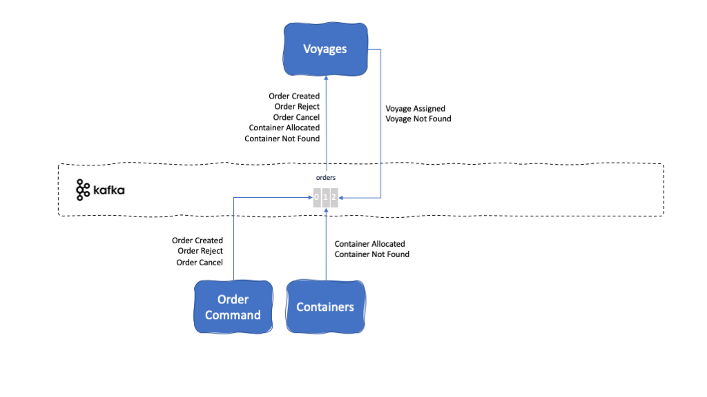

<InlineNotification kind="warning">UNDER CONSTRUCTION</InlineNotification>

<PageDescription>
This service keeps track of each scheduled, current or completed voyage of container carreer vessels, being loaded with containers at a source port, sailing to a destination port and having onboard containers unloaded there.
</PageDescription>

<AnchorLinks>
  <AnchorLink>Overview</AnchorLink>
  <AnchorLink>Build</AnchorLink>
  <AnchorLink>Run</AnchorLink>
  <AnchorLink>Integration Tests</AnchorLink>
  <AnchorLink>Implementation Details</AnchorLink>
</AnchorLinks>

## Overview

**Description:** This microservice manages the voyages for each ship. A voyage consist of carrying a limited amount of goods from a source port to a destination port being the goods carried by a uniquely identified ship on a specific date. All those attributes make a voyage unique and these voyages are managed by this microservice. Voyages microservice will then be responsible to allocate a voyage to an order based on where this order needs to be carried from and to, the window time the goods need to be carried within and the amount of goods to be carried. Written in NodeJS, this microservice assigns a voyage to an order (and manage the remaining capacity on the ship making such voyage) if any suitable voyage is found and emit the consequent VoyageAssigned Event or will otherwise emit a VoyageNotFound Event.

**Github repository:** [refarch-kc-ms](https://github.com/ibm-cloud-architecture/refarch-kc-ms)

**Folder:** [voyage-ms](https://github.com/ibm-cloud-architecture/refarch-kc-ms/tree/master/voyage-ms)

**Kafka topics consumed from:**

- [Order Topic](#orders-topic)

**Kafka topics produced to:**

- [Order Topic](#orders-topic)

**Events reacted to:**

- [Order Created Event](#order-created-event)
- [Order Reject Event](#order-reject-event)
- [Order Cancel Event](#order-cancel-event)
- [Container Allocated Event](#container-allocated-event)
- [Container Not Found Event](#container-not-found-event)

**Events produced:**

- [Voyage Assigned Event](#voyage-assigned-event)
- [Voyage Not Found Event](#voyage-not-found-event)

**EDA Patterns implemented:**

- [SAGA](#saga)

## Build

TBD Appsody

## Run

TBD Appsody

## Integration Tests

TBD Source from https://github.com/ibm-cloud-architecture/refarch-kc-ms/blob/master/docs/voyagesms.md

## Implementation Details

TBD Source from https://github.com/ibm-cloud-architecture/refarch-kc-ms/blob/master/docs/index.md

### User stories

This service keeps track of each of the container ships available for transporting containers. Each ship has a unique shipID. We limit the scope of a minimum viable product so the following user stories are implemented:

* [x] The information about each ship is kept in a json file for a fleet. Ships are uniquely identified by their name (as shipID).
* [x] The capacity of a ship is represented by a matrix, number of rows x number of columns to make it simpler. Therefore the total number of container is rows*columns.
* [x] Support GPS lat/log position reports, as ship position event, of the position of the ship a different point in time. This is modeled as csv file with one row of (lat,log) pair, a row representing a time stamp. (1h?)
* [ ] Generate ship event when leaving source port and when entering destination port, and when docked.
* [ ] Define query of what happen to a ship from a given time to retrace its past voyages.
