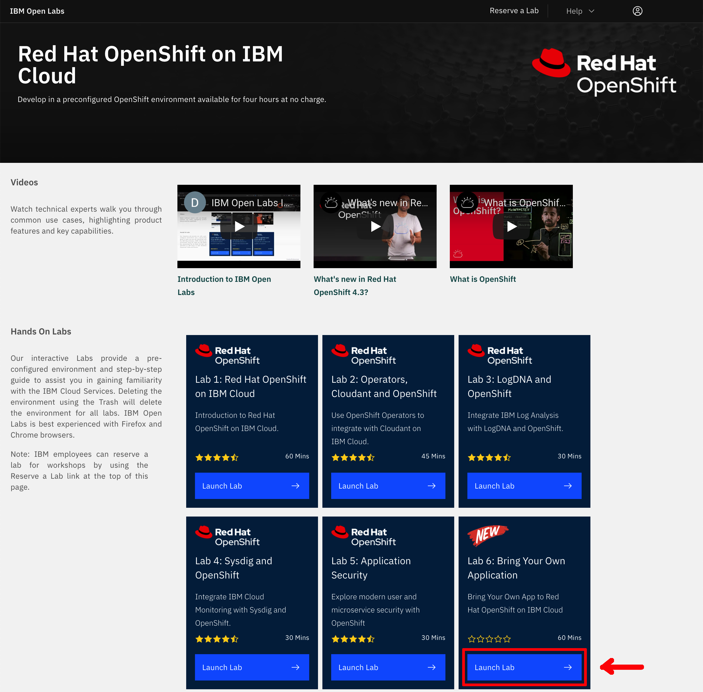
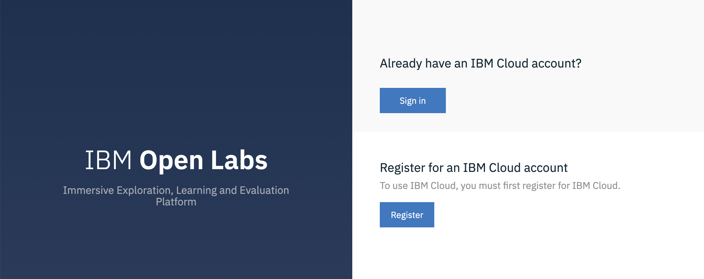
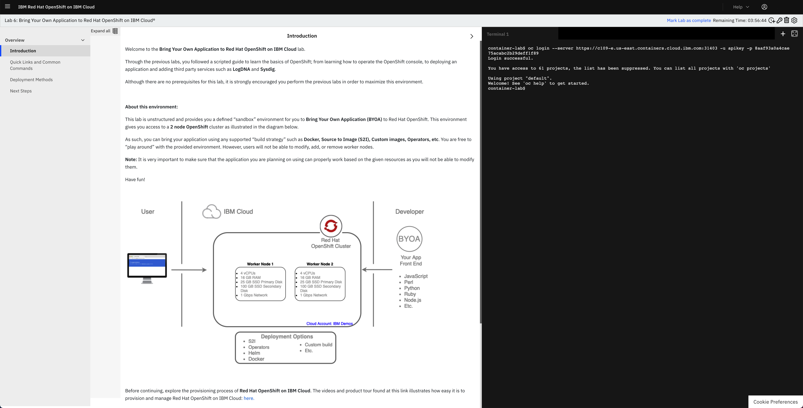
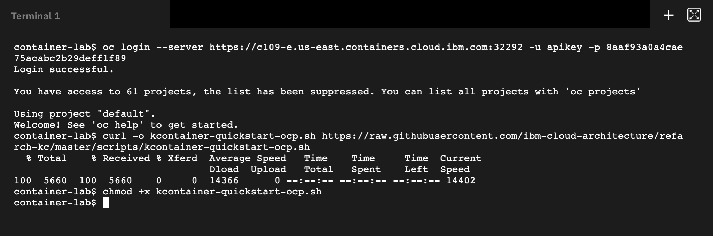
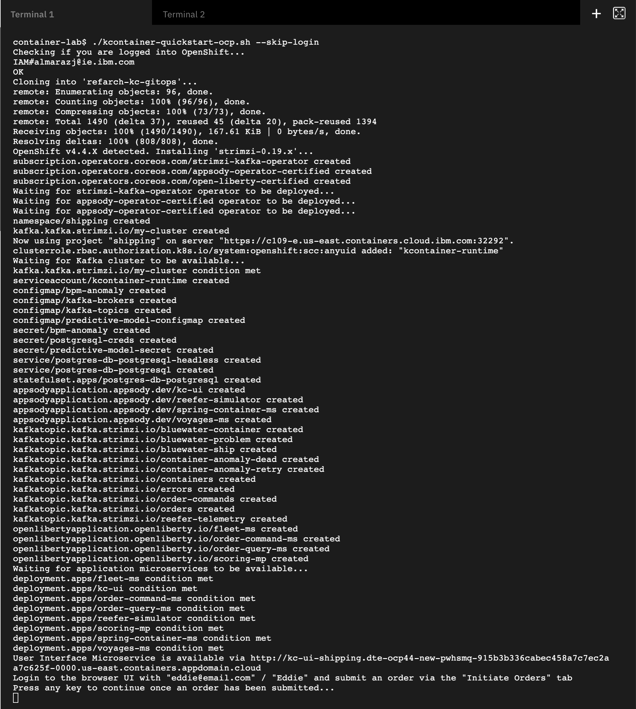
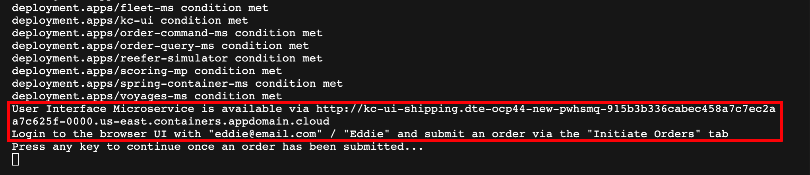
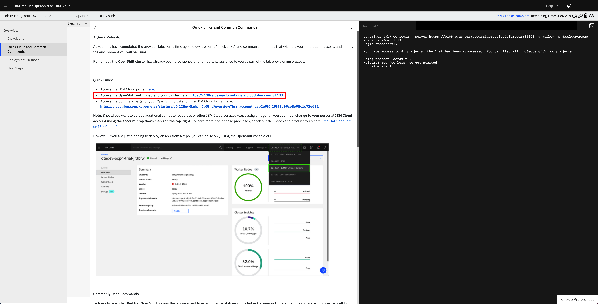
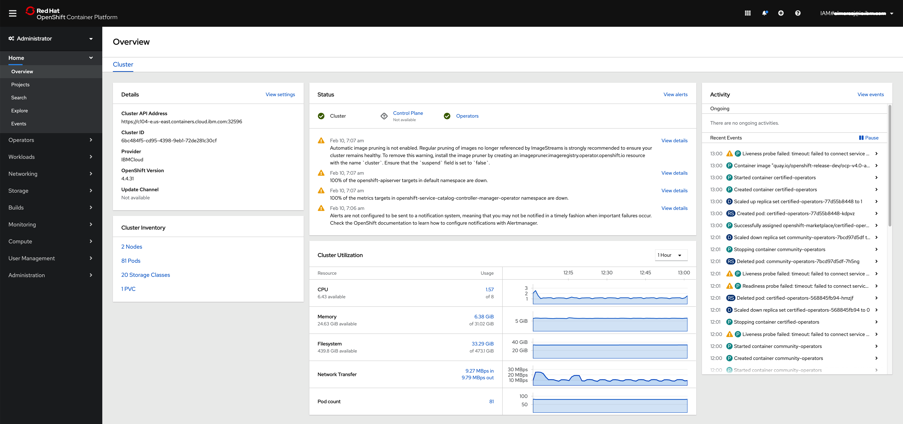

### IBM OpenLabs

In this section, we are going to see how to deploy the KContainer Shipping Container Reference Implementation on the [IBM OpenLabs](https://developer.ibm.com/openlabs/openshift) hosted environment.

1. Go to [IBM OpenLabs](https://developer.ibm.com/openlabs/openshift) in a browser and click on `Launch Lab` button for **Lab 6**.

  

1. Sign in with your IBM Cloud account or register for an IBM Cloud account.

  

1. You will be presented with a dialog asking you whether you have an **Opportunity Id** or not. If you don't have it or don't no, just select **No** and click on **Launch Lab**.

1. You should now see your IBM OpenLabs environment.

  

1. On the left hand side navigation menu, click on the **Quick Links and Common Commnads** section. Now, if you scroll down on the instructions shown on your screen, you should reach the **Commonly Used Command** section of these and in there you should see an `oc login ...` command to get your terminal associated to this IBM OpenLabs Lab 6 logged into the OpenShift cluster that you will be working with for this quickstart tutorial. Click on the `oc login...` command and you should see a `Login successful` message on the terminal.

  

1. In the terminal associated to your lab, download the [kcontainer-quickstart-ocp.sh](https://github.com/ibm-cloud-architecture/refarch-kc/tree/master/scripts/quickstart/kcontainer-quickstart-ocp.sh) file:

  ```
  curl -o kcontainer-quickstart-ocp.sh https://raw.githubusercontent.com/ibm-cloud-architecture/refarch-kc/master/scripts/quickstart/kcontainer-quickstart-ocp.sh
  chmod +x kcontainer-quickstart-ocp.sh
  ```

  <br/>

  

1. Execute the quickstart deployment script with the following command:

  ```
  ./kcontainer-quickstart-ocp.sh --skip-login
  ```
  **IMPORTANT:** do not forget the **- -skip-login** flag since we have already logged into the RedHat OpenShift cluster above.

1. Wait for the deployment to be active and ready when you are prompted with `Press any key to continue once an order has been submitted...`.

  

1. Grab the User Interface Microservice url and credentials and open it up in your web browser.

  

1. You can also check all the resources created by the `kcontainer-quickstart-ocp.sh` script in the RedHat OpenShift console by clicking on the OpenShift web console quick link presented at the top of the instructions section of the OpenLabs Lab6 website.

  

1. You should now see your OpenShift web console.

  
