## Introduction

In this tutorial, you will:

- Deploy the reference implementation to a standalone OpenShift cluster.
- Create an order via the UI.
- Check on existing orders.
- View information about the Fleet.

Each of these business processes will be executed step-by-step using the demonstration APIs and some scripts.

### Pre-requisites

- **Red Hat OpenShift Container Platform** - this quickstart utilizes either the [OpenShift Playgrounds](https://learn.openshift.com/playgrounds/openshift45/) or the [IBM OpenLabs](https://developer.ibm.com/openlabs/openshift).
- ... and that's it!!! Everything else is provided for you via OpenShift Operators or through existing GitHub repositories.
- Additional self-paced learning can be done to integrate the deployed reference implementation with additional Kafka offerings, such as _IBM Event Streams_, _Red Hat AMQ Streams_, or _Confluent Platform_.

## Deploy the reference implementation

### OpenShift Playgrounds

In this section, we are going to see how to deploy the KContainer Shipping Container Reference Implementation on the [OpenShift Playgrounds](https://learn.openshift.com/playgrounds/openshift45/) hosted environment.

1. Go to [`https://learn.openshift.com/playgrounds/openshift45/`](https://learn.openshift.com/playgrounds/openshift45/) in a browser and click **Start Scenario**.

  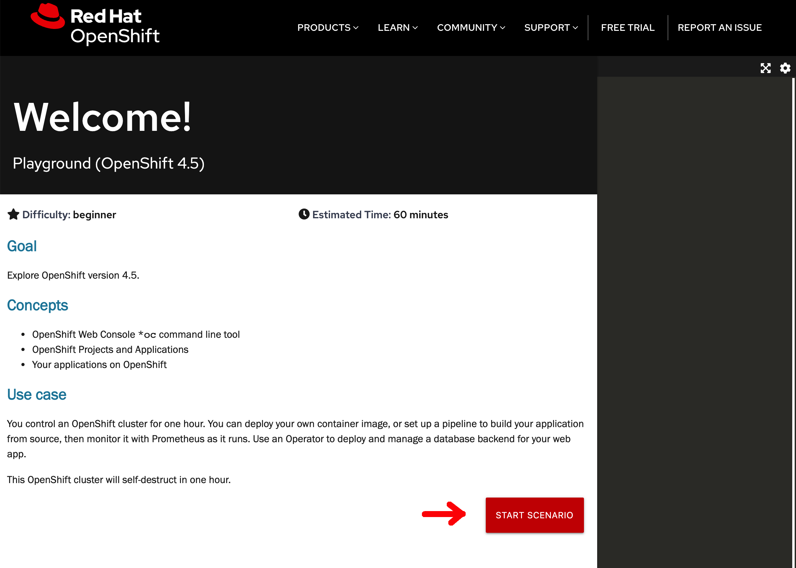

1. From a terminal that has access to your OpenShift cluster, download the [kcontainer-quickstart-ocp.sh](https://github.com/ibm-cloud-architecture/refarch-kc/tree/master/scripts/quickstart/kcontainer-quickstart-ocp.sh) file:
  ```
  curl -o kcontainer-quickstart-ocp.sh https://raw.githubusercontent.com/ibm-cloud-architecture/refarch-kc/master/scripts/quickstart/kcontainer-quickstart-ocp.sh
  chmod +x kcontainer-quickstart-ocp.sh
  ```
  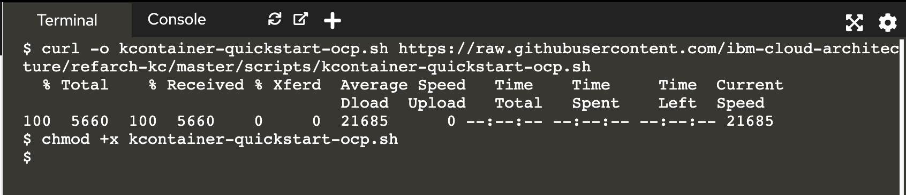

   _(\*) To override the default username and password used in the quickstart script for use in a different OpenShift environment, set environment variables with names of_ `OCP_ADMIN_USER` _and_ `OCP_ADMIN_PASSWORD` _to the appropriate values before executing the script._

1. Execute the quickstart deployment script with the following command:
  ```
  ./kcontainer-quickstart-ocp.sh
  ```

1. Wait for the deployment to be active and ready when you are prompted with `Press any key to continue once an order has been submitted...`.

  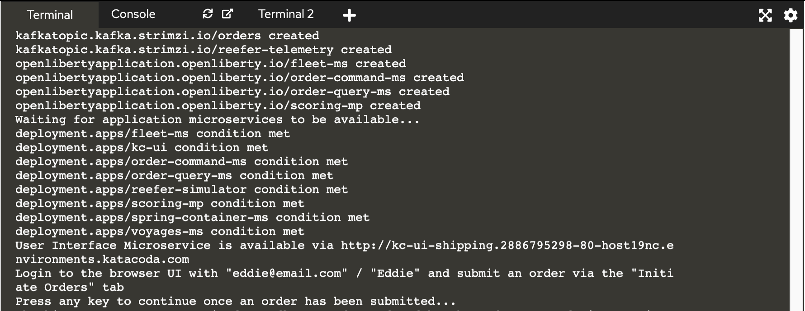

1. Grab the User Interface Microservice url and credentials and open it up in your web browser.

  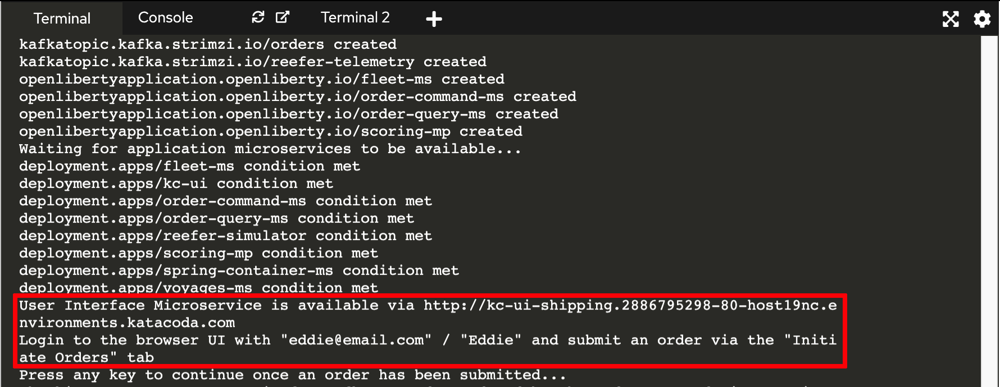

   _(\*) This will be referred to as_ `kc-ui-shipping.cluster.local` _in the step 2 of this quickstart._

1. You can also check all the resources created by the `kcontainer-quickstart-ocp.sh` script in the RedHat OpenShift console by clicking on the console tab and using the appropriate credentials displayed on the instructions section to log in.

  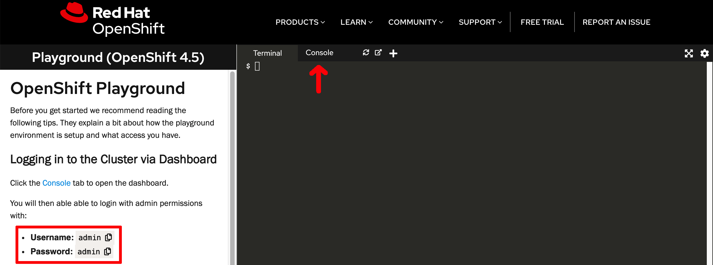

## Run the Demo

In this section, we are going to guide you through different scenarios to not only demonstrate the end goal of the KContainer application of creating an order to ship goods from a source port to a destination port but some of the EDA patterns that it implements as well.

### Setup

First thing we want to do is to be able to inspect the state of each of the components involved in the creation of an oder. These are:

- [User Interface](/microservices/user-interface/) - Will provide us with a user interface.
- [Order Command](/microservices/order-command/) - Will take care of the write responibilities in the CQRS pattern.
- [Order Query](/microservices/order-query/) - Will take care of the read responsibilities in the CQRS pattern.
- [Container Management](/microservices/container-management/) - Will take care of the management of the containers.
- [Voyage Management](/microservices/voyage-management/) - Will take care of the management of the voyages for the different ships in our fleet.

In order to check the state of each of these components and see how these evolve and react to the events happening within our application, we need to expose them individually through OpenShift routes. Of course, this is not a best practice for production-ready applications but a tool for us to be able to understand what is going on behind the scenes in our Event Driven Architecure KContainer reference implementation.

We have created the following `get_state.sh` script that will grab the route for each of the KContainer components involved in the creation of an order listed above, set these up with the appropriate context path and poke them to retrieve their state so that you don't have to do so manually in the terminal and web browser (which you may want for a client demo so that it may be a bit more visual...).

To grab the script and make it executable, run the following in your terminal:

```shell
curl -o kcontainer-quickstart-ocp.sh https://raw.githubusercontent.com/ibm-cloud-architecture/refarch-kc/master/scripts/quickstart/get_state.sh
chmod +x get_state.sh
```

These script runs and infinite while loop to get the state of each of the KContainer components involved in the creation of an order every time to press any key. Execute the script by running `./get_state.sh`:

```shell
These are the endpoints for each of the KContainer components
-------------------------------------------------------------
* User Interface --> kc-ui-shipping.dte-ocp44-new-aghbjd-915b3b336cabec458a7c7ec2aa7c625f-0000.us-east.containers.appdomain.cloud/api/orders/GoodManuf
* Order Command  --> order-command-ms-shipping.dte-ocp44-new-aghbjd-915b3b336cabec458a7c7ec2aa7c625f-0000.us-east.containers.appdomain.cloud/orders
* Order Query    --> order-query-ms-shipping.dte-ocp44-new-aghbjd-915b3b336cabec458a7c7ec2aa7c625f-0000.us-east.containers.appdomain.cloud/orders
* Containers     --> spring-container-ms-shipping.dte-ocp44-new-aghbjd-915b3b336cabec458a7c7ec2aa7c625f-0000.us-east.containers.appdomain.cloud/containers
* Voyages        --> voyages-ms-shipping.dte-ocp44-new-aghbjd-915b3b336cabec458a7c7ec2aa7c625f-0000.us-east.containers.appdomain.cloud/voyage

Press any key to get the state for each of the KContainer components

These are the states for each of the KContainer components at Mon  8 Mar 2021 13:28:08 CET
---------------------------------------------------------------------------------------
User Interface:
[]

Order Command:

Order Query:
[]

Containers:
[]

Voyages:
[
  {
    "voyageID": "100",
    "shipID": "JimminyCricket",
    "srcPort": "Oakland",
    "plannedDeparture": "2019-02-15T20:20Z",
    "destPort": "Shanghai",
    "plannedArrival": "2019-02-30T20:20Z",
    "freeCapacity": 400
  },
  {
    "voyageID": "101",
    "shipID": "JimminyCricket",
    "srcPort": "Shanghai",
    "plannedDeparture": "2019-03-05T20:20Z",
    "destPort": "Oakland",
    "plannedArrival": "2019-03-30T20:20Z",
    "freeCapacity": 1000
  },
  {
    "voyageID": "200",
    "shipID": "BlackBear",
    "srcPort": "NYC",
    "plannedDeparture": "2019-02-20T20:20Z",
    "destPort": "London",
    "plannedArrival": "2019-02-300T20:20Z",
    "freeCapacity": 200
  },
  {
    "voyageID": "201",
    "shipID": "BlackBear",
    "srcPort": "London",
    "plannedDeparture": "2019-03-02T20:20Z",
    "destPort": "NYC",
    "plannedArrival": "2019-03-10T20:20Z",
    "freeCapacity": 300
  }
]


Press any key to get the state for each of the KContainer components
```

We can see that the initial state of our KContainer application does not count with any order already in the system which is what we should expect after a new clean deployment of the solution. However, it does have 4 voyages already in the system (disregard the `plannedDeparture` and `plannedArrival` attributes. We are **only** interested in the `srcPort`, `dstPort` and `freeCapacity` attributes). Also, there is no container at all in the system which we need if we want to carry goods from a source port to a destination port.

As a result, the first thing we need to do before creating an order is to add a new container at the source port into our system. For that, the Container Management component exposes and API which the following `create_container.sh` script will make use of. On a new terminal tab, download the script and make it executable:

```shell
curl -o kcontainer-quickstart-ocp.sh https://raw.githubusercontent.com/ibm-cloud-architecture/refarch-kc/master/scripts/quickstart/create_container.sh
chmod +x create_container.sh
```

Create a container of size 10 executing `./create_container.sh 10`

```shell
Creating a new container with ID = 8090 and size = 10

{
  "id": "8090",
  "latitude": 31.4,
  "longitude": 121.5,
  "type": "Reefer",
  "status": "Empty",
  "brand": "itgtests-brand",
  "currentCity": "Shanghai",
  "capacity": 10,
  "createdAt": "2021-03-08T12:28:56.851+0000",
  "updatedAt": "2021-03-08T12:28:56.851+0000"
}
```

As you can see, we have created an `Empty` container whose `currentCity` is `Shanghai`, where there is also a voyage to carry goods from to `Oakland`, and `capacity` of `10`.

You can go back to the terminal tab where you executed the `get_state.sh` script and hit any key again to see what the state of the system is now:

```shell
These are the states for each of the KContainer components at Mon  8 Mar 2021 13:29:27 CET
---------------------------------------------------------------------------------------
User Interface:
[]

Order Command:

Order Query:
[]

Containers:
[
  {
    "id": "8090",
    "latitude": 31.4,
    "longitude": 121.5,
    "type": "Reefer",
    "status": "Empty",
    "brand": "itgtests-brand",
    "currentCity": "Shanghai",
    "capacity": 10,
    "createdAt": "2021-03-08T12:28:56.851+0000",
    "updatedAt": "2021-03-08T12:28:56.851+0000"
  }
]

Voyages:
[
  {
    "voyageID": "100",
    "shipID": "JimminyCricket",
    "srcPort": "Oakland",
    "plannedDeparture": "2019-02-15T20:20Z",
    "destPort": "Shanghai",
    "plannedArrival": "2019-02-30T20:20Z",
    "freeCapacity": 400
  },
  {
    "voyageID": "101",
    "shipID": "JimminyCricket",
    "srcPort": "Shanghai",
    "plannedDeparture": "2019-03-05T20:20Z",
    "destPort": "Oakland",
    "plannedArrival": "2019-03-30T20:20Z",
    "freeCapacity": 1000
  },
  {
    "voyageID": "200",
    "shipID": "BlackBear",
    "srcPort": "NYC",
    "plannedDeparture": "2019-02-20T20:20Z",
    "destPort": "London",
    "plannedArrival": "2019-02-300T20:20Z",
    "freeCapacity": 200
  },
  {
    "voyageID": "201",
    "shipID": "BlackBear",
    "srcPort": "London",
    "plannedDeparture": "2019-03-02T20:20Z",
    "destPort": "NYC",
    "plannedArrival": "2019-03-10T20:20Z",
    "freeCapacity": 300
  }
]


Press any key to get the state for each of the KContainer components
```

that shows, again, the container we have just created is reflected in the system as you would expect.

We are now ready to create a new order in our KContainer application to carry some goods up to `10` from `Shanghai`, where we created the new container, to `Oakland` which is one of the existing voayages in the system.

### KContainer Manufacturer creating an order

In this section, we are going to create a new order to ship goods of 10 items overseas from `Shanghai` to `Oakland` as the `GoodManuf` manufacturer. By creating this order, we are going to observe how our Event Driven Architecture KContainer reference implementation works both from the outside (the order gets `assigned` which means it has a container assigned to carry the goods and a voyage allocated to ship the container overseas) and from the inside looking at the CQRS, SAGA, Event Sourcing, etc patterns as well as the different events in Kafka, our event backbone.

Open up the KContainer application user interface on your web browser by pointing it to the route you got presented with at the end of the previous [Deploy the reference implementation](#deploy-the-reference-implementation) section. You can also find the route executing:

  ```shell
  oc get route kc-ui -o jsonpath="{.spec.host}"
  ```

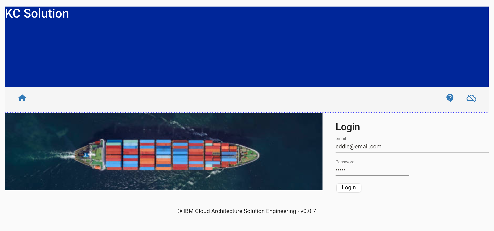

To log in to the home page, you will need the following user email and password:

- Email: `eddie@email.com`
- Password: `Eddie`

The initial UI homepage shows an illustrated version of the business process. There are four tiles that can be used to simulate different parts of the outlined business process.

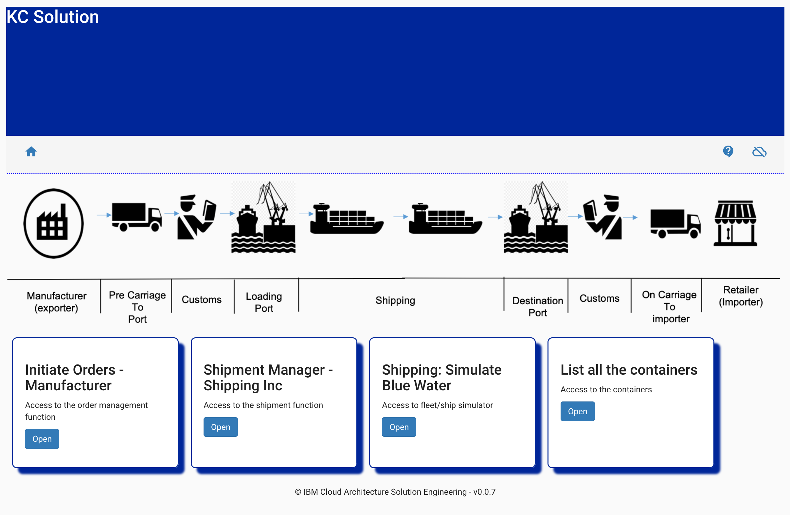

Click on the `Initiate Orders - Manufacturer` tile to create a new _'fresh product'_ order to ship overseas. This simulates the activity that would usually be carried out by the manufacturer in our scenario.

To represent different manufacturers, the first select box has been designed to support multiple scenarios in the future. For the purposes of this quickstart tutorial, select `GoodManuf`.


Once the manufacturer is selected, a list of existing orders will be displayed. As expected, there is no orders in the system yet for the `GoodManuf` manufacturer.

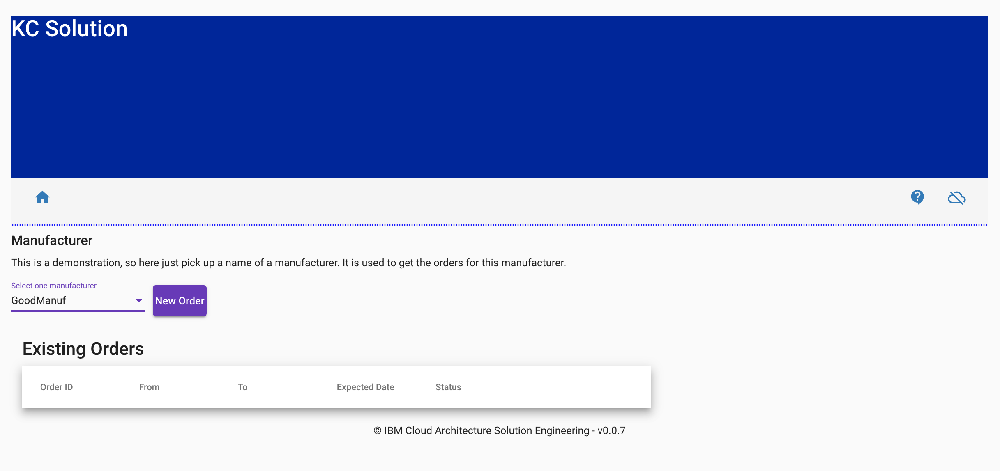

Click on `New Order` and a form to create a new order will be displayed on the right hand side of your screen:

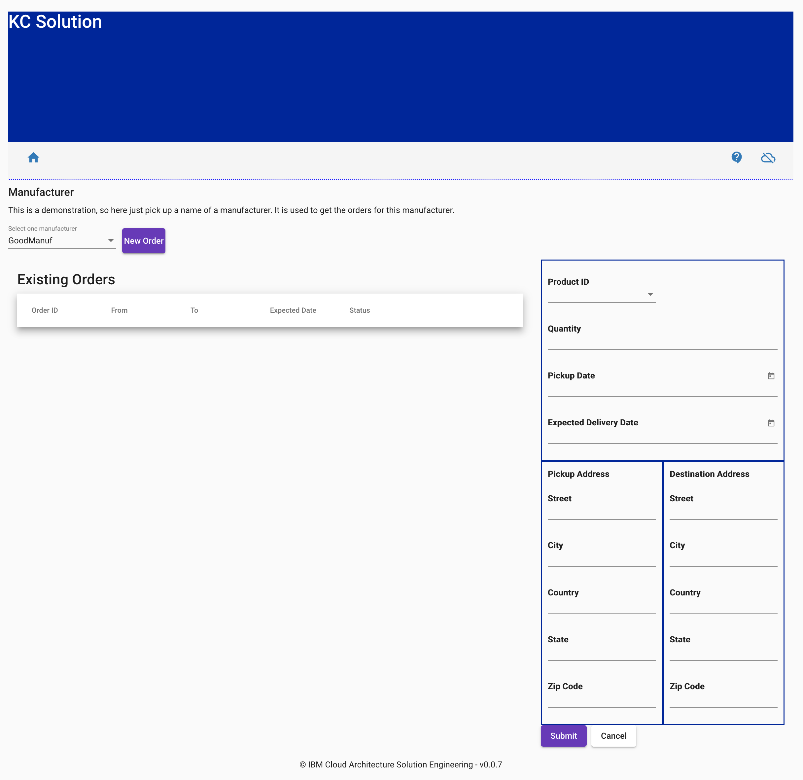

Now, in order for the demo to work, we **must** make sure that the new order we submit has

- `10` or less `Quantity`
- `Shanghai` as the `Pickup Address City`
- `Oakland` as the `Destination Address City`

the reason for this is that we created in the [Setup](#setup) section a container in `Shanghai` with a capacity of `10` and we know there is only one voyage whose source port is Shanghai and that voyage ships containers to `Oakland`. The rest of the attributes, will not have effect on the order management. **DO NOT** click `Submit` yet.

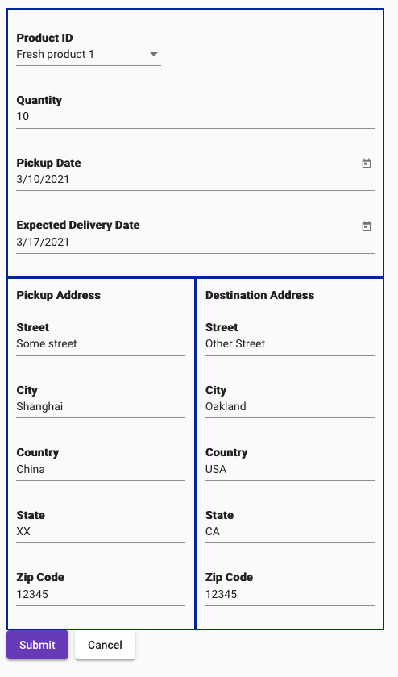

We are ready to submit our new order for the KContainer application to process it. But first, let's go over what is meant to happen behind the scenes as a result:

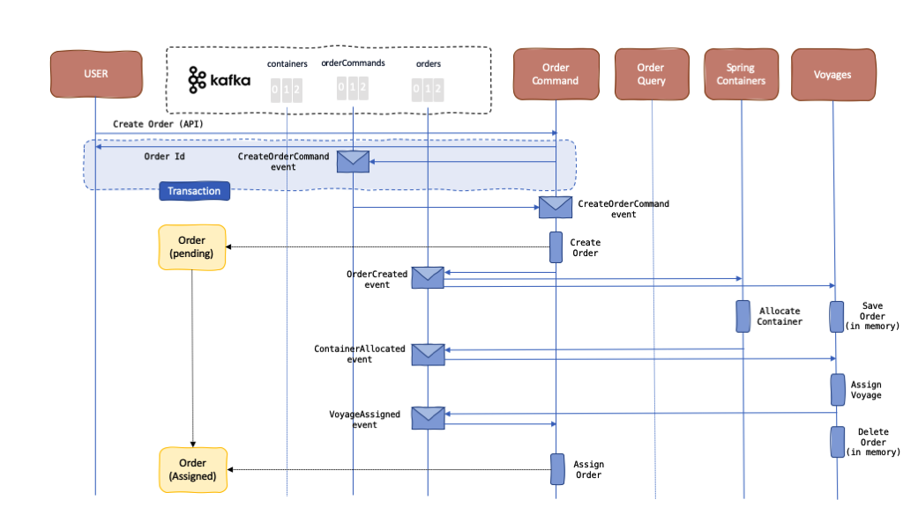

1. Clicking the Submit button on the user interface will call the API to create a new order in the `Order Command` component. As explained in the [Event Sourcing pattern](https://ibm-cloud-architecture.github.io/refarch-eda/patterns/event-sourcing/), any request from the users of the application or any third party will become a command event (specific type of event) that will get registered in our event backbone and that our application will need to act upon. That is, the system will obey to a command. As a result, we should see a `CreateOrderCommand` event in the `orderCommands` topic. The idea behind Event Sourcing and logging the actions we want our system to take into our event backbone as commands is to make sure these actions are taken no matter what. Commands will not get "marked" as "accomplished/executed" until we are 100% sure the needed actions have been taken as a result. To make sure of this, we are making use of the technology and capabilities that Kafka provides (such us transactionality and idempontence) along with the [Consume-transform-produce loop pattern](/implementation/consume-transform-produce/). 

1. The Order Command component is listening to the `orderCommands` topic for those `CreateOrderCommand` command events to go off and create those new orders. As a result, it will pick up our `CreateOrderCommand` event and will create the corresponding new order. In this case, it will be as "simple" as creating a new record into an in-memory database and then, once again, to comply with the [Event Sourcing pattern](https://ibm-cloud-architecture.github.io/refarch-eda/patterns/event-sourcing/), logging an event into the event backbone as the fact that has happened. As a result, we should see an `OrderCreated` event being dropped in the `orders` topic. Only then, the initial `CreateOrderCommand` command event will get marked as "accomplished/executed" (which translates in the Kafka terminology as get its offset committed). The actions of creating a new object into the `Order Commands` in-memory's database and sending out the `OrderCreated` event into the event backbone are the two actions (could be more if we needed) that must happen as a result and the [Consume-transform-produce loop pattern](/implementation/consume-transform-produce/) is what makes sure of it.

1. Now, we have created a new order in the `Order Command` component and dropped an `OrderCreated` event into the event backbone following the [Event Sourcing pattern](https://ibm-cloud-architecture.github.io/refarch-eda/patterns/event-sourcing/) as something that has happened. This allows any other component in our system to be aware of this change (and any other that happens) and be able to appropriately react to these if needed as a result. This makes our components completely decoupled through asynchronous communication, which makes our application reactive, resilient and scalable (see [The Reactive Manifesto](https://www.reactivemanifesto.org/)). 

1. However, the creation of a new order "object" in the `Order Command` component is useless for us from the business point of view because our end goal is to get those orders shipped overseas and, in order to do that, we need to allocate a container and assign a voyage to the order or reject the order. To allocate a container and assign a voyage to an order another two components of our distributed solution need to step in. The need of taking several actions on distributed components for an end goal is what is known as a long running transaction. To address this long running transaction, we implemented the choreography variant of the [SAGA pattern](https://ibm-cloud-architecture.github.io/refarch-eda/patterns/saga/) where the `OrderCreated` event will trigger a sequence of actions to happen in a distributed manner before "marking" the new order object created previously as `Assigned` (which means accepted and ready for delivery) or `Rejected` (in the case that there wasn't a suitable container or voyage available). Until then, the order will remain as `Pending`.

1. As said above, the `OrderCreated` event will trigger a long running transaction in our distributed system on a choreography manner. That is, the next actor in such long running transaction, the `Container Manager` component is listening to the `orders` topic for `OrderCreated` events. Once it sees one of those events, it will try to allocate a container for that order. If it finds one it will allocate the container to the order and will, following the [Event Sourcing pattern](https://ibm-cloud-architecture.github.io/refarch-eda/patterns/event-sourcing/) again, log that fact in the form of a `ContainerAllocated` event into `orders` topic of the event backbone. If a suitable container could not be found, then it will drop a `ContainerNotFound` event into the `orders` topic of the event backbone so the rest of the components involved in this long running transaction can carry out a compensation process accordingly (we will cover this later on).

1. We hope to have a `ContainerAllocated` event into the `orders` topic by now which will then trigger the next action on this long running transaction part of the [SAGA pattern](https://ibm-cloud-architecture.github.io/refarch-eda/patterns/saga/) that involves the `Voyages Manager`. The `Voyages Manager` is listening for `ContainerAllocated` events in the `orders` topic in our event backbone in order to assign a voyage to these. As a result, it will then log a `VoyageAssigned` event if a suitable voyage for the order (source port and destination port) and for its allocated container (capacity) has been found. If a suitable voyage could not be found, a `VoyageNotFound` event will get logged into the `orders` topic in our event backbone instead so that a compensation process is carried out (more on this later).

1. Finally, the `Order Command` component, which initiated the long running transaction as a result of having created a new order, listens for `VoyageAssigned` events in the `orders` topic in our event backbone. Once the `VoyageAssigned` event is received, the order is marked as `Assigned` and the long running transaction is considered successfully completed.

Ok, this time we really are ready for creating a new order. Make sure you have the `get_state.sh` script running on a terminal so that you execute it **right after** hitting the submit button for the new order in the user interface. This way, we would see the intermediate `Pending` state of the order:

```shell
These are the states for each of the KContainer components at Mon  8 Mar 2021 13:40:43 CET
---------------------------------------------------------------------------------------
User Interface:
[
  {
    "containerID": "8090",
    "customerID": "GoodManuf",
    "destinationAddress": {
      "city": "Oakland",
      "country": "USA",
      "state": "CA",
      "street": "Other Street",
      "zipcode": "12345"
    },
    "expectedDeliveryDate": "2021-03-16T23:00:00.000Z",
    "orderID": "0e75b3f5-a15e-42c9-a05b-9c8c55a4e0dc",
    "pickupAddress": {
      "city": "Shanghai",
      "country": "China",
      "state": "XX",
      "street": "Some street",
      "zipcode": "12345"
    },
    "pickupDate": "2021-03-09T23:00:00.000Z",
    "productID": "Fresh product 1",
    "quantity": 10,
    "status": "pending"
  }
]

Order Command:
[
  {
    "customerID": "GoodManuf",
    "orderID": "0e75b3f5-a15e-42c9-a05b-9c8c55a4e0dc",
    "productID": "Fresh product 1",
    "status": "pending"
  }
]

Order Query:
[
  {
    "containerID": "8090",
    "customerID": "GoodManuf",
    "destinationAddress": {
      "city": "Oakland",
      "country": "USA",
      "state": "CA",
      "street": "Other Street",
      "zipcode": "12345"
    },
    "expectedDeliveryDate": "2021-03-16T23:00:00.000Z",
    "orderID": "0e75b3f5-a15e-42c9-a05b-9c8c55a4e0dc",
    "pickupAddress": {
      "city": "Shanghai",
      "country": "China",
      "state": "XX",
      "street": "Some street",
      "zipcode": "12345"
    },
    "pickupDate": "2021-03-09T23:00:00.000Z",
    "productID": "Fresh product 1",
    "quantity": 10,
    "status": "pending"
  }
]

Containers:
[
  {
    "id": "8090",
    "latitude": 31.4,
    "longitude": 121.5,
    "type": "Reefer",
    "status": "Loaded",
    "brand": "itgtests-brand",
    "currentCity": "Shanghai",
    "capacity": 0,
    "createdAt": "2021-03-08T12:28:56.851+0000",
    "updatedAt": "2021-03-08T12:40:39.882+0000"
  }
]

Voyages:
[
  {
    "voyageID": "100",
    "shipID": "JimminyCricket",
    "srcPort": "Oakland",
    "plannedDeparture": "2019-02-15T20:20Z",
    "destPort": "Shanghai",
    "plannedArrival": "2019-02-30T20:20Z",
    "freeCapacity": 400
  },
  {
    "voyageID": "101",
    "shipID": "JimminyCricket",
    "srcPort": "Shanghai",
    "plannedDeparture": "2019-03-05T20:20Z",
    "destPort": "Oakland",
    "plannedArrival": "2019-03-30T20:20Z",
    "freeCapacity": 1000
  },
  {
    "voyageID": "200",
    "shipID": "BlackBear",
    "srcPort": "NYC",
    "plannedDeparture": "2019-02-20T20:20Z",
    "destPort": "London",
    "plannedArrival": "2019-02-300T20:20Z",
    "freeCapacity": 200
  },
  {
    "voyageID": "201",
    "shipID": "BlackBear",
    "srcPort": "London",
    "plannedDeparture": "2019-03-02T20:20Z",
    "destPort": "NYC",
    "plannedArrival": "2019-03-10T20:20Z",
    "freeCapacity": 300
  }
]


Press any key to get the state for each of the KContainer components
```

where we can already see the following interesting facts:

  1. As per the `Order Command` component, a new order with ID `0e75b3f5-a15e-42c9-a05b-9c8c55a4e0dc` has been created and it is still in `Pending` state since the long running transaction implemented using the SAGA pattern has not yet finalised (since a voyage has not yet been assigned. See the `Voyage Manager` state where no voyage has yet decreased their `freeCapacity`).
  1. As per the `Container Manager` component, the container with ID `8090` we previously created on purpose is now loaded (`capacity` is `0`).
  1. In the `User Interface` and `Command Query` components, we can not only see see the full information of the order compared to what the `Order Command` component shows but also that the container with ID `8090` has been allocated to it. The reason for this is that the `Order Command` component implements the write portion of the [**Command Query Responsibility Segregation pattern**](https://ibm-cloud-architecture.github.io/refarch-eda/patterns/cqrs/) whereas the `Order Query` component implements the read portion of it. As a result, the `Order Command` component only cares about managing the state of the order whereas the `Order Query` component implements the complex queries our application needs to address by building the projections on the appropriate data that is gathered from the different distributed components by processing the events flowing through the event backbone it is interested in.

If we had the ability to refresh the user interface and select the `GoodManuf` manufacturer once again to get its orders listed, we should see the order is also in `pending` state.

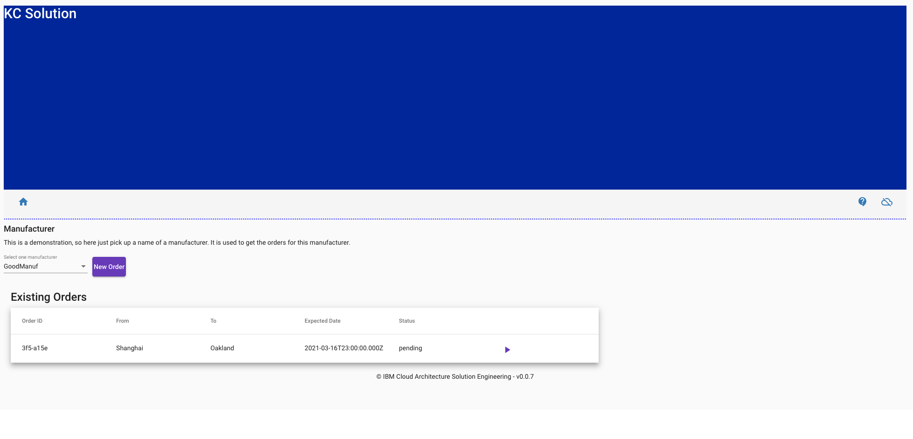

If we now, after 10 secs aprox, hit again any key in the terminal where we have running the `get_state.sh` script: 

```shell
These are the states for each of the KContainer components at Mon  8 Mar 2021 13:43:03 CET
---------------------------------------------------------------------------------------
User Interface:
[
  {
    "containerID": "8090",
    "customerID": "GoodManuf",
    "destinationAddress": {
      "city": "Oakland",
      "country": "USA",
      "state": "CA",
      "street": "Other Street",
      "zipcode": "12345"
    },
    "expectedDeliveryDate": "2021-03-16T23:00:00.000Z",
    "orderID": "0e75b3f5-a15e-42c9-a05b-9c8c55a4e0dc",
    "pickupAddress": {
      "city": "Shanghai",
      "country": "China",
      "state": "XX",
      "street": "Some street",
      "zipcode": "12345"
    },
    "pickupDate": "2021-03-09T23:00:00.000Z",
    "productID": "Fresh product 1",
    "quantity": 10,
    "status": "assigned",
    "voyageID": "101"
  }
]

Order Command:
[
  {
    "customerID": "GoodManuf",
    "orderID": "0e75b3f5-a15e-42c9-a05b-9c8c55a4e0dc",
    "productID": "Fresh product 1",
    "status": "assigned"
  }
]

Order Query:
[
  {
    "containerID": "8090",
    "customerID": "GoodManuf",
    "destinationAddress": {
      "city": "Oakland",
      "country": "USA",
      "state": "CA",
      "street": "Other Street",
      "zipcode": "12345"
    },
    "expectedDeliveryDate": "2021-03-16T23:00:00.000Z",
    "orderID": "0e75b3f5-a15e-42c9-a05b-9c8c55a4e0dc",
    "pickupAddress": {
      "city": "Shanghai",
      "country": "China",
      "state": "XX",
      "street": "Some street",
      "zipcode": "12345"
    },
    "pickupDate": "2021-03-09T23:00:00.000Z",
    "productID": "Fresh product 1",
    "quantity": 10,
    "status": "assigned",
    "voyageID": "101"
  }
]

Containers:
[
  {
    "id": "8090",
    "latitude": 31.4,
    "longitude": 121.5,
    "type": "Reefer",
    "status": "Loaded",
    "brand": "itgtests-brand",
    "currentCity": "Shanghai",
    "capacity": 0,
    "createdAt": "2021-03-08T12:28:56.851+0000",
    "updatedAt": "2021-03-08T12:40:39.882+0000"
  }
]

Voyages:
[
  {
    "voyageID": "100",
    "shipID": "JimminyCricket",
    "srcPort": "Oakland",
    "plannedDeparture": "2019-02-15T20:20Z",
    "destPort": "Shanghai",
    "plannedArrival": "2019-02-30T20:20Z",
    "freeCapacity": 400
  },
  {
    "voyageID": "101",
    "shipID": "JimminyCricket",
    "srcPort": "Shanghai",
    "plannedDeparture": "2019-03-05T20:20Z",
    "destPort": "Oakland",
    "plannedArrival": "2019-03-30T20:20Z",
    "freeCapacity": 990
  },
  {
    "voyageID": "200",
    "shipID": "BlackBear",
    "srcPort": "NYC",
    "plannedDeparture": "2019-02-20T20:20Z",
    "destPort": "London",
    "plannedArrival": "2019-02-300T20:20Z",
    "freeCapacity": 200
  },
  {
    "voyageID": "201",
    "shipID": "BlackBear",
    "srcPort": "London",
    "plannedDeparture": "2019-03-02T20:20Z",
    "destPort": "NYC",
    "plannedArrival": "2019-03-10T20:20Z",
    "freeCapacity": 300
  }
]


Press any key to get the state for each of the KContainer components
```

we should see that:

  1. As per the `Order Command` component, the order is now `Assigned` as a result of having a voyage assigned to it.
  1. As per the `User Interface` and `Order Query` commands, we should see the voyage that has been assigned to the order (ID `101`). Again, we see how the `Order Query` component is building up those projections with the data it is interested in from the different distributed components through the events being published in the event backbone ([Command Query Responsibility Segregation pattern](https://ibm-cloud-architecture.github.io/refarch-eda/patterns/cqrs/))
  1. As per the `Voyages Management` component, we can see that voyage with ID `101` has now `freeCapacity` of `990` as opposed to the `freeCapacity` of `1000` at the beginning as a result of having allocated our container with ID `8090` and capacity of `10` on it.

Again, if we refresh the user interface and select the `GoodManuf` manufacturer, we should now see the order in `assigned` state.

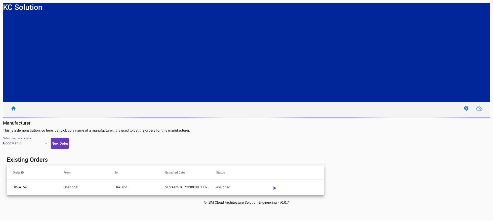

Finally, we want to inspect the events in both the `orderCommands` and `orders` topics of our event backbone.

1. Check out the events in the `orderCommands` topic by executing in a terminal:

  ```shell
  oc rsh my-cluster-kafka-0 bin/kafka-console-consumer.sh --bootstrap-server localhost:9092 --from-beginning --timeout-ms 10000 --topic order-commands
  ```
  
  ```json
  {
      "payload":{
          "orderID":"0e75b3f5-a15e-42c9-a05b-9c8c55a4e0dc",
          "productID":"Fresh product 1",
          "customerID":"GoodManuf",
          "quantity":10,
          "pickupAddress":{
              "street":"Some street","
              city":"Shanghai",
              "country":"China",
              "state":"XX",
              "zipcode":"12345"
          },
          "pickupDate":"2021-03-09T23:00:00.000Z",
          "destinationAddress":{
              "street":"Other Street",
              "city":"Oakland",
              "country":"USA",
              "state":"CA",
              "zipcode":"12345"
          },
          "expectedDeliveryDate":"2021-03-16T23:00:00.000Z",
          "status":"toBeCreated"
      },
      "timestampMillis":1615207239077,
      "type":"CreateOrderCommand",
      "version":"1"
  }
  ```

  where we can see the `CreateOrderCommand` command event as a result of calling the create new order API of the `Order Command` component and applying the [Event Sourcing pattern](https://ibm-cloud-architecture.github.io/refarch-eda/patterns/event-sourcing/).

1. Check out the events in the `orders` topic as a result of the new order command event above by executing in a terminal:

  ```shell
  oc rsh my-cluster-kafka-0 bin/kafka-console-consumer.sh --bootstrap-server localhost:9092 --from-beginning --timeout-ms 10000 --topic orders
  ```

  ```json
  {
      "payload":{
          "orderID":"0e75b3f5-a15e-42c9-a05b-9c8c55a4e0dc",
          "productID":"Fresh product 1",
          "customerID":"GoodManuf",
          "quantity":10,
          "pickupAddress":{
              "street":"Some street",
              "city":"Shanghai",
              "country":"China",
              "state":"XX",
              "zipcode":"12345"
          },
          "pickupDate":"2021-03-09T23:00:00.000Z",
          "destinationAddress":{
              "street":"Other Street",
              "city":"Oakland",
              "country":"USA",
              "state":"CA",
              "zipcode":"12345"
          },
          "expectedDeliveryDate":"2021-03-16T23:00:00.000Z",
          "status":"pending"
      },
      "timestampMillis":1615207239330,
      "type":"OrderCreated",
      "version":"1"
  }

  {
      "orderID":"0e75b3f5-a15e-42c9-a05b-9c8c55a4e0dc",
      "payload":{
          "containerID":"8090",
          "orderID":"0e75b3f5-a15e-42c9-a05b-9c8c55a4e0dc"
      },
      "timestamp":1615207239909,
      "type":"ContainerAllocated"
  }

  {
      "timestamp":1615207250000,
      "type":"VoyageAssigned",
      "version":"1",
      "payload":{
          "voyageID":"101",
          "orderID":"0e75b3f5-a15e-42c9-a05b-9c8c55a4e0dc"
      }
  }
  ```

  where we can see the `OrderCreated` event as a result of having processed the initial `CreateOrderCommand` command event from the `orderCommands` topic followed by the `ContainerAllocated` and `VoyageAssigned` events that are part of the long running transaction of the [SAGA pattern](https://ibm-cloud-architecture.github.io/refarch-eda/patterns/saga/) the `OrderCreated` events triggers.

_This quickstart guide will be updated as the project evolves and new capability is added. If you have any issues or queries with this quickstart guide, please [raise an issue](https://github.com/ibm-cloud-architecture/refarch-kc/issues) in the github repo._
