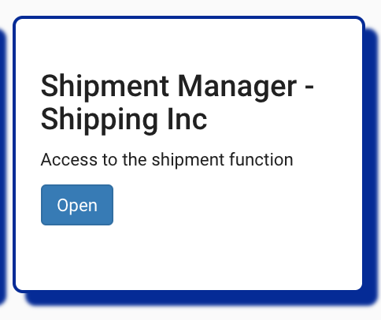
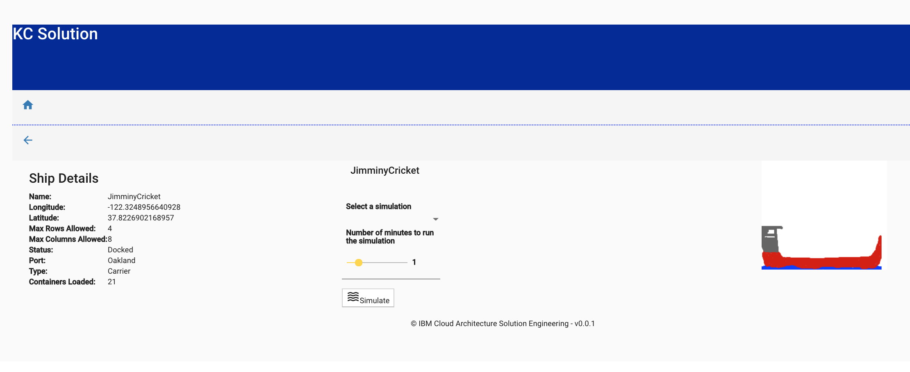

### KContainer Shipment Manager looking at Orders

* From the home page, click on the Shipment Manager - Shipping Inc tile:



The home page lists the order that the shipment company received in the previous step.


The status of events will be modified over time while the order is processed down stream by the voyage and container services. The following sequence diagram illustrates the flow:


Looking at the events in the voyage service
```
voyages_1     |  emitting {"timestamp":1548788544290,"type":"OrderAssigned","version":"1","payload":{"voyageID":100,"orderID":"1fcccdf2-e29d-4b30-8e52-8116dc2a01ff"}}
```

or on the `orders` topic:

```json
{"timestamp":1548792921679,
"type":"OrderAssigned","version":"1",
"payload":{"voyageID":100,"orderID":"1fcccdf2-e29d-4b30-8e52-8116dc2a01ff"}}

```

### View Fleet information

<InlineNotification kind="warning"><strong>UNDER CONSTRUCTION</strong></InlineNotification>

Note: *The term 'Blue Water' referred to here means at sea (including ports and coastal waters).*

* From the home page, select the `Simulate Blue Water` tile. Select one of the available fleet. As of now, only the North Pacific has fleet data:


The fleet panel lists the ships, their location and status and a map:


* Select one ship with the edit button. You will see the ship detail view:



This view contains information about the ship itself, it's position at sea and the load. There is also an option to simulate a number of disaster scenarios that could play out at sea, however this functionality is not yet implemented.

There are currently three pre-defined scenarios, which will be implemented in the future:

* Fire affecting some containers
* Reefer down
* Ship experiencing conditions that cause reefers to exceed desired temperature.
